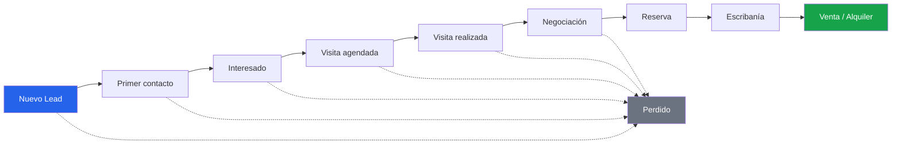

# RealEstate OS — Visión y Propuesta de Valor

> **El sistema operativo de la inmobiliaria moderna: centrado en el lead, no en la propiedad.**

---

## 1. Posicionamiento en una línea

RealEstate OS no es un CRM. Es la **torre de control** que une conversaciones, oportunidades y equipos en tiempo real, para que ninguna inmobiliaria de LATAM vuelva a perder un cliente por lentitud o desorden.

---

## 2. Visión del producto (10 años)

En 10 años, **RealEstate OS es la capa operativa por defecto de las inmobiliarias de LATAM**. Así como una PyME hoy no discute si usa un sistema de facturación, en 2036 no va a discutir si opera sobre un OS inmobiliario.

La ambición no es "vender un software más". Es cambiar la unidad de trabajo del rubro: hoy la inmobiliaria piensa en **stock de propiedades**; mañana piensa en **flujo de oportunidades**. RealEstate OS es la infraestructura que hace posible ese cambio de mentalidad.

Horizonte por fases:

- **Años 1–2 (Argentina):** producto vertical, foco en respuesta rápida, distribución de leads y automatización de seguimientos. Ganar la pelea contra Tokko en experiencia de uso.
- **Años 3–5 (Cono Sur + México):** integraciones profundas con portales (Zonaprop, Argenprop, MercadoLibre Inmuebles) y firma electrónica. Convertirnos en el estándar de facto para inmobiliarias medianas.
- **Años 6–10 (LATAM):** plataforma abierta. Marketplace de integraciones sobre arquitectura hexagonal, IA operativa madura, y datos agregados de mercado que devuelven inteligencia a cada tenant.

**La estrella polar de la visión:** que el dueño de una inmobiliaria pueda saber, en cualquier momento y desde el teléfono, exactamente qué está pasando con cada oportunidad de su negocio, sin pedirle un reporte a nadie.

---

## 3. El problema

El negocio inmobiliario de LATAM se pierde plata todos los días por tres fallas estructurales que ningún CRM tradicional resuelve.

### 3.1 Lentitud de respuesta (el asesino silencioso)

- La probabilidad de calificar un lead **cae drásticamente después de los primeros 5 minutos** sin respuesta. Es un patrón repetido en múltiples estudios de lead response (Harvard Business Review, InsideSales): responder dentro de los 5 minutos vs. 30 minutos puede significar **hasta 20x más chances** de contacto efectivo.
- En la práctica LATAM, la consulta entra por WhatsApp, un portal o una landing, y **queda sin respuesta horas o días**. El asesor está en una visita, el mensaje se pierde en un teléfono personal, nadie sabe que existió.
- El resultado: el lead consulta a **3–5 inmobiliarias en paralelo**. Gana la que contesta primero y mejor, no la que tiene la mejor propiedad.

### 3.2 Leads perdidos por falta de proceso

- Los leads viven **desparramados**: WhatsApp del asesor, mail personal, planilla de Excel, cabeza de alguien. No hay una fuente de verdad.
- Cuando un asesor se va de la inmobiliaria, **se lleva su cartera** porque nunca estuvo en un sistema.
- El seguimiento es manual y depende de la memoria. El 80% de las ventas requiere **5+ contactos de seguimiento**, pero la mayoría de los asesores abandona después del segundo. Sin automatización, esos leads mueren solos.

### 3.3 Cero visibilidad para el dueño

- El dueño **no sabe en tiempo real** cuántas consultas entraron hoy, cuántas se contestaron, cuáles están frías, qué asesor está saturado y cuál sin carga.
- La información llega tarde, filtrada y maquillada: la reunión semanal donde cada asesor cuenta "cómo viene la mano".
- No hay forma de **detectar el problema mientras se puede corregir**. Cuando el dueño se entera de que se perdieron 15 leads, ya pasó el mes.

> **Síntesis del problema:** el rubro tiene demasiado software para gestionar *propiedades* y casi nada para gestionar *oportunidades y equipos*. Ahí está la plata que se fuga.

---

## 4. La tesis: OS vs. CRM

### Por qué el CRM tradicional falla en inmobiliaria

El CRM inmobiliario clásico (Tokko a la cabeza) está construido alrededor de la **propiedad**: cargar el inmueble, publicarlo en portales, matchearlo con búsquedas. La propiedad es el sustantivo central; el cliente es un satélite.

Ese modelo tiene sentido cuando el cuello de botella es el *stock*. Pero en un mercado de LATAM con demanda volátil y competencia feroz por el mismo lead, **el cuello de botella no es la propiedad: es la velocidad y la calidad con la que se atiende a la persona**.

### El giro: centrarse en el lead

RealEstate OS invierte el modelo de datos y de atención:

- **El lead es el sustantivo central.** La propiedad es un *atributo del recorrido* del cliente ("este lead se interesó por estas 3 propiedades"), no el eje.
- Todo gira alrededor del **ciclo de vida del lead**: desde la primera consulta hasta la compra/alquiler o la pérdida.
- Un OS no te muestra tablas de inmuebles: te muestra **qué oportunidad requiere tu atención ahora** y **qué debería pasar después**.

Un CRM te deja *registrar* que pasó todo esto. Un OS **te empuja** a que pase, automatiza lo repetitivo y te avisa cuando algo se está por caer.

| | CRM tradicional | RealEstate OS |
|---|---|---|
| Sustantivo central | Propiedad | Lead / Oportunidad |
| Pregunta que responde | "¿Qué stock tengo?" | "¿A quién tengo que atender ahora?" |
| Interfaz | Tablas y formularios | Torre de control + panel de acción |
| Rol del dueño | Pide reportes | Ve todo en tiempo real |
| Seguimiento | Manual, depende de memoria | Motor de automatizaciones |
| Momento de valor | Al cargar el inmueble | En cada conversación |

---

## 5. Propuesta de valor por rol

### Dueño (acceso total)

| Antes | Después |
|---|---|
| Se entera de los problemas en la reunión semanal, cuando ya es tarde. | Ve en tiempo real cuántos leads entraron, cuántos se contestaron y cuáles están fríos. |
| Depende de lo que cada asesor le cuenta. | Torre de control con datos crudos, sin filtro humano. |
| No sabe qué asesor rinde y cuál no. | Métricas objetivas por asesor: velocidad de respuesta, conversión, carga. |
| El asesor que se va se lleva la cartera. | Toda la cartera vive en el sistema, es del negocio. |

### Gerente (supervisa)

| Antes | Después |
|---|---|
| Reparte leads a ojo, sin saber quién está saturado. | Distribución inteligente con reasignación automática si un lead no se atiende. |
| No detecta cuellos de botella en el pipeline. | Ve dónde se traban las oportunidades por etapa y por persona. |
| Persigue manualmente a cada asesor. | El sistema alerta y escala solo cuando algo se cae. |

### Asesor (panel diario simple)

| Antes | Después |
|---|---|
| Abre 4 apps (WhatsApp, mail, Excel, portal) para saber qué hacer. | Un panel diario que le dice **qué hacer hoy y en qué orden**. |
| Se olvida de seguir a leads tibios. | El motor de seguimientos le arma la agenda de contactos. |
| Contesta desde su WhatsApp personal, sin registro. | WhatsApp Business por asesor, todo trazado en el sistema. |
| No sabe a quién priorizar. | Sección **🔥 Oportunidades del día** con lead score explicable. |

---

## 6. Propuesta de valor única (UVP)

> **RealEstate OS es la única plataforma que convierte cada consulta en una oportunidad gestionada en tiempo real: responde más rápido, no se olvida de nadie y le muestra al dueño la verdad de su negocio sin pedir un solo reporte.**

---

## 7. Los 5 diferenciales

### 1. Centro de Operaciones en tiempo real (WebSockets)

No es un dashboard que se refresca cuando apretás F5. Es una **torre de control** que se actualiza sola vía WebSockets: entra un lead y aparece en la pantalla de todos los que corresponde, cambia una etapa y el tablero se mueve solo. El dueño mira su negocio *latir* en vivo.

### 2. Lead Score explicable + 🔥 Oportunidades del día

Un score que **explica por qué** un lead es caliente (respondió rápido, pidió visita, presupuesto claro, canal de alta intención), no una caja negra. Se materializa en una sección diaria — **🔥 Oportunidades del día** — que le dice a cada asesor dónde poner la energía primero.

### 3. Motor de automatizaciones y seguimientos

Reglas event-driven: "si un lead nuevo no fue contactado en X minutos, alertá y reasigná"; "si una visita se realizó, disparar seguimiento a las 24 hs". El seguimiento deja de depender de la memoria del asesor y pasa a ser **infraestructura**.

### 4. Distribución inteligente de leads con reasignación automática

Los leads no caen en una bolsa común. Se **distribuyen** según reglas (carga, especialidad, zona, turno) y se **reasignan automáticamente** si el asignado no responde a tiempo. Nadie se queda sin atender porque el asesor estaba en una visita.

### 5. WhatsApp Business por asesor + Landing Pages con chat inteligente

Cada asesor con su **WhatsApp Business** integrado y trazado. Landing pages propias con **chat inteligente** que capta, clasifica y detecta intención antes de que un humano toque el lead. El canal donde realmente vive el cliente LATAM, dentro del sistema.

> **Nota sobre IA:** la IA es **solo operativa** — responde consultas, detecta intención, clasifica, etiqueta, resume conversaciones y sugiere prioridades. **Nunca** editamos fotos, hacemos home staging ni generamos imágenes. Ese no es nuestro negocio.

---

## 8. Métricas de éxito

### North Star Metric

> **Tiempo de respuesta al lead × Tasa de conversión.**

Es una sola idea con dos caras: **¿respondemos rápido?** y **¿eso se traduce en operaciones cerradas?** Si movemos esta métrica en cada tenant, el producto está funcionando y el cliente lo siente en la facturación.

### Métricas secundarias

**De producto (leading):**
- Mediana de **tiempo a primer contacto** (objetivo: < 5 minutos).
- % de leads contactados dentro del SLA.
- % de leads con al menos 3 seguimientos automatizados completados.
- Leads reasignados automáticamente (indicador de que la red no deja caer nada).

**De negocio (lagging):**
- Tasa de conversión por etapa del pipeline (embudo).
- Tasa de leads perdidos y motivo.
- Operaciones cerradas por asesor / por tenant.

**De adopción (salud del SaaS):**
- Usuarios activos diarios sobre asientos contratados (DAU/seats).
- Retención neta de ingresos (NRR) y churn de tenants.
- Time-to-value: días desde el alta hasta el primer lead gestionado end-to-end.

---

## 9. Modelo de negocio sugerido

**SaaS multi-tenant, cobro por asiento con piso por sucursal.** El valor escala con el equipo y con la operación, no con la cantidad de propiedades cargadas (a diferencia del incumbente).

| Tier | Público | Incluye | Lógica de precio |
|---|---|---|---|
| **Starter** | Inmobiliaria chica (1–3 asesores) | Pipeline, panel diario, WhatsApp por asesor, lead score, seguimientos básicos | Precio por asiento, sin piso |
| **Pro** | Inmobiliaria mediana / con gerente | Todo Starter + torre de control en tiempo real, distribución inteligente, automatizaciones avanzadas, landing pages | Por asiento + piso por sucursal |
| **Business** | Cadena / multisucursal | Todo Pro + multisucursal, RBAC granular, integraciones (portales, calendario, firma electrónica), reportes de dueño | Por asiento + piso por sucursal + fee de plataforma |
| **Enterprise** | Redes grandes | Todo Business + SLA, onboarding dedicado, integraciones a medida (VoIP, contabilidad), API | Contrato anual, precio negociado |

**Palancas de expansión de ingresos:**
- Add-ons: WhatsApp Business API con volumen, landing pages extra, conectores premium (Tokko import, MercadoLibre).
- Cobro por **valor entregado**, no por stock: alineamos precio con equipo activo, que es lo que crece cuando al cliente le va bien.

**Anti-objetivos del modelo:** no competir por precio contra planes "gratis + portal". Competimos por **plata que el cliente hoy pierde** en leads no atendidos. El ROI se paga solo con una operación extra por mes.

---

## 10. Anti-objetivos (lo que NO somos)

- No somos un **CRM tradicional** centrado en propiedades.
- No **clonamos a Tokko** ni competimos en cantidad de features de gestión de inmuebles.
- No hacemos **interfaces llenas de tablas** ni pantallas sobrecargadas.
- No agregamos **funciones innecesarias** para llenar una grilla de comparación.
- No hacemos IA generativa de imágenes / home staging.

**Nuestra disciplina es el foco:** un OS que hace pocas cosas — atender rápido, no perder a nadie, dar visibilidad — y las hace mejor que cualquiera.
