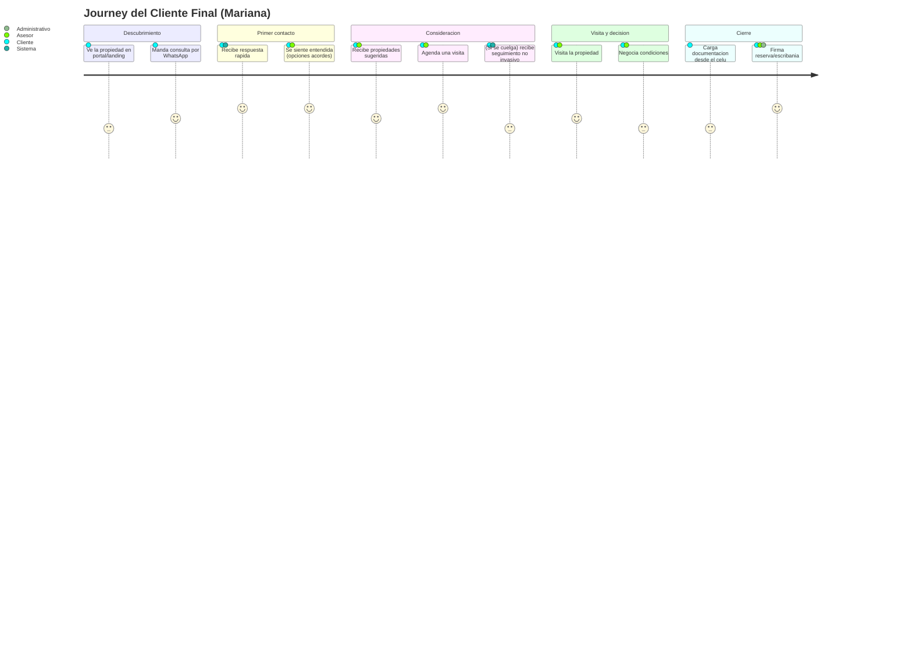
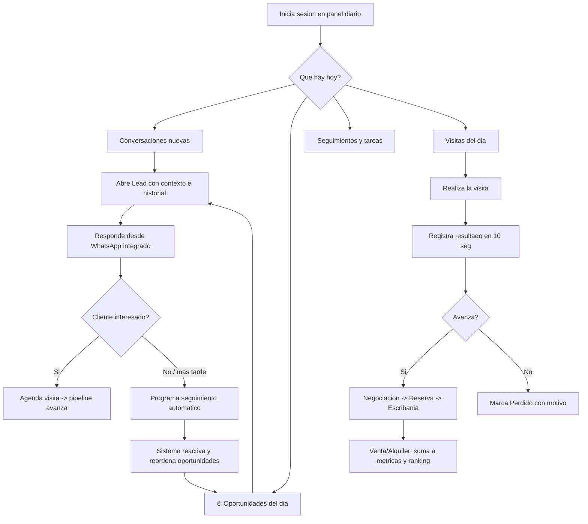

# Personas y Casos de Uso — RealEstate OS

> Documento de research de producto. Define las personas primarias y secundarias del "Sistema Operativo para Inmobiliarias" (RealEstate OS) y los casos de uso que el producto debe resolver.
> **Versión:** 1.0 · **Fecha:** 2026-07-02 · **Autor:** Product Management (Research)

---

## 1. Introducción

### 1.1 Propósito

Este documento traduce la visión del producto en **personas accionables** y **casos de uso operativos**. No es un catálogo de features: es la base de research que le da contexto humano a cada decisión de diseño. Cuando discutamos una pantalla, una automatización o un permiso, volvemos acá para preguntarnos: *¿a qué persona sirve y qué job está resolviendo?*

RealEstate OS **no es un CRM tradicional**. Un CRM tradicional gira alrededor de la propiedad y del contacto. Nosotros giramos alrededor del **Lead**: la persona que quiere comprar, alquilar o vender, y todo lo que le pasa desde que levanta la mano hasta que firma (o se pierde). Ese cambio de eje es lo que ordena todo el documento.

### 1.2 Metodología

Combinamos dos marcos complementarios:

1. **Jobs-to-be-Done (JTBD).** No preguntamos "qué features querés". Preguntamos "cuándo usás esto, ¿qué progreso estás tratando de lograr en tu vida?". Cada persona tiene jobs funcionales, emocionales y sociales. Un dueño no quiere "un dashboard": quiere *dormir tranquilo sabiendo que no se están perdiendo consultas mientras él no mira*.
2. **Personas.** Arquetipos basados en entrevistas y observación de campo en inmobiliarias de Argentina y LATAM. Cada persona tiene nombre, contexto y frustraciones concretas para que el equipo pueda empatizar rápido y decidir con criterio.

Sobre esa base construimos:

- **Mapas de empatía** (qué piensa, siente, ve, oye, dice y hace cada persona).
- **Casos de uso numerados** (UC-01…) con actor, precondición, flujo principal, flujos alternativos y postcondición.
- **Diagramas de journey** en Mermaid para el cliente final y para el asesor.

### 1.3 Alcance de personas

| Tipo | Persona | Rol en el sistema |
|------|---------|-------------------|
| Primaria | Dueño / Director | Acceso total. Visión ejecutiva y de negocio. |
| Primaria | Gerente / Jefe de ventas | Supervisión operativa del equipo. |
| Primaria | Asesor / Corredor | Ejecución diaria, contacto con el cliente. |
| Secundaria | Cliente final | Consulta por WhatsApp o landing. No es usuario interno. |
| Secundaria | Administrativo | Documentación, back-office. |

> **Nota sobre la IA:** en todas las personas, la IA aparece únicamente en tareas **operativas** (responder, clasificar, resumir, priorizar). Nunca edición de fotos ni home staging. Cuando una persona "confía en la IA", confía en que le ordena el trabajo, no en que le inventa contenido visual.

---

## 2. Personas primarias

### 2.1 Dueño — Roberto Salvatti

 **"No quiero enterarme el viernes de que perdimos tres clientes el lunes."**

| Atributo | Detalle |
|----------|---------|
| Nombre | Roberto Salvatti, 52 años |
| Rol | Dueño y director de "Salvatti Propiedades" |
| Estructura | 2 sucursales (Caballito y Villa Crespo), 9 asesores, 1 gerente, 1 administrativa |
| Perfil tecnológico | Medio. Usa el celular todo el día, desconfía de sistemas complicados. Quiere abrir una pantalla y "entender en 10 segundos". |

**Contexto.** Roberto arrancó como corredor y hoy dirige. Ya no atiende clientes: dirige personas y cuida el negocio. Su problema no es la falta de datos, es la **falta de visibilidad en tiempo real**. Se entera de los problemas tarde, por comentarios de pasillo o cuando el número del mes ya está mal. Invierte plata en portales y publicidad, pero no sabe qué pasa con cada consulta que entra.

**Objetivos**

- Saber, sin llamar a nadie, cómo viene el negocio hoy (no a fin de mes).
- Garantizar que **ninguna consulta quede sin responder**.
- Comparar el rendimiento entre sucursales y entre asesores con datos objetivos.
- Detectar problemas (asesor saturado, sucursal floja, campaña que no convierte) antes de que cuesten plata.
- Tomar decisiones de negocio con métricas financieras reales, no con sensaciones.

**Frustraciones / dolores actuales**

- "Me entero tarde de todo." La info llega filtrada y con demora.
- Consultas que se pierden en WhatsApps personales de los asesores, sin trazabilidad.
- No puede comparar asesores de forma justa: cada uno cuenta su propia versión.
- Reportes armados a mano en Excel, desactualizados el día que los mira.
- Cuando un asesor se va, se lleva sus contactos y su historial en la cabeza.
- No tiene idea del costo real de adquirir un cliente ni de qué campaña funciona.

**Jobs-to-be-Done**

- *Cuando* empiezo el día, *quiero* ver el estado real de la operación de un vistazo, *para* actuar sobre lo que está mal sin depender de que alguien me avise.
- *Cuando* evalúo al equipo, *quiero* datos objetivos de conversión y actividad, *para* premiar, corregir o reasignar con justicia.
- *Cuando* pienso el negocio, *quiero* ver de dónde vienen los leads que convierten y cuánto cuestan, *para* invertir donde rinde.
- *Cuando* no estoy en la oficina, *quiero* saber que el sistema sigue capturando y distribuyendo todo, *para* desconectarme sin culpa.

**Un día en su vida — antes vs. con RealEstate OS**

| Momento | Antes | Con RealEstate OS |
|---------|-------|-------------------|
| Mañana | Llama al gerente para preguntar "cómo venimos". Respuesta vaga. | Abre el **Centro de Operaciones** y ve leads del día, tiempos de respuesta y visitas agendadas en tiempo real. |
| Mediodía | Se entera por casualidad de que un asesor está desbordado. | El sistema le marca al asesor saturado y sugiere redistribuir. |
| Tarde | Arma un Excel para comparar sucursales. | Filtra por sucursal en el **dashboard ejecutivo** y compara al instante. |
| Fin de mes | Reconstruye números a mano, siempre incompleto. | Descarga reportes de conversión, ranking de asesores y métricas financieras ya listos. |

**Qué necesita ver al iniciar sesión**

1. **Centro de Operaciones** en tiempo real: consultas entrando, tiempos de respuesta, alertas de leads sin atender.
2. Dashboard ejecutivo: leads del período, conversión por etapa del **pipeline global**, ranking de asesores.
3. Alertas rojas primero: leads sin responder, asesores saturados, visitas sin confirmar.
4. Comparativa entre sucursales.

**Métricas que le importan**

- Tiempo medio de primera respuesta (el KPI que lo obsesiona).
- Tasa de conversión por etapa del pipeline y global.
- Leads perdidos y **motivo** de la pérdida.
- Ranking de asesores (actividad + conversión, no solo cierres).
- Costo por lead y por campaña / origen.
- Facturación proyectada según el pipeline (métricas financieras).

---

### 2.2 Gerente — Carla Domínguez

 **"Mi trabajo es que ningún lead se enfríe y que el equipo esté siempre balanceado."**

| Atributo | Detalle |
|----------|---------|
| Nombre | Carla Domínguez, 38 años |
| Rol | Gerente comercial / Jefa de ventas |
| Estructura | Coordina 9 asesores en 2 sucursales |
| Perfil tecnológico | Alto para el rubro. Vive entre el sistema, WhatsApp y la agenda. |

**Contexto.** Carla es el nexo entre la visión del dueño y la ejecución de los asesores. Es la que apaga incendios: el lead caliente que nadie atendió, el asesor que se fue de vacaciones con 15 clientes activos, la visita que se pisó con otra. Su valor está en el **balanceo del equipo** y en no dejar que nada se caiga entre las grietas.

**Objetivos**

- Que cada lead tenga siempre un asesor responsable y activo.
- Distribuir la carga de forma pareja y por criterio (zona, tipo de operación, disponibilidad).
- Detectar leads que se están enfriando y reactivarlos.
- Aprobar publicaciones de propiedades antes de que salgan mal cargadas.
- Reportarle al dueño con datos, no con excusas.

**Frustraciones / dolores actuales**

- Reasignar leads es un caos manual: WhatsApp, memoria, planillas.
- No sabe en tiempo real quién está saturado y quién ocioso.
- Leads que se enfrían sin que nadie note que dejaron de responder.
- Propiedades publicadas con errores o fotos malas que ella tiene que corregir después.
- Pierde media mañana armando el "reporte para el dueño".

**Jobs-to-be-Done**

- *Cuando* entra un lead nuevo, *quiero* que se asigne solo al asesor correcto, *para* no repartir a mano ni dejarlo huérfano.
- *Cuando* un asesor se sobrecarga, *quiero* verlo y reasignar en dos clics, *para* que ningún cliente espere.
- *Cuando* un lead deja de responder, *quiero* que el sistema lo marque, *para* intervenir antes de perderlo.
- *Cuando* reviso una publicación, *quiero* aprobar o rechazar con contexto, *para* cuidar la imagen de la marca.

**Un día en su vida — antes vs. con RealEstate OS**

| Momento | Antes | Con RealEstate OS |
|---------|-------|-------------------|
| Mañana | Reparte leads a mano leyendo WhatsApp. | La **distribución inteligente** ya asignó los leads; ella solo revisa excepciones. |
| Media mañana | No sabe quién está desbordado. | El Centro de Operaciones le muestra la carga de cada asesor. |
| Tarde | Descubre por casualidad un lead frío de hace 5 días. | El sistema le lista los leads sin respuesta para reasignar. |
| Cierre del día | Arma el reporte del dueño a mano. | Los reportes y métricas del equipo se generan solos. |

**Qué necesita ver al iniciar sesión**

1. Carga de trabajo por asesor (quién está saturado, quién libre).
2. Leads sin asignar o en riesgo de enfriarse.
3. Publicaciones pendientes de aprobación.
4. Agenda del día del equipo y visitas por confirmar.
5. Reportes de conversión del equipo.

**Métricas que le importan**

- Distribución de leads por asesor (balance de carga).
- Tiempo de respuesta por asesor.
- Leads en riesgo (frío / sin seguimiento).
- Conversión por asesor y por etapa del pipeline.
- Visitas agendadas vs. realizadas.

---

### 2.3 Asesor — Nicolás Ferreyra

 **"Decime a quién llamar hoy y qué necesita, y me olvido de la planilla."**

| Atributo | Detalle |
|----------|---------|
| Nombre | Nicolás Ferreyra, 29 años |
| Rol | Asesor / Corredor inmobiliario |
| Cartera | ~40 leads activos en distintas etapas |
| Perfil tecnológico | Alto en celular, bajo en sistemas de escritorio complejos. Odia "cargar datos". |

**Contexto.** Nicolás vive en la calle y en WhatsApp. Su día es una sucesión de conversaciones, visitas y seguimientos. Su enemigo no es la falta de clientes: es la **desorganización** y la carga administrativa que le come tiempo de venta. Cada minuto que pasa cargando datos es un minuto que no está vendiendo.

**Objetivos**

- Responder rápido a cada consulta nueva.
- No olvidarse de ningún seguimiento ni visita.
- Tener a mano el historial completo del cliente sin buscarlo.
- Priorizar: saber a quién llamar primero para cerrar más.
- Cargar la menor cantidad de datos posible.

**Frustraciones / dolores actuales**

- Se le mezclan los chats de trabajo con los personales.
- Se olvida de seguir a clientes que "estaban por decidir".
- Pierde tiempo buscando qué habían hablado con el cliente.
- No sabe a quién priorizar: atiende por urgencia, no por oportunidad.
- Le hacen cargar datos en sistemas que no le devuelven nada útil.

**Jobs-to-be-Done**

- *Cuando* abro mi panel, *quiero* ver qué tengo que hacer hoy y con quién, *para* arrancar sin pensar.
- *Cuando* entra una consulta, *quiero* responder desde el sistema con el contexto del cliente, *para* no cambiar de app ni perder el hilo.
- *Cuando* tengo muchos clientes, *quiero* que me digan a quién priorizar, *para* dedicar mi energía a los que están más cerca de cerrar.
- *Cuando* termino una visita, *quiero* dejar registro en 10 segundos, *para* que el sistema siga el hilo por mí.

**Un día en su vida — antes vs. con RealEstate OS**

| Momento | Antes | Con RealEstate OS |
|---------|-------|-------------------|
| Arranque | Revisa WhatsApp y trata de acordarse qué tenía pendiente. | Abre su **panel diario**: conversaciones nuevas, seguimientos y visitas del día ordenados. |
| Priorización | Atiende al que más grita. | Ve **🔥 Oportunidades del día** con los leads más calientes explicados. |
| Contacto | Salta entre WhatsApp personal y notas sueltas. | Responde desde su **WhatsApp por asesor**, con el historial del lead al lado. |
| Post-visita | Anota en un papel que después pierde. | Registra la visita realizada y el sistema agenda el próximo seguimiento solo. |

**Qué necesita ver al iniciar sesión**

1. Conversaciones nuevas sin responder.
2. **🔥 Oportunidades del día** (leads priorizados por Lead Score, con el "por qué").
3. Seguimientos y tareas del día.
4. Agenda: visitas del día.
5. Su pipeline personal.

**Métricas que le importan**

- Cuántos leads tiene que atender hoy.
- Su tasa de conversión personal.
- Seguimientos cumplidos vs. vencidos.
- Visitas de la semana.
- Su posición en el ranking (motivación).

---

## 3. Personas secundarias

### 3.1 Cliente final — Mariana López

 **"Mandé una consulta por un depto. Ojalá me contesten rápido."**

| Atributo | Detalle |
|----------|---------|
| Nombre | Mariana López, 34 años |
| Rol | Cliente final (compradora / inquilina potencial) |
| Relación con el sistema | Externa. Interactúa por WhatsApp o landing page. No sabe que existe RealEstate OS. |

**Contexto.** Mariana busca un 2 ambientes para alquilar. Consulta en varios lados a la vez. **Gana quien le responde primero y mejor.** Su experiencia con el sistema es invisible: para ella todo es "la inmobiliaria que me contestó rápido y me entendió".

**Objetivos:** respuesta rápida, sentirse entendida, coordinar una visita sin fricción, recibir opciones que le sirvan.

**Frustraciones:** que no le contesten, que le manden propiedades que no tienen nada que ver, tener que repetir su búsqueda cada vez que la atiende alguien distinto.

**JTBD:** *Cuando* consulto por una propiedad, *quiero* respuesta rápida y opciones acordes a lo que busco, *para* avanzar sin perder tiempo con inmobiliarias que no me escuchan.

**Cómo la sirve el sistema:** su consulta crea un **Lead automático**, la IA la clasifica y prioriza, se le asigna un asesor y recibe respuesta rápida. Si deja de responder, un **seguimiento automático** la reactiva sin acoso.

---

### 3.2 Administrativo — Silvia Ferrari

 **"Cuando la venta se cierra, empieza mi trabajo: que no falte ni un papel."**

| Atributo | Detalle |
|----------|---------|
| Nombre | Silvia Ferrari, 45 años |
| Rol | Administrativa / Back-office |
| Relación con el sistema | Usuaria interna con foco en **documentación** de leads en etapas avanzadas. |

**Contexto.** Silvia entra en juego cuando el lead avanza hacia Reserva y Escribanía. Su job es que la documentación esté completa y ordenada para que la operación no se trabe.

**Objetivos:** documentación completa y a tiempo, checklist claro por operación, nada que se pierda entre la reserva y la escribanía.

**Frustraciones:** papeles dispersos, tener que perseguir al cliente y al asesor por documentos, no saber qué falta.

**JTBD:** *Cuando* una operación avanza, *quiero* un checklist de documentación por lead, *para* garantizar que llegue completa a escribanía sin idas y vueltas.

**Cómo la sirve el sistema:** cada Lead tiene su bloque de **documentación**; el cliente puede cargar archivos desde la landing / WhatsApp, y Silvia ve qué falta por operación.

---

## 4. Mapas de empatía (personas primarias)

### 4.1 Dueño — Roberto

| Dimensión | Contenido |
|-----------|-----------|
| **Piensa y siente** | "¿Se está escapando plata sin que yo lo vea?" Ansiedad por la falta de control en tiempo real. |
| **Ve** | Reportes viejos, sucursales que no puede comparar, asesores que cuentan su versión. |
| **Oye** | "Estamos bien" de su gerente; quejas sueltas de clientes que no le contestaron. |
| **Dice y hace** | Pide números, arma Excels, llama para preguntar cómo viene el día. |
| **Dolores** | Info tardía, consultas perdidas, dependencia de terceros para saber la verdad. |
| **Ganancias** | Visibilidad en vivo, decisiones con datos, tranquilidad de que nada se cae. |

### 4.2 Gerente — Carla

| Dimensión | Contenido |
|-----------|-----------|
| **Piensa y siente** | "Si no reviso yo, se enfría un lead y nadie se entera." Sensación de ser el único cable a tierra. |
| **Ve** | Chats desbordados, asesores con cargas dispares, publicaciones mal armadas. |
| **Oye** | "No me llegó ese lead", "no tuve tiempo de seguirlo". |
| **Dice y hace** | Reparte leads a mano, apaga incendios, arma reportes para el dueño. |
| **Dolores** | Reasignación manual, falta de visibilidad de carga, leads que se enfrían callados. |
| **Ganancias** | Distribución automática, alertas de riesgo, reportes que se generan solos. |

### 4.3 Asesor — Nicolás

| Dimensión | Contenido |
|-----------|-----------|
| **Piensa y siente** | "¿A quién estoy olvidando? ¿A quién llamo primero?" Miedo a que se le escape un cierre. |
| **Ve** | WhatsApp mezclado, notas sueltas, clientes que no recuerda bien. |
| **Oye** | "¿Al final me conseguiste algo?" de clientes que quedaron colgados. |
| **Dice y hace** | Responde por urgencia, anota en papeles, esquiva la carga de datos. |
| **Dolores** | Desorganización, olvidos de seguimiento, carga administrativa. |
| **Ganancias** | Panel diario claro, oportunidades priorizadas, WhatsApp integrado, seguimientos automáticos. |

---

## 5. Casos de uso

> Notación: **UC-XX**. Cada caso incluye actor, precondición, flujo principal, flujos alternativos y postcondición. El pipeline de referencia es:
> **Nuevo Lead → Primer contacto → Interesado → Visita agendada → Visita realizada → Negociación → Reserva → Escribanía → Venta/Alquiler → Perdido.**

### 5.1 Casos de uso — Sistema / Automatizaciones

#### UC-01 — Llega una consulta por WhatsApp y se crea un Lead automático

- **Actor:** Cliente final (Mariana) → Sistema.
- **Precondición:** La inmobiliaria tiene un número de WhatsApp conectado y/o una landing con chat activa.
- **Flujo principal:**
  1. Mariana envía un mensaje consultando por una propiedad (por WhatsApp o por el chat de la landing).
  2. El sistema detecta que el número/contacto no existe como Lead.
  3. Crea un **Lead nuevo** en estado *Nuevo Lead* con los datos disponibles (nombre, teléfono, propiedad consultada, canal de origen).
  4. La **IA operativa** clasifica el mensaje: tipo de operación (compra/alquiler), propiedad de interés y urgencia; genera un **resumen** de la consulta.
  5. El sistema calcula un **Lead Score** inicial y registra la conversación en el historial del Lead.
  6. Dispara la **distribución inteligente** (ver UC-04).
- **Flujos alternativos:**
  - *A1 — El contacto ya existe:* el mensaje se anexa al historial del Lead existente; no se duplica.
  - *A2 — Mensaje ambiguo:* la IA marca el Lead como "requiere calificación" y deja una tarea de calificar.
  - *A3 — Fuera de horario:* se envía una respuesta automática de recepción y el Lead queda encolado con prioridad para el próximo horario hábil.
- **Postcondición:** Existe un Lead trazable, clasificado, scoreado y listo para asignar. Nada quedó en un WhatsApp personal.

---

#### UC-02 — Distribución automática de un Lead nuevo

- **Actor:** Sistema (motor de distribución inteligente); supervisa el Gerente.
- **Precondición:** Existe un Lead en estado *Nuevo Lead* sin asesor responsable.
- **Flujo principal:**
  1. El motor evalúa reglas configuradas: zona/barrio del Lead, tipo de operación, tipo de propiedad, disponibilidad y carga actual de cada asesor.
  2. Selecciona al asesor más adecuado según criterio y balance de carga.
  3. Asigna el **asesor responsable** al Lead y lo notifica en su panel y por WhatsApp.
  4. Registra la asignación en la auditoría del Lead.
- **Flujos alternativos:**
  - *A1 — No hay asesor disponible:* el Lead queda en cola "sin asignar" y se alerta al Gerente.
  - *A2 — Empate de criterio:* se aplica round-robin entre los candidatos igualados.
  - *A3 — Regla especial (VIP / zona premium):* se asigna al asesor designado para ese segmento.
- **Postcondición:** El Lead tiene asesor responsable y el equipo quedó balanceado.

---

#### UC-03 — Seguimiento automático de cliente que no responde

- **Actor:** Sistema (motor de automatizaciones); interviene el Asesor si escala.
- **Precondición:** Un Lead recibió respuesta pero no contesta desde hace X tiempo (parametrizable).
- **Flujo principal:**
  1. El motor detecta inactividad del Lead según la regla definida (ej.: 48 h sin respuesta).
  2. Envía un mensaje de seguimiento automático personalizado por WhatsApp, con tono no invasivo.
  3. Registra el intento en el historial y ajusta el **Lead Score** (enfriamiento).
  4. Si tras N intentos no hay respuesta, crea una tarea para el asesor y marca el Lead "en riesgo".
- **Flujos alternativos:**
  - *A1 — El cliente responde:* se cancela la secuencia, el Lead vuelve a estado activo y sube el score; se notifica al asesor.
  - *A2 — El cliente pide no ser contactado:* se detiene toda automatización y se marca la preferencia.
  - *A3 — Límite de intentos alcanzado:* se sugiere marcar como *Perdido* (ver UC-08) o reasignar (ver UC-06).
- **Postcondición:** El Lead fue reactivado o quedó correctamente identificado como en riesgo, sin quedar en el olvido.

---

### 5.2 Casos de uso — Asesor

#### UC-04 — El asesor responde una consulta y agenda una visita

- **Actor:** Asesor (Nicolás).
- **Precondición:** Nicolás tiene un Lead asignado con una conversación nueva.
- **Flujo principal:**
  1. Nicolás abre su panel diario y ve la conversación nueva en su bandeja.
  2. Abre el Lead: ve datos personales, presupuesto, preferencias, barrios, propiedades consultadas y el **resumen** de la IA.
  3. Responde desde su **WhatsApp por asesor** integrado, sin salir del sistema.
  4. Propone propiedades acordes a las preferencias del Lead.
  5. Acuerdan una visita; Nicolás la agenda en la **agenda** del Lead (fecha, hora, propiedad).
  6. El estado del Lead avanza a *Visita agendada*; el sistema crea un recordatorio.
- **Flujos alternativos:**
  - *A1 — El cliente no está listo para visitar:* Nicolás programa un seguimiento; el Lead queda en *Interesado*.
  - *A2 — La propiedad ya no está disponible:* ofrece alternativas similares desde el catálogo.
  - *A3 — El cliente pide reprogramar:* se actualiza la agenda y se reenvía la confirmación.
- **Postcondición:** El Lead tiene una visita agendada, con recordatorios activos y estado actualizado.

---

#### UC-05 — El asesor ve las Oportunidades del día y actúa

- **Actor:** Asesor (Nicolás).
- **Precondición:** Nicolás tiene leads activos con distintos Lead Score.
- **Flujo principal:**
  1. Al iniciar sesión, ve el bloque **🔥 Oportunidades del día**: los leads más calientes ordenados por Lead Score.
  2. Cada oportunidad muestra el **"por qué"** explicable (ej.: "pidió visitar esta semana + presupuesto acorde + respondió hace 1 h").
  3. Nicolás elige la primera oportunidad y la contacta desde el sistema.
  4. Registra el resultado (interesado, agendó visita, pidió más info).
  5. El sistema recalcula el score y reordena la lista.
- **Flujos alternativos:**
  - *A1 — El lead ya no está interesado:* Nicolás lo marca; el sistema propone cerrarlo como *Perdido*.
  - *A2 — Nicolás no puede atender ahora:* pospone la oportunidad y queda como tarea del día.
- **Postcondición:** Los leads de mayor potencial fueron atendidos primero, priorizando por dato y no por urgencia.

---

#### UC-06 — Cierre de venta y paso a escribanía

- **Actor:** Asesor (Nicolás), con apoyo del Administrativo (Silvia).
- **Precondición:** El Lead está en *Negociación* con acuerdo entre partes.
- **Flujo principal:**
  1. Nicolás registra el acuerdo y avanza el Lead a *Reserva*.
  2. Se genera el checklist de **documentación** de la operación.
  3. El Lead avanza a *Escribanía*; se notifica a Silvia (Administrativo).
  4. Silvia verifica la documentación (ver UC-10) y coordina la firma.
  5. Al concretarse, Nicolás marca el Lead como *Venta/Alquiler*.
  6. El sistema actualiza las **métricas financieras** y suma la operación al ranking del asesor.
- **Flujos alternativos:**
  - *A1 — Falta documentación:* el Lead queda bloqueado en *Escribanía* con tareas pendientes para el cliente.
  - *A2 — Se cae la operación:* el Lead puede volver a *Negociación* o marcarse *Perdido* con motivo.
- **Postcondición:** La operación queda cerrada y contabilizada, con trazabilidad completa desde el primer contacto.

---

### 5.3 Casos de uso — Gerente

#### UC-07 — El gerente reasigna un lead frío

- **Actor:** Gerente (Carla).
- **Precondición:** Existe un Lead marcado "en riesgo" o "frío" (ver UC-03).
- **Flujo principal:**
  1. Carla ve en su panel los leads en riesgo, con el asesor responsable actual.
  2. Abre el Lead y revisa el historial y la conversación para entender por qué se enfrió.
  3. Decide reasignarlo a otro asesor con mejor disponibilidad o encaje.
  4. Cambia el **asesor responsable**; el sistema notifica a ambos y registra el cambio en auditoría.
  5. El nuevo asesor recibe el Lead con todo el contexto y una tarea de reactivación.
- **Flujos alternativos:**
  - *A1 — El asesor original estaba sobrecargado:* Carla redistribuye varios leads a la vez.
  - *A2 — El Lead no tiene potencial:* Carla lo marca como *Perdido* con motivo (ver UC-08).
  - *A3 — El asesor destino no tiene capacidad:* el sistema advierte y sugiere otro candidato.
- **Postcondición:** El Lead frío tiene un nuevo responsable con contexto y una acción concreta para reactivarlo.

---

#### UC-08 — Un lead se marca como Perdido

- **Actor:** Asesor o Gerente.
- **Precondición:** Existe un Lead activo que no va a avanzar.
- **Flujo principal:**
  1. El usuario abre el Lead y selecciona marcarlo como *Perdido*.
  2. El sistema **obliga a registrar un motivo** (precio, financiación, compró en otra, no responde, fuera de zona, etc.).
  3. El Lead pasa a estado *Perdido*; se detienen automatizaciones y seguimientos.
  4. El motivo se suma a las métricas de pérdida para análisis.
- **Flujos alternativos:**
  - *A1 — Perdido recuperable:* se puede programar una reactivación futura (ej.: "recontactar en 6 meses").
  - *A2 — Marcado por error:* el Lead puede reabrirse y volver a su etapa anterior.
- **Postcondición:** El Lead queda cerrado con motivo trazable, alimentando el análisis de por qué se pierden clientes.

---

### 5.4 Casos de uso — Dueño

#### UC-09 — El dueño detecta un asesor saturado en el Centro de Operaciones

- **Actor:** Dueño (Roberto).
- **Precondición:** El **Centro de Operaciones** está activo y captando datos en tiempo real.
- **Flujo principal:**
  1. Roberto abre el Centro de Operaciones y ve la carga de trabajo por asesor.
  2. El sistema resalta un asesor **saturado**: muchos leads activos, tiempos de respuesta en alza, seguimientos vencidos.
  3. Roberto revisa el detalle: cantidad de leads, estado del pipeline personal, respuestas pendientes.
  4. Comparte el hallazgo con Carla (Gerente) para redistribuir (deriva a UC-07).
- **Flujos alternativos:**
  - *A1 — Toda la sucursal está saturada:* señal para sumar personal o pausar campañas de ese origen.
  - *A2 — El asesor está saturado pero convierte bien:* se prioriza reasignar leads de baja prioridad para liberarlo.
- **Postcondición:** Se detectó y accionó un cuello de botella antes de perder clientes por falta de atención.

---

### 5.5 Casos de uso — Cliente final / Administrativo

#### UC-10 — El cliente carga documentación

- **Actor:** Cliente final (Mariana); valida el Administrativo (Silvia).
- **Precondición:** El Lead está en una etapa que requiere documentación (*Reserva* / *Escribanía*).
- **Flujo principal:**
  1. El sistema envía a Mariana un enlace (por WhatsApp o landing) con el checklist de documentos requeridos.
  2. Mariana sube los archivos desde su celular.
  3. Los documentos se adjuntan al bloque de **documentación** del Lead.
  4. Silvia recibe la notificación, revisa y marca cada documento como válido o rechazado.
  5. Cuando el checklist está completo, el Lead queda habilitado para avanzar.
- **Flujos alternativos:**
  - *A1 — Documento ilegible o incorrecto:* Silvia lo rechaza con un comentario y el cliente recibe el pedido de recarga.
  - *A2 — Falta un documento:* el checklist muestra el pendiente y dispara un recordatorio automático.
  - *A3 — El cliente no puede cargar solo:* el asesor puede subir la documentación en su nombre.
- **Postcondición:** La documentación queda completa, validada y trazable, lista para escribanía.

---

## 6. Diagramas de journey

### 6.1 Customer Journey — Cliente final

### 6.2 Recorrido del Asesor

---

## 7. Trazabilidad: personas ↔ casos de uso

| Caso de uso | Dueño | Gerente | Asesor | Cliente | Administrativo | Sistema |
|-------------|:-----:|:-------:|:------:|:-------:|:--------------:|:-------:|
| UC-01 Consulta crea Lead | | | | ● | | ● |
| UC-02 Distribución automática | ○ | ● | ○ | | | ● |
| UC-03 Seguimiento automático | | ○ | ○ | ● | | ● |
| UC-04 Responder y agendar | | | ● | ● | | |
| UC-05 Oportunidades del día | | | ● | | | ● |
| UC-06 Cierre y escribanía | ○ | | ● | ● | ● | ● |
| UC-07 Reasignar lead frío | | ● | ○ | | | ● |
| UC-08 Marcar Perdido | | ● | ● | | | ● |
| UC-09 Detectar saturación | ● | ○ | | | | ● |
| UC-10 Cargar documentación | | | ○ | ● | ● | ● |

> ● actor principal · ○ actor involucrado / supervisor

---

## 8. Cierre

Las tres personas primarias comparten un mismo miedo con distinto nombre: **que un cliente se pierda por desorganización**. El Dueño lo llama "falta de control", la Gerente "leads que se enfrían", el Asesor "olvidos". RealEstate OS ataca ese miedo desde tres ángulos —visibilidad en tiempo real, distribución y automatización, y priorización explicable— siempre con el **Lead** en el centro. Los casos de uso de este documento son el contrato de comportamiento que el producto debe cumplir para cada uno de ellos.
