# 04 — Arquitectura Funcional

> **Producto:** RealEstate OS — SaaS multi-tenant para inmobiliarias LATAM
> **Documento:** Arquitectura funcional del sistema (visión architect + product)
> **Estado:** Baseline v1 · Fecha: 2026-07-02
> **Premisa central:** el sistema gira alrededor del **Lead**. La propiedad es un atributo del interés del lead, no la entidad protagonista. Todo evento, automatización, métrica y vista se ordena en función de mover leads a través del pipeline hasta el cierre.

---

## 1. Visión funcional general

RealEstate OS es un sistema **event-driven, modular y multi-tenant** donde cada inmobiliaria (tenant) opera de forma aislada bajo un esquema de **RBAC** (Dueño, Gerente, Asesor, Administrativo, Cliente final). La arquitectura interna es **hexagonal (Ports & Adapters)**: el núcleo de dominio (Lead, Pipeline, Propiedad, Agenda) es independiente de los adaptadores de entrada (WhatsApp, Landing Pages, API) y de salida (notificaciones, IA, persistencia, integraciones futuras).

### El Lead como centro gravitacional

Todo lo que ocurre en el sistema es **un evento sobre un lead** o **una consecuencia de un evento sobre un lead**:

- Una consulta de WhatsApp **crea o enriquece** un lead.
- Una landing page **genera** un lead.
- El pipeline **describe el estado** de un lead.
- Las automatizaciones **reaccionan** a cambios de estado del lead.
- El Centro de Operaciones **observa en tiempo real** el flujo de leads.
- Los reportes, KPIs y rankings **agregan** el comportamiento de los leads y de los asesores que los trabajan.

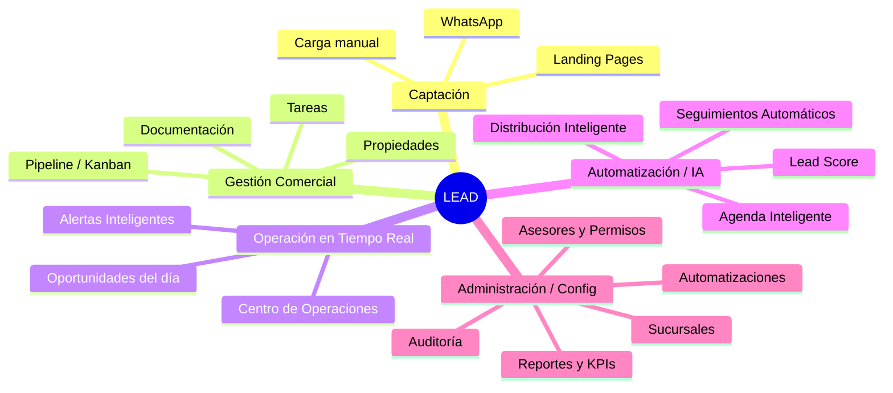

### Principios funcionales rectores

| Principio | Implicancia funcional |
|-----------|-----------------------|
| **Multi-tenant** | Todo dato lleva `tenantId`. Ningún query cruza tenants. La configuración es por tenant. |
| **Event-driven** | Los módulos no se llaman directamente entre sí; emiten y consumen **eventos de dominio**. |
| **Modular / hexagonal** | El dominio no conoce a WhatsApp ni a Clerk. Los adaptadores son reemplazables. |
| **RBAC** | Cada acción se autoriza por rol y por scope (tenant, sucursal, asesor). |
| **IA solo operativa** | La IA responde, clasifica, resume y prioriza. **Nunca genera imágenes** ni contenido visual. |
| **Tiempo real** | WebSockets empujan cambios al Centro de Operaciones y a los tableros. |

---

## 2. Mapa de módulos

Los módulos se agrupan en cinco **dominios funcionales**. Cada módulo declara: propósito, responsabilidades, entradas/salidas, eventos que emite/consume y roles que lo usan.

### 2.1 Dominio: Captación

Responsable de que **ningún interés se pierda** antes de convertirse en lead trabajable.

#### Gestión de Leads
- **Propósito:** ser el repositorio canónico del lead y su ciclo de vida.
- **Responsabilidades:** crear/deduplicar leads, mantener datos de contacto, interés (propiedad/zona/presupuesto), origen, historial y estado actual del pipeline.
- **Entradas:** eventos de WhatsApp, submits de landing, carga manual, importaciones.
- **Salidas:** lead normalizado + eventos de dominio.
- **Emite:** `lead.created`, `lead.updated`, `lead.merged`, `lead.qualified`.
- **Consume:** `whatsapp.message.received`, `landing.form.submitted`.
- **Roles:** Asesor, Gerente, Dueño, Administrativo.

#### Conversaciones / WhatsApp
- **Propósito:** canal conversacional principal de captación y contacto.
- **Responsabilidades:** recibir/enviar mensajes, asociar conversación a lead, clasificar intención (IA), sugerir respuestas (IA), registrar timeline.
- **Entradas:** webhooks de proveedor de WhatsApp, respuestas del asesor, plantillas.
- **Salidas:** mensajes enviados, lead creado/enriquecido, clasificación de intención.
- **Emite:** `whatsapp.message.received`, `whatsapp.message.sent`, `conversation.intent.classified`.
- **Consume:** `lead.assigned`, `followup.triggered`, `visit.scheduled`.
- **Roles:** Asesor (principal), Gerente (supervisión), IA (asistencia).

#### Landing Pages
- **Propósito:** capturar leads desde publicaciones y campañas.
- **Responsabilidades:** publicar páginas por propiedad/campaña, renderizar formularios, validar y anti-spam, atribuir origen/UTM.
- **Entradas:** configuración de landing, tráfico web, submit de formulario.
- **Salidas:** lead con atribución de campaña.
- **Emite:** `landing.form.submitted`, `landing.visited`.
- **Consume:** `property.published`.
- **Roles:** Gerente/Dueño (configuran), Cliente final (consume), Asesor (recibe el lead).

### 2.2 Dominio: Gestión Comercial

El corazón operativo donde el asesor **trabaja** el lead.

#### Pipeline (Kanban)
- **Propósito:** representar y hacer avanzar el estado comercial del lead.
- **Responsabilidades:** mostrar etapas como columnas, permitir mover leads, **registrar por cada etapa: fecha de ingreso, tiempo de permanencia, responsable, comentarios, tareas pendientes y probabilidad de cierre**.
- **Entradas:** interacción del asesor (drag&drop), eventos automáticos (visita agendada → mueve etapa).
- **Salidas:** transición de etapa + snapshot de métricas de etapa.
- **Emite:** `pipeline.stage.changed`, `pipeline.stage.entered`, `pipeline.stage.exited`, `lead.won`, `lead.lost`.
- **Consume:** `lead.created`, `visit.scheduled`, `visit.completed`, `reservation.created`.
- **Roles:** Asesor (opera), Gerente (supervisa), Dueño (lee).

#### Gestión de Propiedades
- **Propósito:** administrar el inventario de propiedades como **atributo del interés del lead**.
- **Responsabilidades:** alta/baja/estado de propiedades, características, precio, ubicación, disponibilidad, vinculación a leads interesados.
- **Entradas:** carga de propiedad, cambios de estado (reservada/vendida).
- **Salidas:** propiedad publicable, disponibilidad actualizada.
- **Emite:** `property.published`, `property.reserved`, `property.sold`, `property.unavailable`.
- **Consume:** `reservation.created`, `sale.closed`.
- **Roles:** Asesor, Gerente, Dueño.

#### Documentación (carpeta digital por cliente)
- **Propósito:** consolidar la documentación del cliente/operación.
- **Responsabilidades:** carpeta digital por lead/cliente, versionado de documentos, checklist para reserva/escribanía, control de vencimientos.
- **Entradas:** archivos subidos, requisitos por etapa.
- **Salidas:** estado de completitud documental.
- **Emite:** `document.uploaded`, `document.checklist.completed`, `document.expiring`.
- **Consume:** `reservation.created`, `pipeline.stage.changed` (Escribanía).
- **Roles:** Administrativo (principal), Asesor, Cliente final (carga sus docs).

#### Tareas
- **Propósito:** gestionar el trabajo pendiente asociado a cada lead.
- **Responsabilidades:** crear tareas manuales o automáticas, asignar responsable, fecha límite, vincular a etapa del pipeline.
- **Entradas:** creación manual, automatizaciones, seguimientos.
- **Salidas:** tareas asignadas y su estado.
- **Emite:** `task.created`, `task.completed`, `task.overdue`.
- **Consume:** `pipeline.stage.changed`, `followup.triggered`.
- **Roles:** Asesor, Administrativo, Gerente.

### 2.3 Dominio: Operación en Tiempo Real

Visibilidad y reacción inmediata sobre lo que pasa **ahora**.

#### Centro de Operaciones (tiempo real)
- **Propósito:** tablero de mando en vivo del estado operativo del tenant.
- **Responsabilidades:** stream en tiempo real de leads entrantes, transiciones de pipeline, visitas del día, alertas y SLAs de respuesta.
- **Entradas:** todos los eventos de dominio relevantes vía WebSockets.
- **Salidas:** vistas en vivo, disparo de alertas.
- **Emite:** `ops.alert.raised`, `ops.sla.breached`.
- **Consume:** prácticamente todos los eventos (`lead.*`, `pipeline.*`, `visit.*`, `whatsapp.*`).
- **Roles:** Gerente, Dueño (principal), Asesor (su vista acotada).

#### Alertas Inteligentes
- **Propósito:** avisar cuando algo requiere atención humana.
- **Responsabilidades:** reglas de alerta (lead sin respuesta > X min, visita sin confirmar, doc por vencer), priorización por IA.
- **Entradas:** eventos + reglas configuradas + señales de IA.
- **Salidas:** alertas priorizadas y ruteadas.
- **Emite:** `alert.raised`, `alert.resolved`.
- **Consume:** `ops.sla.breached`, `task.overdue`, `document.expiring`, `lead.created`.
- **Roles:** Gerente, Asesor.

#### Lead Score + Oportunidades del día
- **Propósito:** decirle al asesor **a quién llamar primero hoy**.
- **Responsabilidades:** calcular score por lead (IA operativa: prioriza/clasifica), armar lista diaria priorizada de oportunidades.
- **Entradas:** señales del lead (recencia, intención, etapa, interacciones).
- **Salidas:** score numérico + ranking diario.
- **Emite:** `lead.score.updated`, `opportunities.daily.generated`.
- **Consume:** `lead.updated`, `pipeline.stage.changed`, `conversation.intent.classified`.
- **Roles:** Asesor (principal), Gerente.

### 2.4 Dominio: Automatización / IA

Reduce trabajo manual y hace que el sistema reaccione solo.

#### Distribución Inteligente de Leads
- **Propósito:** asignar cada lead nuevo al asesor correcto.
- **Responsabilidades:** aplicar reglas (round-robin, por zona, por carga, por especialidad, por disponibilidad), balancear y reasignar por SLA.
- **Entradas:** `lead.created`, reglas de distribución, estado de asesores.
- **Salidas:** lead asignado a asesor.
- **Emite:** `lead.assigned`, `lead.reassigned`.
- **Consume:** `lead.created`, `ops.sla.breached` (reasignación).
- **Roles:** configurado por Gerente/Dueño; ejecuta automático.

#### Seguimientos Automáticos
- **Propósito:** que ningún lead quede sin contacto.
- **Responsabilidades:** disparar secuencias de seguimiento por evento/tiempo (post-primer contacto, post-visita, lead frío), respetando canal y horario.
- **Entradas:** eventos de pipeline, temporizadores, plantillas.
- **Salidas:** mensajes/tareas de seguimiento.
- **Emite:** `followup.triggered`, `followup.completed`, `followup.cancelled`.
- **Consume:** `pipeline.stage.changed`, `visit.completed`, `lead.score.updated`.
- **Roles:** configurado por Gerente; ejecuta automático; Asesor supervisa.

#### Agenda Inteligente
- **Propósito:** coordinar y agendar visitas sin fricción.
- **Responsabilidades:** proponer horarios según disponibilidad de asesor y cliente, agendar visitas, enviar recordatorios, evitar solapamientos.
- **Entradas:** solicitud de visita, disponibilidad, calendario.
- **Salidas:** visita agendada + recordatorios.
- **Emite:** `visit.scheduled`, `visit.reminder.sent`, `visit.rescheduled`, `visit.cancelled`, `visit.completed`.
- **Consume:** `lead.qualified`, `conversation.intent.classified` (intención de visita).
- **Roles:** Asesor, Cliente final (confirma).

#### Automatizaciones (motor de reglas)
- **Propósito:** permitir a cada tenant definir su propia lógica evento→acción.
- **Responsabilidades:** editor de reglas (trigger → condición → acción), ejecución y auditoría de automatizaciones.
- **Entradas:** reglas configuradas, eventos de dominio.
- **Salidas:** acciones ejecutadas (crear tarea, mover etapa, enviar mensaje, alertar).
- **Emite:** `automation.rule.executed`.
- **Consume:** cualquier evento de dominio como trigger.
- **Roles:** Gerente/Dueño (configuran).

### 2.5 Dominio: Administración / Configuración

Estructura organizativa, seguridad y visibilidad agregada.

#### Sucursales
- **Propósito:** modelar la estructura física/organizativa del tenant.
- **Responsabilidades:** definir sucursales, asignar asesores, segmentar leads/propiedades por sucursal.
- **Emite:** `branch.created`, `branch.updated`.
- **Consume:** —
- **Roles:** Dueño, Gerente.

#### Asesores
- **Propósito:** gestionar el equipo comercial.
- **Responsabilidades:** alta/baja de asesores, disponibilidad, especialidad, zona, metas.
- **Emite:** `advisor.created`, `advisor.availability.changed`.
- **Consume:** —
- **Roles:** Dueño, Gerente.

#### Permisos (RBAC)
- **Propósito:** controlar qué puede hacer cada rol.
- **Responsabilidades:** definir roles, permisos por módulo/acción, scopes (tenant/sucursal/propio).
- **Emite:** `permission.changed`.
- **Consume:** —
- **Roles:** Dueño (principal).

#### Auditoría
- **Propósito:** trazabilidad de todo cambio sensible.
- **Responsabilidades:** registrar quién hizo qué, cuándo y sobre qué entidad (append-only, inmutable).
- **Entradas:** todos los eventos de dominio.
- **Salidas:** log de auditoría consultable.
- **Emite:** —
- **Consume:** todos los eventos.
- **Roles:** Dueño, Gerente (lectura).

#### Reportes / KPIs / Métricas financieras / Ranking de asesores
- **Propósito:** convertir la actividad en decisiones.
- **Responsabilidades:** agregación de conversión por etapa, tiempos de ciclo, KPIs por asesor/sucursal, métricas financieras (comisiones, ticket, proyección), ranking de asesores.
- **Entradas:** eventos históricos + snapshots de etapa.
- **Salidas:** dashboards, reportes, ranking.
- **Emite:** `report.generated`.
- **Consume:** `pipeline.*`, `lead.won`, `sale.closed`, `visit.completed`.
- **Roles:** Gerente, Dueño.

#### Configuración
- **Propósito:** parametrizar el comportamiento del tenant.
- **Responsabilidades:** etapas del pipeline, plantillas, reglas de distribución/seguimiento, canales, integraciones.
- **Emite:** `config.updated`.
- **Consume:** —
- **Roles:** Dueño, Gerente.

---

## 3. Diagrama general de funcionamiento

Flujo end-to-end desde una consulta entrante hasta el cierre, atravesando captación, lead, pipeline, automatización y tiempo real.

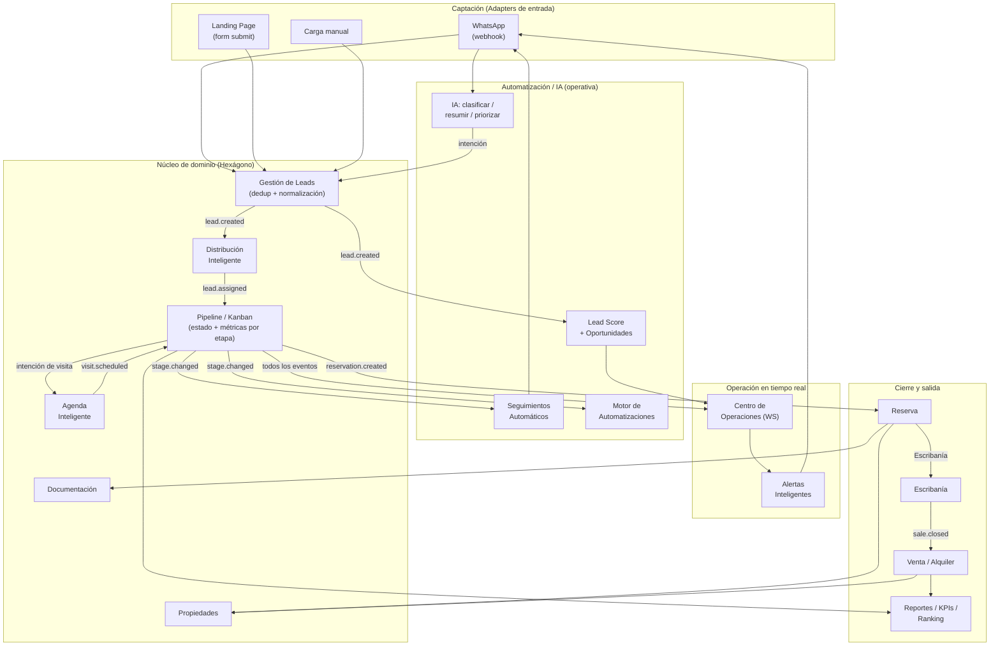

---

## 4. Flujos completos del negocio

> **Regla transversal del pipeline (aplica a todos los flujos):** cada transición de etapa registra un **snapshot de etapa** con: `fechaIngreso`, `tiempoPermanencia` (calculado al salir), `responsable`, `comentarios`, `tareasPendientes` y `probabilidadCierre`. Esto alimenta reportes, KPIs y ranking.

### 4.1 Captura de lead por WhatsApp con creación automática

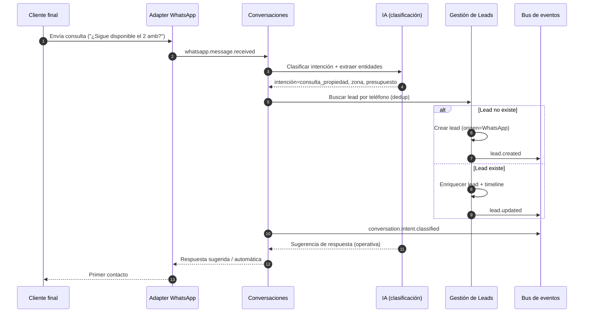

### 4.2 Distribución y asignación del lead

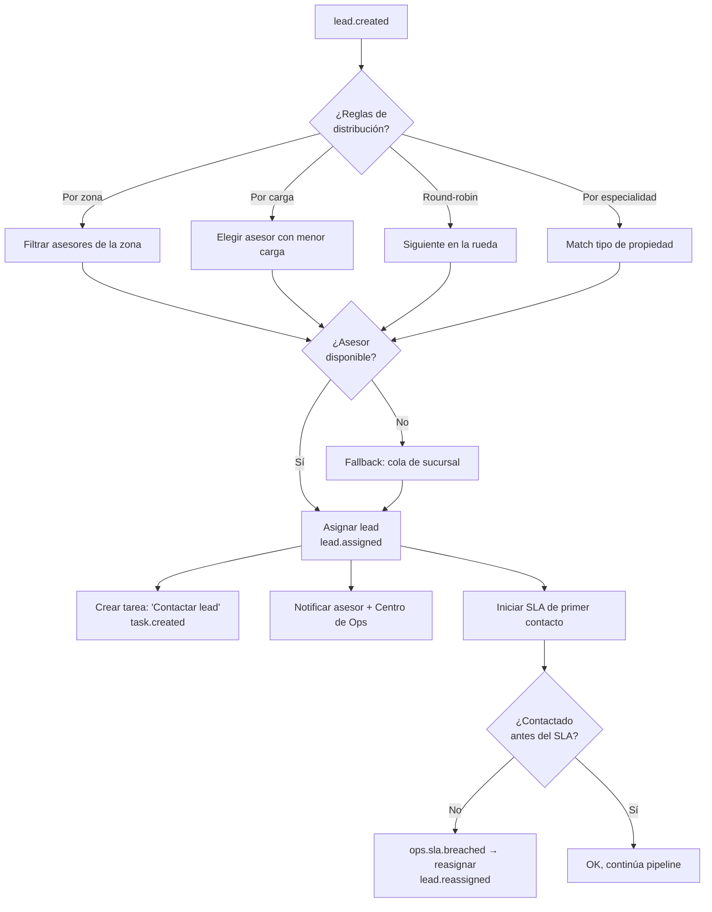

### 4.3 Avance por el pipeline con registro de tiempos y probabilidad

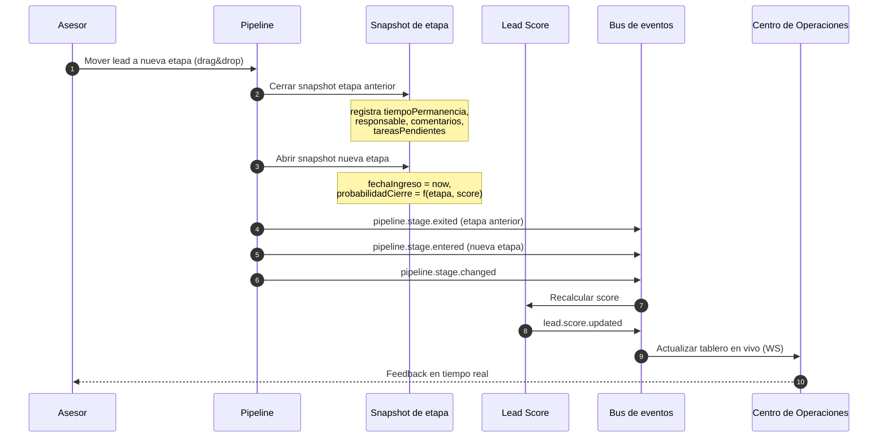

**Etapas del pipeline (canónicas):**

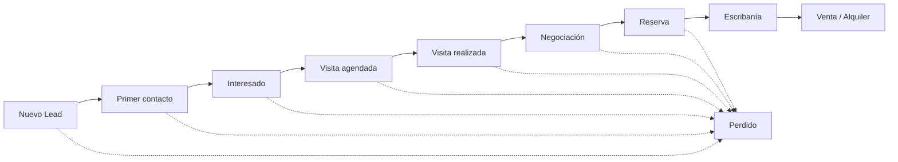

### 4.4 Agendado automático de visita

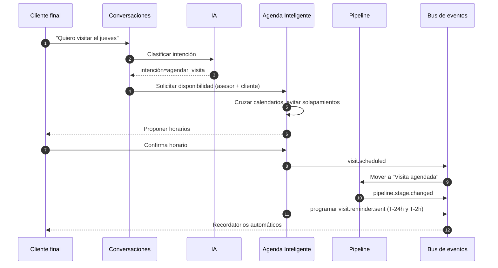

### 4.5 Seguimiento automático disparado por evento

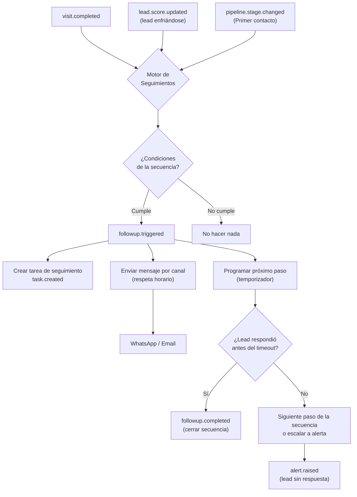

### 4.6 Cierre de venta → escribanía

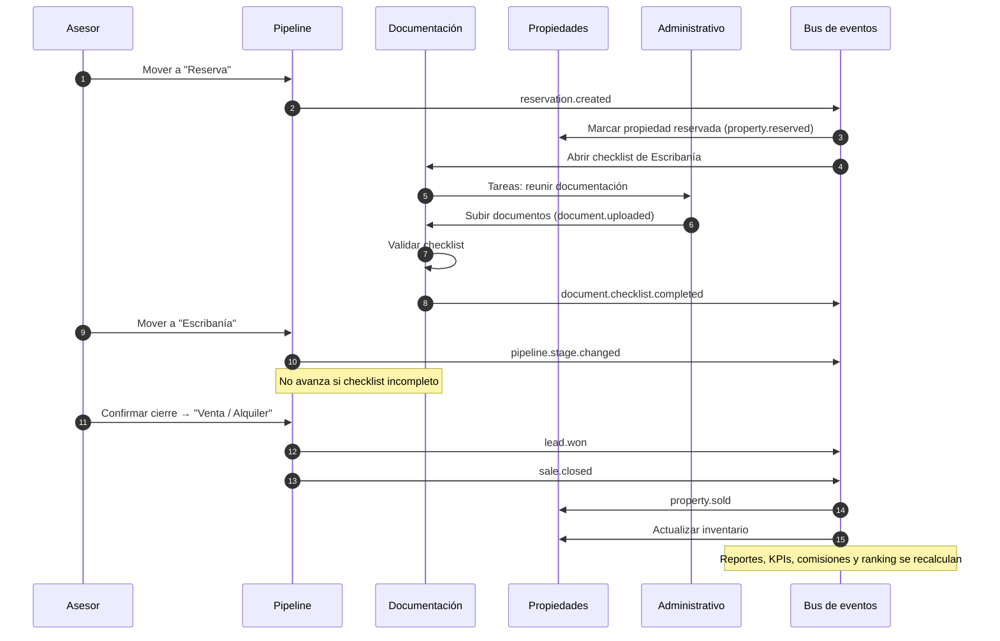

### 4.7 Generación de alerta en el Centro de Operaciones

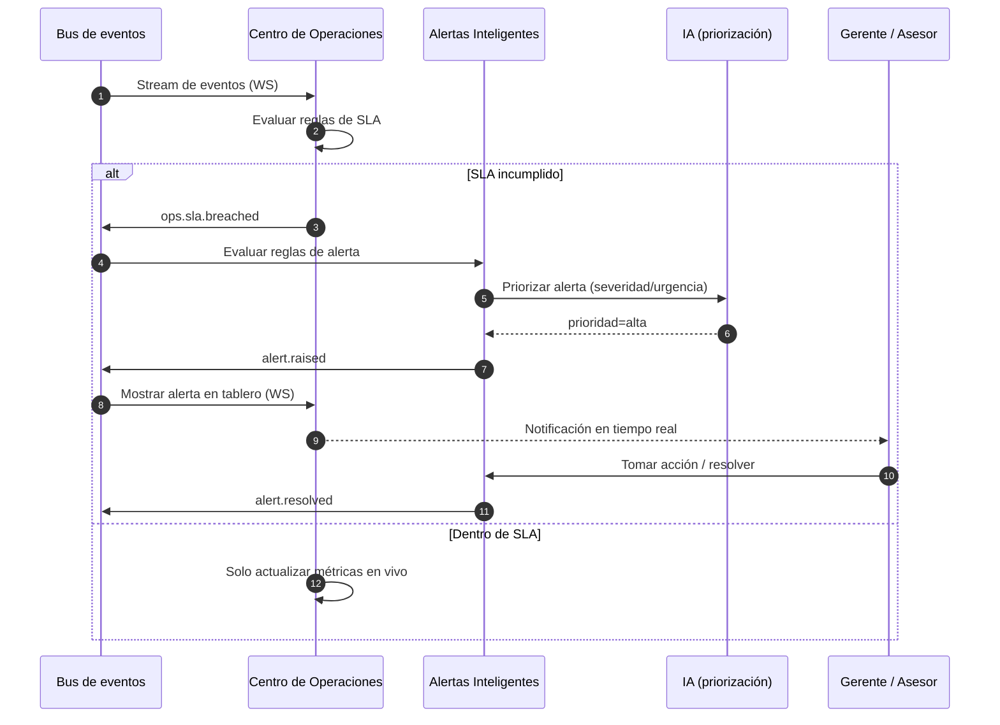

---

## 5. Modelo de eventos de dominio

Contrato de eventos que atraviesa el bus. Todos llevan `tenantId`, `timestamp`, `actor` y `payload`.

| Evento | Disparador | Consumidores / Automatizaciones |
|--------|------------|---------------------------------|
| `lead.created` | Nueva consulta (WA/landing/manual) sin lead previo | Distribución, Lead Score, Centro de Ops, Auditoría |
| `lead.updated` | Enriquecimiento o edición del lead | Lead Score, Centro de Ops, Auditoría |
| `lead.merged` | Deduplicación de leads | Auditoría, Reportes |
| `lead.qualified` | Lead pasa a interesado/calificado | Agenda, Seguimientos, Lead Score |
| `lead.assigned` | Distribución asigna asesor | Conversaciones, Tareas, Centro de Ops |
| `lead.reassigned` | SLA incumplido o reasignación manual | Centro de Ops, Auditoría, Ranking |
| `lead.score.updated` | Cambio en señales del lead | Oportunidades del día, Seguimientos, Centro de Ops |
| `lead.won` | Cierre exitoso | Reportes, KPIs, Ranking, Métricas financieras |
| `lead.lost` | Lead marcado como perdido | Reportes, Auditoría, Seguimientos (reactivación) |
| `whatsapp.message.received` | Webhook entrante | Conversaciones, IA (clasificación), Gestión de Leads |
| `whatsapp.message.sent` | Envío de mensaje | Auditoría, Centro de Ops |
| `conversation.intent.classified` | IA clasifica intención | Gestión de Leads, Agenda, Lead Score |
| `landing.form.submitted` | Submit de formulario | Gestión de Leads, Reportes de campaña |
| `landing.visited` | Visita a landing | Métricas de captación |
| `pipeline.stage.entered` | Lead ingresa a una etapa | Snapshot de etapa, Automatizaciones |
| `pipeline.stage.exited` | Lead sale de una etapa | Snapshot de etapa (tiempoPermanencia), Reportes |
| `pipeline.stage.changed` | Transición de etapa | Seguimientos, Automatizaciones, Centro de Ops, Lead Score |
| `visit.scheduled` | Agenda confirma visita | Pipeline, Recordatorios, Centro de Ops |
| `visit.reminder.sent` | Temporizador de recordatorio | Conversaciones, Cliente final |
| `visit.rescheduled` | Cambio de horario | Agenda, Pipeline, Auditoría |
| `visit.cancelled` | Cancelación | Pipeline, Seguimientos (reactivación) |
| `visit.completed` | Visita realizada | Pipeline, Seguimientos, Lead Score |
| `reservation.created` | Lead entra a Reserva | Propiedades, Documentación, KPIs |
| `property.published` | Propiedad publicada | Landing Pages, Reportes |
| `property.reserved` | Propiedad reservada | Inventario, Centro de Ops |
| `property.sold` | Propiedad vendida/alquilada | Inventario, Métricas financieras |
| `property.unavailable` | Propiedad no disponible | Landing Pages, Pipeline |
| `sale.closed` | Operación cerrada | Reportes, KPIs, Ranking, Métricas financieras, Auditoría |
| `document.uploaded` | Carga de documento | Documentación, Auditoría |
| `document.checklist.completed` | Checklist completo | Pipeline (habilita Escribanía) |
| `document.expiring` | Documento por vencer | Alertas Inteligentes, Tareas |
| `task.created` | Tarea manual o automática | Asesor, Centro de Ops |
| `task.completed` | Tarea finalizada | Reportes, Ranking |
| `task.overdue` | Vencimiento de tarea | Alertas Inteligentes, Centro de Ops |
| `followup.triggered` | Evento/tiempo dispara secuencia | Conversaciones, Tareas |
| `followup.completed` | Secuencia finalizada | Reportes |
| `followup.cancelled` | Lead respondió / secuencia abortada | Reportes |
| `ops.alert.raised` / `alert.raised` | Regla de alerta activada | Centro de Ops, Gerente/Asesor |
| `ops.sla.breached` | SLA incumplido | Distribución (reasignar), Alertas |
| `alert.resolved` | Alerta atendida | Centro de Ops, Auditoría |
| `automation.rule.executed` | Motor ejecuta regla | Auditoría, Reportes |
| `lead.reassigned` / `advisor.availability.changed` | Cambios de equipo | Distribución, Ranking |
| `config.updated` / `permission.changed` | Cambios de configuración | Auditoría |
| `report.generated` | Generación de reporte | Dueño / Gerente |

---

## 6. Máquina de estados del Lead

El estado del lead **es** su etapa en el pipeline. `Perdido` es un estado terminal alcanzable desde casi cualquier etapa; `Venta/Alquiler` es el estado terminal de éxito.

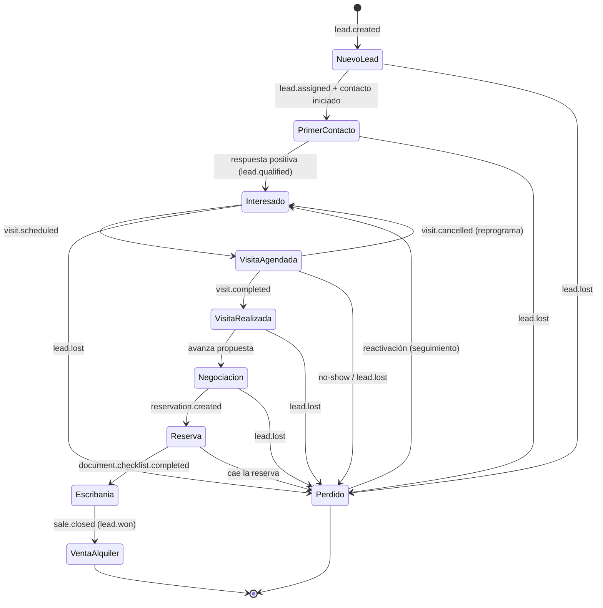

**Invariantes de la máquina de estados:**

1. Toda transición **debe** emitir `pipeline.stage.changed` y cerrar/abrir snapshots de etapa.
2. `Escribania` solo es alcanzable si `document.checklist.completed` fue emitido (guard documental).
3. `Perdido` conserva el historial completo y admite reactivación hacia `Interesado`.
4. Cada estado mantiene: `fechaIngreso`, `tiempoPermanencia`, `responsable`, `comentarios`, `tareasPendientes`, `probabilidadCierre`.
5. La `probabilidadCierre` es función de `(etapa, leadScore)` y se recalcula ante `lead.score.updated`.

---

## 7. Notas de arquitectura hexagonal (integraciones futuras)

- **Puertos de entrada:** `InboundMessagePort` (WhatsApp/otros canales), `LeadIntakePort` (landing/API/import), `PipelineCommandPort`.
- **Puertos de salida:** `NotificationPort`, `AIAssistPort` (clasificar/resumir/priorizar), `PersistencePort`, `CalendarPort`, `DocumentStoragePort`.
- **Adapters reemplazables:** el proveedor de WhatsApp, el motor de IA operativa, el almacenamiento documental y el calendario son adapters; el dominio no los conoce.
- **IA acotada por contrato:** el `AIAssistPort` **no expone** generación de imágenes; solo texto/clasificación/priorización, garantizando la restricción "IA solo operativa" a nivel de arquitectura.

---

_Fin del documento 04 — Arquitectura Funcional._
