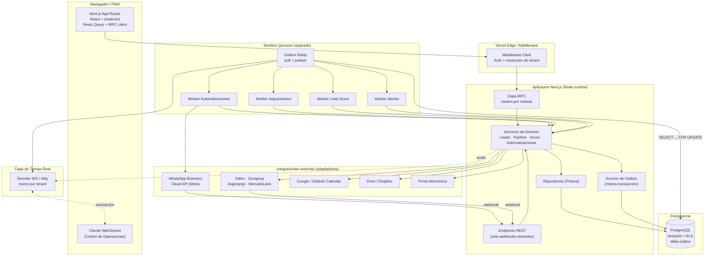
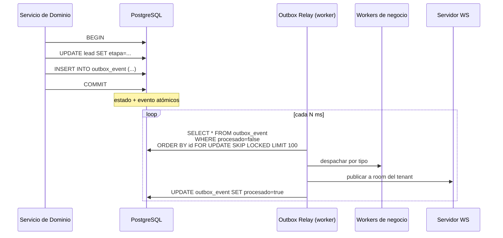
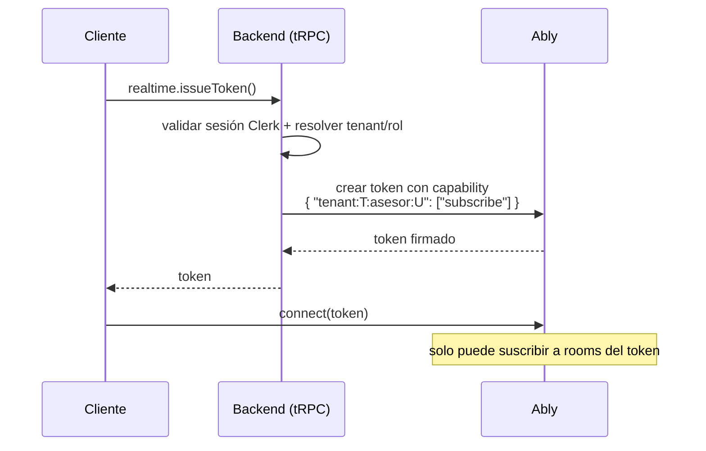
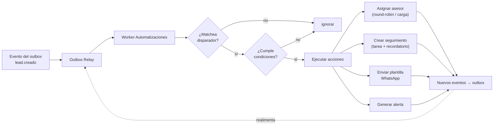
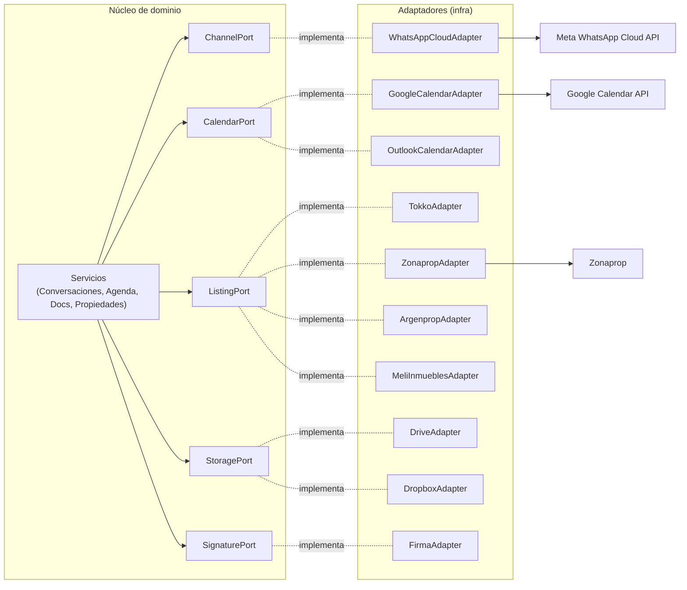

# 05 — Arquitectura Técnica

> **Producto:** RealEstate OS — SaaS multi-tenant para inmobiliarias LATAM, centrado en el LEAD.
> **Audiencia:** equipo de ingeniería, tech leads, revisores de arquitectura.
> **Estado:** documento vivo. Refleja las decisiones fijadas en la SPEC y las expande a nivel de implementación.

---

## 0. Principios rectores

Antes de entrar en los diagramas, dejamos explícitos los principios no negociables que atraviesan toda la arquitectura. Cada decisión posterior se justifica contra estos principios.

1. **Multi-tenant desde el día 1.** Ningún dato cruza el límite de un tenant. El `tenantId` viaja en cada tabla y se refuerza con Row Level Security (RLS) de Postgres. La aplicación *nunca* confía sólo en el filtro del ORM.
2. **Event-driven, pero simple.** El MVP no lleva Kafka. Usamos el patrón **transactional outbox** sobre la misma Postgres + workers. Esto nos da entrega confiable de eventos sin operar un broker.
3. **Modular por dominio.** El código se organiza por *feature module* (Leads, Pipeline, Conversaciones…), no por capa técnica. Alta cohesión, bajo acoplamiento.
4. **Hexagonal en los bordes.** Toda integración externa (WhatsApp, portales, calendarios, firma) entra por un **puerto** y se implementa con un **adaptador**. El dominio no conoce Meta, Tokko ni Google.
5. **Type-safe end to end.** tRPC + Zod + Prisma nos dan tipos desde la DB hasta el componente React sin generación de clientes ni drift de contratos.
6. **Explicabilidad sobre magia.** El Lead Score es un motor de reglas ponderadas configurable y auditable. Nada de ML opaco en el MVP.
7. **RBAC en todos lados.** Dueño, Gerente y Asesor tienen alcances distintos. La autorización se evalúa en cada procedimiento, no sólo en la UI.

---

## 1. Diagrama de arquitectura de alto nivel



**Lectura del diagrama.** Toda entrada del usuario pasa por el middleware de Clerk que resuelve identidad y *organización → tenant*. La escritura de dominio y la escritura al outbox ocurren en **la misma transacción** de Postgres, garantizando que nunca se pierda un evento ni se emita un evento sin que el estado se haya persistido. El **Outbox Relay** lee eventos comprometidos y los reparte a workers y a la capa de tiempo real. Las integraciones externas son adaptadores detrás de puertos.

---

## 2. Arquitectura del Backend

### 2.1 Organización modular por dominio

El backend no se organiza por capa técnica (`controllers/`, `services/`, `models/`) sino por **feature module**. Cada módulo es un slice vertical que contiene su router tRPC, sus servicios de dominio, sus repositorios, sus esquemas Zod y sus definiciones de eventos.

```
src/server/modules/
  leads/
    lead.router.ts        # procedimientos tRPC
    lead.service.ts       # lógica de dominio (sin Prisma directo)
    lead.repository.ts    # acceso a datos vía Prisma
    lead.schema.ts        # Zod: inputs/outputs
    lead.events.ts        # tipos de eventos que emite
    lead.policy.ts        # reglas RBAC del módulo
  pipeline/
  conversations/
  scoring/
  automations/
  ...
```

**Regla de dependencia:** `router → service → repository → Prisma`. El router valida input y autoriza; el service contiene la lógica de negocio y **nunca** llama a Prisma directamente; el repository es la única capa que toca la base. Los services de un módulo pueden depender de *puertos* de otro módulo, nunca de sus repositorios concretos.

### 2.2 Capa de servicios de dominio

Los servicios son funciones puras de dominio en la medida de lo posible: reciben un contexto (`ctx` con `tenantId`, `userId`, `role`) y datos ya validados, y devuelven nuevos objetos (patrón inmutable). Los efectos secundarios — escribir a la DB, publicar eventos — se concentran en un único punto transaccional.

```typescript
// leads/lead.service.ts (conceptual)
export async function moverLeadDeEtapa(
  ctx: TenantContext,
  input: { leadId: string; etapaDestino: EtapaPipeline; motivo?: string }
): Promise<Lead> {
  return db.$transaction(async (tx) => {
    const lead = await leadRepo.findByIdForTenant(tx, ctx.tenantId, input.leadId);
    assertExists(lead, "Lead no encontrado");
    assertTransicionValida(lead.etapa, input.etapaDestino); // máquina de estados del pipeline

    const actualizado = leadRepo.aplicarCambioEtapa(lead, input.etapaDestino); // devuelve copia nueva
    await leadRepo.save(tx, actualizado);

    // MISMA transacción → outbox
    await outbox.enqueue(tx, {
      tenantId: ctx.tenantId,
      tipo: "lead.etapa_cambiada",
      payload: {
        leadId: lead.id,
        de: lead.etapa,
        a: input.etapaDestino,
        actorId: ctx.userId,
      },
    });

    return actualizado;
  });
}
```

### 2.3 Repositorios (Prisma)

Cada repositorio expone operaciones de dominio (`findByIdForTenant`, `save`, `listByPipeline`) y **siempre** recibe el `tenantId`. Aunque RLS actúa como red de seguridad en la base, el repositorio *también* filtra por `tenantId` — defensa en profundidad.

```typescript
// leads/lead.repository.ts (conceptual)
export const leadRepo = {
  findByIdForTenant: (tx, tenantId, id) =>
    tx.lead.findFirst({ where: { id, tenantId } }),

  listByPipeline: (tx, tenantId, etapa, { cursor, limit }) =>
    tx.lead.findMany({
      where: { tenantId, etapa },
      take: limit + 1,
      cursor: cursor ? { id: cursor } : undefined,
      orderBy: { updatedAt: "desc" },
    }),

  save: (tx, lead) => tx.lead.update({ where: { id: lead.id }, data: lead }),

  aplicarCambioEtapa: (lead, etapa) => ({
    ...lead,
    etapa,
    etapaCambiadaEn: new Date(),
  }),
};
```

### 2.4 Patrón Transactional Outbox

El corazón del modelo event-driven. El problema clásico: si escribimos el cambio de estado en la DB y *después* publicamos un evento a un broker/WS, un crash entre ambos pasos deja el sistema inconsistente (estado cambiado pero nadie se enteró, o evento emitido sin estado). El outbox lo resuelve escribiendo el evento **en la misma transacción** que el cambio de estado.



**Esquema de la tabla outbox (conceptual):**

```sql
CREATE TABLE outbox_event (
  id           BIGSERIAL PRIMARY KEY,
  tenant_id    UUID NOT NULL,
  tipo         TEXT NOT NULL,            -- 'lead.etapa_cambiada'
  payload      JSONB NOT NULL,
  ocurrido_en  TIMESTAMPTZ NOT NULL DEFAULT now(),
  procesado    BOOLEAN NOT NULL DEFAULT false,
  procesado_en TIMESTAMPTZ,
  intentos     INT NOT NULL DEFAULT 0
);
CREATE INDEX idx_outbox_pendiente ON outbox_event (id) WHERE procesado = false;
```

**Garantías:**
- **At-least-once:** un evento puede procesarse más de una vez si el worker cae antes de marcar `procesado`. Por eso los consumidores deben ser **idempotentes** (clave de idempotencia = `outbox_event.id`).
- **Orden por tenant:** el relay procesa en orden de `id`; con `SKIP LOCKED` varios relays pueden correr en paralelo sin pisarse.
- **Sin pérdida:** si el evento está en la tabla, tarde o temprano se entrega.

### 2.5 Workers

Los workers corren en un proceso separado del servidor Next.js (mismo repo, distinto entrypoint). El **Outbox Relay** es el único que lee la tabla outbox y despacha a los workers de negocio según el `tipo` de evento.

| Worker | Escucha eventos | Responsabilidad |
|--------|-----------------|-----------------|
| **Outbox Relay** | (lee tabla) | Poll del outbox, despacho y publicación a WS |
| **Automatizaciones** | `lead.*`, `conversation.*`, `appointment.*` | Ejecuta reglas configurables (si X entonces Y) |
| **Seguimientos** | `lead.creado`, `lead.sin_contacto`, `appointment.realizada` | Agenda y dispara recordatorios/tareas de follow-up |
| **Lead Score** | `lead.*`, `conversation.mensaje_recibido`, `appointment.*` | Recalcula score con el motor de reglas ponderadas |
| **Alertas** | `lead.sin_respuesta`, `sla.vencido`, `score.subio` | Genera alertas para el Centro de Operaciones |

**Idempotencia:** cada worker registra `(outbox_event_id, worker)` en una tabla `processed_event` antes de actuar. Si ya está, hace no-op.

### 2.6 Publicación de eventos a WebSockets

El Outbox Relay, además de despachar a workers, publica a la capa de tiempo real. Cada evento se enruta a la **room del tenant** (`tenant:<tenantId>`) y, cuando corresponde, a rooms más específicas (`tenant:<tenantId>:asesor:<userId>`). Ver sección 4 para el catálogo y la autorización.

```typescript
// outbox/relay.ts (conceptual)
for (const ev of eventosPendientes) {
  await despacharAWorkers(ev);               // efectos de negocio
  await rt.publish(`tenant:${ev.tenantId}`, ev.tipo, ev.payload); // tiempo real
  await outbox.marcarProcesado(ev.id);
}
```

---

## 3. Arquitectura del Frontend

### 3.1 App Router

Usamos el App Router de Next.js. La app se estructura por **segmentos de ruta que reflejan roles y features**. Los Server Components hacen el fetch inicial (SSR/streaming) vía el caller server-side de tRPC; los Client Components usan React Query + tRPC para interactividad y tiempo real.

```
src/app/
  (auth)/
    sign-in/[[...sign-in]]/page.tsx      # Clerk
    sign-up/[[...sign-up]]/page.tsx
  (app)/
    layout.tsx                           # shell autenticado, resuelve tenant
    leads/
      page.tsx                           # listado (Server Component)
      [leadId]/page.tsx                  # detalle
    pipeline/
      page.tsx                           # tablero kanban
    conversaciones/
      page.tsx                           # bandeja WhatsApp
    operaciones/
      page.tsx                           # Centro de Operaciones (WS)
    agenda/page.tsx
    reportes/page.tsx
    configuracion/
      automatizaciones/page.tsx
      score/page.tsx                     # editor de reglas del Lead Score
      permisos/page.tsx                  # (solo Dueño/Gerente)
  api/
    webhooks/
      whatsapp/route.ts                  # REST entrante
      landing/route.ts
    trpc/[trpc]/route.ts                 # handler tRPC
```

### 3.2 React Query + tRPC

tRPC genera un cliente tipado que envuelve React Query. No hay definición manual de hooks de fetching ni tipos duplicados.

```typescript
// componente cliente
const { data, isLoading } = trpc.lead.list.useQuery({ etapa: "INTERESADO", limit: 25 });
const mover = trpc.pipeline.moverEtapa.useMutation({ onSuccess: () => utils.lead.list.invalidate() });
```

### 3.3 Manejo de estado

Tres niveles, cada uno con su herramienta:

| Tipo de estado | Herramienta | Ejemplo |
|----------------|-------------|---------|
| **Estado de servidor** | React Query (vía tRPC) | Listas de leads, detalle, KPIs |
| **Estado de UI local** | `useState` / `useReducer` | Modal abierto, tab activo, filtros |
| **Estado global liviano** | Zustand | Usuario/tenant actual, preferencias, buffer de eventos WS |

No usamos Redux. El estado de servidor es la fuente de verdad; el estado de tiempo real *actualiza el cache de React Query* en vez de vivir en un store paralelo.

### 3.4 Componentes shadcn/ui

La UI se compone sobre shadcn/ui (Radix + Tailwind). Los componentes son *propiedad del proyecto* (copiados, no dependencia opaca), lo que permite adaptarlos al design system. Patrones: `DataTable` para listados, `Command` para búsqueda global, `Sheet`/`Dialog` para detalle lateral, `Toast` para feedback de mutaciones.

### 3.5 El Centro de Operaciones consume WebSockets

El Centro de Operaciones es una vista en vivo del embudo: leads entrantes, mensajes de WhatsApp, cambios de etapa, alertas de SLA. Se suscribe a la room del tenant al montar y, ante cada evento, **actualiza el cache de React Query** (sin refetch) para reflejar el cambio al instante.

```typescript
// operaciones/useOpsStream.ts (conceptual)
export function useOpsStream() {
  const utils = trpc.useUtils();
  const { tenantId } = useTenant();

  useEffect(() => {
    const canal = rt.subscribe(`tenant:${tenantId}`);

    canal.on("lead.creado", (p) => {
      utils.lead.list.setData({ etapa: "NUEVO" }, (prev) => prependLead(prev, p));
      utils.dashboard.ops.invalidate();
    });

    canal.on("lead.etapa_cambiada", (p) => moverEnCache(utils, p));
    canal.on("conversation.mensaje_recibido", (p) => bumpConversacion(utils, p));
    canal.on("alert.creada", (p) => pushAlerta(utils, p));

    return () => canal.unsubscribe();
  }, [tenantId]);
}
```

### 3.6 Optimistic updates

Las mutaciones frecuentes (mover un lead en el kanban, asignar un asesor, marcar una tarea) usan optimistic updates de React Query: la UI cambia al instante y se revierte si el servidor rechaza.

```typescript
const mover = trpc.pipeline.moverEtapa.useMutation({
  onMutate: async (vars) => {
    await utils.lead.list.cancel();
    const snapshot = utils.lead.list.getData();
    utils.lead.list.setData(/* aplicar cambio local */);
    return { snapshot };
  },
  onError: (_e, _vars, ctx) => utils.lead.list.setData(ctx.snapshot), // rollback
  onSettled: () => utils.lead.list.invalidate(),
});
```

> **Cuidado con el eco de WS:** el mismo cambio llega por optimistic update *y* por el evento WS. Se deduplica con la clave `outbox_event_id`/timestamp para no aplicarlo dos veces.

---

## 4. Capa de tiempo real

### 4.1 Elección

**Decisión: Ably como capa gestionada de WS para el MVP**, con la opción de migrar a un servidor WS propio en Node si el volumen o el costo lo justifican. El puerto `RealtimePort` abstrae al proveedor: el resto del sistema publica y suscribe sin saber si detrás hay Ably, Pusher o un `ws` propio.

**Por qué gestionado primero:** operar un fleet de WebSockets con presencia, reconexión, fan-out y escalado horizontal es un proyecto en sí mismo. Ably/Pusher lo resuelven con SLA. Como todo pasa por un puerto, cambiar de proveedor es un adaptador nuevo, no un refactor.

```typescript
export interface RealtimePort {
  publish(room: string, evento: string, payload: unknown): Promise<void>;
  issueToken(ctx: TenantContext): Promise<string>; // token con claims de rooms permitidas
}
```

### 4.2 Canales / rooms por tenant

| Room | Alcance | Quién se suscribe |
|------|---------|-------------------|
| `tenant:<tenantId>` | Todo el tenant | Centro de Operaciones (Dueño/Gerente) |
| `tenant:<tenantId>:sucursal:<id>` | Una sucursal | Gerente de sucursal |
| `tenant:<tenantId>:asesor:<userId>` | Un asesor | El propio asesor (sus leads/tareas) |

### 4.3 Autorización de sockets

Los sockets **nunca** se autorizan en el cliente. El cliente pide un token al backend (`realtime.issueToken`), que valida la sesión de Clerk, resuelve el tenant y el rol, y emite un token firmado con **exactamente** las rooms que ese usuario puede escuchar. Un asesor jamás recibe un token para `tenant:<x>:asesor:<otro>`.



### 4.4 Eventos emitidos

El catálogo completo (nombre, payload, receptor) está en **08-apis.md → sección 4**. Resumen de los principales: `lead.creado`, `lead.etapa_cambiada`, `lead.asignado`, `conversation.mensaje_recibido`, `appointment.creada`, `appointment.recordatorio`, `task.vencida`, `alert.creada`, `score.actualizado`.

---

## 5. Motor de automatizaciones event-driven

### 5.1 Modelo mental

Una **automatización** es una regla declarativa del tenant: `CUANDO <evento> [SI <condiciones>] ENTONCES <acciones>`. Las reglas se configuran en la UI (`configuracion/automatizaciones`) y se persisten como datos, no como código. El Worker de Automatizaciones las evalúa contra cada evento del outbox.

```typescript
// automations/automation.schema.ts (conceptual)
type Automatizacion = {
  id: string;
  tenantId: string;
  activo: boolean;
  disparador: EventoTipo;                 // 'lead.creado'
  condiciones: Condicion[];               // [{ campo: 'origen', op: '=', valor: 'zonaprop' }]
  acciones: Accion[];                     // [{ tipo: 'asignar', a: 'roundRobin' }, { tipo: 'crearTarea', ... }]
};
```

### 5.2 Cómo un evento dispara seguimientos / alertas / reasignaciones



**Punto clave:** cada acción que cambia estado escribe *su propio* evento al outbox (ej. `lead.asignado`, `task.creada`). Así el motor es composable — una automatización puede disparar otra — y todo queda auditado. Se protege contra bucles con un límite de profundidad por cadena de eventos.

### 5.3 Ejemplo concreto

> *"Cuando entra un lead de Zonaprop sin asesor, asignarlo por round-robin a la sucursal que corresponde, crear una tarea de primer contacto con SLA de 15 minutos y avisar al Centro de Operaciones."*

1. `lead.creado` (origen=zonaprop) → outbox.
2. Worker Automatizaciones matchea la regla.
3. Acciones: `lead.asignado` (round-robin) + `task.creada` (SLA 15 min) → outbox.
4. `task.creada` con SLA arma un temporizador; si vence, `sla.vencido` → Worker Alertas → `alert.creada`.
5. `lead.asignado` y `alert.creada` se publican a la room del tenant → el Centro de Operaciones lo muestra en vivo.

---

## 6. Capa de integraciones hexagonal

### 6.1 Puertos y adaptadores

El dominio define **puertos** (interfaces). Las integraciones concretas son **adaptadores** que implementan esos puertos. El dominio depende de la interfaz, nunca de Meta, Tokko o Google. Esto permite sumar Argenprop o cambiar de proveedor de calendario sin tocar lógica de negocio.



### 6.2 Ejemplo: `ChannelPort` (WhatsApp)

El dominio de Conversaciones habla de *mensajes*, no de la Cloud API de Meta. El `WhatsAppCloudAdapter` traduce.

```typescript
// ports/channel.port.ts
export interface ChannelPort {
  readonly canal: "whatsapp" | "sms" | "email";

  enviarMensaje(input: {
    tenantId: string;
    para: string;                          // número E.164
    contenido: MensajeSaliente;            // texto | plantilla | media
  }): Promise<{ mensajeExternoId: string }>;

  // el adaptador normaliza el webhook entrante a este tipo de dominio
  parsearEntrante(rawWebhook: unknown): MensajeEntrante[];
}

// adapters/whatsapp-cloud.adapter.ts (conceptual)
export const whatsAppCloudAdapter: ChannelPort = {
  canal: "whatsapp",
  async enviarMensaje({ tenantId, para, contenido }) {
    const cfg = await tenantConfig.whatsapp(tenantId);   // token/phoneId por tenant
    const res = await fetch(`https://graph.facebook.com/v20.0/${cfg.phoneId}/messages`, {
      method: "POST",
      headers: { Authorization: `Bearer ${cfg.token}`, "Content-Type": "application/json" },
      body: JSON.stringify(mapearAContratoMeta(para, contenido)),
    });
    if (!res.ok) throw new ChannelError("whatsapp_send_failed", await res.text());
    const json = await res.json();
    return { mensajeExternoId: json.messages[0].id };
  },
  parsearEntrante(raw) {
    return normalizarWebhookMeta(raw); // → MensajeEntrante[] de dominio
  },
};
```

### 6.3 Ejemplo: `CalendarPort`

```typescript
// ports/calendar.port.ts
export interface CalendarPort {
  crearEvento(input: {
    tenantId: string;
    usuarioExternoId: string;              // cuenta conectada del asesor
    titulo: string;
    inicio: Date;
    fin: Date;
    invitados: string[];
  }): Promise<{ eventoExternoId: string; urlEvento: string }>;

  cancelarEvento(input: { tenantId: string; eventoExternoId: string }): Promise<void>;

  // sincroniza cambios externos hacia RealEstate OS
  sincronizar(input: { tenantId: string; usuarioExternoId: string }): Promise<CambioAgenda[]>;
}
```

El módulo Agenda usa `CalendarPort` sin saber si el asesor conectó Google u Outlook. La resolución del adaptador correcto ocurre en una fábrica según la config del usuario.

### 6.4 Fábrica de adaptadores

```typescript
// integrations/factory.ts (conceptual)
export function resolverCalendarPort(proveedor: "google" | "outlook"): CalendarPort {
  return proveedor === "google" ? googleCalendarAdapter : outlookCalendarAdapter;
}
export function resolverListingPort(portal: Portal): ListingPort {
  return { tokko, zonaprop, argenprop, meli }[portal];
}
```

---

## 7. Decisiones técnicas justificadas

| Decisión | Alternativas consideradas | Por qué esta |
|----------|---------------------------|--------------|
| **tRPC como API principal** | REST + OpenAPI, GraphQL | Type-safety end to end sin codegen ni drift de contratos; equipo full-TS; menos boilerplate. REST queda solo para webhooks entrantes. |
| **REST solo para webhooks** | tRPC para todo | Los proveedores externos (Meta, portales) POSTean REST; no controlamos su cliente. |
| **DB compartida + tenantId + RLS** | DB por tenant, schema por tenant | Costo/ops mínimos para MVP LATAM; RLS da aislamiento reforzado por el motor; migraciones únicas. Escala a schema/DB dedicada si un cliente lo exige. |
| **Transactional Outbox** | Publicar directo a broker, CDC (Debezium), Kafka | Atomicidad estado+evento sin operar broker; simple sobre la Postgres que ya tenemos; sin Kafka en MVP. |
| **Workers en proceso separado** | Cron serverless, colas gestionadas (SQS) | Control total del orden por tenant, poll con `SKIP LOCKED`, sin dependencia cloud extra en MVP. |
| **Ably para tiempo real** | WS propio con `ws`, Pusher, SSE | Presencia/reconexión/escala resueltas; detrás de `RealtimePort` para poder migrar. |
| **Zustand para estado global** | Redux Toolkit, Context puro | Mínimo boilerplate; el estado de servidor vive en React Query, no en el store. |
| **Motor de reglas para Lead Score** | ML supervisado | Explicable, configurable por el tenant y auditable; sin datos suficientes para ML confiable en MVP. |
| **Hexagonal en integraciones** | Llamadas directas a cada API | Aísla el dominio del vendor; sumar portal = adaptador nuevo; testeable con adaptadores fake. |
| **Clerk (organizaciones → tenants)** | Auth propia, Auth0 | Organizaciones nativas mapeadas a tenants, RBAC, menos superficie de seguridad propia. |
| **Prisma** | Drizzle, Kysely, SQL crudo | Modelo tipado, migraciones, madurez; RLS se aplica vía `SET LOCAL app.tenant_id`. |

---

## 8. Estructura de carpetas del proyecto

Monorepo simple (un solo paquete Next.js + entrypoint de workers). Se puede escalar a Turborepo si se separan paquetes.

```
realestate-os/
├── prisma/
│   ├── schema.prisma
│   ├── migrations/
│   └── policies/                     # SQL de Row Level Security
├── src/
│   ├── app/                          # App Router (ver §3.1)
│   │   ├── (auth)/
│   │   ├── (app)/
│   │   └── api/
│   │       ├── trpc/[trpc]/route.ts
│   │       └── webhooks/
│   ├── server/
│   │   ├── trpc.ts                   # init tRPC, context, middlewares (auth, tenant, rbac)
│   │   ├── root.router.ts            # merge de routers de módulos
│   │   ├── context.ts                # TenantContext (tenantId, userId, role)
│   │   ├── modules/                  # feature modules (slices verticales)
│   │   │   ├── leads/
│   │   │   ├── pipeline/
│   │   │   ├── conversations/
│   │   │   ├── properties/
│   │   │   ├── appointments/
│   │   │   ├── tasks/
│   │   │   ├── documents/
│   │   │   ├── automations/
│   │   │   ├── alerts/
│   │   │   ├── scoring/
│   │   │   ├── distribution/         # distribución de leads
│   │   │   ├── operations/           # Centro de Operaciones (dashboard/ops)
│   │   │   ├── reports/
│   │   │   ├── branches/             # sucursales
│   │   │   ├── users/                # asesores + permisos
│   │   │   └── tenant/
│   │   ├── outbox/
│   │   │   ├── outbox.ts             # enqueue en transacción
│   │   │   └── relay.ts              # poll + despacho + publish
│   │   ├── ports/                    # interfaces hexagonales
│   │   │   ├── channel.port.ts
│   │   │   ├── calendar.port.ts
│   │   │   ├── listing.port.ts
│   │   │   ├── storage.port.ts
│   │   │   ├── signature.port.ts
│   │   │   └── realtime.port.ts
│   │   ├── adapters/                 # implementaciones concretas
│   │   │   ├── whatsapp-cloud.adapter.ts
│   │   │   ├── google-calendar.adapter.ts
│   │   │   ├── outlook-calendar.adapter.ts
│   │   │   ├── tokko.adapter.ts
│   │   │   ├── zonaprop.adapter.ts
│   │   │   ├── argenprop.adapter.ts
│   │   │   ├── meli-inmuebles.adapter.ts
│   │   │   ├── drive.adapter.ts
│   │   │   ├── dropbox.adapter.ts
│   │   │   ├── signature.adapter.ts
│   │   │   └── ably-realtime.adapter.ts
│   │   └── auth/
│   │       ├── clerk.ts
│   │       └── rbac.ts               # matriz de permisos por rol
│   ├── workers/
│   │   ├── index.ts                  # entrypoint del proceso de workers
│   │   ├── automations.worker.ts
│   │   ├── followups.worker.ts
│   │   ├── scoring.worker.ts
│   │   └── alerts.worker.ts
│   ├── lib/
│   │   ├── db.ts                     # cliente Prisma + set tenant en RLS
│   │   ├── realtime-client.ts        # cliente WS del browser
│   │   └── errors.ts                 # AppError, formato de error tRPC
│   ├── components/
│   │   ├── ui/                       # shadcn/ui
│   │   └── features/                 # componentes por feature
│   └── styles/
├── tests/
│   ├── unit/
│   ├── integration/
│   └── e2e/
├── package.json
└── tsconfig.json
```

---

## 9. Cierre

La arquitectura combina piezas conservadoras y probadas (Postgres, outbox, workers, hexagonal) con la ergonomía de un stack full-TypeScript type-safe (tRPC + Prisma + Zod + React Query). El resultado: aislamiento multi-tenant reforzado por la base, un modelo event-driven confiable sin operar un broker, integraciones desacopladas por puertos, y un Centro de Operaciones en vivo. Todo apuntando al principio central del producto: **el lead como unidad de trabajo, siempre trazable y siempre reactivo.**

Para el detalle de contratos de API, routers, webhooks y eventos, ver **08-apis.md**.
