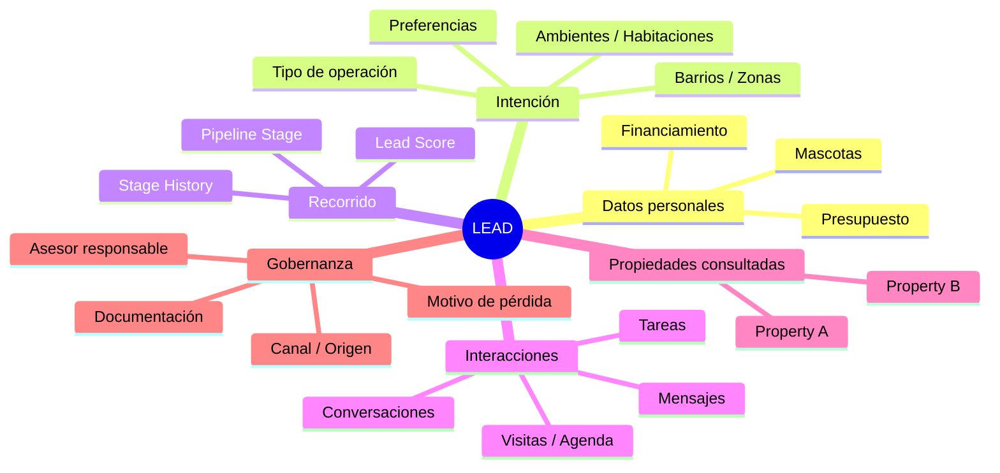

# 06 — Modelo de Datos

> **RealEstate OS** — SaaS multi-tenant para inmobiliarias LATAM
> Documento de arquitectura de datos. Autor: Software Architect + DBA (PostgreSQL/Prisma).
> Stack: Next.js · React · TypeScript · PostgreSQL · Prisma · tRPC · WebSockets · Clerk.

---

## 1. Filosofía del modelo: lead-céntrico, no property-céntrico

La mayoría de los CRM inmobiliarios de la región nacen desde la **propiedad**: el listado es el rey, y el cliente aparece como un dato secundario colgado de una publicación. Ese modelo funciona para portales de avisos, pero rompe la operación real de una inmobiliaria, donde lo que se gestiona todos los días es **la relación con una persona a lo largo del tiempo**.

En **RealEstate OS** invertimos el eje. El centro del modelo es el **Lead**: una persona con una intención (comprar, vender, alquilar) que atraviesa un recorrido (el *pipeline*). La propiedad es **un atributo del recorrido**, no la raíz del grafo.

**Consecuencias de diseño concretas:**

- Un mismo Lead puede consultar **muchas propiedades** a lo largo de su ciclo de vida. La relación `Lead ↔ Property` es **muchos-a-muchos**, materializada en una tabla de "propiedades consultadas" (`LeadPropertyInterest`) que guarda contexto (cuándo, por qué canal, nivel de interés, feedback post-visita).
- El historial es de **primera clase**. `LeadStageHistory` no es un log accesorio: es la fuente de verdad para métricas de conversión, tiempos por etapa y *forecasting*. Nunca se sobreescribe la etapa "en su lugar"; se **appendea** una nueva fila.
- Las conversaciones, tareas, visitas, documentos y alertas cuelgan del **Lead**, no de la propiedad. Un asesor abre "la ficha del Lead" y ve todo su recorrido, no "la ficha de una propiedad".
- El **Lead Score** es un atributo derivado y explicable del Lead (reglas ponderadas), recalculado por eventos, no un campo mágico.

**Regla de oro del modelo:** si una entidad describe *qué le pasó a una persona en su camino de compra/alquiler*, cuelga del Lead. Si describe *un inmueble en el mercado*, es una `Property`. La `Property` existe de forma independiente (puede ser listada, republicada, compartida entre leads), pero **no es el centro del universo**.



---

## 2. Catálogo de entidades principales

Todas las entidades comparten dos columnas transversales que no se repiten en cada descripción por brevedad, pero **existen en todas**:

- `id` — `String @id @default(cuid())` (o `uuid`), clave primaria opaca.
- `tenantId` — `String`, discriminador multi-tenant. **Presente en TODAS las tablas de negocio**, con `@@index([tenantId])` e integrado a las políticas RLS de Postgres (ver documento 07).
- `createdAt` / `updatedAt` — timestamps de auditoría básica.

> Convención: los timestamps son `DateTime @default(now())` y `@updatedAt`. Todos los montos monetarios se guardan como `Decimal @db.Decimal(14,2)` + una columna `currency` (`Char(3)`, ISO 4217) — **nunca** `Float` para dinero.

### 2.1 Tenant

Representa a **una inmobiliaria** (la organización cliente del SaaS). Mapea 1:1 con una organización de Clerk.

| Atributo | Tipo | Notas |
|---|---|---|
| `clerkOrgId` | `String @unique` | ID de la organización en Clerk. Fuente de verdad de membresía. |
| `name` | `String` | Razón social / nombre comercial. |
| `slug` | `String @unique` | Subdominio / identificador URL-safe. |
| `plan` | `SubscriptionPlan` | FREE, STARTER, PRO, ENTERPRISE. |
| `country` | `Char(2)` | ISO-3166. Afecta defaults de moneda, DNI, formato. |
| `defaultCurrency` | `Char(3)` | Moneda base del tenant. |
| `settings` | `Json` | Configuración flexible (branding, features flags, límites). |
| `status` | `TenantStatus` | ACTIVE, SUSPENDED, TRIAL, CHURNED. |

**Relaciones:** `1—N` con `Branch`, `User`, `Lead`, `Property`, y prácticamente todas las demás entidades (es la raíz del árbol de aislamiento).

### 2.2 Branch (Sucursal)

Oficina física o unidad de negocio dentro de una inmobiliaria. Permite segmentar leads, asesores y métricas por sucursal.

| Atributo | Tipo | Notas |
|---|---|---|
| `name` | `String` | Nombre de la sucursal. |
| `address` | `String?` | Dirección física. |
| `timezone` | `String` | IANA tz (ej. `America/Argentina/Buenos_Aires`). Afecta agenda y SLAs. |
| `phone` | `String?` | Teléfono de contacto. |
| `isActive` | `Boolean @default(true)` | Baja lógica. |

**Relaciones:** `N—1` con `Tenant`; `1—N` con `User`, `Lead`, `Property`.

### 2.3 User (con rol)

Un miembro del staff de la inmobiliaria. Autenticado por Clerk; su membresía y rol se resuelven contra el tenant.

| Atributo | Tipo | Notas |
|---|---|---|
| `clerkUserId` | `String @unique` | ID del usuario en Clerk. |
| `email` | `String` | Denormalizado desde Clerk para queries. |
| `fullName` | `String` | |
| `role` | `UserRole` | OWNER, MANAGER, ADVISOR, ADMIN, CLIENT. |
| `branchId` | `String?` | Sucursal de pertenencia (los OWNER pueden ser cross-branch). |
| `avatarUrl` | `String?` | |
| `isActive` | `Boolean @default(true)` | |
| `lastActiveAt` | `DateTime?` | Presencia / actividad. |

**Relaciones:** `N—1` con `Tenant` y `Branch`; `1—N` con `Lead` (como asesor responsable), `Task`, `Appointment`, `Availability`, `Conversation` (como agente), `AuditLog` (como actor).

> **Nota:** unicidad de `email` es **por tenant**, no global. Un mismo mail podría, en teoría, existir en dos tenants distintos → `@@unique([tenantId, email])`.

### 2.4 Lead ⭐ (entidad central)

La entidad más importante del sistema. Modela a la persona y **todo su recorrido**. Se subdivide conceptualmente en bloques.

**Datos personales / identidad**

| Atributo | Tipo | Notas |
|---|---|---|
| `firstName` | `String` | |
| `lastName` | `String?` | |
| `email` | `String?` | |
| `phone` | `String?` | Normalizado E.164. Índice para dedupe. |
| `documentType` | `DocumentType?` | DNI, CUIT, PASSPORT, RUT, CURP… (PII). |
| `documentNumber` | `String?` | **PII sensible** → cifrado at-rest a nivel columna (ver doc 07). |
| `dateOfBirth` | `DateTime?` | |
| `notes` | `String?` | Notas libres del asesor. |

**Intención y preferencias comerciales**

| Atributo | Tipo | Notas |
|---|---|---|
| `operationType` | `OperationType` | BUY, SELL, RENT, TEMPORARY_RENT. |
| `budgetMin` | `Decimal? @db.Decimal(14,2)` | |
| `budgetMax` | `Decimal? @db.Decimal(14,2)` | |
| `budgetCurrency` | `Char(3)` | |
| `propertyType` | `PropertyType[]` | HOUSE, APARTMENT, PH, OFFICE, LAND, COMMERCIAL… (multi). |
| `neighborhoods` | `String[]` | Barrios/zonas de interés (array; ver nota de normalización). |
| `minRooms` | `Int?` | Ambientes mínimos. |
| `minBedrooms` | `Int?` | Habitaciones/dormitorios. |
| `hasPets` | `Boolean?` | Relevante para alquiler. |
| `needsFinancing` | `Boolean?` | |
| `financingType` | `FinancingType?` | MORTGAGE, CASH, CONSTRUCTION_LOAN, NONE. |
| `preferences` | `Json?` | Preferencias flexibles no estructuradas (cochera, amenities, orientación). |

**Estado del pipeline y scoring**

| Atributo | Tipo | Notas |
|---|---|---|
| `currentStageId` | `String` | FK a `PipelineStage`. Estado *actual* (desnormalizado para queries rápidas). |
| `stageEnteredAt` | `DateTime` | Cuándo entró a la etapa actual (para SLAs/aging). |
| `leadScore` | `Int @default(0)` | Score derivado (0–100). Recalculado por eventos. |
| `scoreBand` | `ScoreBand?` | COLD, WARM, HOT (derivado del score, cacheado). |
| `lossReason` | `LossReason?` | Solo si `currentStage = LOST`. |
| `lossComment` | `String?` | |

**Gobernanza / atribución**

| Atributo | Tipo | Notas |
|---|---|---|
| `ownerUserId` | `String?` | Asesor responsable. FK a `User`. |
| `branchId` | `String?` | Sucursal. |
| `channel` | `LeadChannel` | WHATSAPP, WEB_FORM, PORTAL, REFERRAL, WALK_IN, PHONE, SOCIAL, LANDING. |
| `source` | `String?` | Origen granular (ej. campaña, nombre de landing, portal específico). |
| `landingPageId` | `String?` | FK a `LandingPage` si vino de una. |
| `integrationId` | `String?` | Si entró por una integración (ver `Integration`). |
| `status` | `LeadStatus` | OPEN, WON, LOST, ARCHIVED (estado macro, distinto del stage). |

**Relaciones del Lead (el corazón del grafo):**

- `N—1` → `Tenant`, `Branch`, `User` (owner), `PipelineStage` (current), `LandingPage`, `Integration`.
- `1—N` → `LeadStageHistory`, `Task`, `Appointment`, `Conversation`, `Document`, `FollowUp`, `Alert`, `Notification`, `LeadScore` (histórico de cálculos).
- `M—N` → `Property` vía `LeadPropertyInterest` ("propiedades consultadas").

### 2.5 Property (Propiedad)

Un inmueble. Existe con vida propia; puede ser de interés para varios leads y (si es un mandato de venta) puede a su vez originar un Lead vendedor.

| Atributo | Tipo | Notas |
|---|---|---|
| `title` | `String` | |
| `operationType` | `OperationType` | Lo que se ofrece (venta/alquiler). |
| `propertyType` | `PropertyType` | |
| `status` | `PropertyStatus` | DRAFT, ACTIVE, RESERVED, SOLD, RENTED, WITHDRAWN. |
| `price` | `Decimal @db.Decimal(14,2)` | |
| `currency` | `Char(3)` | |
| `address` | `String?` | |
| `neighborhood` | `String?` | |
| `city` | `String?` | |
| `latitude` / `longitude` | `Decimal?` | Geolocalización. |
| `rooms` | `Int?` | Ambientes. |
| `bedrooms` | `Int?` | |
| `bathrooms` | `Int?` | |
| `coveredArea` | `Decimal?` | m² cubiertos. |
| `totalArea` | `Decimal?` | m² totales. |
| `features` | `Json?` | Amenities, cochera, pileta, etc. |
| `ownerLeadId` | `String?` | Lead vendedor/propietario (si aplica). |
| `assignedUserId` | `String?` | Asesor que capta/administra. |

**Relaciones:** `N—1` con `Tenant`, `Branch`, `User`; `M—N` con `Lead` vía `LeadPropertyInterest`; `1—N` con `Appointment`/`Visit` (visitas a esa propiedad) y `Document`.

### 2.6 LeadPropertyInterest (propiedades consultadas — tabla de unión enriquecida)

Materializa la relación M—N `Lead ↔ Property` con **contexto**. No es una join table vacía.

| Atributo | Tipo | Notas |
|---|---|---|
| `leadId` | `String` | FK. |
| `propertyId` | `String` | FK. |
| `interestLevel` | `InterestLevel` | VIEWED, INTERESTED, VISITED, DISCARDED, OFFERED. |
| `sourceChannel` | `LeadChannel?` | Cómo llegó a consultar esta propiedad. |
| `feedback` | `String?` | Devolución post-visita. |
| `discardReason` | `String?` | Por qué la descartó (feed al lead score). |
| `firstSeenAt` | `DateTime` | |

**Relaciones:** `N—1` con `Lead` y `Property`. `@@unique([leadId, propertyId])`.

### 2.7 Conversation

Un hilo de comunicación con un Lead por un canal (WhatsApp, email, chat web). Agrupa mensajes.

| Atributo | Tipo | Notas |
|---|---|---|
| `leadId` | `String` | FK. |
| `channel` | `LeadChannel` | |
| `externalThreadId` | `String?` | ID del hilo en el proveedor (ej. WhatsApp). |
| `assignedUserId` | `String?` | Agente asignado. |
| `status` | `ConversationStatus` | OPEN, PENDING, CLOSED, SNOOZED. |
| `lastMessageAt` | `DateTime?` | Para ordenar bandeja. |
| `unreadCount` | `Int @default(0)` | |

**Relaciones:** `N—1` con `Lead`, `User`; `1—N` con `Message`.

### 2.8 Message

Un mensaje individual dentro de una conversación. **Tabla de alto volumen** (candidata a particionado).

| Atributo | Tipo | Notas |
|---|---|---|
| `conversationId` | `String` | FK. |
| `direction` | `MessageDirection` | INBOUND, OUTBOUND. |
| `body` | `String` | Contenido (texto). |
| `mediaUrl` | `String?` | Adjunto (imagen, audio, doc). |
| `externalId` | `String?` | ID del mensaje en el proveedor (idempotencia de webhooks). |
| `deliveryStatus` | `MessageDeliveryStatus?` | SENT, DELIVERED, READ, FAILED. |
| `senderUserId` | `String?` | Si es OUTBOUND desde el staff. |
| `sentAt` | `DateTime` | Timestamp del proveedor. |

**Relaciones:** `N—1` con `Conversation`. Índice `@@unique([tenantId, externalId])` para **idempotencia** de webhooks.

### 2.9 PipelineStage

Define las etapas del embudo. Es **configurable por tenant** (algunos añaden etapas propias), con un set default sembrado.

| Atributo | Tipo | Notas |
|---|---|---|
| `key` | `PipelineStageKey` | Enum canónico (para lógica). |
| `label` | `String` | Nombre visible (editable). |
| `order` | `Int` | Posición en el embudo. |
| `defaultProbability` | `Int` | Probabilidad de cierre asociada (0–100), para forecast. |
| `slaHours` | `Int?` | SLA de permanencia máxima antes de alertar. |
| `isTerminal` | `Boolean @default(false)` | WON / LOST. |
| `color` | `String?` | UI. |

**Relaciones:** `N—1` con `Tenant`; `1—N` con `Lead` (current) y `LeadStageHistory`. `@@unique([tenantId, key])`.

### 2.10 LeadStageHistory (historial de etapas)

**Append-only.** Cada transición de etapa de un Lead genera una fila nueva. Fuente de verdad para tiempos por etapa, conversión y forecast. **Tabla de alto volumen.**

| Atributo | Tipo | Notas |
|---|---|---|
| `leadId` | `String` | FK. |
| `fromStageId` | `String?` | Etapa de origen (null en la creación). |
| `toStageId` | `String` | Etapa de destino. |
| `changedByUserId` | `String?` | Quién movió (o `system` si automático). |
| `probability` | `Int?` | Probabilidad snapshot al momento de la transición. |
| `durationInPrevStageSec` | `Int?` | Tiempo que estuvo en la etapa anterior. |
| `comment` | `String?` | Comentario de la transición. |
| `enteredAt` | `DateTime @default(now())` | |

**Relaciones:** `N—1` con `Lead`, `PipelineStage` (from/to), `User`.

### 2.11 Task

Una tarea accionable ligada a un Lead (o suelta). Alimenta la lista de "próximas acciones" del asesor.

| Atributo | Tipo | Notas |
|---|---|---|
| `leadId` | `String?` | FK (opcional). |
| `assigneeUserId` | `String` | Responsable. |
| `title` | `String` | |
| `description` | `String?` | |
| `status` | `TaskStatus` | TODO, IN_PROGRESS, DONE, CANCELLED. |
| `priority` | `Priority` | LOW, MEDIUM, HIGH, URGENT. |
| `dueAt` | `DateTime?` | Vencimiento. |
| `completedAt` | `DateTime?` | |

**Relaciones:** `N—1` con `Lead`, `User`.

### 2.12 Appointment / Visit

Un evento agendado, típicamente una **visita a una propiedad** con un Lead. Es simultáneamente cita de agenda y visita comercial.

| Atributo | Tipo | Notas |
|---|---|---|
| `leadId` | `String` | FK. |
| `propertyId` | `String?` | Propiedad a visitar (null si es reunión general). |
| `assignedUserId` | `String` | Asesor que atiende. |
| `type` | `AppointmentType` | VISIT, MEETING, CALL, SIGNING. |
| `status` | `AppointmentStatus` | SCHEDULED, CONFIRMED, DONE, NO_SHOW, CANCELLED. |
| `startAt` | `DateTime` | |
| `endAt` | `DateTime` | |
| `location` | `String?` | |
| `outcome` | `String?` | Resultado de la visita (feed al lead score / stage). |

**Relaciones:** `N—1` con `Lead`, `Property`, `User`.

### 2.13 Availability (disponibilidad del asesor)

Franjas de disponibilidad de un asesor, para agendar visitas sin choques.

| Atributo | Tipo | Notas |
|---|---|---|
| `userId` | `String` | Asesor. |
| `weekday` | `Int?` | 0–6 (regla recurrente) o null si es bloque puntual. |
| `startTime` | `String` | HH:mm (recurrente) — o usar `startAt/endAt` para puntuales. |
| `endTime` | `String` | |
| `startAt` / `endAt` | `DateTime?` | Bloques puntuales (excepciones). |
| `type` | `AvailabilityType` | AVAILABLE, BUSY, OUT_OF_OFFICE. |

**Relaciones:** `N—1` con `User`.

### 2.14 Document

Archivo asociado a un Lead o Property (contrato, DNI, reserva, plano). **PII/sensible** cuando es documentación personal.

| Atributo | Tipo | Notas |
|---|---|---|
| `leadId` | `String?` | FK. |
| `propertyId` | `String?` | FK. |
| `type` | `DocumentCategory` | ID_DOCUMENT, CONTRACT, RESERVATION, DEED, FLOORPLAN, OTHER. |
| `fileName` | `String` | |
| `storageKey` | `String` | Referencia en el object storage (no el archivo en sí). |
| `mimeType` | `String` | |
| `sizeBytes` | `Int` | |
| `uploadedByUserId` | `String?` | |
| `isSensitive` | `Boolean @default(false)` | Marca PII para políticas de acceso/retención. |

**Relaciones:** `N—1` con `Lead`, `Property`, `User`.

### 2.15 Automation / AutomationRule

Regla de automatización event-driven: "cuando pasa X, hacer Y". Motoriza follow-ups, alertas y notificaciones.

| Atributo | Tipo | Notas |
|---|---|---|
| `name` | `String` | |
| `trigger` | `AutomationTrigger` | STAGE_CHANGED, LEAD_CREATED, NO_ACTIVITY, VISIT_DONE, SCORE_THRESHOLD. |
| `conditions` | `Json` | Predicados (ej. score > 70). |
| `actions` | `Json` | Acciones (crear tarea, enviar WA, alertar gerente). |
| `isActive` | `Boolean @default(true)` | |

**Relaciones:** `N—1` con `Tenant`; genera `FollowUp`, `Alert`, `Task`, `Notification`.

### 2.16 FollowUp

Recordatorio/seguimiento programado sobre un Lead (a menudo generado por una automatización).

| Atributo | Tipo | Notas |
|---|---|---|
| `leadId` | `String` | FK. |
| `assigneeUserId` | `String?` | |
| `dueAt` | `DateTime` | |
| `channel` | `LeadChannel?` | Canal sugerido para el contacto. |
| `status` | `FollowUpStatus` | PENDING, DONE, SKIPPED, OVERDUE. |
| `automationRuleId` | `String?` | Origen si fue automático. |

**Relaciones:** `N—1` con `Lead`, `User`, `AutomationRule`.

### 2.17 Alert

Señal proactiva para el staff (lead caliente sin respuesta, SLA vencido, visita sin cargar resultado).

| Atributo | Tipo | Notas |
|---|---|---|
| `leadId` | `String?` | FK. |
| `type` | `AlertType` | SLA_BREACH, HOT_LEAD_IDLE, MISSED_FOLLOWUP, STAGE_STUCK. |
| `severity` | `AlertSeverity` | INFO, WARNING, CRITICAL. |
| `targetUserId` | `String?` | A quién se dirige. |
| `message` | `String` | |
| `resolvedAt` | `DateTime?` | |

**Relaciones:** `N—1` con `Lead`, `User`.

### 2.18 LeadScore / LeadScoreFactor

`LeadScore` es un **snapshot histórico** de un cálculo de scoring (para explicabilidad y auditoría del score en el tiempo). `LeadScoreFactor` desglosa los factores que sumaron/restaron.

**LeadScore**

| Atributo | Tipo | Notas |
|---|---|---|
| `leadId` | `String` | FK. |
| `score` | `Int` | Resultado (0–100). |
| `band` | `ScoreBand` | COLD/WARM/HOT. |
| `computedAt` | `DateTime @default(now())` | |
| `reason` | `String?` | Trigger del recálculo. |

**LeadScoreFactor**

| Atributo | Tipo | Notas |
|---|---|---|
| `leadScoreId` | `String` | FK. |
| `factorKey` | `String` | ej. `budget_defined`, `visited_property`, `fast_reply`. |
| `weight` | `Int` | Peso de la regla. |
| `contribution` | `Int` | Puntos que aportó (positivo/negativo). |
| `explanation` | `String` | Texto legible ("Definió presupuesto: +15"). |

**Relaciones:** `LeadScore` `N—1` con `Lead`; `LeadScoreFactor` `N—1` con `LeadScore`.

> Diseño **explicable por construcción**: el score nunca es una caja negra; se puede reconstruir sumando sus `LeadScoreFactor`.

### 2.19 AuditLog

Registro **inmutable** (append-only) de acciones sensibles. **Tabla de alto volumen.** Ver detalle en documento 07.

| Atributo | Tipo | Notas |
|---|---|---|
| `actorUserId` | `String?` | Quién (o `system`). |
| `action` | `AuditAction` | CREATE, UPDATE, DELETE, STAGE_CHANGE, REASSIGN, LOGIN, PUBLISH, EXPORT. |
| `entityType` | `String` | ej. `Lead`, `Property`. |
| `entityId` | `String` | |
| `before` | `Json?` | Snapshot previo (o diff). |
| `after` | `Json?` | Snapshot posterior. |
| `ip` | `String?` | |
| `userAgent` | `String?` | |
| `occurredAt` | `DateTime @default(now())` | |

**Relaciones:** `N—1` con `Tenant`, `User`. Sin `updatedAt` (no se edita nunca).

### 2.20 Notification

Notificación *in-app* / push dirigida a un usuario del staff.

| Atributo | Tipo | Notas |
|---|---|---|
| `userId` | `String` | Destinatario. |
| `leadId` | `String?` | Contexto. |
| `type` | `NotificationType` | ASSIGNMENT, MENTION, ALERT, TASK_DUE, MESSAGE. |
| `title` | `String` | |
| `body` | `String?` | |
| `readAt` | `DateTime?` | |
| `channel` | `NotificationChannel` | IN_APP, PUSH, EMAIL. |

**Relaciones:** `N—1` con `User`, `Lead`.

### 2.21 LandingPage

Página de captura configurable por el tenant. Origina leads con atribución.

| Atributo | Tipo | Notas |
|---|---|---|
| `slug` | `String` | URL. |
| `title` | `String` | |
| `config` | `Json` | Campos del formulario, branding. |
| `defaultStageId` | `String?` | Etapa inicial de los leads que captura. |
| `isPublished` | `Boolean @default(false)` | |

**Relaciones:** `N—1` con `Tenant`; `1—N` con `Lead`. `@@unique([tenantId, slug])`.

### 2.22 Integration

Conector externo del tenant (WhatsApp Business, portales, Meta Ads, email).

| Atributo | Tipo | Notas |
|---|---|---|
| `provider` | `IntegrationProvider` | WHATSAPP, META_LEADS, ZONAPROP, MERCADOLIBRE, EMAIL, WEBHOOK. |
| `status` | `IntegrationStatus` | CONNECTED, DISCONNECTED, ERROR. |
| `credentials` | `Json` | **Cifrado at-rest** (tokens/API keys). Nunca en claro. |
| `config` | `Json` | Mapeos, filtros. |
| `lastSyncAt` | `DateTime?` | |

**Relaciones:** `N—1` con `Tenant`; `1—N` con `Lead` (leads originados).

### 2.23 AssignmentRule (distribución de leads)

Reglas de reparto automático de leads entrantes entre asesores (round-robin, por zona, por carga, por skill).

| Atributo | Tipo | Notas |
|---|---|---|
| `name` | `String` | |
| `strategy` | `AssignmentStrategy` | ROUND_ROBIN, LEAST_LOADED, BY_ZONE, BY_SKILL, MANUAL. |
| `conditions` | `Json` | Cuándo aplica (canal, barrio, tipo de operación). |
| `targetUserIds` | `String[]` | Pool de asesores elegibles. |
| `branchId` | `String?` | Ámbito. |
| `priority` | `Int` | Orden de evaluación. |
| `isActive` | `Boolean @default(true)` | |

**Relaciones:** `N—1` con `Tenant`, `Branch`.

### 2.24 OutboxEvent (transactional outbox)

Soporte del patrón **event-driven** con outbox transaccional: cada cambio de dominio escribe, en la **misma transacción**, un evento que un relay publica luego al bus/WebSockets. Garantiza *at-least-once* sin two-phase commit.

| Atributo | Tipo | Notas |
|---|---|---|
| `aggregateType` | `String` | ej. `Lead`. |
| `aggregateId` | `String` | |
| `eventType` | `String` | ej. `lead.stage_changed`. |
| `payload` | `Json` | |
| `status` | `OutboxStatus` | PENDING, PUBLISHED, FAILED. |
| `attempts` | `Int @default(0)` | |
| `availableAt` | `DateTime @default(now())` | Para backoff. |
| `publishedAt` | `DateTime?` | |

**Relaciones:** `N—1` con `Tenant`. Índice `@@index([status, availableAt])` para el relay.

---

## 3. ERD completo (Mermaid)

> `tenantId` está presente en **todas** las tablas de negocio (omitido gráficamente en algunos atributos por legibilidad, pero explícito donde importa a la relación).

```mermaid
erDiagram
    TENANT ||--o{ BRANCH : "tiene"
    TENANT ||--o{ USER : "tiene"
    TENANT ||--o{ LEAD : "tiene"
    TENANT ||--o{ PROPERTY : "tiene"
    TENANT ||--o{ PIPELINE_STAGE : "configura"
    TENANT ||--o{ LANDING_PAGE : "publica"
    TENANT ||--o{ INTEGRATION : "conecta"
    TENANT ||--o{ AUTOMATION_RULE : "define"
    TENANT ||--o{ ASSIGNMENT_RULE : "define"
    TENANT ||--o{ AUDIT_LOG : "registra"
    TENANT ||--o{ OUTBOX_EVENT : "emite"

    BRANCH ||--o{ USER : "agrupa"
    BRANCH ||--o{ LEAD : "posee"
    BRANCH ||--o{ PROPERTY : "gestiona"

    USER ||--o{ LEAD : "es_asesor_de"
    USER ||--o{ TASK : "responsable"
    USER ||--o{ APPOINTMENT : "atiende"
    USER ||--o{ AVAILABILITY : "declara"
    USER ||--o{ CONVERSATION : "atiende"
    USER ||--o{ AUDIT_LOG : "actor"
    USER ||--o{ NOTIFICATION : "recibe"

    LEAD ||--o{ LEAD_STAGE_HISTORY : "historial"
    LEAD ||--o{ TASK : "genera"
    LEAD ||--o{ APPOINTMENT : "agenda"
    LEAD ||--o{ CONVERSATION : "conversa"
    LEAD ||--o{ DOCUMENT : "adjunta"
    LEAD ||--o{ FOLLOW_UP : "seguimiento"
    LEAD ||--o{ ALERT : "dispara"
    LEAD ||--o{ NOTIFICATION : "contextualiza"
    LEAD ||--o{ LEAD_SCORE : "puntua"
    LEAD ||--o{ LEAD_PROPERTY_INTEREST : "consulta"
    LEAD }o--|| PIPELINE_STAGE : "etapa_actual"
    LEAD }o--o| LANDING_PAGE : "origen"
    LEAD }o--o| INTEGRATION : "origen"

    PROPERTY ||--o{ LEAD_PROPERTY_INTEREST : "es_consultada"
    PROPERTY ||--o{ APPOINTMENT : "se_visita"
    PROPERTY ||--o{ DOCUMENT : "documenta"
    PROPERTY }o--o| LEAD : "propietario_vendedor"

    LEAD_PROPERTY_INTEREST }o--|| LEAD : ""
    LEAD_PROPERTY_INTEREST }o--|| PROPERTY : ""

    PIPELINE_STAGE ||--o{ LEAD_STAGE_HISTORY : "from_to"

    CONVERSATION ||--o{ MESSAGE : "contiene"

    AUTOMATION_RULE ||--o{ FOLLOW_UP : "genera"
    AUTOMATION_RULE ||--o{ ALERT : "genera"

    LEAD_SCORE ||--o{ LEAD_SCORE_FACTOR : "desglosa"

    TENANT {
        string id PK
        string clerkOrgId UK
        string name
        string slug UK
        enum plan
        enum status
    }
    BRANCH {
        string id PK
        string tenantId FK
        string name
        string timezone
    }
    USER {
        string id PK
        string tenantId FK
        string clerkUserId UK
        string branchId FK
        enum role
    }
    LEAD {
        string id PK
        string tenantId FK
        string branchId FK
        string ownerUserId FK
        string currentStageId FK
        enum operationType
        enum channel
        int leadScore
        enum status
    }
    PROPERTY {
        string id PK
        string tenantId FK
        enum operationType
        enum propertyType
        enum status
        decimal price
    }
    LEAD_PROPERTY_INTEREST {
        string id PK
        string tenantId FK
        string leadId FK
        string propertyId FK
        enum interestLevel
    }
    CONVERSATION {
        string id PK
        string tenantId FK
        string leadId FK
        enum channel
        enum status
    }
    MESSAGE {
        string id PK
        string tenantId FK
        string conversationId FK
        enum direction
        string externalId
    }
    PIPELINE_STAGE {
        string id PK
        string tenantId FK
        enum key
        int order
        int defaultProbability
    }
    LEAD_STAGE_HISTORY {
        string id PK
        string tenantId FK
        string leadId FK
        string fromStageId FK
        string toStageId FK
        int probability
    }
    TASK {
        string id PK
        string tenantId FK
        string leadId FK
        enum status
        enum priority
    }
    APPOINTMENT {
        string id PK
        string tenantId FK
        string leadId FK
        string propertyId FK
        enum status
        datetime startAt
    }
    AVAILABILITY {
        string id PK
        string tenantId FK
        string userId FK
        enum type
    }
    DOCUMENT {
        string id PK
        string tenantId FK
        string leadId FK
        enum type
        boolean isSensitive
    }
    AUTOMATION_RULE {
        string id PK
        string tenantId FK
        enum trigger
        boolean isActive
    }
    FOLLOW_UP {
        string id PK
        string tenantId FK
        string leadId FK
        enum status
    }
    ALERT {
        string id PK
        string tenantId FK
        string leadId FK
        enum severity
    }
    LEAD_SCORE {
        string id PK
        string tenantId FK
        string leadId FK
        int score
        enum band
    }
    LEAD_SCORE_FACTOR {
        string id PK
        string leadScoreId FK
        string factorKey
        int contribution
    }
    AUDIT_LOG {
        string id PK
        string tenantId FK
        string actorUserId FK
        enum action
        string entityType
    }
    NOTIFICATION {
        string id PK
        string tenantId FK
        string userId FK
        enum type
    }
    LANDING_PAGE {
        string id PK
        string tenantId FK
        string slug
        boolean isPublished
    }
    INTEGRATION {
        string id PK
        string tenantId FK
        enum provider
        enum status
    }
    ASSIGNMENT_RULE {
        string id PK
        string tenantId FK
        enum strategy
        int priority
    }
    OUTBOX_EVENT {
        string id PK
        string tenantId FK
        string eventType
        enum status
    }
```



---

## 4. Esquema Prisma conceptual

> Realista y coherente para compilar conceptualmente. Cada model incluye `tenantId` + `@@index([tenantId])`. Se muestran los enums y los models principales. En producción, este `schema.prisma` se dividiría con la funcionalidad de esquemas múltiples de Prisma o se mantendría con secciones claramente comentadas.

### 4.1 Enums y catálogos

```prisma
// ---------- Roles y tenancy ----------
enum UserRole {
  OWNER      // Dueño
  MANAGER    // Gerente
  ADVISOR    // Asesor
  ADMIN      // Administrativo
  CLIENT     // Cliente final (acceso limitado)
}

enum SubscriptionPlan {
  FREE
  STARTER
  PRO
  ENTERPRISE
}

enum TenantStatus {
  ACTIVE
  TRIAL
  SUSPENDED
  CHURNED
}

// ---------- Pipeline ----------
enum PipelineStageKey {
  NEW_LEAD          // Nuevo Lead
  FIRST_CONTACT     // Primer contacto
  INTERESTED        // Interesado
  VISIT_SCHEDULED   // Visita agendada
  VISIT_DONE        // Visita realizada
  NEGOTIATION       // Negociación
  RESERVATION       // Reserva
  NOTARY            // Escribanía
  CLOSED_WON        // Venta / Alquiler
  LOST              // Perdido
}

enum LeadStatus {
  OPEN
  WON
  LOST
  ARCHIVED
}

// ---------- Operación y propiedad ----------
enum OperationType {
  BUY
  SELL
  RENT
  TEMPORARY_RENT
}

enum PropertyType {
  HOUSE
  APARTMENT
  PH
  OFFICE
  LAND
  COMMERCIAL
  WAREHOUSE
  GARAGE
}

enum PropertyStatus {
  DRAFT
  ACTIVE
  RESERVED
  SOLD
  RENTED
  WITHDRAWN
}

enum FinancingType {
  MORTGAGE
  CASH
  CONSTRUCTION_LOAN
  NONE
}

enum InterestLevel {
  VIEWED
  INTERESTED
  VISITED
  DISCARDED
  OFFERED
}

// ---------- Scoring ----------
enum ScoreBand {
  COLD
  WARM
  HOT
}

enum LossReason {
  PRICE
  FINANCING
  FOUND_ELSEWHERE
  NO_RESPONSE
  NOT_QUALIFIED
  TIMING
  OTHER
}

// ---------- Canales / origen ----------
enum LeadChannel {
  WHATSAPP
  WEB_FORM
  PORTAL
  REFERRAL
  WALK_IN
  PHONE
  SOCIAL
  LANDING
  EMAIL
}

enum DocumentType {
  DNI
  CUIT
  CUIL
  PASSPORT
  RUT
  CURP
  OTHER
}

// ---------- Tareas / prioridades / estados ----------
enum TaskStatus {
  TODO
  IN_PROGRESS
  DONE
  CANCELLED
}

enum Priority {
  LOW
  MEDIUM
  HIGH
  URGENT
}

enum FollowUpStatus {
  PENDING
  DONE
  SKIPPED
  OVERDUE
}

// ---------- Agenda / visitas ----------
enum AppointmentType {
  VISIT
  MEETING
  CALL
  SIGNING
}

enum AppointmentStatus {
  SCHEDULED
  CONFIRMED
  DONE
  NO_SHOW
  CANCELLED
}

enum AvailabilityType {
  AVAILABLE
  BUSY
  OUT_OF_OFFICE
}

// ---------- Conversaciones / mensajes ----------
enum ConversationStatus {
  OPEN
  PENDING
  CLOSED
  SNOOZED
}

enum MessageDirection {
  INBOUND
  OUTBOUND
}

enum MessageDeliveryStatus {
  SENT
  DELIVERED
  READ
  FAILED
}

// ---------- Alertas / notificaciones ----------
enum AlertType {
  SLA_BREACH
  HOT_LEAD_IDLE
  MISSED_FOLLOWUP
  STAGE_STUCK
}

enum AlertSeverity {
  INFO
  WARNING
  CRITICAL
}

enum NotificationType {
  ASSIGNMENT
  MENTION
  ALERT
  TASK_DUE
  MESSAGE
}

enum NotificationChannel {
  IN_APP
  PUSH
  EMAIL
}

// ---------- Documentos ----------
enum DocumentCategory {
  ID_DOCUMENT
  CONTRACT
  RESERVATION
  DEED
  FLOORPLAN
  OTHER
}

// ---------- Automatización / asignación / integraciones ----------
enum AutomationTrigger {
  STAGE_CHANGED
  LEAD_CREATED
  NO_ACTIVITY
  VISIT_DONE
  SCORE_THRESHOLD
}

enum AssignmentStrategy {
  ROUND_ROBIN
  LEAST_LOADED
  BY_ZONE
  BY_SKILL
  MANUAL
}

enum IntegrationProvider {
  WHATSAPP
  META_LEADS
  ZONAPROP
  MERCADOLIBRE
  EMAIL
  WEBHOOK
}

enum IntegrationStatus {
  CONNECTED
  DISCONNECTED
  ERROR
}

// ---------- Auditoría / outbox ----------
enum AuditAction {
  CREATE
  UPDATE
  DELETE
  STAGE_CHANGE
  REASSIGN
  LOGIN
  PUBLISH
  EXPORT
}

enum OutboxStatus {
  PENDING
  PUBLISHED
  FAILED
}
```

### 4.2 Models principales

```prisma
model Tenant {
  id              String           @id @default(cuid())
  clerkOrgId      String           @unique
  name            String
  slug            String           @unique
  plan            SubscriptionPlan @default(FREE)
  country         String           @db.Char(2)
  defaultCurrency String           @db.Char(3)
  status          TenantStatus     @default(TRIAL)
  settings        Json?
  createdAt       DateTime         @default(now())
  updatedAt       DateTime         @updatedAt

  branches   Branch[]
  users      User[]
  leads      Lead[]
  properties Property[]
  stages     PipelineStage[]

  @@index([status])
}

model Branch {
  id        String   @id @default(cuid())
  tenantId  String
  name      String
  address   String?
  timezone  String
  phone     String?
  isActive  Boolean  @default(true)
  createdAt DateTime @default(now())
  updatedAt DateTime @updatedAt

  tenant Tenant @relation(fields: [tenantId], references: [id])
  users  User[]
  leads  Lead[]

  @@index([tenantId])
}

model User {
  id           String    @id @default(cuid())
  tenantId     String
  clerkUserId  String    @unique
  email        String
  fullName     String
  role         UserRole  @default(ADVISOR)
  branchId     String?
  avatarUrl    String?
  isActive     Boolean   @default(true)
  lastActiveAt DateTime?
  createdAt    DateTime  @default(now())
  updatedAt    DateTime  @updatedAt

  tenant       Tenant         @relation(fields: [tenantId], references: [id])
  branch       Branch?        @relation(fields: [branchId], references: [id])
  ownedLeads   Lead[]         @relation("LeadOwner")
  tasks        Task[]
  appointments Appointment[]
  availability Availability[]

  @@unique([tenantId, email])
  @@index([tenantId])
  @@index([tenantId, role])
}

model Lead {
  id              String        @id @default(cuid())
  tenantId        String
  branchId        String?

  // Identidad (PII)
  firstName       String
  lastName        String?
  email           String?
  phone           String?
  documentType    DocumentType?
  documentNumber  String?       // cifrado at-rest a nivel columna
  dateOfBirth     DateTime?
  notes           String?

  // Intención / preferencias
  operationType   OperationType
  budgetMin       Decimal?      @db.Decimal(14, 2)
  budgetMax       Decimal?      @db.Decimal(14, 2)
  budgetCurrency  String?       @db.Char(3)
  propertyType    PropertyType[]
  neighborhoods   String[]
  minRooms        Int?
  minBedrooms     Int?
  hasPets         Boolean?
  needsFinancing  Boolean?
  financingType   FinancingType?
  preferences     Json?

  // Pipeline / scoring
  currentStageId  String
  stageEnteredAt  DateTime      @default(now())
  leadScore       Int           @default(0)
  scoreBand       ScoreBand?
  lossReason      LossReason?
  lossComment     String?

  // Gobernanza / atribución
  ownerUserId     String?
  channel         LeadChannel
  source          String?
  landingPageId   String?
  integrationId   String?
  status          LeadStatus    @default(OPEN)

  createdAt       DateTime      @default(now())
  updatedAt       DateTime      @updatedAt

  tenant          Tenant        @relation(fields: [tenantId], references: [id])
  branch          Branch?       @relation(fields: [branchId], references: [id])
  owner           User?         @relation("LeadOwner", fields: [ownerUserId], references: [id])
  currentStage    PipelineStage @relation("LeadCurrentStage", fields: [currentStageId], references: [id])
  landingPage     LandingPage?  @relation(fields: [landingPageId], references: [id])
  integration     Integration?  @relation(fields: [integrationId], references: [id])

  stageHistory    LeadStageHistory[]
  propertyInterests LeadPropertyInterest[]
  conversations   Conversation[]
  tasks           Task[]
  appointments    Appointment[]
  documents       Document[]
  followUps       FollowUp[]
  alerts          Alert[]
  scores          LeadScore[]
  notifications   Notification[]

  @@index([tenantId])
  @@index([tenantId, currentStageId])
  @@index([tenantId, ownerUserId])
  @@index([tenantId, status, leadScore])
  @@index([tenantId, phone])
}

model Property {
  id             String         @id @default(cuid())
  tenantId       String
  branchId       String?
  title          String
  operationType  OperationType
  propertyType   PropertyType
  status         PropertyStatus @default(DRAFT)
  price          Decimal        @db.Decimal(14, 2)
  currency       String         @db.Char(3)
  address        String?
  neighborhood   String?
  city           String?
  latitude       Decimal?       @db.Decimal(10, 7)
  longitude      Decimal?       @db.Decimal(10, 7)
  rooms          Int?
  bedrooms       Int?
  bathrooms      Int?
  coveredArea    Decimal?       @db.Decimal(10, 2)
  totalArea      Decimal?       @db.Decimal(10, 2)
  features       Json?
  ownerLeadId    String?
  assignedUserId String?
  createdAt      DateTime       @default(now())
  updatedAt      DateTime       @updatedAt

  tenant    Tenant                 @relation(fields: [tenantId], references: [id])
  interests LeadPropertyInterest[]
  visits    Appointment[]
  documents Document[]

  @@index([tenantId])
  @@index([tenantId, status])
  @@index([tenantId, operationType, propertyType])
  @@index([tenantId, neighborhood])
}

model LeadPropertyInterest {
  id            String        @id @default(cuid())
  tenantId      String
  leadId        String
  propertyId    String
  interestLevel InterestLevel @default(VIEWED)
  sourceChannel LeadChannel?
  feedback      String?
  discardReason String?
  firstSeenAt   DateTime      @default(now())
  createdAt     DateTime      @default(now())
  updatedAt     DateTime      @updatedAt

  lead     Lead     @relation(fields: [leadId], references: [id])
  property Property @relation(fields: [propertyId], references: [id])

  @@unique([leadId, propertyId])
  @@index([tenantId])
  @@index([tenantId, propertyId])
}

model PipelineStage {
  id                 String           @id @default(cuid())
  tenantId           String
  key                PipelineStageKey
  label              String
  order              Int
  defaultProbability Int              @default(0)
  slaHours           Int?
  isTerminal         Boolean          @default(false)
  color              String?
  createdAt          DateTime         @default(now())
  updatedAt          DateTime         @updatedAt

  tenant       Tenant             @relation(fields: [tenantId], references: [id])
  currentLeads Lead[]             @relation("LeadCurrentStage")
  fromHistory  LeadStageHistory[] @relation("FromStage")
  toHistory    LeadStageHistory[] @relation("ToStage")

  @@unique([tenantId, key])
  @@index([tenantId])
}

model LeadStageHistory {
  id                    String   @id @default(cuid())
  tenantId              String
  leadId                String
  fromStageId           String?
  toStageId             String
  changedByUserId       String?
  probability           Int?
  durationInPrevStageSec Int?
  comment               String?
  enteredAt             DateTime @default(now())

  lead      Lead           @relation(fields: [leadId], references: [id])
  fromStage PipelineStage? @relation("FromStage", fields: [fromStageId], references: [id])
  toStage   PipelineStage  @relation("ToStage", fields: [toStageId], references: [id])

  @@index([tenantId])
  @@index([tenantId, leadId, enteredAt])
}

model Conversation {
  id               String             @id @default(cuid())
  tenantId         String
  leadId           String
  channel          LeadChannel
  externalThreadId String?
  assignedUserId   String?
  status           ConversationStatus @default(OPEN)
  lastMessageAt    DateTime?
  unreadCount      Int                @default(0)
  createdAt        DateTime           @default(now())
  updatedAt        DateTime           @updatedAt

  lead     Lead      @relation(fields: [leadId], references: [id])
  messages Message[]

  @@index([tenantId])
  @@index([tenantId, leadId])
  @@index([tenantId, status, lastMessageAt])
}

model Message {
  id             String                 @id @default(cuid())
  tenantId       String
  conversationId String
  direction      MessageDirection
  body           String
  mediaUrl       String?
  externalId     String?
  deliveryStatus MessageDeliveryStatus?
  senderUserId   String?
  sentAt         DateTime               @default(now())
  createdAt      DateTime               @default(now())

  conversation Conversation @relation(fields: [conversationId], references: [id])

  @@unique([tenantId, externalId])
  @@index([tenantId])
  @@index([tenantId, conversationId, sentAt])
}

model Task {
  id             String     @id @default(cuid())
  tenantId       String
  leadId         String?
  assigneeUserId String
  title          String
  description    String?
  status         TaskStatus @default(TODO)
  priority       Priority   @default(MEDIUM)
  dueAt          DateTime?
  completedAt    DateTime?
  createdAt      DateTime   @default(now())
  updatedAt      DateTime   @updatedAt

  lead     Lead? @relation(fields: [leadId], references: [id])
  assignee User  @relation(fields: [assigneeUserId], references: [id])

  @@index([tenantId])
  @@index([tenantId, assigneeUserId, status])
  @@index([tenantId, dueAt])
}

model Appointment {
  id             String            @id @default(cuid())
  tenantId       String
  leadId         String
  propertyId     String?
  assignedUserId String
  type           AppointmentType   @default(VISIT)
  status         AppointmentStatus @default(SCHEDULED)
  startAt        DateTime
  endAt          DateTime
  location       String?
  outcome        String?
  createdAt      DateTime          @default(now())
  updatedAt      DateTime          @updatedAt

  lead     Lead      @relation(fields: [leadId], references: [id])
  property Property? @relation(fields: [propertyId], references: [id])
  assignee User      @relation(fields: [assignedUserId], references: [id])

  @@index([tenantId])
  @@index([tenantId, assignedUserId, startAt])
  @@index([tenantId, leadId])
}

model Availability {
  id        String           @id @default(cuid())
  tenantId  String
  userId    String
  weekday   Int?
  startTime String?
  endTime   String?
  startAt   DateTime?
  endAt     DateTime?
  type      AvailabilityType @default(AVAILABLE)
  createdAt DateTime         @default(now())

  user User @relation(fields: [userId], references: [id])

  @@index([tenantId])
  @@index([tenantId, userId])
}

model Document {
  id               String           @id @default(cuid())
  tenantId         String
  leadId           String?
  propertyId       String?
  type             DocumentCategory @default(OTHER)
  fileName         String
  storageKey       String
  mimeType         String
  sizeBytes        Int
  uploadedByUserId String?
  isSensitive      Boolean          @default(false)
  createdAt        DateTime         @default(now())

  lead     Lead?     @relation(fields: [leadId], references: [id])
  property Property? @relation(fields: [propertyId], references: [id])

  @@index([tenantId])
  @@index([tenantId, leadId])
}

model AutomationRule {
  id         String            @id @default(cuid())
  tenantId   String
  name       String
  trigger    AutomationTrigger
  conditions Json
  actions    Json
  isActive   Boolean           @default(true)
  createdAt  DateTime          @default(now())
  updatedAt  DateTime          @updatedAt

  followUps FollowUp[]

  @@index([tenantId])
  @@index([tenantId, trigger, isActive])
}

model FollowUp {
  id               String         @id @default(cuid())
  tenantId         String
  leadId           String
  assigneeUserId   String?
  dueAt            DateTime
  channel          LeadChannel?
  status           FollowUpStatus @default(PENDING)
  automationRuleId String?
  createdAt        DateTime       @default(now())
  updatedAt        DateTime       @updatedAt

  lead     Lead            @relation(fields: [leadId], references: [id])
  rule     AutomationRule? @relation(fields: [automationRuleId], references: [id])

  @@index([tenantId])
  @@index([tenantId, status, dueAt])
}

model Alert {
  id           String        @id @default(cuid())
  tenantId     String
  leadId       String?
  type         AlertType
  severity     AlertSeverity @default(INFO)
  targetUserId String?
  message      String
  resolvedAt   DateTime?
  createdAt    DateTime      @default(now())

  lead Lead? @relation(fields: [leadId], references: [id])

  @@index([tenantId])
  @@index([tenantId, severity, resolvedAt])
}

model LeadScore {
  id         String      @id @default(cuid())
  tenantId   String
  leadId     String
  score      Int
  band       ScoreBand
  reason     String?
  computedAt DateTime    @default(now())

  lead    Lead              @relation(fields: [leadId], references: [id])
  factors LeadScoreFactor[]

  @@index([tenantId])
  @@index([tenantId, leadId, computedAt])
}

model LeadScoreFactor {
  id           String @id @default(cuid())
  tenantId     String
  leadScoreId  String
  factorKey    String
  weight       Int
  contribution Int
  explanation  String

  leadScore LeadScore @relation(fields: [leadScoreId], references: [id])

  @@index([tenantId])
  @@index([leadScoreId])
}

model AuditLog {
  id           String      @id @default(cuid())
  tenantId     String
  actorUserId  String?
  action       AuditAction
  entityType   String
  entityId     String
  before       Json?
  after        Json?
  ip           String?
  userAgent    String?
  occurredAt   DateTime    @default(now())

  @@index([tenantId])
  @@index([tenantId, entityType, entityId])
  @@index([tenantId, occurredAt])
}

model Notification {
  id       String              @id @default(cuid())
  tenantId String
  userId   String
  leadId   String?
  type     NotificationType
  title    String
  body     String?
  channel  NotificationChannel @default(IN_APP)
  readAt   DateTime?
  createdAt DateTime           @default(now())

  lead Lead? @relation(fields: [leadId], references: [id])

  @@index([tenantId])
  @@index([tenantId, userId, readAt])
}

model LandingPage {
  id             String   @id @default(cuid())
  tenantId       String
  slug           String
  title          String
  config         Json
  defaultStageId String?
  isPublished    Boolean  @default(false)
  createdAt      DateTime @default(now())
  updatedAt      DateTime @updatedAt

  leads Lead[]

  @@unique([tenantId, slug])
  @@index([tenantId])
}

model Integration {
  id          String            @id @default(cuid())
  tenantId    String
  provider    IntegrationProvider
  status      IntegrationStatus @default(DISCONNECTED)
  credentials Json              // cifrado at-rest
  config      Json?
  lastSyncAt  DateTime?
  createdAt   DateTime          @default(now())
  updatedAt   DateTime          @updatedAt

  leads Lead[]

  @@index([tenantId])
  @@index([tenantId, provider])
}

model AssignmentRule {
  id            String             @id @default(cuid())
  tenantId      String
  name          String
  strategy      AssignmentStrategy
  conditions    Json
  targetUserIds String[]
  branchId      String?
  priority      Int                @default(0)
  isActive      Boolean            @default(true)
  createdAt     DateTime           @default(now())
  updatedAt     DateTime           @updatedAt

  @@index([tenantId])
  @@index([tenantId, isActive, priority])
}

model OutboxEvent {
  id            String       @id @default(cuid())
  tenantId      String
  aggregateType String
  aggregateId   String
  eventType     String
  payload       Json
  status        OutboxStatus @default(PENDING)
  attempts      Int          @default(0)
  availableAt   DateTime     @default(now())
  publishedAt   DateTime?
  createdAt     DateTime     @default(now())

  @@index([tenantId])
  @@index([status, availableAt])
}
```

---

## 5. Relaciones entre entidades (explicadas)

**Lead ↔ Property (muchos-a-muchos vía LeadPropertyInterest).**
Un Lead consulta muchas propiedades; una propiedad interesa a muchos leads. La join table `LeadPropertyInterest` no es vacía: guarda `interestLevel`, `feedback`, `discardReason` y canal. Esto permite responder preguntas como "¿qué propiedades vio y descartó este Lead y por qué?" — insumo directo del **Lead Score** y de la recomendación de propiedades. Además, `Property.ownerLeadId` modela el caso del **Lead vendedor**: la propiedad puede haber nacido de un mandato de captación, cerrando el círculo lead→propiedad→lead.

**Lead ↔ PipelineStage (dos aristas).**
`Lead.currentStageId` es una desnormalización deliberada del estado actual, para no recalcular la etapa desde el historial en cada query de tablero (rendimiento del Kanban). La **fuente de verdad temporal** es `LeadStageHistory`, append-only, con `fromStageId`/`toStageId`. Toda transición debe: (1) actualizar `Lead.currentStageId` + `stageEnteredAt`, y (2) insertar una fila en `LeadStageHistory`, **en la misma transacción** (junto con el `OutboxEvent`). Nunca uno sin el otro.

**Lead ↔ Conversation ↔ Message.**
Un Lead tiene varias conversaciones (una por canal/hilo). Cada `Conversation` agrupa `Message`s. `Message.externalId` con `@@unique([tenantId, externalId])` da **idempotencia** ante reintentos de webhooks de WhatsApp. `Conversation.lastMessageAt` y `unreadCount` están desnormalizados para ordenar la bandeja sin agregaciones costosas.

**Lead ↔ LeadStageHistory (métricas).**
El historial habilita KPIs de conversión por etapa, tiempo promedio en cada etapa (`durationInPrevStageSec`), y forecast ponderado (`probability` snapshot). Al ser append-only, es también evidencia de auditoría del recorrido.

**Lead ↔ LeadScore ↔ LeadScoreFactor.**
Cada recálculo del score inserta un `LeadScore` (snapshot) con sus `LeadScoreFactor` (desglose explicable). El `Lead.leadScore`/`scoreBand` guardan el último valor para queries rápidas, pero la **explicación** vive en el histórico. Esto satisface el requisito de "reglas ponderadas explicables": el score siempre se puede justificar factor por factor.

**Lead ↔ Task / Appointment / FollowUp / Alert / Notification.**
Todas las acciones y señales cuelgan del Lead (contexto), pero se dirigen a un `User` (`assigneeUserId`, `targetUserId`, `userId`). `Appointment` referencia además a `Property` (la visita ocurre sobre un inmueble concreto). Las automatizaciones (`AutomationRule`) generan `FollowUp`/`Alert`/`Task`/`Notification` de forma event-driven vía el outbox.

**Tenant / Branch como ejes de aislamiento y segmentación.**
`Tenant` es la raíz del aislamiento (RLS). `Branch` segmenta operación y métricas dentro del tenant, sin ser una frontera de seguridad dura (un OWNER ve todas las sucursales). Casi toda entidad tiene `branchId` opcional para reporting por sucursal.

---

## 6. Estrategia de índices, particionado y escala

### 6.1 Principios de indexación

1. **Todo índice empieza por `tenantId`.** Como cada query pasa por RLS y filtra por tenant, el índice compuesto `(tenantId, ...)` es el patrón base. Un índice que no arranque por `tenantId` casi nunca se usa en este modelo.
2. **Índices que reflejan los accesos reales:**
   - Kanban: `Lead(tenantId, currentStageId)`.
   - Mis leads: `Lead(tenantId, ownerUserId)`.
   - Priorización: `Lead(tenantId, status, leadScore)`.
   - Dedupe/búsqueda: `Lead(tenantId, phone)`.
   - Bandeja de conversaciones: `Conversation(tenantId, status, lastMessageAt)`.
   - Timeline de mensajes: `Message(tenantId, conversationId, sentAt)`.
   - Agenda del asesor: `Appointment(tenantId, assignedUserId, startAt)`.
   - Tareas vencidas: `Task(tenantId, dueAt)` y `Task(tenantId, assigneeUserId, status)`.
3. **Unicidad multi-tenant:** `@@unique([tenantId, key])`, `@@unique([tenantId, email])`, `@@unique([tenantId, slug])`, `@@unique([tenantId, externalId])`. La unicidad **nunca** es global salvo `clerkOrgId`/`clerkUserId`/`slug` de tenant.
4. **Índices parciales (SQL crudo vía migración)** para colas de trabajo: p. ej. `CREATE INDEX ON outbox_event (available_at) WHERE status = 'PENDING';` reduce drásticamente el tamaño del índice del relay.

### 6.2 Tablas de alto volumen y particionado

Tres tablas crecen sin techo y son candidatas a **particionado nativo de PostgreSQL**:

| Tabla | Volumen | Estrategia | Clave |
|---|---|---|---|
| `messages` | Muy alto (cada WA/email) | **RANGE por mes** sobre `sent_at`, con sub-consideración de tenant | `(tenant_id, sent_at)` |
| `audit_log` | Alto y monótono | **RANGE por mes** sobre `occurred_at`; retención por política (drop de particiones viejas) | `(tenant_id, occurred_at)` |
| `lead_stage_history` | Alto | **RANGE por trimestre** sobre `entered_at` | `(tenant_id, entered_at)` |

**Por qué RANGE temporal y no HASH por tenant:** el acceso es predominantemente *time-bounded* (últimos N días de mensajes, auditoría del mes) y la retención es *time-based* (drop de particiones antiguas es O(1) vs `DELETE` masivo). El aislamiento por tenant ya lo garantiza RLS + índices `(tenant_id, …)`; no necesitamos particionar **por** tenant salvo en el segmento **enterprise** (ver 6.3).

Ejemplo conceptual de partición declarativa:

```sql
CREATE TABLE message (
  id TEXT NOT NULL,
  tenant_id TEXT NOT NULL,
  conversation_id TEXT NOT NULL,
  sent_at TIMESTAMPTZ NOT NULL DEFAULT now(),
  -- ...
  PRIMARY KEY (id, sent_at)
) PARTITION BY RANGE (sent_at);

CREATE TABLE message_2026_07 PARTITION OF message
  FOR VALUES FROM ('2026-07-01') TO ('2026-08-01');

CREATE INDEX ON message_2026_07 (tenant_id, conversation_id, sent_at);
```

> Prisma no gestiona particiones declarativas de forma nativa; se aplican con **migraciones SQL crudas** y `pg_partman` para el ciclo automático de creación/drop de particiones. Prisma sigue leyendo/escribiendo la tabla padre con transparencia.

### 6.3 Escala por tenant y camino a aislamiento dedicado

- **Fase 1 (default):** DB compartida + RLS. Escala hasta miles de tenants pequeños/medianos.
- **Fase 2 (tenant grande):** para un tenant "ruidoso" (heavy hitter), se puede aislar en su propio **conjunto de particiones** o mover sus tablas calientes a un tablespace dedicado, manteniendo el mismo esquema.
- **Fase 3 (enterprise):** cuando un cliente exige aislamiento físico (compliance, performance garantizado), se migra a **schema-per-tenant** o **DB-per-tenant**. El diseño lo soporta porque `tenantId` es explícito en todas las tablas: la migración es un *copy filtrado por tenant*. Detalle de este trigger de migración en el **documento 07**.

### 6.4 Otras consideraciones de rendimiento

- **Evitar N+1** en el timeline del Lead: usar `include`/`select` de Prisma con `take`/`cursor` (paginación por cursor sobre `sent_at`/`enteredAt`), nunca `offset` grande.
- **Paginación obligatoria** en `messages`, `audit_log`, `lead_stage_history` y listados de leads (cursor-based, `LIMIT` siempre presente).
- **Materialized views** (refresco periódico) para dashboards de conversión por etapa y por asesor, en lugar de recalcular sobre `lead_stage_history` en cada carga.
- **`Decimal` para dinero** — jamás `Float`. Moneda siempre acompañada.
- **Arrays (`String[]`, `PropertyType[]`)**: cómodos para `neighborhoods`/`propertyType`, indexables con GIN si se filtra por contención. Si el matching por barrio se vuelve crítico, se normaliza a una tabla `LeadNeighborhood` — decisión diferida hasta que el volumen lo justifique.

---

## 7. Enums y catálogos (resumen de referencia)

| Catálogo | Enum | Valores |
|---|---|---|
| Roles | `UserRole` | OWNER, MANAGER, ADVISOR, ADMIN, CLIENT |
| Etapas del pipeline | `PipelineStageKey` | NEW_LEAD, FIRST_CONTACT, INTERESTED, VISIT_SCHEDULED, VISIT_DONE, NEGOTIATION, RESERVATION, NOTARY, CLOSED_WON, LOST |
| Estado macro del lead | `LeadStatus` | OPEN, WON, LOST, ARCHIVED |
| Tipo de operación | `OperationType` | BUY, SELL, RENT, TEMPORARY_RENT |
| Tipo de propiedad | `PropertyType` | HOUSE, APARTMENT, PH, OFFICE, LAND, COMMERCIAL, WAREHOUSE, GARAGE |
| Estado de propiedad | `PropertyStatus` | DRAFT, ACTIVE, RESERVED, SOLD, RENTED, WITHDRAWN |
| Financiamiento | `FinancingType` | MORTGAGE, CASH, CONSTRUCTION_LOAN, NONE |
| Nivel de interés | `InterestLevel` | VIEWED, INTERESTED, VISITED, DISCARDED, OFFERED |
| Banda de score | `ScoreBand` | COLD, WARM, HOT |
| Motivo de pérdida | `LossReason` | PRICE, FINANCING, FOUND_ELSEWHERE, NO_RESPONSE, NOT_QUALIFIED, TIMING, OTHER |
| Canal / origen | `LeadChannel` | WHATSAPP, WEB_FORM, PORTAL, REFERRAL, WALK_IN, PHONE, SOCIAL, LANDING, EMAIL |
| Tipo de documento (PII) | `DocumentType` | DNI, CUIT, CUIL, PASSPORT, RUT, CURP, OTHER |
| Estado de tarea | `TaskStatus` | TODO, IN_PROGRESS, DONE, CANCELLED |
| Prioridad | `Priority` | LOW, MEDIUM, HIGH, URGENT |
| Estado de follow-up | `FollowUpStatus` | PENDING, DONE, SKIPPED, OVERDUE |
| Tipo de cita | `AppointmentType` | VISIT, MEETING, CALL, SIGNING |
| Estado de cita | `AppointmentStatus` | SCHEDULED, CONFIRMED, DONE, NO_SHOW, CANCELLED |
| Disponibilidad | `AvailabilityType` | AVAILABLE, BUSY, OUT_OF_OFFICE |
| Estado de conversación | `ConversationStatus` | OPEN, PENDING, CLOSED, SNOOZED |
| Dirección de mensaje | `MessageDirection` | INBOUND, OUTBOUND |
| Entrega de mensaje | `MessageDeliveryStatus` | SENT, DELIVERED, READ, FAILED |
| Tipo de alerta | `AlertType` | SLA_BREACH, HOT_LEAD_IDLE, MISSED_FOLLOWUP, STAGE_STUCK |
| Severidad de alerta | `AlertSeverity` | INFO, WARNING, CRITICAL |
| Tipo de notificación | `NotificationType` | ASSIGNMENT, MENTION, ALERT, TASK_DUE, MESSAGE |
| Canal de notificación | `NotificationChannel` | IN_APP, PUSH, EMAIL |
| Categoría de documento | `DocumentCategory` | ID_DOCUMENT, CONTRACT, RESERVATION, DEED, FLOORPLAN, OTHER |
| Trigger de automatización | `AutomationTrigger` | STAGE_CHANGED, LEAD_CREATED, NO_ACTIVITY, VISIT_DONE, SCORE_THRESHOLD |
| Estrategia de asignación | `AssignmentStrategy` | ROUND_ROBIN, LEAST_LOADED, BY_ZONE, BY_SKILL, MANUAL |
| Proveedor de integración | `IntegrationProvider` | WHATSAPP, META_LEADS, ZONAPROP, MERCADOLIBRE, EMAIL, WEBHOOK |
| Estado de integración | `IntegrationStatus` | CONNECTED, DISCONNECTED, ERROR |
| Acción de auditoría | `AuditAction` | CREATE, UPDATE, DELETE, STAGE_CHANGE, REASSIGN, LOGIN, PUBLISH, EXPORT |
| Estado de outbox | `OutboxStatus` | PENDING, PUBLISHED, FAILED |
| Plan de suscripción | `SubscriptionPlan` | FREE, STARTER, PRO, ENTERPRISE |
| Estado de tenant | `TenantStatus` | ACTIVE, TRIAL, SUSPENDED, CHURNED |

> **Nota de gobernanza de datos:** los enums son la columna vertebral de la consistencia entre backend, frontend y automatizaciones. Cambiar un enum es una migración; agregar valores es barato, quitarlos requiere backfill. Las etiquetas visibles (`PipelineStage.label`) son editables por el tenant, pero la **key** (`PipelineStageKey`) es canónica e inmutable para preservar la lógica.

---

_Fin del documento 06. Continúa en `07-multi-tenant-seguridad-rbac.md`._
