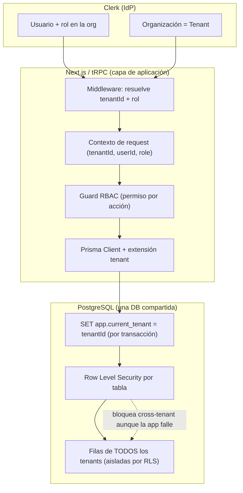
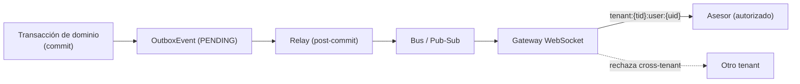

# 07 — Multi-Tenant, Seguridad y RBAC

> **RealEstate OS** — SaaS multi-tenant para inmobiliarias LATAM
> Documento de arquitectura de seguridad y aislamiento. Autor: Software Architect + DBA (PostgreSQL/Prisma).
> Stack: Next.js · React · TypeScript · PostgreSQL · Prisma · tRPC · WebSockets · Clerk.
> Ver también: `06-modelo-de-datos.md` (entidades, `tenantId` en cada tabla).

---

## 1. Estrategia multi-tenant: DB compartida + `tenantId` + RLS

### 1.1 Decisión

RealEstate OS usa **una sola base de datos PostgreSQL compartida**, con una columna `tenantId` en cada tabla de negocio y **Row Level Security (RLS)** de Postgres como frontera de aislamiento a nivel del motor.

Es una arquitectura de **doble defensa**:

1. **Capa de aplicación:** todo query pasa por un contexto que inyecta el `tenantId` resuelto desde Clerk. Prisma filtra por `tenantId`.
2. **Capa de base de datos (última línea):** aunque un bug de aplicación olvide el `WHERE tenantId = ...`, **RLS bloquea** el acceso a filas de otros tenants. La DB nunca confía en que la app filtró bien.

### 1.2 Comparación con alternativas

| Estrategia | Aislamiento | Costo/escala | Operación | Cuándo |
|---|---|---|---|---|
| **DB compartida + tenantId + RLS** (elegida) | Lógico, reforzado por el motor | El mejor: 1 DB, 1 pool, 1 migración | Simple: una migración para todos | Miles de tenants pequeños/medianos. **Default.** |
| Schema-per-tenant | Fuerte (namespaces separados) | Medio: N schemas, migración × N, connection churn | Compleja: fan-out de migraciones, límites de catálogo de PG | Cientos de tenants con datos voluminosos y necesidad de aislamiento más duro |
| DB-per-tenant | Máximo (físico) | Alto: N instancias/DBs, N backups | La más costosa: orquestación por tenant | Enterprise / compliance estricto / residencia de datos por país |

**Por qué DB compartida + RLS como default:**

- **Costo y velocidad de desarrollo:** una migración, un pool de conexiones, un backup. Onboarding de un tenant = insertar una fila en `Tenant`. Sin aprovisionamiento de infraestructura.
- **RLS elimina la clase entera de bugs de "cross-tenant leak"** por olvido de filtro en la app — el riesgo #1 de este modelo — moviéndolo al motor.
- **Escala probada:** con índices `(tenantId, …)` y particionado temporal de las tablas grandes (ver doc 06 §6), soporta el volumen esperado de la región.

**Contras asumidos y mitigaciones:**

- *Noisy neighbor:* un tenant pesado degrada a otros → mitigado con rate limiting por tenant (§6), particiones dedicadas y, en el límite, migración a aislamiento dedicado.
- *"Blast radius" de un bug de RLS:* mitigado con tests de aislamiento automatizados (un tenant nunca ve filas de otro) en CI, y `FORCE ROW LEVEL SECURITY` incluso para el owner de la tabla.

### 1.3 Cuándo migrar a aislamiento dedicado (enterprise)

Se dispara la migración de un tenant a **schema-per-tenant** o **DB-per-tenant** cuando se cumple alguno:

- **Compliance / contrato:** el cliente exige aislamiento físico o residencia de datos en un país específico.
- **Volumen desproporcionado:** el tenant representa una fracción tal del volumen que degrada al resto pese al rate limiting.
- **SLA de rendimiento garantizado** que no se puede asegurar en infraestructura compartida.
- **Requisito de backup/restore independiente** (poder restaurar solo a ese cliente sin tocar a los demás).

Como `tenantId` es explícito en todas las tablas, la migración es un **export filtrado por tenant → import a la DB/schema dedicado**, sin rediseño del modelo.

### 1.4 Diagrama



---

## 2. Implementación de RLS en PostgreSQL

### 2.1 Cómo se setea el tenant en la sesión

Cada request obtiene una **transacción** cuyo primer statement fija una variable de sesión con el `tenantId` del contexto. Las políticas RLS leen esa variable. Se usa `SET LOCAL` para que el valor viva solo en la transacción (evita fugas entre requests que comparten conexión del pool).

```sql
-- Ejecutado al comienzo de cada transacción, con el tenant del request:
SET LOCAL app.current_tenant = 'tnt_abc123';
-- Opcional: rol para políticas más finas
SET LOCAL app.current_role = 'ADVISOR';
SET LOCAL app.current_user = 'usr_789';
```

Con Prisma, se hace vía **Client Extension** que envuelve cada operación en una transacción interactiva y ejecuta el `SET LOCAL` antes del query real:

```ts
// Pseudocódigo de la extensión de Prisma (conceptual)
const tenantClient = (ctx: RequestContext) =>
  basePrisma.$extends({
    query: {
      async $allOperations({ args, query }) {
        return basePrisma.$transaction(async (tx) => {
          // Doble defensa capa DB: setea el tenant para RLS
          await tx.$executeRawUnsafe(
            `SET LOCAL app.current_tenant = $1`, ctx.tenantId
          );
          await tx.$executeRawUnsafe(
            `SET LOCAL app.current_role = $1`, ctx.role
          );
          return query(args);
        });
      },
    },
  });
```

> **Importante:** la app se conecta con un rol de Postgres **no-superusuario** y **sin `BYPASSRLS`**. Un superusuario ignora RLS; por eso el rol de aplicación jamás debe serlo.

### 2.2 Políticas de ejemplo (pseudocódigo SQL)

Patrón por tabla: activar RLS, forzarla incluso para el owner, y definir política de aislamiento por tenant. Sobre eso se pueden agregar políticas finas por rol.

```sql
-- 1) Activar y FORZAR RLS (aplica también al dueño de la tabla)
ALTER TABLE lead ENABLE ROW LEVEL SECURITY;
ALTER TABLE lead FORCE ROW LEVEL SECURITY;

-- 2) Política base de aislamiento por tenant (lectura y escritura)
CREATE POLICY tenant_isolation ON lead
  USING      (tenant_id = current_setting('app.current_tenant', true))
  WITH CHECK (tenant_id = current_setting('app.current_tenant', true));

-- USING      -> filas visibles en SELECT/UPDATE/DELETE
-- WITH CHECK -> impide INSERT/UPDATE que "escape" a otro tenant
```

Ejemplo de política **fina por rol** (un ADVISOR solo ve sus leads o los de su sucursal; un OWNER/MANAGER ve todo el tenant):

```sql
CREATE POLICY advisor_scope ON lead
  FOR SELECT
  USING (
    tenant_id = current_setting('app.current_tenant', true)
    AND (
      current_setting('app.current_role', true) IN ('OWNER','MANAGER','ADMIN')
      OR owner_user_id = current_setting('app.current_user', true)
    )
  );
```

Función helper para no repetir el `current_setting` en cada política:

```sql
CREATE OR REPLACE FUNCTION current_tenant() RETURNS text
LANGUAGE sql STABLE AS $$
  SELECT current_setting('app.current_tenant', true)
$$;

-- Uso:
CREATE POLICY tenant_isolation ON property
  USING (tenant_id = current_tenant())
  WITH CHECK (tenant_id = current_tenant());
```

> El segundo argumento `true` de `current_setting(..., true)` evita error si la variable no está seteada: devuelve `NULL`, y `tenant_id = NULL` es falso → **fail-closed** (no ve nada). Esto es deliberado: si por algún motivo no se seteó el tenant, la política no filtra hacia "ver todo", sino hacia "ver nada".

### 2.3 Doble defensa app + DB

| Capa | Qué hace | Falla que cubre |
|---|---|---|
| **App (Prisma + tRPC)** | Filtra por `tenantId` en cada query; valida rol antes de ejecutar | UX, mensajes de error claros, performance (índices) |
| **DB (RLS)** | Rechaza a nivel de motor cualquier fila fuera del tenant de la sesión | Bug de app que olvide el filtro; query raw mal escrito; inyección que llegue al SQL |

**Tests de aislamiento en CI (obligatorios):** seed de 2 tenants; para cada tabla, con el tenant A seteado, un `SELECT *` **nunca** debe devolver filas del tenant B; un `INSERT` con `tenant_id` del B debe ser rechazado por `WITH CHECK`. Este suite corre en cada PR.

---

## 3. Integración con Clerk

### 3.1 Organizaciones → Tenants

Clerk provee **Organizaciones** y **membresías con rol**. El mapeo es directo:

- **Organización de Clerk** ⇒ `Tenant` (`Tenant.clerkOrgId = org.id`).
- **Membresía del usuario en la org** ⇒ `User` (`User.clerkUserId`, `User.tenantId`) con su `role`.
- Los **roles de Clerk** (`org:admin`, `org:member`, o custom roles) se mapean a `UserRole` (OWNER, MANAGER, ADVISOR, ADMIN, CLIENT). El rol es la fuente de verdad de RBAC.

Sincronización vía **webhooks de Clerk** (`organization.created`, `organizationMembership.created/updated/deleted`, `user.updated`) → actualizan `Tenant`/`User` en nuestra DB. Los webhooks se verifican con firma (Svix) — ver §6.

### 3.2 Resolución del tenant en cada request

```mermaid
sequenceDiagram
    participant B as Browser
    participant MW as Next.js Middleware
    participant Clerk as Clerk (auth())
    participant TRPC as tRPC context
    participant PG as PostgreSQL

    B->>MW: request (cookie de sesión Clerk)
    MW->>Clerk: auth() → { userId, orgId, orgRole }
    Clerk-->>MW: sesión válida + org activa
    MW->>TRPC: inyecta { tenantId, userId, role }
    Note over TRPC: tenantId = lookup(orgId) o directo si guardamos orgId
    TRPC->>PG: BEGIN; SET LOCAL app.current_tenant = tenantId; ...
    PG-->>TRPC: query bajo RLS
    TRPC-->>B: datos SOLO del tenant
```

Pasos:

1. El **middleware de Next.js** usa `auth()` de Clerk para obtener `userId`, `orgId` (organización activa) y `orgRole`.
2. Si no hay `orgId` activo → 401/redirect a selección de organización. **Nunca** se sirve data sin tenant resuelto.
3. Se construye el **contexto de tRPC** con `{ tenantId, userId, role }`. El `tenantId` sale de mapear `orgId` (o se persiste `orgId` como identificador y se usa directamente).
4. Cada procedimiento tRPC abre transacción y ejecuta el `SET LOCAL app.current_tenant`.

### 3.3 Propagación a Prisma/RLS

El contexto `{ tenantId, role, userId }` fluye hacia la **extensión de Prisma** (§2.1), que garantiza el `SET LOCAL` antes de cualquier query. Regla dura: **no existe un cliente Prisma "global sin tenant"** disponible en el código de negocio. El único acceso a datos es a través del `tenantClient(ctx)`. Un procedimiento que no tenga contexto de tenant no puede tocar la DB (más allá de operaciones de sistema explícitamente marcadas, como el relay del outbox, que corre con su propio rol acotado).

---

## 4. RBAC: roles, permisos y matriz

### 4.1 Modelo de roles y permisos

- **Roles** (`UserRole`): OWNER, MANAGER, ADVISOR, ADMIN, CLIENT.
- **Permisos**: tuplas `(módulo, acción)`, p. ej. `lead:reassign`, `property:publish`, `settings:configure`.
- **Enforcement en dos niveles:**
  1. **tRPC middleware** (`protectedProcedure.use(requirePermission('lead:delete'))`) — decisión de aplicación.
  2. **RLS con contexto de rol** — decisión de motor para el subconjunto de reglas expresables en SQL (p. ej. ADVISOR solo ve sus leads).
- **Permisos granulares configurables:** el mapa rol→permisos tiene defaults por rol, pero el OWNER puede ajustar overrides por tenant (persistidos en `Tenant.settings` o una tabla `RolePermission`). Esto permite, por ejemplo, habilitar que ADVISOR reasigne dentro de su sucursal en un tenant y no en otro.

**Jerarquía general:** OWNER ⊇ MANAGER ⊇ ADVISOR en alcance de datos; ADMIN es transversal-operativo (documentación, agenda, datos) pero **sin** poderes de configuración ni de negocio sensibles; CLIENT es acceso externo mínimo (su propio recorrido).

### 4.2 Matriz rol × permiso

Leyenda: ✅ permitido · 🟡 limitado (a lo propio / a su sucursal) · ❌ denegado.

| Módulo / Acción | OWNER (Dueño) | MANAGER (Gerente) | ADVISOR (Asesor) | ADMIN (Administrativo) |
|---|:---:|:---:|:---:|:---:|
| **Leads** — ver | ✅ (todos) | ✅ (todos/sucursal) | 🟡 (propios/sucursal) | ✅ (todos) |
| Leads — crear | ✅ | ✅ | ✅ | ✅ |
| Leads — editar | ✅ | ✅ | 🟡 (propios) | ✅ |
| Leads — eliminar | ✅ | ✅ | ❌ | 🟡 (según config) |
| Leads — reasignar | ✅ | ✅ | ❌ | 🟡 |
| Leads — cambiar de etapa | ✅ | ✅ | 🟡 (propios) | ✅ |
| Leads — exportar | ✅ | ✅ | ❌ | 🟡 |
| **Propiedades** — ver | ✅ | ✅ | ✅ | ✅ |
| Propiedades — crear/editar | ✅ | ✅ | 🟡 (asignadas) | ✅ |
| Propiedades — eliminar | ✅ | ✅ | ❌ | ❌ |
| Propiedades — publicar | ✅ | ✅ | ❌ | 🟡 |
| **Conversaciones** — ver | ✅ | ✅ | 🟡 (propias) | ✅ |
| Conversaciones — responder | ✅ | ✅ | 🟡 (propias) | ✅ |
| Conversaciones — reasignar | ✅ | ✅ | ❌ | 🟡 |
| **Tareas / Agenda** — ver | ✅ | ✅ | 🟡 (propias) | ✅ |
| Tareas / Agenda — crear/editar | ✅ | ✅ | 🟡 (propias) | ✅ |
| Agenda de otros — gestionar | ✅ | ✅ | ❌ | 🟡 |
| **Visitas** — registrar resultado | ✅ | ✅ | 🟡 (propias) | ✅ |
| **Documentos** — ver | ✅ | ✅ | 🟡 (de sus leads) | ✅ |
| Documentos — subir | ✅ | ✅ | 🟡 | ✅ |
| Documentos — eliminar | ✅ | ✅ | ❌ | 🟡 |
| Documentos sensibles (DNI) — ver | ✅ | ✅ | 🟡 (de sus leads) | 🟡 |
| **Automatizaciones** — ver | ✅ | ✅ | 🟡 (solo lectura) | ❌ |
| Automatizaciones — crear/editar | ✅ | ✅ | ❌ | ❌ |
| **Reglas de asignación** — configurar | ✅ | ✅ | ❌ | ❌ |
| **Reportes / Dashboards** — ver | ✅ (global) | ✅ (sucursal) | 🟡 (propios) | 🟡 |
| Reportes — exportar | ✅ | ✅ | ❌ | 🟡 |
| **Usuarios / Equipo** — ver | ✅ | ✅ | 🟡 | 🟡 |
| Usuarios — invitar/editar/rol | ✅ | 🟡 (no OWNER) | ❌ | ❌ |
| Usuarios — desactivar | ✅ | 🟡 | ❌ | ❌ |
| **Integraciones** — configurar | ✅ | 🟡 | ❌ | ❌ |
| **Landing Pages** — crear/publicar | ✅ | ✅ | ❌ | 🟡 |
| **Facturación / Plan** — gestionar | ✅ | ❌ | ❌ | ❌ |
| **Ajustes del tenant** — configurar | ✅ | 🟡 (operativos) | ❌ | ❌ |
| **Pipeline** — configurar etapas | ✅ | ✅ | ❌ | ❌ |
| **Auditoría** — ver logs | ✅ | 🟡 (sucursal) | ❌ | ❌ |

> **CLIENT (cliente final)** queda fuera de la matriz de staff: solo ve su propio Lead/recorrido (portal externo), su documentación y sus visitas agendadas; sin acceso a otros leads, propiedades internas, reportes ni configuración.

### 4.3 Enforcement (pseudocódigo)

```ts
// Mapa de permisos por rol (con overrides por tenant sobreimpuestos)
const DEFAULT_PERMISSIONS: Record<UserRole, Permission[]> = {
  OWNER:   ['*'],                              // todo
  MANAGER: ['lead:*', 'property:*', 'report:view', 'user:view', ...],
  ADVISOR: ['lead:view:own', 'lead:edit:own', 'conversation:*:own', ...],
  ADMIN:   ['lead:view', 'document:*', 'appointment:*', ...],
  CLIENT:  ['self:view'],
};

const requirePermission = (perm: Permission) =>
  middleware(({ ctx, next }) => {
    if (!can(ctx.role, perm, ctx.tenantId)) {   // can() aplica overrides del tenant
      throw new TRPCError({ code: 'FORBIDDEN' });
    }
    return next();
  });

// Uso en un procedimiento
export const deleteLead = protectedProcedure
  .use(requirePermission('lead:delete'))
  .input(z.object({ id: z.string() }))
  .mutation(async ({ ctx, input }) => { /* ... RLS también aplica ... */ });
```

---

## 5. Auditoría

### 5.1 Qué se audita

Toda acción sensible o irreversible genera una fila **inmutable** en `AuditLog` (ver estructura en doc 06 §2.19):

- **Cambio de estado del lead** (`STAGE_CHANGE`) — con etapa origen/destino y comentario.
- **Eliminación** de cualquier entidad (`DELETE`) — con snapshot `before`.
- **Reasignación** de leads/conversaciones (`REASSIGN`) — de quién a quién.
- **Edición** de campos sensibles (`UPDATE`) — con diff `before`/`after`.
- **Login / logout** (`LOGIN`) — actor, IP, user-agent.
- **Publicación** de propiedad o landing (`PUBLISH`).
- **Exportación** de datos (`EXPORT`) — crítico para PII / cumplimiento.
- **Configuración** (cambios de reglas, roles, integraciones).

### 5.2 Estructura e inmutabilidad

`AuditLog` es **append-only**:

- **Sin `UPDATE` ni `DELETE`** desde la aplicación. El rol de app tiene `GRANT INSERT, SELECT` pero **no** `UPDATE`/`DELETE` sobre `audit_log`.
- RLS de aislamiento por tenant también aplica (cada tenant ve solo su auditoría; ver §4.2, solo OWNER/MANAGER).
- Reforzado a nivel motor:

```sql
REVOKE UPDATE, DELETE ON audit_log FROM app_role;

-- Trigger de bloqueo defensivo
CREATE OR REPLACE FUNCTION prevent_audit_mutation()
RETURNS trigger LANGUAGE plpgsql AS $$
BEGIN
  RAISE EXCEPTION 'audit_log es inmutable';
END $$;

CREATE TRIGGER no_update_audit BEFORE UPDATE OR DELETE ON audit_log
  FOR EACH ROW EXECUTE FUNCTION prevent_audit_mutation();
```

- **Retención y particionado:** `audit_log` particionada por rango temporal (doc 06 §6.2); el "borrado" es *drop* de particiones vencidas según política de retención, no `DELETE` fila a fila. Esto preserva inmutabilidad dentro de la ventana de retención.
- **Escritura transaccional:** el `AuditLog` se inserta en la **misma transacción** que la acción auditada (y su `OutboxEvent`), garantizando que no haya acción sin rastro ni rastro sin acción.

---

## 6. Seguridad general (OWASP Top 10 aplicado)

| Riesgo OWASP | Mitigación en RealEstate OS |
|---|---|
| **A01 Broken Access Control** | RBAC en tRPC + **RLS** en Postgres (doble defensa). Tests de aislamiento en CI. Deny-by-default. |
| **A02 Cryptographic Failures** | TLS 1.2+ en tránsito; cifrado at-rest de la DB; **cifrado a nivel columna** para PII (`documentNumber`) y secretos (`Integration.credentials`). |
| **A03 Injection** | Prisma parametriza por defecto; prohibido concatenar SQL. `$queryRaw` solo con placeholders. Validación Zod en boundaries. |
| **A04 Insecure Design** | Modelo lead-céntrico con outbox transaccional; threat modeling por módulo; fail-closed en RLS. |
| **A05 Security Misconfiguration** | Rol de DB no-superusuario sin `BYPASSRLS`; headers de seguridad (CSP, HSTS); secretos fuera del código. |
| **A06 Vulnerable Components** | `npm audit`/Dependabot en CI; pins de versiones; revisión de dependencias. |
| **A07 Auth Failures** | Autenticación delegada a **Clerk** (MFA, gestión de sesión, rotación). Sin passwords propios. |
| **A08 Integrity Failures** | Verificación de **firma de webhooks** (Clerk/Svix, WhatsApp); outbox idempotente (`externalId` único). |
| **A09 Logging/Monitoring Failures** | `AuditLog` inmutable + logs estructurados; alertas sobre eventos de seguridad; monitoreo de rate-limit hits. |
| **A10 SSRF** | Validación/allowlist de URLs en integraciones y fetch de medios; egress controlado. |

### 6.1 Validación de input en boundaries

Todo input externo (formularios, tRPC, webhooks, respuestas de integraciones) se valida con **Zod** en el borde, **antes** de tocar la lógica de negocio. Nunca se confía en API responses ni en payloads de webhook. Fail-fast con mensajes claros; los errores no filtran detalles internos.

```ts
const CreateLeadInput = z.object({
  firstName: z.string().min(1).max(120),
  phone: z.string().regex(/^\+?[1-9]\d{6,14}$/).optional(),   // E.164
  operationType: z.nativeEnum(OperationType),
  budgetMax: z.number().positive().optional(),
  // ...
});
```

### 6.2 Manejo de secretos

- **Nunca** hardcodear secretos. Se leen de variables de entorno / **secret manager** (Vercel Env, AWS Secrets Manager, etc.).
- Validación de presencia de secretos requeridos **al arranque** (fail-fast si falta uno).
- Credenciales de integraciones (`Integration.credentials`) se guardan **cifradas at-rest a nivel columna** (envelope encryption con KMS), nunca en claro.
- Rotación de cualquier secreto potencialmente expuesto; los tokens de Clerk/WhatsApp se rotan según política.

### 6.3 Rate limiting por tenant / endpoint

- Límites **por tenant** (mitiga noisy-neighbor) y **por endpoint** (protege recursos caros: envío de mensajes, exportaciones, IA de scoring).
- Implementado en el edge / middleware (p. ej. Upstash Redis + sliding window), con clave `tenantId:endpoint:userId`.
- Los webhooks entrantes tienen su propio límite y cola, para absorber ráfagas sin tumbar el sistema.
- Los *hits* de rate-limit se registran y alertan (posible abuso).

### 6.4 Protección de webhooks (verificación de firma)

Los webhooks son un vector de ataque directo (llegan de afuera). **Ningún webhook se procesa sin verificar firma:**

```ts
// WhatsApp Cloud API: verificación HMAC-SHA256 del payload crudo
function verifyWhatsAppSignature(rawBody: Buffer, header: string, appSecret: string) {
  const expected = 'sha256=' +
    crypto.createHmac('sha256', appSecret).update(rawBody).digest('hex');
  // comparación en tiempo constante
  if (!crypto.timingSafeEqual(Buffer.from(header), Buffer.from(expected))) {
    throw new Error('firma de webhook inválida');
  }
}
```

- Se verifica sobre el **cuerpo crudo** (raw body), antes de parsear JSON.
- **Comparación en tiempo constante** (`timingSafeEqual`) contra timing attacks.
- **Idempotencia:** `Message.externalId` con `@@unique([tenantId, externalId])` evita procesar dos veces el mismo evento reintentado.
- Webhooks de **Clerk** verificados con **Svix** (headers `svix-id`, `svix-timestamp`, `svix-signature`), con ventana de tolerancia temporal para rechazar replays.

### 6.5 Cifrado (tránsito y reposo)

- **Tránsito:** TLS obligatorio (HSTS); WebSockets sobre WSS; conexión a Postgres con SSL.
- **Reposo:** cifrado de disco de la DB (gestionado por el proveedor) + **cifrado a nivel columna** para los campos más sensibles (DNI/`documentNumber`, credenciales). Las claves viven en KMS, no en la DB.

### 6.6 PII y datos sensibles

- **Clasificación:** `documentNumber`, `dateOfBirth`, documentación (`Document.isSensitive`), teléfono y email son PII.
- **Minimización y acceso:** RBAC restringe quién ve documentación sensible (§4.2). ADVISOR solo ve la de sus leads.
- **Auditoría de acceso/exportación** de PII (`EXPORT` en `AuditLog`).
- **Object storage** para documentos: los archivos no viven en la DB (solo `storageKey`); acceso vía URLs firmadas de corta vida, con el bucket privado.
- **Cumplimiento regional:** soporte para *right-to-erasure* apoyado en `tenantId` + `leadId` (borrado/anonimización dirigido).

### 6.7 Backups

- Backups automáticos con **point-in-time recovery (PITR)** de la DB compartida.
- **Restore por tenant** apoyado en `tenantId` (filtrado en el export); para enterprise con DB dedicada, restore independiente nativo.
- Backups cifrados; pruebas de restore periódicas (un backup no probado no es un backup).

---

## 7. Aislamiento en tiempo real (WebSockets)

Los WebSockets abren una superficie de riesgo propia: un canal mal autorizado filtra eventos en vivo entre tenants o entre usuarios. Reglas:

### 7.1 Autenticación del socket

- El handshake del WebSocket **exige el token de sesión de Clerk**. Sin sesión válida → conexión rechazada.
- Del token se derivan `{ tenantId, userId, role }`; se guardan en el estado del socket **server-side** (el cliente nunca declara su propio tenant/rol).

### 7.2 Autorización de canales por tenant / rol

Los canales se nombran con el `tenantId` como prefijo obligatorio, y la suscripción se valida server-side:

```
tenant:{tenantId}:leads              # cambios de leads del tenant (MANAGER/OWNER)
tenant:{tenantId}:user:{userId}      # eventos dirigidos a un usuario (sus asignaciones)
tenant:{tenantId}:conversation:{id}  # mensajes en vivo de una conversación
tenant:{tenantId}:branch:{branchId}  # eventos de una sucursal
```

Reglas de suscripción (validadas en el servidor, **nunca** confiando en el cliente):

1. El `tenantId` del canal **debe** coincidir con el `tenantId` del socket. Cross-tenant subscribe → rechazado.
2. Aplica el mismo RBAC que la API: un ADVISOR solo se suscribe a `user:{suPropioId}` y a conversaciones que le pertenecen; no a `tenant:{...}:leads` global.
3. La autorización de un canal de conversación se resuelve contra la DB (bajo RLS): si el usuario no puede leer esa conversación por API, tampoco por socket.

### 7.3 Publicación de eventos

- Los eventos se originan en el **outbox transaccional** (doc 06 §2.24): el relay publica al bus/WebSocket **después** del commit, garantizando que solo se emiten cambios realmente persistidos.
- Cada evento lleva su `tenantId`; el fan-out respeta los canales prefijados por tenant. Un evento **jamás** se enruta a un canal de otro tenant.
- Backpressure y reconexión: los clientes reconectan y hacen *catch-up* por API (cursor), no se asume entrega exactamente-una-vez por el socket.



---

## Apéndice — Checklist de seguridad pre-commit

- [ ] Sin secretos hardcodeados (env / secret manager).
- [ ] Todo input validado con Zod en el boundary.
- [ ] Queries parametrizadas (sin concatenación SQL).
- [ ] RLS activa y forzada en toda tabla nueva; test de aislamiento agregado.
- [ ] Rol de DB de app sin superusuario / sin `BYPASSRLS`.
- [ ] Permiso RBAC verificado en cada procedimiento tRPC.
- [ ] Webhooks nuevos con verificación de firma + idempotencia.
- [ ] PII nueva clasificada, cifrada si corresponde, y su acceso auditado.
- [ ] Rate limiting definido para endpoints costosos.
- [ ] Acción sensible nueva registrada en `AuditLog` (append-only).
- [ ] Canal WebSocket nuevo prefijado por `tenantId` y autorizado por rol.

---

_Fin del documento 07. Ver `06-modelo-de-datos.md` para el catálogo de entidades y enums referenciados._
