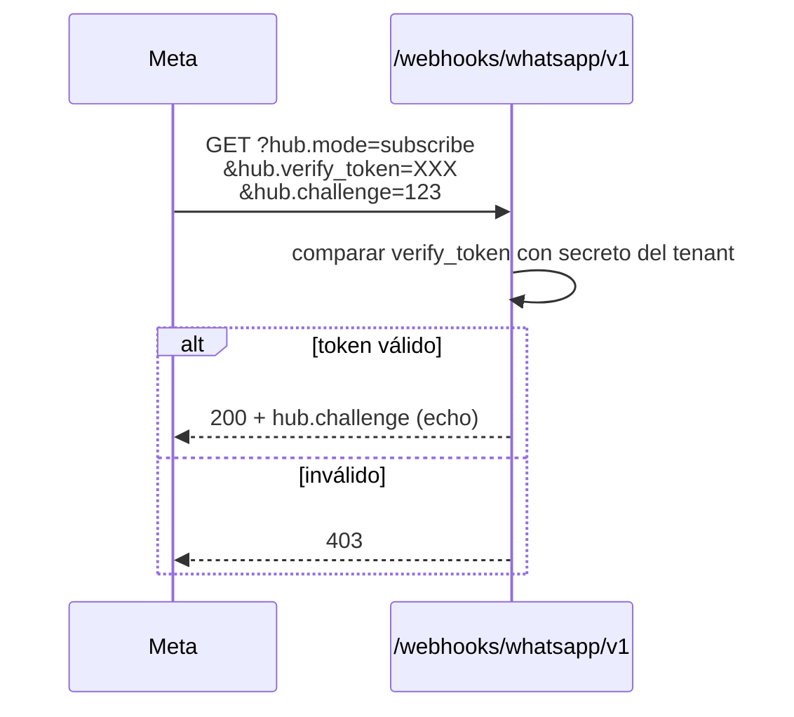
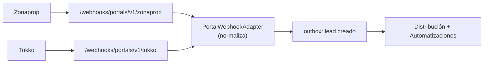

# 08 — APIs

> **Producto:** RealEstate OS — SaaS multi-tenant para inmobiliarias LATAM, centrado en el LEAD.
> **Audiencia:** ingeniería frontend/backend, integradores.
> **Relación:** este documento detalla los contratos. Para la arquitectura que los sostiene, ver **05-arquitectura-tecnica.md**.

---

## 1. Estrategia de API

RealEstate OS expone tres superficies de API, cada una para un propósito distinto:

| Superficie | Uso | Tecnología | Quién consume |
|------------|-----|------------|---------------|
| **tRPC** | API principal de la app | tRPC + Zod | El propio frontend Next.js (type-safe) |
| **REST** | Webhooks **entrantes** | Route handlers Next.js | Meta (WhatsApp), landing pages, portales |
| **WebSocket** | Eventos en tiempo real | Ably / WS (vía `RealtimePort`) | Centro de Operaciones y vistas en vivo |

**Principio:** tRPC no se expone a terceros. Nadie fuera de nuestro frontend habla tRPC. Todo lo que viene de afuera entra por REST (webhooks) o sale por WS (eventos). Esto mantiene la superficie externa mínima y auditada.

### 1.1 Versionado

- **tRPC:** no hay versionado por URL. El contrato es el tipo TypeScript compartido; frontend y backend se despliegan juntos, así que el drift es imposible. Cambios breaking se manejan con procedimientos nuevos + deprecación del viejo.
- **REST (webhooks):** versionado por path — `/api/webhooks/whatsapp/v1`. Los webhooks son contratos con terceros y deben poder evolucionar sin romper integraciones activas.
- **Eventos WS:** el nombre del evento incluye dominio y acción (`lead.etapa_cambiada`). Cambios de payload se hacen aditivos (nunca se remueven campos sin deprecación).

### 1.2 Convenciones

- **Nombres de procedimientos:** `verbo` para mutations (`crear`, `moverEtapa`, `asignar`), `sustantivo`/`get`/`list` para queries.
- **Casing:** `camelCase` en TS, `snake_case` en columnas Postgres (Prisma mapea).
- **IDs:** UUID v4. Siempre string en la API.
- **Fechas:** ISO 8601 en el borde; `Date` en dominio.
- **Todo input pasa por Zod.** Nada llega al service sin validar.
- **Todo query lleva `tenantId` implícito** desde el contexto — nunca como parámetro del cliente.

### 1.3 Formato de error

tRPC usa un `errorFormatter` central que produce un envelope consistente:

```typescript
type ApiError = {
  code: "BAD_REQUEST" | "UNAUTHORIZED" | "FORBIDDEN" | "NOT_FOUND"
      | "CONFLICT" | "TOO_MANY_REQUESTS" | "INTERNAL_SERVER_ERROR";
  message: string;              // apto para mostrar al usuario (sin datos sensibles)
  detalle?: string;             // contexto técnico, solo en logs/dev
  campos?: Record<string, string>; // errores de validación por campo (Zod)
  requestId: string;            // para correlacionar con logs
};
```

Reglas: los mensajes de usuario nunca filtran stack traces, SQL ni IDs de otros tenants. El `requestId` correlaciona el error del cliente con el log del servidor.

### 1.4 Paginación

Paginación por **cursor** (no offset) para listados grandes y estables:

```typescript
// input
{ cursor?: string; limit?: number /* default 25, max 100 */; filtros?: {...} }
// output
{ items: T[]; nextCursor: string | null; total?: number }
```

El cursor es el `id` del último item (orden estable por `updatedAt, id`). `total` es opcional y sólo se calcula cuando la UI lo necesita (evita `COUNT` caros).

---

## 2. Routers tRPC por módulo

Cada router vive en su feature module (`src/server/modules/<x>/<x>.router.ts`) y se mergea en `root.router.ts`. La columna **Permisos** indica el rol mínimo; el aislamiento por `tenantId` es implícito en **todos** los procedimientos.

> Roles: **D** = Dueño, **G** = Gerente, **A** = Asesor. "Propios" = limitado a los recursos asignados al asesor.

### 2.1 `lead`

| Procedimiento | Tipo | Input (conceptual) | Output | Permisos |
|---------------|------|--------------------|--------|----------|
| `list` | query | `{ etapa?, asesorId?, origen?, cursor?, limit? }` | `{ items: Lead[], nextCursor }` | A (propios), G/D (todos) |
| `getById` | query | `{ leadId }` | `LeadDetalle` | A (propio), G/D |
| `crear` | mutation | `{ nombre, telefono?, email?, origen, propiedadId?, notas? }` | `Lead` | A, G, D |
| `actualizar` | mutation | `{ leadId, patch }` | `Lead` | A (propio), G/D |
| `asignar` | mutation | `{ leadId, asesorId }` | `Lead` | G, D |
| `registrarContacto` | mutation | `{ leadId, canal, resultado, nota? }` | `Lead` | A, G, D |
| `marcarPerdido` | mutation | `{ leadId, motivo }` | `Lead` | A (propio), G/D |
| `timeline` | query | `{ leadId }` | `EventoLead[]` (auditoría) | A (propio), G/D |

**Eventos emitidos:** `lead.creado`, `lead.actualizado`, `lead.asignado`, `lead.etapa_cambiada`, `lead.perdido`, `lead.contacto_registrado`.

### 2.2 `pipeline`

| Procedimiento | Tipo | Input | Output | Permisos |
|---------------|------|-------|--------|----------|
| `tablero` | query | `{ asesorId?, sucursalId? }` | `{ etapas: EtapaConLeads[] }` | A (propios), G/D |
| `moverEtapa` | mutation | `{ leadId, etapaDestino, motivo? }` | `Lead` | A (propio), G/D |
| `configuracion` | query | `{}` | `EtapaPipeline[]` | D, G |
| `reordenarEtapas` | mutation | `{ orden: EtapaId[] }` | `EtapaPipeline[]` | D |

La transición valida la máquina de estados: `NUEVO → PRIMER_CONTACTO → INTERESADO → VISITA_AGENDADA → VISITA_REALIZADA → NEGOCIACION → RESERVA → ESCRIBANIA → VENTA/ALQUILER`, con `PERDIDO` alcanzable desde cualquier etapa.

**Eventos emitidos:** `lead.etapa_cambiada`.

### 2.3 `conversation`

| Procedimiento | Tipo | Input | Output | Permisos |
|---------------|------|-------|--------|----------|
| `listConversaciones` | query | `{ estado?, asesorId?, cursor? }` | `{ items: Conversacion[], nextCursor }` | A (propios), G/D |
| `getMensajes` | query | `{ conversacionId, cursor? }` | `{ items: Mensaje[], nextCursor }` | A (propia), G/D |
| `enviarMensaje` | mutation | `{ conversacionId, contenido }` | `Mensaje` | A, G, D |
| `enviarPlantilla` | mutation | `{ conversacionId, plantillaId, variables }` | `Mensaje` | A, G, D |
| `marcarLeido` | mutation | `{ conversacionId }` | `Conversacion` | A, G, D |
| `asignarConversacion` | mutation | `{ conversacionId, asesorId }` | `Conversacion` | G, D |

`enviarMensaje` delega en `ChannelPort` (WhatsApp Cloud API). No conoce a Meta.

**Eventos emitidos:** `conversation.mensaje_enviado`, `conversation.mensaje_recibido`, `conversation.asignada`, `conversation.leida`.

### 2.4 `property`

| Procedimiento | Tipo | Input | Output | Permisos |
|---------------|------|-------|--------|----------|
| `list` | query | `{ operacion?, tipo?, sucursalId?, cursor? }` | `{ items: Propiedad[], nextCursor }` | A, G, D |
| `getById` | query | `{ propiedadId }` | `PropiedadDetalle` | A, G, D |
| `crear` | mutation | `{ ... }` | `Propiedad` | G, D |
| `actualizar` | mutation | `{ propiedadId, patch }` | `Propiedad` | G, D |
| `archivar` | mutation | `{ propiedadId }` | `Propiedad` | G, D |
| `publicarEnPortal` | mutation | `{ propiedadId, portal }` | `{ estado, publicacionExternaId }` | G, D |

`publicarEnPortal` usa `ListingPort` (Tokko/Zonaprop/Argenprop/MELI).

**Eventos emitidos:** `property.creada`, `property.actualizada`, `property.publicada`.

### 2.5 `appointment`

| Procedimiento | Tipo | Input | Output | Permisos |
|---------------|------|-------|--------|----------|
| `agenda` | query | `{ desde, hasta, asesorId? }` | `Cita[]` | A (propias), G/D |
| `crear` | mutation | `{ leadId, propiedadId?, inicio, fin, tipo }` | `Cita` | A, G, D |
| `reprogramar` | mutation | `{ citaId, inicio, fin }` | `Cita` | A (propia), G/D |
| `cancelar` | mutation | `{ citaId, motivo? }` | `Cita` | A (propia), G/D |
| `marcarRealizada` | mutation | `{ citaId, resultado }` | `Cita` | A, G, D |

`crear`/`reprogramar`/`cancelar` se sincronizan vía `CalendarPort` (Google/Outlook).

**Eventos emitidos:** `appointment.creada`, `appointment.reprogramada`, `appointment.cancelada`, `appointment.realizada`, `appointment.recordatorio`.

### 2.6 `task`

| Procedimiento | Tipo | Input | Output | Permisos |
|---------------|------|-------|--------|----------|
| `list` | query | `{ estado?, asesorId?, vencimiento?, cursor? }` | `{ items: Tarea[], nextCursor }` | A (propias), G/D |
| `crear` | mutation | `{ titulo, leadId?, asignadoA, vence, sla? }` | `Tarea` | A, G, D |
| `completar` | mutation | `{ tareaId, nota? }` | `Tarea` | A (propia), G/D |
| `reasignar` | mutation | `{ tareaId, asesorId }` | `Tarea` | G, D |

**Eventos emitidos:** `task.creada`, `task.completada`, `task.reasignada`, `task.vencida`.

### 2.7 `document`

| Procedimiento | Tipo | Input | Output | Permisos |
|---------------|------|-------|--------|----------|
| `listPorLead` | query | `{ leadId }` | `Documento[]` | A (propio), G/D |
| `solicitarSubida` | mutation | `{ leadId, nombre, tipo }` | `{ uploadUrl, documentoId }` | A, G, D |
| `confirmarSubida` | mutation | `{ documentoId }` | `Documento` | A, G, D |
| `solicitarFirma` | mutation | `{ documentoId, firmantes }` | `{ estado, firmaExternaId }` | G, D |

Almacenamiento vía `StoragePort` (Drive/Dropbox); firma vía `SignaturePort`.

**Eventos emitidos:** `document.subido`, `document.firma_solicitada`, `document.firmado`.

### 2.8 `automation`

| Procedimiento | Tipo | Input | Output | Permisos |
|---------------|------|-------|--------|----------|
| `list` | query | `{}` | `Automatizacion[]` | D, G |
| `crear` | mutation | `{ disparador, condiciones, acciones }` | `Automatizacion` | D, G |
| `actualizar` | mutation | `{ id, patch }` | `Automatizacion` | D, G |
| `activar` | mutation | `{ id, activo }` | `Automatizacion` | D, G |
| `eliminar` | mutation | `{ id }` | `{ ok }` | D |
| `simular` | query | `{ id, eventoEjemplo }` | `{ matchea, accionesResultantes }` | D, G |

**Eventos emitidos:** `automation.creada`, `automation.actualizada`, `automation.ejecutada`.

### 2.9 `alert`

| Procedimiento | Tipo | Input | Output | Permisos |
|---------------|------|-------|--------|----------|
| `listActivas` | query | `{ asesorId?, severidad?, cursor? }` | `{ items: Alerta[], nextCursor }` | A (propias), G/D |
| `resolver` | mutation | `{ alertaId, nota? }` | `Alerta` | A, G, D |
| `descartar` | mutation | `{ alertaId }` | `Alerta` | G, D |

**Eventos emitidos:** `alert.creada`, `alert.resuelta`, `alert.descartada`.

### 2.10 `dashboardOps` (Centro de Operaciones)

| Procedimiento | Tipo | Input | Output | Permisos |
|---------------|------|-------|--------|----------|
| `snapshot` | query | `{ sucursalId? }` | `{ embudo, sla, colaLeads, actividadReciente }` | G, D |
| `colaLeads` | query | `{ estado?, cursor? }` | `{ items: LeadEnCola[], nextCursor }` | G, D |
| `slaEnRiesgo` | query | `{}` | `{ items: TareaSla[] }` | G, D |
| `realtimeToken` | mutation | `{}` | `{ token, rooms: string[] }` | A, G, D |

`realtimeToken` emite el token de suscripción WS con las rooms permitidas por rol (ver 05 §4.3).

### 2.11 `user` (asesores + permisos)

| Procedimiento | Tipo | Input | Output | Permisos |
|---------------|------|-------|--------|----------|
| `list` | query | `{ sucursalId?, rol? }` | `Usuario[]` | G, D |
| `invitar` | mutation | `{ email, rol, sucursalId? }` | `Invitacion` | D (G limitado) |
| `cambiarRol` | mutation | `{ userId, rol }` | `Usuario` | D |
| `asignarSucursal` | mutation | `{ userId, sucursalId }` | `Usuario` | D, G |
| `desactivar` | mutation | `{ userId }` | `Usuario` | D |
| `getPermisos` | query | `{ userId }` | `Permiso[]` | D, G |

Cambios de rol se reflejan en la organización de Clerk.

**Eventos emitidos:** `user.invitado`, `user.rol_cambiado`, `user.desactivado`.

### 2.12 `branch` (sucursales)

| Procedimiento | Tipo | Input | Output | Permisos |
|---------------|------|-------|--------|----------|
| `list` | query | `{}` | `Sucursal[]` | A, G, D |
| `crear` | mutation | `{ nombre, direccion, ... }` | `Sucursal` | D |
| `actualizar` | mutation | `{ sucursalId, patch }` | `Sucursal` | D, G |
| `configurarDistribucion` | mutation | `{ sucursalId, estrategia }` | `Sucursal` | D, G |

`estrategia` de distribución: `round_robin`, `por_carga`, `manual`.

**Eventos emitidos:** `branch.creada`, `branch.actualizada`.

### 2.13 `tenant`

| Procedimiento | Tipo | Input | Output | Permisos |
|---------------|------|-------|--------|----------|
| `get` | query | `{}` | `TenantConfig` | D, G |
| `actualizarConfig` | mutation | `{ patch }` | `TenantConfig` | D |
| `conectarIntegracion` | mutation | `{ tipo, credenciales }` | `EstadoIntegracion` | D |
| `estadoIntegraciones` | query | `{}` | `EstadoIntegracion[]` | D, G |

`conectarIntegracion` guarda credenciales cifradas por tenant (WhatsApp phoneId/token, OAuth de calendario, portales).

### 2.14 `report`

| Procedimiento | Tipo | Input | Output | Permisos |
|---------------|------|-------|--------|----------|
| `embudo` | query | `{ desde, hasta, sucursalId?, asesorId? }` | `ReporteEmbudo` | G, D |
| `rendimientoAsesores` | query | `{ periodo, sucursalId? }` | `RankingAsesores` | G, D |
| `origenLeads` | query | `{ desde, hasta }` | `ReporteOrigen` | G, D |
| `kpis` | query | `{ periodo }` | `{ conversion, tiempoRespuesta, leadsActivos, ... }` | G, D |
| `exportar` | mutation | `{ tipo, filtros, formato }` | `{ url }` | D, G |

### 2.15 `leadScore`

| Procedimiento | Tipo | Input | Output | Permisos |
|---------------|------|-------|--------|----------|
| `getReglas` | query | `{}` | `ReglaScore[]` | D, G |
| `actualizarReglas` | mutation | `{ reglas }` | `ReglaScore[]` | D |
| `explicar` | query | `{ leadId }` | `{ score, desglose: FactorScore[] }` | A (propio), G/D |
| `recalcular` | mutation | `{ leadId }` | `{ score }` | G, D |

`explicar` devuelve el desglose factor por factor (por qué el lead tiene ese puntaje) — clave de la promesa de explicabilidad.

**Eventos emitidos:** `score.actualizado`.

---

## 3. Webhooks entrantes (REST)

Todos los webhooks entran por `src/app/api/webhooks/**` y siguen el mismo patrón: **verificar firma → normalizar → escribir al outbox en transacción → responder 200 rápido**. El procesamiento pesado es asíncrono vía workers.

### 3.1 WhatsApp Cloud API (Meta)

**Endpoints:**
- `GET /api/webhooks/whatsapp/v1` — verificación de suscripción (Meta manda `hub.challenge`).
- `POST /api/webhooks/whatsapp/v1` — mensajes y estados de entrega entrantes.

**Flujo de verificación (GET):**



**Flujo de mensaje entrante (POST):**

```mermaid
sequenceDiagram
    participant M as Meta
    participant EP as POST /webhooks/whatsapp/v1
    participant AD as WhatsAppCloudAdapter
    participant PG as Postgres (outbox)
    participant W as Worker Conversaciones

    M->>EP: POST { entry: [...] } + X-Hub-Signature-256
    EP->>EP: validar HMAC SHA-256 con app secret
    alt firma inválida
        EP-->>M: 401
    else válida
        EP->>AD: parsearEntrante(body)
        AD-->>EP: MensajeEntrante[]
        EP->>PG: BEGIN; upsert conversación/mensaje;<br/>INSERT outbox 'conversation.mensaje_recibido'; COMMIT
        EP-->>M: 200 (rápido)
        Note over W: async → matchea conversación,<br/>dispara automatizaciones/score
    end
```

**Contrato entrante (normalizado a dominio):**

```typescript
type MensajeEntrante = {
  canal: "whatsapp";
  telefono: string;              // E.164
  contenido: { tipo: "texto" | "imagen" | "audio" | "documento"; texto?: string; mediaId?: string };
  mensajeExternoId: string;
  recibidoEn: string;            // ISO
  contextoTenantId: string;      // resuelto por phoneNumberId → tenant
};

type EstadoEntrega = {
  mensajeExternoId: string;
  estado: "enviado" | "entregado" | "leido" | "fallido";
  ocurridoEn: string;
};
```

**Seguridad:** validación obligatoria de `X-Hub-Signature-256` (HMAC SHA-256 con el app secret). El `phoneNumberId` del payload resuelve el tenant — nunca se confía en un `tenantId` provisto por el cliente.

### 3.2 Formularios de Landing Pages

**Endpoint:** `POST /api/webhooks/landing/v1/:landingId`

Las landing pages generadas por el módulo Landing Pages postean sus formularios acá. El `landingId` (firmado) resuelve el tenant, la sucursal y la propiedad asociada.

**Contrato:**

```typescript
type LandingSubmission = {
  landingId: string;             // firmado, resuelve tenant/sucursal/propiedad
  nombre: string;
  telefono?: string;
  email?: string;
  mensaje?: string;
  utm?: { source?, medium?, campaign? };
  captchaToken: string;          // anti-spam
};
```

**Flujo:** verificar firma del `landingId` + validar captcha → crear `Lead` (origen=`landing`) + `INSERT outbox 'lead.creado'` en transacción → 200. El evento `lead.creado` dispara la distribución y las automatizaciones (asignación + primer contacto).

**Seguridad:** rate limit agresivo por IP + captcha obligatorio (formularios públicos son superficie de abuso).

### 3.3 Portales futuros

**Endpoint:** `POST /api/webhooks/portals/v1/:portal` (`portal ∈ {tokko, zonaprop, argenprop, meli}`).

Cada portal tiene su `PortalWebhookAdapter` que normaliza el payload propietario a `MensajeEntrante`/`LandingSubmission` de dominio. El contrato de dominio no cambia; sólo se agrega un adaptador por portal. Verificación por token/HMAC según lo que ofrezca cada portal.



---

## 4. Eventos WebSocket

Catálogo de eventos publicados a la capa de tiempo real (ver 05 §4). Cada evento se emite a una room y lo reciben los roles indicados. El payload siempre incluye `tenantId`, `eventoId` (= `outbox_event.id`, para deduplicar) y `ocurridoEn`.

| Evento | Payload (además de base) | Room | Receptores |
|--------|--------------------------|------|------------|
| `lead.creado` | `{ leadId, nombre, origen, asesorId? }` | `tenant:T` | Ops (G/D) |
| `lead.etapa_cambiada` | `{ leadId, de, a, actorId }` | `tenant:T` (+ asesor) | Ops (G/D), asesor asignado |
| `lead.asignado` | `{ leadId, asesorId, asignadoPor }` | `tenant:T:asesor:U` | Asesor asignado, Ops |
| `lead.perdido` | `{ leadId, motivo }` | `tenant:T` | Ops (G/D) |
| `conversation.mensaje_recibido` | `{ conversacionId, leadId, preview, telefono }` | `tenant:T` (+ asesor) | Asesor asignado, Ops |
| `conversation.mensaje_enviado` | `{ conversacionId, mensajeId, estado }` | `tenant:T:asesor:U` | Asesor asignado |
| `appointment.creada` | `{ citaId, leadId, inicio, asesorId }` | `tenant:T` (+ asesor) | Asesor, Ops |
| `appointment.recordatorio` | `{ citaId, leadId, inicio }` | `tenant:T:asesor:U` | Asesor asignado |
| `task.creada` | `{ tareaId, asignadoA, vence, sla? }` | `tenant:T:asesor:U` | Asesor asignado |
| `task.vencida` | `{ tareaId, leadId?, asignadoA }` | `tenant:T` (+ asesor) | Asesor, Ops |
| `alert.creada` | `{ alertaId, severidad, tipo, refId }` | `tenant:T` (+ asesor) | Ops (G/D), asesor si aplica |
| `score.actualizado` | `{ leadId, score, delta }` | `tenant:T` (+ asesor) | Asesor asignado, Ops |

**Autorización:** el servidor emite el token con `capability` por room (05 §4.3). Un asesor sólo recibe eventos de `tenant:T:asesor:<supropio>` y los generales de `tenant:T` que su rol permite. Gerentes/Dueños escuchan la room completa del tenant.

---

## 5. Contratos clave de ejemplo

### 5.1 `lead.crear`

```typescript
// input (Zod conceptual)
const CrearLeadInput = z.object({
  nombre: z.string().min(2).max(120),
  telefono: z.string().regex(/^\+?[1-9]\d{7,14}$/).optional(),   // E.164
  email: z.string().email().optional(),
  origen: z.enum(["manual", "landing", "zonaprop", "argenprop", "tokko", "meli", "whatsapp"]),
  propiedadId: z.string().uuid().optional(),
  notas: z.string().max(2000).optional(),
}).refine((d) => d.telefono || d.email, "Requiere teléfono o email");

// output
type Lead = {
  id: string;
  tenantId: string;
  nombre: string;
  telefono: string | null;
  email: string | null;
  origen: OrigenLead;
  etapa: EtapaPipeline;          // arranca en "NUEVO"
  asesorId: string | null;
  score: number;                 // 0-100
  creadoEn: string;              // ISO
  actualizadoEn: string;
};
```

**Permisos:** A, G, D. **Efecto:** persiste + `outbox 'lead.creado'` en una transacción. La distribución de leads y las automatizaciones reaccionan al evento.

### 5.2 `pipeline.moverEtapa`

```typescript
const MoverEtapaInput = z.object({
  leadId: z.string().uuid(),
  etapaDestino: z.enum([
    "NUEVO", "PRIMER_CONTACTO", "INTERESADO", "VISITA_AGENDADA",
    "VISITA_REALIZADA", "NEGOCIACION", "RESERVA", "ESCRIBANIA",
    "VENTA", "ALQUILER", "PERDIDO",
  ]),
  motivo: z.string().max(500).optional(),   // obligatorio si etapaDestino === "PERDIDO"
});

// output: Lead (actualizado)
```

**Validación de dominio:** transición legal según la máquina de estados; `PERDIDO` requiere `motivo`. **Permisos:** A sobre lead propio, G/D sobre cualquiera. **Efecto:** `outbox 'lead.etapa_cambiada'` → recálculo de score + automatizaciones + push a Ops.

### 5.3 `conversation.enviarMensaje`

```typescript
const EnviarMensajeInput = z.object({
  conversacionId: z.string().uuid(),
  contenido: z.discriminatedUnion("tipo", [
    z.object({ tipo: z.literal("texto"), texto: z.string().min(1).max(4096) }),
    z.object({ tipo: z.literal("media"), mediaId: z.string(), caption: z.string().max(1024).optional() }),
  ]),
});

type Mensaje = {
  id: string;
  conversacionId: string;
  direccion: "saliente";
  contenido: ContenidoMensaje;
  estado: "encolado" | "enviado" | "entregado" | "leido" | "fallido";
  mensajeExternoId: string | null;   // asignado por WhatsApp Cloud API
  creadoEn: string;
};
```

**Efecto:** el service llama a `ChannelPort.enviarMensaje` (WhatsApp) y escribe `outbox 'conversation.mensaje_enviado'`. El estado se actualiza luego vía webhook de estados de Meta. **Permisos:** A, G, D (asesor sólo en conversaciones propias).

---

## 6. Seguridad de API

### 6.1 Autenticación (Clerk)

Toda request pasa por el middleware de Clerk, que valida la sesión y expone `userId` y `orgId`. El **contexto tRPC** deriva de ahí:

```typescript
// server/context.ts (conceptual)
export async function createContext({ req }: CreateContextOptions): Promise<TenantContext> {
  const { userId, orgId } = await auth(req);          // Clerk
  if (!userId || !orgId) throw new TRPCError({ code: "UNAUTHORIZED" });

  const tenantId = await resolveTenant(orgId);        // organización Clerk → tenant
  const role = await resolveRole(userId, tenantId);   // Dueño | Gerente | Asesor

  return { userId, tenantId, role };
}
```

### 6.2 RBAC en procedimientos

tRPC usa middlewares componibles. Los procedimientos se construyen a partir de `protectedProcedure` (requiere sesión) y helpers de rol que verifican permisos **antes** de ejecutar.

```typescript
const isRole = (roles: Role[]) => t.middleware(({ ctx, next }) => {
  if (!roles.includes(ctx.role)) throw new TRPCError({ code: "FORBIDDEN" });
  return next();
});

export const gerenteProcedure = protectedProcedure.use(isRole(["DUENO", "GERENTE"]));
export const duenoProcedure   = protectedProcedure.use(isRole(["DUENO"]));

// autorización a nivel de recurso (asesor sólo sus leads)
export const leadPropioProcedure = protectedProcedure.use(async ({ ctx, rawInput, next }) => {
  if (ctx.role === "ASESOR") {
    const lead = await leadRepo.findByIdForTenant(db, ctx.tenantId, rawInput.leadId);
    if (lead?.asesorId !== ctx.userId) throw new TRPCError({ code: "FORBIDDEN" });
  }
  return next();
});
```

### 6.3 Aislamiento por tenant en cada query

Defensa en profundidad, dos capas:

1. **Aplicación:** todo repositorio recibe y filtra por `ctx.tenantId`. Nunca se acepta un `tenantId` del cliente.
2. **Base de datos (RLS):** cada transacción setea `SET LOCAL app.tenant_id = <tenantId>`; las políticas RLS de Postgres fuerzan `tenant_id = current_setting('app.tenant_id')` en cada tabla. Aunque un bug de la app olvide el filtro, la base bloquea el acceso cruzado.

```sql
-- policies/lead.sql (conceptual)
ALTER TABLE lead ENABLE ROW LEVEL SECURITY;
CREATE POLICY tenant_isolation ON lead
  USING (tenant_id = current_setting('app.tenant_id')::uuid);
```

```typescript
// lib/db.ts — set del tenant por transacción
export async function withTenant<T>(tenantId: string, fn: (tx) => Promise<T>) {
  return prisma.$transaction(async (tx) => {
    await tx.$executeRaw`SELECT set_config('app.tenant_id', ${tenantId}, true)`;
    return fn(tx);
  });
}
```

### 6.4 Validación de input

- **Todo procedimiento** define un esquema Zod de input; tRPC rechaza (`BAD_REQUEST`) lo que no valide, con detalle por campo.
- **Webhooks** validan firma HMAC **antes** de parsear el body.
- Nunca se confía en datos externos: payloads de Meta, portales y landings se normalizan por adaptador y se re-validan.

### 6.5 Rate limiting

| Superficie | Límite (orientativo) | Clave |
|------------|----------------------|-------|
| tRPC mutations | 60/min por usuario | `userId` |
| tRPC queries | 300/min por usuario | `userId` |
| Webhook landing | 20/min por IP + captcha | IP + `landingId` |
| Webhook WhatsApp | alto, gobernado por firma | `phoneNumberId` |
| `conversation.enviarMensaje` | según límites de Meta por tenant | `tenantId` |

Implementado con un limitador de ventana deslizante (Redis/Upstash) en el middleware. Exceder devuelve `TOO_MANY_REQUESTS`.

### 6.6 Otras defensas

- **Mensajes de error** sin datos sensibles; `requestId` para correlación en logs.
- **Credenciales de integración** cifradas at-rest por tenant; nunca en el cliente ni en logs.
- **Auditoría:** toda mutation relevante escribe al módulo Auditoría (quién, qué, cuándo) — trazabilidad completa del lead.
- **Tokens WS** de vida corta y con capability mínima por room.

---

## 7. Cierre

La estrategia de API prioriza type-safety interna (tRPC) y una superficie externa mínima y verificada (REST sólo para webhooks entrantes, WS sólo para salida en vivo). RBAC y aislamiento por tenant se aplican en cada procedimiento y se refuerzan en la base con RLS. Cada mutation que cambia estado emite un evento por el outbox, alimentando automatizaciones, score, alertas y el Centro de Operaciones en tiempo real — cerrando el círculo con la arquitectura de **05-arquitectura-tecnica.md**.
