# 09 — Módulos Clave: los 5 diferenciales de RealEstate OS

> **Documento**: Especificación profunda de producto + arquitectura
> **Producto**: RealEstate OS — SaaS multi-tenant para inmobiliarias LATAM, centrado en el LEAD
> **Audiencia**: Equipo de producto, arquitectura, ingeniería, diseño y QA
> **Estado**: Especificación de referencia (source of truth para implementación)
> **Stack de referencia**: Next.js · React · TypeScript · PostgreSQL · Prisma · tRPC · WebSockets · Clerk · WhatsApp Business Cloud API · Event-driven (transactional outbox + workers) · IA solo operativa

---

## 0. Contexto y principios transversales

Este documento especifica **en profundidad** los 5 módulos que diferencian a RealEstate OS de un CRM inmobiliario genérico. No son features sueltas: son el corazón operativo del producto. Todo gira alrededor del **LEAD** y su recorrido por el pipeline.

### 0.1 Pipeline canónico (etapas)

El pipeline es la columna vertebral. Toda la lógica de scoring, automatizaciones, distribución y torre de control lo referencia.

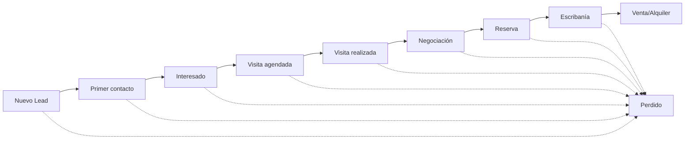

> **Regla de oro**: `Perdido` es un estado terminal alcanzable desde cualquier etapa. `Venta/Alquiler` es el estado terminal de éxito. Todo cambio de etapa emite un evento `LeadStageChanged`.

### 0.2 Roles

| Rol | Alcance | Poderes clave |
|-----|---------|---------------|
| **Dueño** | Todo el tenant (todas las sucursales) | Ve el Centro de Operaciones global, configura reglas de scoring/distribución/automatización, ve facturación y rankings |
| **Gerente** | Su(s) sucursal(es) | Torre de control de su sucursal, reasigna leads, aprueba automatizaciones, gestiona equipo |
| **Asesor** | Sus propios leads y conversaciones | Bandeja de conversaciones, ficha de lead, agenda, oportunidades del día, seguimientos |

### 0.3 Arquitectura event-driven (transactional outbox)

Todos los módulos se comunican por **eventos de dominio**. Nunca se hace un "efecto secundario" (recalcular score, disparar automatización, notificar torre de control) dentro de la misma transacción que la escritura de negocio. En su lugar:

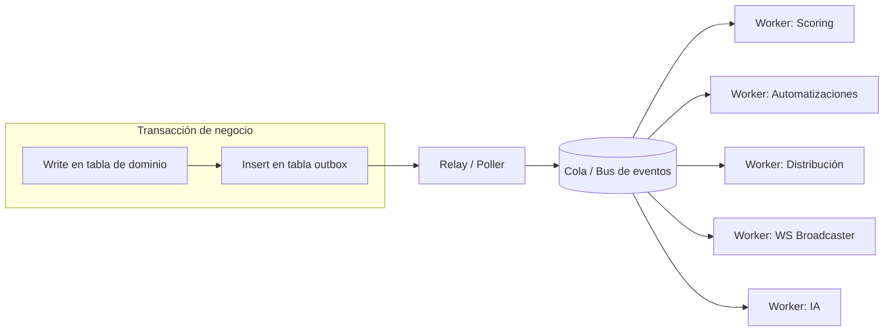

- **Escritura + outbox en la misma transacción** → garantía de que el evento se emite si y solo si el negocio se guardó (atomicidad).
- **Relay** lee la tabla `outbox`, publica en el bus y marca como procesado (at-least-once).
- **Workers idempotentes**: cada worker deduplica por `eventId` (guardado en `processed_events`).
- **WS Broadcaster** empuja a los clientes conectados vía WebSockets (torre de control, feeds, badges).

### 0.4 Catálogo global de eventos (referencia cruzada)

Estos son los eventos que atraviesan todos los módulos. Cada módulo declara cuáles **emite** y cuáles **consume**.

| Evento | Emitido por | Consumido por |
|--------|-------------|---------------|
| `LeadCreated` | Ingesta (WhatsApp, Landing, manual) | Distribución, Scoring, Torre, Automatizaciones |
| `LeadAssigned` | Distribución | Torre, Automatizaciones, Notificaciones |
| `LeadReassigned` | Distribución (timeout) / Gerente (manual) | Torre, Automatizaciones, Notificaciones |
| `LeadStageChanged` | CRM / IA / Asesor | Scoring, Automatizaciones, Torre, Analytics |
| `LeadScoreRecomputed` | Scoring | Torre, Oportunidades del día |
| `MessageReceived` | Channel (WhatsApp inbound) | IA, Scoring, Torre, Automatizaciones |
| `MessageSent` | Channel (outbound) | Scoring, Torre, Automatizaciones |
| `ConversationOpened` | Channel / Asesor | Torre |
| `VisitScheduled` | Agenda / IA | Torre, Automatizaciones, Scoring |
| `VisitCompleted` | Agenda / Asesor | Scoring, Automatizaciones, Torre |
| `VisitCancelled` | Agenda / Cliente | Torre (alerta), Automatizaciones |
| `ProposalSent` | Asesor / CRM | Automatizaciones, Scoring |
| `ReservationCreated` | CRM | Torre, Automatizaciones, Analytics |
| `DealClosed` (Venta/Alquiler) | CRM | Torre, Analytics, Facturación |
| `DocumentUploaded` | CRM | Scoring, Automatizaciones |
| `AdvisorConnected` / `AdvisorDisconnected` | Presence | Torre, Distribución |
| `AlertRaised` / `AlertResolved` | Motor de alertas | Torre |
| `TaskCreated` / `TaskCompleted` | Automatizaciones / Asesor | Torre, Agenda |

### 0.5 Envelope de respuesta y contratos

Todas las respuestas tRPC usan el envelope estándar del producto: `{ success, data, error, meta }`. Los pushes por WebSocket usan un envelope propio:

```ts
type WsMessage<T> = {
  type: string;          // ej: "torre.feed.append", "lead.score.updated"
  tenantId: string;
  branchId?: string;
  scope: "tenant" | "branch" | "advisor";
  payload: T;
  ts: string;            // ISO 8601
  v: number;             // versión de esquema del payload
};
```

---

# Módulo 1 — Centro de Operaciones (Torre de Control en tiempo real)

## 1.1 Propósito

El **Centro de Operaciones** NO es un dashboard tradicional (no es una pantalla de reportes que se abre "a veces"). Es una **torre de control** que el **Dueño / Gerente deja abierta todo el día en un monitor**, y que se actualiza **en tiempo real por WebSockets**, sin refrescar. Responde a una sola pregunta permanente:

> *"¿Qué está pasando AHORA en mi inmobiliaria, y dónde tengo que meter la mano?"*

Diferencia clave con un dashboard:
- **Dashboard** = fotos del pasado (KPIs de ayer, del mes).
- **Torre de control** = película del presente (quién está esperando respuesta ahora, qué asesor está saturado ahora, qué lead se está por perder ahora) + acciones inmediatas.

## 1.2 Bloques exactos de la pantalla

La torre se compone de **7 bloques**. Cada bloque tiene una fuente de datos, una frecuencia de actualización y acciones asociadas.

### Bloque A — Estado del equipo

Vista en vivo del equipo de asesores.

| Métrica | Definición | Fuente | Update |
|---------|-----------|--------|--------|
| Asesores conectados | Presencia activa (heartbeat WS < 60s) | Presence service | WS push |
| Última actividad | Timestamp del último evento del asesor | `advisor_activity` | WS push |
| Conversaciones activas | Conversaciones con mensaje en las últimas 24h sin cerrar | `conversations` | WS push |
| Leads asignados | Leads abiertos por asesor | `leads` | WS push |
| Visitas del día | `VisitScheduled` con fecha = hoy | `visits` | WS push |
| Tiempo promedio de respuesta (TPR) | Media de (primer msg saliente − msg entrante) por asesor, ventana móvil 7d | agregado | cada 60s |
| Tiempo desde última respuesta | Ahora − último `MessageSent` del asesor | derivado | tick client-side + WS |

### Bloque B — Estado de clientes (leads)

| Indicador | Definición |
|-----------|-----------|
| Nuevos leads | `LeadCreated` sin primer contacto aún |
| Esperando respuesta | Última interacción fue del cliente (mensaje entrante sin responder) |
| Seguimientos pendientes | Tareas `follow_up` con `dueAt <= now` no completadas |
| Negociaciones | Leads en etapa `Negociación` |
| Clientes en riesgo | Score cayó > X% o sin actividad > umbral en etapa avanzada |
| Hot Leads | Score >= 80 (ver Módulo 2) |
| Oportunidades perdidas | `Perdido` en las últimas 24/48/72h (con motivo) |

### Bloque C — Estado del Pipeline (embudo en vivo)

Para **cada etapa** del pipeline: cantidad, conversión a la siguiente, tiempo promedio en etapa, valor potencial (Σ de precio estimado ponderado por probabilidad de la etapa), y evolución (delta vs. ayer / semana).

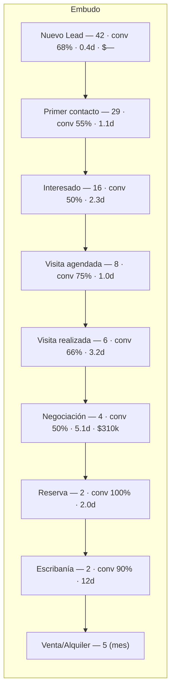

### Bloque D — Feed en tiempo real

Stream cronológico inverso de eventos del tenant/sucursal. Cada ítem es clickeable (abre la entidad relacionada).

Eventos que aparecen: nuevo lead, nueva conversación, visita agendada, reserva, venta, cambio de estado, reasignación, asesor conectado, cliente esperando.

```
🟢 14:32  Nuevo lead — "María G." vía WhatsApp (+54911...) → Depto Palermo 2amb   [Abrir]
💬 14:31  Nueva conversación — Asesor "Lucas" ↔ "Pedro R."                          [Abrir]
📅 14:28  Visita agendada — "Ana" · Casa Tigre · Jue 15:00                          [Abrir]
🔁 14:25  Reasignación — Lead "Jorge" de "Sofía"(timeout) → "Lucas"                 [Abrir]
🔴 14:22  Cliente esperando — "Pedro R." hace 18 min sin respuesta                  [Responder]
✅ 14:10  Reserva — "Depto Caballito" · $185.000 · Asesor "Sofía"                    [Abrir]
```

### Bloque E — Alertas inteligentes

Cada alerta tiene **prioridad** (CRÍTICA/ALTA/MEDIA/BAJA), **motivo**, y **acción sugerida** (botón directo).

| Alerta | Trigger (regla) | Prioridad | Acción sugerida |
|--------|-----------------|-----------|-----------------|
| Cliente esperando demasiado | Mensaje entrante sin responder > SLA (ej. 15 min en horario) | CRÍTICA | Abrir conversación / Reasignar |
| Demasiadas conversaciones abiertas | Asesor con > N conversaciones activas | ALTA | Reasignar / Balancear |
| Asesor saturado | Leads activos > umbral **y** TPR subiendo | ALTA | Redistribuir leads |
| Propiedad sin movimiento | Propiedad sin nuevos leads/visitas > X días | MEDIA | Revisar precio / republicar |
| Pipeline detenido | Leads sin cambio de etapa > X días en etapa | MEDIA | Empujar seguimiento |
| Oportunidades perdidas | Tasa de `Perdido` sube vs. baseline | ALTA | Revisar causas |
| Visitas canceladas | `VisitCancelled` en cascada / % alto | MEDIA | Reagendar / contactar |

### Bloque F — KPIs

Tarjetas numéricas con sparkline y comparación vs. período anterior. Selector de rango (Hoy / 7d / 30d / Mes).

Nuevos leads · Conversaciones · Visitas · Reservas · Ventas · Alquileres · Conversión global · Ticket promedio · Facturación **estimada** (pipeline ponderado) · Facturación **cerrada** · Propiedades más consultadas · Propiedades sin actividad · **Ranking de asesores** (por conversión / cierres / TPR).

### Bloque G — Acciones rápidas

Barra siempre visible + acciones contextuales en cada card: abrir conversación · cambiar estado · reasignar · contactar asesor · abrir ficha · abrir agenda · **filtros** (por sucursal, asesor, etapa, tipo de propiedad, rango de precio, canal de origen).

## 1.3 Wireframe conceptual (layout torre de control)

```
┌──────────────────────────────────────────────────────────────────────────────────────┐
│ RealEstate OS · CENTRO DE OPERACIONES        [Sucursal ▾] [Hoy ▾] [Filtros ▾]  ● LIVE  │
├───────────────────────────────┬──────────────────────────────┬─────────────────────────┤
│ (A) ESTADO DEL EQUIPO         │ (C) PIPELINE (embudo en vivo)│ (E) ALERTAS INTELIGENTES │
│ ┌───────────────────────────┐ │  Nuevo Lead ▓▓▓▓▓▓▓ 42       │ 🔴 CRÍTICA Cliente       │
│ │ Lucas   ● 3 conv  TPR 4m  │ │  1er contacto ▓▓▓▓▓ 29       │    esperando 18m         │
│ │ Sofía   ● 5 conv  TPR 9m ⚠│ │  Interesado ▓▓▓ 16           │    [Responder][Reasignar]│
│ │ Ana     ○ off             │ │  Visita agend. ▓▓ 8          │ ────────────────────────│
│ │ ...                       │ │  Visita real. ▓ 6            │ 🟠 ALTA Sofía saturada   │
│ └───────────────────────────┘ │  Negociación ▓ 4  $310k      │    5 conv · TPR ↑        │
│ Conectados 4/7 · Visitas 6    │  Reserva 2 · Escrib. 2       │    [Redistribuir]        │
├───────────────────────────────┤  Venta/Alq (mes) 5           │ ────────────────────────│
│ (B) ESTADO DE CLIENTES        │  ── Conversión global 11.9% ─│ 🟡 MEDIA Propiedad sin   │
│ Nuevos 12 · Esperando 5 🔴    ├──────────────────────────────┤    movimiento 9d         │
│ Seguim. 8 · Negoc. 4          │ (F) KPIs                     │    [Revisar]             │
│ En riesgo 3 · 🔥 Hot 7        │ Leads 42 ▲ · Conv 39 · Vis 6 │                          │
│ Perdidas 2                    │ Reservas 2 · Ventas 5        ├─────────────────────────┤
├───────────────────────────────┤ Ticket $172k · Fact.est $1.2M│ (G) ACCIONES RÁPIDAS     │
│ (D) FEED EN TIEMPO REAL       │ Ranking: Sofía>Lucas>Ana     │ [Abrir conv][Cambiar     │
│ 🟢 14:32 Nuevo lead María...  │                              │  estado][Reasignar]      │
│ 💬 14:31 Nueva conversación...│                              │ [Contactar asesor]       │
│ 📅 14:28 Visita agendada...   │                              │ [Ficha][Agenda]          │
│ 🔴 14:22 Cliente esperando... │                              │                          │
└───────────────────────────────┴──────────────────────────────┴─────────────────────────┘
```

## 1.4 UI/UX esperada

- **Densidad alta, cero scroll para lo crítico**: alertas y "clientes esperando" siempre visibles.
- **Color semántico**: verde (ok), amarillo (atención), rojo (acción urgente). Rojo solo para lo accionable ahora.
- **Todo clickeable**: cada número abre su detalle (drill-down) en un panel lateral (drawer) sin perder la torre.
- **Latencia percibida < 1s** desde que ocurre el evento hasta que aparece en el feed.
- **Indicador `● LIVE`**: si el WS se cae, pasa a `● RECONECTANDO` y hace fallback a polling cada 10s.
- **Sonido/flash opcional** para alertas CRÍTICAS (configurable por usuario).
- **Multi-sucursal**: el Dueño ve consolidado + puede filtrar; el Gerente ve su sucursal por defecto.

## 1.5 Datos que usa

Lee (proyecciones de solo lectura optimizadas para tablero):

- `leads`, `conversations`, `messages`, `visits`, `tasks`, `alerts`, `advisor_presence`, `advisor_activity`, `properties`, `deals`.
- Vistas materializadas / tablas de agregado: `mv_pipeline_stage_stats`, `mv_advisor_kpis`, `mv_property_activity`.

> **Patrón CQRS liviano**: la torre lee de **proyecciones** (read models) que los workers mantienen actualizadas a partir de eventos. Nunca hace agregaciones pesadas en caliente contra las tablas transaccionales.

## 1.6 Eventos que consume / emite

**Consume** (para actualizar la vista en vivo): `LeadCreated`, `LeadAssigned`, `LeadReassigned`, `LeadStageChanged`, `MessageReceived`, `MessageSent`, `ConversationOpened`, `VisitScheduled`, `VisitCompleted`, `VisitCancelled`, `ReservationCreated`, `DealClosed`, `AdvisorConnected/Disconnected`, `AlertRaised/Resolved`, `LeadScoreRecomputed`.

**Emite** (acciones desde la torre): `LeadReassigned` (reasignación manual), `LeadStageChanged` (cambio de estado manual), `AlertResolved` (cuando se actúa/descarta), `ConversationOpened`.

## 1.7 Flujo de datos en tiempo real

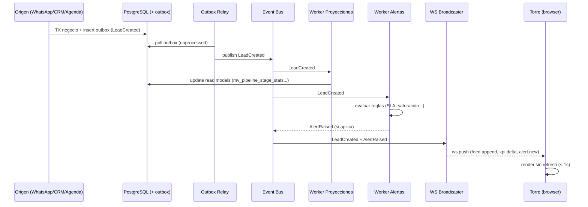

## 1.8 Reglas / algoritmos clave

- **Motor de alertas** = conjunto de reglas evaluadas por el `Worker Alertas` ante cada evento + un **tick programado** (cron cada 60s) para condiciones basadas en tiempo (ej. "cliente esperando > 15 min").
- **De-duplicación de alertas**: una alerta activa por `(tipo, entidad)`. Reraise solo escala prioridad, no duplica.
- **SLA configurable** por tenant y por horario laboral (fuera de horario los SLA se pausan).

## 1.9 Criterios de aceptación

- [ ] La torre se actualiza por WebSocket sin refrescar; latencia evento→UI p95 < 1.5s.
- [ ] Si el WS cae, muestra estado `RECONECTANDO` y hace fallback a polling ≤ 10s; al reconectar, reconcilia estado (no pierde eventos).
- [ ] Los 7 bloques (A–G) están presentes con los indicadores listados.
- [ ] Cada alerta muestra prioridad, motivo y al menos una acción sugerida funcional.
- [ ] Drill-down: click en cualquier KPI/alerta/feed abre el detalle sin perder la torre.
- [ ] Filtros por sucursal/asesor/etapa/tipo/precio/canal aplican a todos los bloques.
- [ ] Multi-tenant estricto: un usuario nunca ve datos de otro tenant (aislamiento por `tenantId` en cada query y en cada canal WS).
- [ ] Roles: Asesor no accede a la torre global; Gerente ve su sucursal; Dueño ve todo.
- [ ] Las proyecciones se reconstruyen desde el event log (replay) ante corrupción.

---

# Módulo 2 — Lead Score explicable + 🔥 Oportunidades del día

## 2.1 Propósito

Poner un número **0–100** a cada lead que represente su **probabilidad/cercanía de cierre**, calculado por un **motor de reglas ponderadas configurable** y, sobre todo, **EXPLICABLE**: el asesor y el dueño entienden **por qué** un lead tiene ese score y **qué hacer** al respecto. No es una caja negra de ML: es un scorecard transparente y auditable. La IA es *operativa* (ayuda a extraer señales), nunca decide el score de forma opaca.

De ese score nacen las **🔥 Oportunidades del día**: la lista corta de leads con mayor probabilidad de cierre, con el **motivo** y la **acción sugerida** para cada uno.

## 2.2 Cómo funciona (visión general)

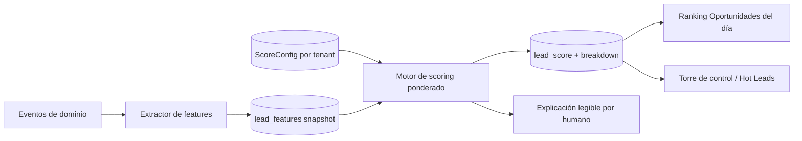

- **Extractor de features**: convierte eventos crudos en señales normalizadas por lead (ej. "velocidad de respuesta = 6 min", "documentación entregada = sí").
- **Motor de scoring**: aplica pesos configurables por factor → produce score + **breakdown** (contribución de cada factor).
- **Explicación**: genera texto natural ("Alto por: presupuesto definido, visita realizada; Baja por: 3 días sin actividad").
- Todo es **event-driven** e **idempotente**.

## 2.3 Factores del score

Score final = suma ponderada de las contribuciones de cada factor, **normalizada a 0–100**. Pesos **sugeridos** (configurables por tenant; deben sumar 100).

| # | Factor | Peso sugerido | Señal / rango | Cómo puntúa (0–100 dentro del factor) |
|---|--------|:------------:|---------------|----------------------------------------|
| 1 | Etapa del pipeline | 20 | Etapa actual | Mapa por etapa: Nuevo=10, 1er contacto=25, Interesado=40, Visita agend.=55, Visita real.=70, Negociación=85, Reserva=95, Escribanía=98 |
| 2 | Presupuesto definido | 12 | sí/no + match c/ propiedad | Definido y realista=100; definido no realista=50; sin definir=0 |
| 3 | Documentación entregada | 10 | % docs requeridos | lineal: docs entregados / requeridos × 100 |
| 4 | Visitas realizadas | 10 | conteo | 0=0, 1=60, 2=85, ≥3=100 |
| 5 | Velocidad de respuesta del cliente | 8 | tiempo medio en responder | <5m=100, <30m=80, <2h=60, <24h=30, ≥24h=10 |
| 6 | Frecuencia de interacción | 8 | msgs/últimos 7d | escala log: 0=0 … ≥10=100 |
| 7 | Cantidad de conversaciones | 7 | hilos activos | 0=0,1=50,2=75,≥3=100 (con techo para evitar spam) |
| 8 | Propiedades consultadas | 7 | distintas propiedades vistas | 1=40, 2–3=80, ≥4=100 (interés amplio) |
| 9 | Tiempo desde primer contacto | 8 | antigüedad del lead | curva: fresco(<3d)=100, tibio(3–7d)=70, frío(7–14d)=40, viejo(>14d)=15 |
| 10 | Tiempo sin actividad (recencia) | 10 | ahora − última interacción | penalizador: 0d=100, 1d=85, 3d=55, 7d=25, ≥14d=5 |

> **Suma de pesos**: 20+12+10+10+8+8+7+7+8+10 = **100**. ✔️
> **Factores 9 y 10** capturan cosas distintas: 9 = *edad total del lead*; 10 = *cuán reciente fue la última señal*. Un lead viejo pero que respondió hoy sigue "caliente" por recencia.

### 2.3.1 Modificadores especiales (opt-in por tenant)

- **Bonus "presupuesto + match propiedad"**: +5 al score final si presupuesto realista coincide con la propiedad consultada.
- **Penalizador "visita cancelada"**: −8 por cada `VisitCancelled` sin reprogramar.
- **Cap de recencia**: si `Tiempo sin actividad ≥ 14d` en etapa temprana → score máximo 40 (evita "falsos calientes").

## 2.4 Recálculo event-driven

El score **no se calcula en batch nocturno** (o no solo): se **recalcula ante los eventos que cambian una feature**.

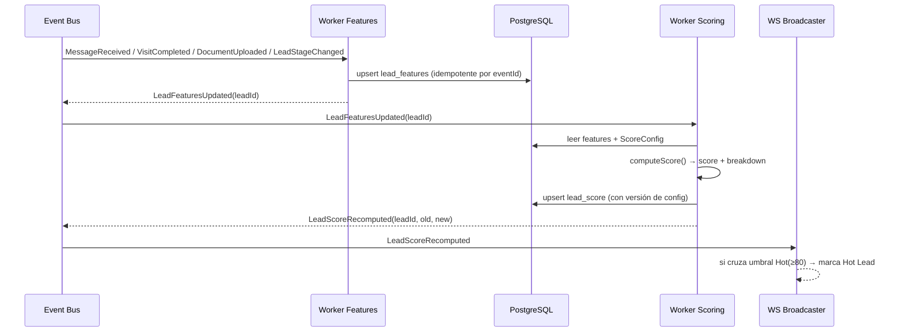

Además: un **cron cada 15 min** re-evalúa **solo el factor recencia** (factor 10) para leads sin eventos recientes (el paso del tiempo también mueve el score, sin que ocurra ningún evento).

## 2.5 Pseudocódigo del cálculo

```ts
type Factor =
  | "stage" | "budget" | "documents" | "visits" | "clientResponseSpeed"
  | "interactionFrequency" | "conversations" | "propertiesViewed"
  | "leadAge" | "inactivity";

interface ScoreConfig {
  tenantId: string;
  version: number;                    // para auditar con qué config se calculó
  weights: Record<Factor, number>;    // suman 100
  hotThreshold: number;               // ej. 80
  warmThreshold: number;              // ej. 60
  modifiers: {
    budgetPropertyMatchBonus: number; // +5
    cancelledVisitPenalty: number;    // -8 por cancelación
    stalledEarlyStageCap: number;     // 40
  };
}

// Cada scorer devuelve 0..100 (la "nota" del factor)
const SCORERS: Record<Factor, (f: LeadFeatures) => number> = {
  stage: (f) => STAGE_MAP[f.stage],                       // tabla 2.3
  budget: (f) => f.budgetDefined ? (f.budgetRealistic ? 100 : 50) : 0,
  documents: (f) => f.docsRequired === 0 ? 0 : clamp((f.docsDelivered / f.docsRequired) * 100),
  visits: (f) => f.visitsDone >= 3 ? 100 : [0,60,85][f.visitsDone] ?? 100,
  clientResponseSpeed: (f) => speedBucket(f.avgClientResponseMin),
  interactionFrequency: (f) => logScale(f.messagesLast7d, 10),
  conversations: (f) => f.openConversations >= 3 ? 100 : [0,50,75][f.openConversations],
  propertiesViewed: (f) => f.distinctPropsViewed >= 4 ? 100 : f.distinctPropsViewed >= 2 ? 80 : f.distinctPropsViewed === 1 ? 40 : 0,
  leadAge: (f) => ageCurve(f.daysSinceFirstContact),      // fresco→viejo
  inactivity: (f) => recencyPenalty(f.daysSinceLastActivity),
};

function computeScore(f: LeadFeatures, cfg: ScoreConfig): ScoreResult {
  const breakdown: BreakdownItem[] = [];
  let weightedSum = 0;

  for (const factor of Object.keys(cfg.weights) as Factor[]) {
    const raw = SCORERS[factor](f);                 // 0..100
    const weight = cfg.weights[factor];             // 0..100 (participación)
    const contribution = (raw * weight) / 100;      // aporte al score final
    weightedSum += contribution;
    breakdown.push({ factor, raw, weight, contribution });
  }

  let score = weightedSum;                           // ya está en 0..100 (Σweight=100)

  // Modificadores
  if (f.budgetDefined && f.budgetRealistic && f.budgetMatchesViewedProperty)
    score += cfg.modifiers.budgetPropertyMatchBonus;
  score -= f.cancelledVisitsUnrescheduled * cfg.modifiers.cancelledVisitPenalty;

  // Cap de "falso caliente"
  if (isEarlyStage(f.stage) && f.daysSinceLastActivity >= 14)
    score = Math.min(score, cfg.modifiers.stalledEarlyStageCap);

  score = clamp(Math.round(score), 0, 100);

  const label =
    score >= cfg.hotThreshold ? "HOT"
    : score >= cfg.warmThreshold ? "WARM"
    : "COLD";

  return {
    score, label, configVersion: cfg.version,
    breakdown: breakdown.sort((a, b) => b.contribution - a.contribution),
    explanation: explain(breakdown, score, label),   // texto natural
    suggestedAction: suggestAction(f, score, label),  // ver 2.7
  };
}

function explain(breakdown: BreakdownItem[], score: number, label: string): string {
  const top = breakdown.slice(0, 2).map(b => LABELS[b.factor]);
  const drags = breakdown.filter(b => b.raw < 40).slice(0, 2).map(b => LABELS[b.factor]);
  return `Score ${score} (${label}). Sube por: ${top.join(", ")}.` +
         (drags.length ? ` Frena por: ${drags.join(", ")}.` : "");
}
```

## 2.6 Ejemplo trabajado

**Lead "María G."** — features:

| Factor | Valor | Nota (0–100) | Peso | Contribución |
|--------|-------|:-----------:|:----:|:-----------:|
| Etapa | Negociación | 85 | 20 | 17.0 |
| Presupuesto | Definido y realista | 100 | 12 | 12.0 |
| Documentación | 3/4 entregados | 75 | 10 | 7.5 |
| Visitas realizadas | 2 | 85 | 10 | 8.5 |
| Velocidad respuesta | ~8 min | 80 | 8 | 6.4 |
| Frecuencia interacción | 6 msgs/7d | 78 | 8 | 6.24 |
| Conversaciones | 1 | 50 | 7 | 3.5 |
| Propiedades consultadas | 2 | 80 | 7 | 5.6 |
| Antigüedad (1er contacto) | 5 días | 70 | 8 | 5.6 |
| Inactividad (recencia) | 1 día | 85 | 10 | 8.5 |
| **Subtotal** | | | **100** | **80.84** |

Modificadores: presupuesto realista **coincide** con propiedad consultada → **+5**. Sin visitas canceladas. No aplica cap.

**Score final = round(80.84 + 5) = 86 → HOT 🔥**

**Explicación generada**: *"Score 86 (HOT). Sube por: Etapa (Negociación), Presupuesto definido. Frena por: nada crítico."*

**Acción sugerida**: *"Enviar propuesta formal hoy — está en negociación con presupuesto realista y respondió hace 1 día."*

## 2.7 🔥 Oportunidades del día

Sección diaria (y en vivo) que muestra **los leads con mayor probabilidad de cierre** ordenados por score, con **motivo** y **acción sugerida** concreta. Es la lista de "a quién le dedico las próximas horas".

### 2.7.1 Reglas de acción sugerida (mapping)

| Rango score / condición | Acción sugerida | Ejemplo |
|-------------------------|-----------------|---------|
| ≥ 90 | **Llamar hoy** | "Score 94 → Llamar hoy: negociación avanzada, respondió hace 2h" |
| 80–89 | **Enviar propuesta** | "Score 89 → Enviar propuesta: presupuesto definido, 2 visitas" |
| 70–79 | **Programar seguimiento** | "Score 82 → Programar seguimiento: interesado, falta documentación" |
| Hot pero cayendo (Δ score < 0) | **Recuperar** | "Score 81 ↓ → Llamar: bajó por 3 días sin actividad" |
| Warm con visita hecha sin propuesta | **Enviar propuesta** | "Score 74 → visita realizada hace 2d, sin propuesta" |

### 2.7.2 UI/UX

```
🔥 OPORTUNIDADES DEL DÍA (7)                                   [Ver todas] [Config score ⚙]
┌───────────────────────────────────────────────────────────────────────────────────────┐
│ 94  María G.   Negociación · Depto Palermo   ▸ Sube: etapa, presupuesto   ☎ Llamar hoy  │
│ 89  Pedro R.   Visita real. · Casa Tigre     ▸ 2 visitas, doc 3/4         📄 Enviar prop.│
│ 82  Ana L.     Interesado · Loft Centro      ▸ falta documentación        📅 Seguimiento │
│ 81↓ Jorge M.   Negociación · PH Boedo        ▸ bajó: 3d sin actividad     ☎ Recuperar   │
│ ...                                                                                       │
└───────────────────────────────────────────────────────────────────────────────────────┘
```

- Cada fila: score + tendencia (▲/▼), lead, etapa/propiedad, **motivo** (breakdown top), **botón de acción**.
- Click en score → abre el **breakdown completo** (tabla de factores y contribuciones) → transparencia total.
- El asesor ve las suyas; el gerente ve las de su equipo; el dueño, global.

## 2.8 Datos que usa

- **Lee**: `lead_features` (snapshot por lead), `score_config` (config por tenant), `leads`, `visits`, `messages`, `documents`, `properties`.
- **Escribe**: `lead_score` (score, label, breakdown JSONB, configVersion, computedAt), `lead_score_history` (para tendencia Δ y auditoría).

## 2.9 Eventos

- **Consume**: `LeadStageChanged`, `MessageReceived`, `MessageSent`, `VisitScheduled`, `VisitCompleted`, `VisitCancelled`, `DocumentUploaded`, `ProposalSent`, `LeadFeaturesUpdated`, tick de recencia.
- **Emite**: `LeadFeaturesUpdated`, `LeadScoreRecomputed` (con `oldScore`, `newScore`, `crossedHotThreshold`).

## 2.10 Configurabilidad y explicabilidad (requisitos)

- Los **pesos**, **umbrales** (hot/warm) y **modificadores** se editan desde una UI de configuración (rol Dueño). Validación: Σ pesos = 100.
- Cada score guarda **con qué `configVersion`** se calculó (auditoría y reproducibilidad).
- Todo score muestra su **breakdown** y una **explicación en lenguaje natural**. Nunca un número "porque sí".
- Cambiar la config **no reescribe el historial**; dispara un recálculo de los scores vigentes con la nueva versión.

## 2.11 Criterios de aceptación

- [ ] El score es 0–100 y siempre viene con breakdown por factor + explicación en texto.
- [ ] Los pesos/umbrales/modificadores son configurables por tenant; se valida Σpesos=100.
- [ ] El score se recalcula ante eventos relevantes en p95 < 3s desde el evento.
- [ ] El factor recencia se re-evalúa por cron aunque no ocurran eventos.
- [ ] Cada score persiste la `configVersion` usada.
- [ ] "Oportunidades del día" ordena por score, muestra motivo y acción sugerida coherente con la tabla 2.7.1.
- [ ] Click en un score abre el breakdown completo (transparencia).
- [ ] Idempotencia: reprocesar un evento no cambia el resultado ni duplica historial.

---

# Módulo 3 — Motor de Automatizaciones y Seguimientos Automáticos

## 3.1 Propósito

El asesor **no debería tener que acordarse** de hacer seguimiento. El motor **detecta el momento** en que corresponde un seguimiento y lo ejecuta: **automáticamente** o **con aprobación** del asesor (según config). Ataca el problema #1 de las inmobiliarias: **leads que se enfrían y se pierden por falta de seguimiento**.

El sistema detecta y actúa sobre situaciones como:
- **Cliente sin responder** (nosotros escribimos, no contestó en X tiempo).
- **Visita realizada** (hay que pedir feedback / avanzar).
- **Propuesta enviada** (sin respuesta → recordatorio).
- **Documentación pendiente** (falta docs para avanzar).
- **Reserva pendiente** (hay que confirmar/pagar seña).

## 3.2 Modelo de reglas: Trigger → Condición → Acción

Cada automatización es una **regla declarativa**:

```
WHEN <trigger>            (un evento de dominio o un tick temporal)
IF   <condición>          (predicados sobre el estado del lead/conversación)
THEN <acción(es)>         (enviar mensaje, crear tarea, notificar, cambiar etapa…)
WITH <política>           (auto | requiere_aprobación, ventana horaria, cooldown, límites)
```

### 3.2.1 Esquema de la entidad `AutomationRule`

```ts
interface AutomationRule {
  id: string;
  tenantId: string;
  branchId?: string;              // opcional: scope por sucursal
  name: string;
  enabled: boolean;
  trigger: Trigger;               // ver 3.2.2
  conditions: Condition[];        // AND lógico (grupos OR opcionales)
  actions: Action[];              // ejecutadas en orden
  mode: "auto" | "approval";      // auto-ejecuta o requiere OK del asesor
  timing: {
    delay?: Duration;             // esperar antes de evaluar/ejecutar (ej. 24h)
    businessHoursOnly: boolean;   // respeta horario laboral del tenant
    cooldown?: Duration;          // no repetir sobre el mismo lead antes de X
    maxPerLead?: number;          // tope de ejecuciones por lead
    quietHours?: [string, string];// ej. ["21:00","09:00"] no enviar de noche
  };
  priority: number;               // desempate si varias aplican
}

type Trigger =
  | { kind: "event"; event: DomainEvent }         // ej. VisitCompleted
  | { kind: "temporal"; after: Duration; anchor: AnchorEvent }; // ej. 24h después de MessageSent

type Condition =
  | { field: "lead.stage"; op: "in" | "eq"; value: any }
  | { field: "lead.score"; op: "gte" | "lte"; value: number }
  | { field: "lead.lastInboundAgeMin"; op: "gte"; value: number }
  | { field: "conversation.awaitingClient"; op: "eq"; value: boolean }
  | { field: "documents.pendingCount"; op: "gt"; value: number }
  | { field: "visit.hasFeedback"; op: "eq"; value: boolean }
  | { field: "custom"; expr: string };

type Action =
  | { kind: "sendWhatsAppTemplate"; templateId: string; vars?: Record<string,string> }
  | { kind: "createTask"; title: string; assignee: "owner" | "advisor"; dueIn: Duration }
  | { kind: "notifyAdvisor"; channel: "inapp" | "push" }
  | { kind: "changeStage"; to: PipelineStage }         // usar con cuidado
  | { kind: "raiseAlert"; alertType: string; priority: Priority }
  | { kind: "waitFor"; event: DomainEvent; timeout: Duration; onTimeout: Action };
```

### 3.2.2 Ejemplos de reglas

| Regla | WHEN | IF | THEN | Modo |
|-------|------|----|------|------|
| **Cliente sin responder** | temporal: 24h después del último `MessageSent` | `conversation.awaitingClient = true` **y** `lead.stage in [Interesado, Negociación]` | `sendWhatsAppTemplate("reengancha")` + `notifyAdvisor` | approval |
| **Post-visita** | `VisitCompleted` | `visit.hasFeedback = false` | `createTask("Registrar feedback de visita", advisor, dueIn 2h)` + `sendWhatsAppTemplate("gracias_visita")` | auto |
| **Propuesta sin respuesta** | temporal: 48h después de `ProposalSent` | `conversation.awaitingClient = true` | `sendWhatsAppTemplate("recordatorio_propuesta")` + `notifyAdvisor` | approval |
| **Documentación pendiente** | temporal: 24h después de `LeadStageChanged→Negociación` | `documents.pendingCount > 0` | `sendWhatsAppTemplate("pedido_docs")` + `createTask("Seguir docs", advisor, 1d)` | auto |
| **Reserva pendiente** | `ReservationCreated` | siempre | `createTask("Confirmar seña", advisor, 4h)` + `sendWhatsAppTemplate("instrucciones_sena")` | auto |
| **Lead se enfría** | `LeadScoreRecomputed` | `newScore < 60` **y** `oldScore >= 60` | `raiseAlert("lead_cooling", ALTA)` + `notifyAdvisor` | auto |

## 3.3 Máquina de la automatización (estados de una ejecución)

Cada vez que un trigger dispara, se crea una **ejecución** (`AutomationRun`) que atraviesa una máquina de estados:

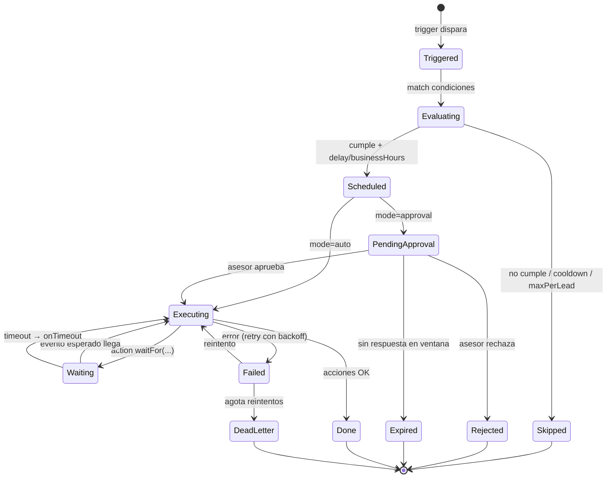

> **Cancelación reactiva**: si el cliente **responde** mientras una regla "cliente sin responder" está `Scheduled`/`PendingApproval`, el `MessageReceived` **cancela** la ejecución (ya no tiene sentido). El motor escucha eventos de invalidación por regla.

## 3.4 Flujo de ejecución (secuencia)

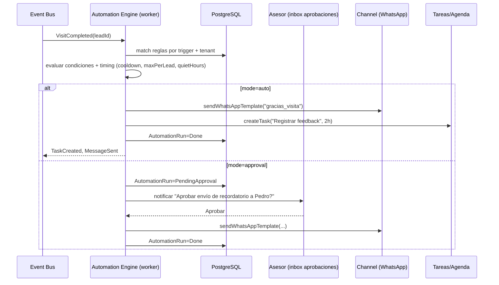

## 3.5 Plantillas de mensajes

Las plantillas viven en `message_templates` y, cuando son de WhatsApp proactivo (fuera de la ventana de 24h), deben estar **aprobadas por Meta** (WhatsApp Business templates). Soportan variables `{{var}}`.

| templateId | Uso | Texto (rioplatense) |
|-----------|-----|---------------------|
| `reengancha` | Cliente sin responder | "Hola {{nombre}}! Quería saber si seguís interesado/a en {{propiedad}}. ¿Coordinamos una visita o te paso más info? 😊" |
| `gracias_visita` | Post-visita | "Gracias por visitar {{propiedad}}, {{nombre}}! ¿Qué te pareció? Cualquier duda me escribís y avanzamos." |
| `recordatorio_propuesta` | Propuesta sin respuesta | "Hola {{nombre}}, te había pasado la propuesta por {{propiedad}}. ¿La pudiste ver? Quedo atento/a para lo que necesites." |
| `pedido_docs` | Documentación pendiente | "Hola {{nombre}}! Para avanzar con {{propiedad}} necesitaríamos {{docs_faltantes}}. ¿Te queda cómodo enviarlos por acá?" |
| `instrucciones_sena` | Reserva pendiente | "¡Genial {{nombre}}! Para dejar reservada {{propiedad}} el próximo paso es la seña. Te paso los datos: {{datos_sena}}." |

> **UI de plantillas**: editor con preview, variables detectadas automáticamente, estado de aprobación Meta, y categoría (utility/marketing) para cumplir políticas de WhatsApp.

## 3.6 Integración con WhatsApp y con Tareas

- **WhatsApp**: la acción `sendWhatsAppTemplate` pasa por el **puerto `Channel`** (mismo puerto del Módulo 5). Si el lead está **dentro de la ventana de 24h** (respondió hace <24h), puede enviarse texto libre; si está **fuera**, debe usarse una **plantilla aprobada**. El motor decide automáticamente.
- **Tareas/Agenda**: `createTask` crea una entrada en `tasks` con `dueAt`, visible en la agenda del asesor y en el bloque "Seguimientos pendientes" de la Torre. Al completarse emite `TaskCompleted`.
- **Aprobaciones**: cuando `mode=approval`, se genera un ítem en la **bandeja de aprobaciones** del asesor (in-app + push). Timeout configurable (ej. 2h) → `Expired`.

## 3.7 UI/UX

- **Constructor de reglas** (rol Dueño/Gerente): builder visual Trigger → Condición → Acción, con plantillas predefinidas ("Recetas": *Post-visita*, *Cliente frío*, *Docs pendientes*).
- **Bandeja de aprobaciones** (Asesor): lista de acciones propuestas con preview del mensaje, botones Aprobar / Editar / Rechazar.
- **Timeline por lead**: en la ficha del lead se ve qué automatizaciones se dispararon y cuándo (auditoría).
- **Panel de salud**: reglas más disparadas, tasa de aprobación, mensajes enviados, conversiones atribuibles.

## 3.8 Datos que usa

- **Lee**: `automation_rules`, `leads`, `conversations`, `messages`, `visits`, `documents`, `message_templates`, `business_hours`.
- **Escribe**: `automation_runs` (estado, timestamps, resultado), `tasks`, `outbox` (eventos), `approvals`.

## 3.9 Eventos

- **Consume**: `VisitCompleted`, `ProposalSent`, `LeadStageChanged`, `ReservationCreated`, `DocumentUploaded`, `MessageSent`, `MessageReceived` (para cancelación), `LeadScoreRecomputed`, ticks temporales.
- **Emite**: `MessageSent` (vía Channel), `TaskCreated`, `TaskCompleted`, `AlertRaised`, `AutomationRunStarted/Completed/Failed`.

## 3.10 Reglas de seguridad y anti-spam

- **Cooldown** y **maxPerLead** obligatorios para evitar bombardear al cliente.
- **quietHours** por defecto (no enviar de 21:00 a 09:00).
- **Cumplimiento WhatsApp**: nunca enviar marketing fuera de ventana sin plantilla utility aprobada; respetar opt-out ("BAJA"/"STOP" desuscribe y frena toda automatización sobre ese contacto).
- **Idempotencia**: cada `AutomationRun` tiene clave `(ruleId, leadId, triggerEventId)`; reprocesar no duplica envíos.

## 3.11 Criterios de aceptación

- [ ] Se pueden crear reglas Trigger→Condición→Acción desde UI, con modo auto o approval.
- [ ] Las reglas temporales (delay/anchor) disparan correctamente respetando horario laboral y quietHours.
- [ ] La respuesta del cliente cancela automáticamente los seguimientos "sin respuesta" pendientes.
- [ ] Cooldown, maxPerLead y opt-out ("BAJA") se respetan; no hay spam.
- [ ] `mode=approval` genera ítem en bandeja del asesor; timeout → Expired sin enviar.
- [ ] El motor elige texto libre vs. plantilla aprobada según la ventana de 24h de WhatsApp.
- [ ] Cada ejecución es idempotente y auditable en el timeline del lead.
- [ ] Fallos en el envío reintenta con backoff y cae a dead-letter tras N intentos.

---

# Módulo 4 — Distribución Inteligente de Leads

## 4.1 Propósito

Cuando entra un **lead nuevo** (de WhatsApp, landing o carga manual), el sistema decide **a qué asesor asignarlo** de forma **automática y configurable**, para que ningún lead quede huérfano y cada uno vaya al asesor con mayor probabilidad de convertirlo. Si el asesor asignado **no responde a tiempo**, se **reasigna automáticamente**. Meta: **primer contacto rápido** (velocidad = conversión).

Criterios combinables de asignación: **menor carga**, **zona**, **tipo de propiedad**, **rendimiento del asesor**, **horario/disponibilidad**, **sucursal**.

## 4.2 Modelo `AssignmentRule` (política de distribución)

```ts
interface AssignmentPolicy {
  id: string;
  tenantId: string;
  branchId?: string;
  strategy: "weighted_score" | "round_robin" | "load_balanced";
  // Pesos de los criterios (para strategy=weighted_score). Suman 100.
  weights: {
    load: number;          // menor carga (más peso = prioriza libres)
    zone: number;          // match de zona/geografía
    propertyType: number;  // especialidad por tipo (depto/casa/comercial/campo)
    performance: number;   // conversión histórica del asesor
    availability: number;  // conectado + dentro de horario
  };
  eligibility: {
    requireOnline: boolean;         // solo asesores conectados
    requireBusinessHours: boolean;  // solo en horario
    maxActiveLeads: number;         // techo de carga (saturación)
    branchScoped: boolean;          // solo asesores de la sucursal del lead
  };
  reassignment: {
    firstResponseSLA: Duration;     // ej. 10 min
    escalation: "next_best" | "round_robin" | "manager_pool";
    maxReassignments: number;       // antes de escalar a gerente
    notifyManagerAfter: number;     // reasignaciones antes de avisar al gerente
  };
  fallback: {
    whenAllSaturated: "manager_pool" | "queue" | "relax_maxActive";
    whenOutOfHours: "queue_until_open" | "assign_on_call" | "bot_holds";
  };
}
```

## 4.3 Algoritmo de scoring de asesores

Para cada lead, se calcula un **AssignmentScore** por asesor **elegible**, y se asigna al de mayor score (con desempate por menor carga y por antigüedad de última asignación para repartir).

```ts
function pickAdvisor(lead: Lead, advisors: Advisor[], p: AssignmentPolicy): Assignment {
  const eligible = advisors.filter(a => isEligible(a, lead, p));   // ver 4.3.1

  if (eligible.length === 0) return handleFallback(lead, p);       // ver 4.5

  const scored = eligible.map(a => {
    const load = loadScore(a, p.eligibility.maxActiveLeads);       // 100 = libre, 0 = saturado
    const zone = zoneMatch(a.zones, lead.zone);                    // 100 si cubre la zona
    const ptype = propertyTypeMatch(a.specialties, lead.propertyType);
    const perf = performanceScore(a.conversionRate30d);            // normalizado 0..100
    const avail = availabilityScore(a);                            // online + horario

    const total =
      (load  * p.weights.load +
       zone  * p.weights.zone +
       ptype * p.weights.propertyType +
       perf  * p.weights.performance +
       avail * p.weights.availability) / 100;                      // 0..100

    return { advisor: a, total, load };
  });

  scored.sort((x, y) =>
    y.total - x.total ||                       // mayor score
    y.load  - x.load  ||                       // desempate: más libre
    x.advisor.lastAssignedAt - y.advisor.lastAssignedAt); // reparto justo

  return { advisorId: scored[0].advisor.id, reason: explainPick(scored[0]) };
}
```

### 4.3.1 Elegibilidad

```ts
function isEligible(a: Advisor, lead: Lead, p: AssignmentPolicy): boolean {
  if (p.eligibility.requireOnline && !a.online) return false;
  if (p.eligibility.requireBusinessHours && !inBusinessHours(a)) return false;
  if (p.eligibility.branchScoped && a.branchId !== lead.branchId) return false;
  if (a.activeLeads >= p.eligibility.maxActiveLeads) return false; // saturado
  return true;
}
```

### 4.3.2 Ejemplo de scoring

Lead: zona **Palermo**, tipo **Depto**, sucursal **Centro**. Política `weighted_score` con pesos load=30, zone=25, propertyType=15, performance=20, availability=10.

| Asesor | load | zone | ptype | perf | avail | Total |
|--------|:---:|:---:|:----:|:---:|:----:|:-----:|
| Lucas | 90 | 100 | 100 | 70 | 100 | **91.0** |
| Sofía | 40 | 100 | 100 | 95 | 100 | 79.5 |
| Ana | 100 | 0 | 60 | 60 | 100 | 63.0 |

→ **Asignado a Lucas** (score 91). Motivo: "libre, cubre Palermo, especialista en deptos".

## 4.4 Diagrama de decisión

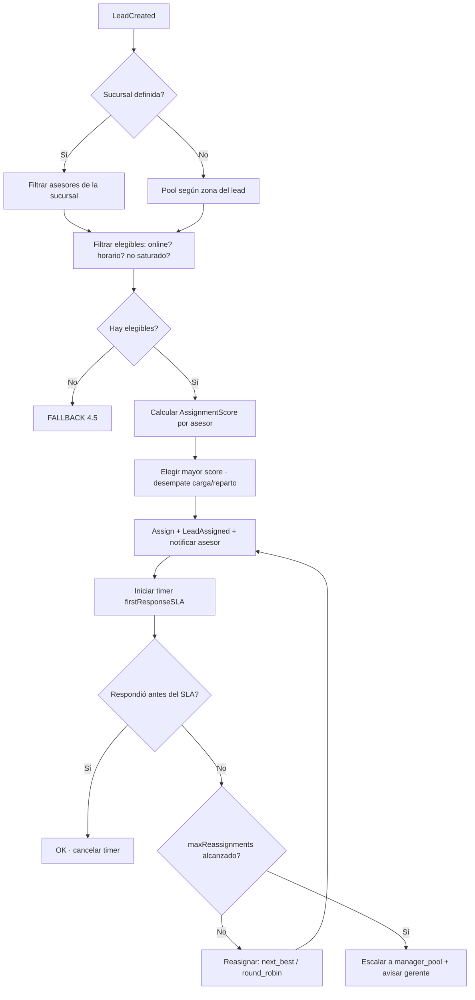

## 4.5 Reasignación por no-respuesta (secuencia)

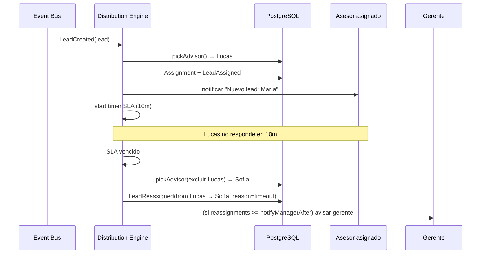

## 4.6 Casos borde

| Caso | Comportamiento |
|------|----------------|
| **Todos saturados** (`activeLeads >= max`) | Según `fallback.whenAllSaturated`: `manager_pool` (va a cola del gerente), `queue` (espera a que alguien se libere), o `relax_maxActive` (relaja el techo temporalmente y asigna al menos cargado). |
| **Fuera de horario** | Según `fallback.whenOutOfHours`: `queue_until_open` (se encola y asigna al abrir), `assign_on_call` (asesor de guardia), o `bot_holds` (el bot de WhatsApp atiende y agenda; se asigna al abrir). |
| **Lead sin zona/tipo** | Se ignoran esos criterios (peso efectivo 0) y se decide por load+performance+availability. |
| **Un solo asesor elegible** | Asignación directa (sin scoring). |
| **Asesor se desconecta tras asignar** | El SLA sigue; al vencer, reasigna a otro online. |
| **Lead duplicado** (mismo teléfono) | Se detecta por `phone` normalizado; se **fusiona** al lead existente y se mantiene su asesor (no se reasigna). Emite `LeadMerged`. |
| **Rebote infinito** (nadie responde) | `maxReassignments` corta el ciclo → escala a `manager_pool` y levanta `AlertRaised("lead_unassigned", CRÍTICA)`. |

## 4.7 UI/UX

- **Config de política** (Dueño): estrategia, pesos por criterio (Σ=100), SLA, escalamiento, fallbacks. Preview: "con esta config, un lead de Palermo/Depto iría a…".
- **Vista de carga del equipo**: barra por asesor (leads activos vs. max), quién está online, quién saturado.
- **Log de asignaciones**: por lead, cadena de asignaciones/reasignaciones con motivo (auditoría).
- **Override manual**: el gerente puede reasignar desde la Torre; emite `LeadReassigned(reason=manual)`.

## 4.8 Datos que usa

- **Lee**: `advisors` (zonas, especialidades, conversionRate, online, activeLeads, branchId), `assignment_policies`, `business_hours`, `leads`.
- **Escribe**: `assignments`, `assignment_log`, `leads.assignedAdvisorId`, `outbox`.

## 4.9 Eventos

- **Consume**: `LeadCreated`, `MessageReceived` (primer respuesta cancela SLA), `AdvisorConnected/Disconnected`, tick de SLA.
- **Emite**: `LeadAssigned`, `LeadReassigned`, `LeadMerged`, `AlertRaised("lead_unassigned")`.

## 4.10 Criterios de aceptación

- [ ] Un lead nuevo se asigna automáticamente en p95 < 5s según la política configurada.
- [ ] La política es configurable (estrategia + pesos Σ=100 + eligibility + fallbacks).
- [ ] Si el asesor no responde dentro del `firstResponseSLA`, se reasigna automáticamente.
- [ ] Respeta `maxActiveLeads`, `requireOnline`, `requireBusinessHours`, `branchScoped`.
- [ ] Casos borde (todos saturados, fuera de horario, sin zona, duplicado) resueltos por fallback definido.
- [ ] Cadena de (re)asignaciones auditable con motivo por lead.
- [ ] `maxReassignments` evita loops; escala a gerente + alerta.
- [ ] Override manual del gerente funciona y queda registrado.

---

# Módulo 5 — WhatsApp Business + Landing Pages con Chat Inteligente

## 5.1 Propósito

Convertir cada consulta en un **lead capturado, clasificado y atendido** sin fricción, en el canal donde está el cliente (**WhatsApp**) y en la vitrina de cada propiedad (**Landing Page**). Cada asesor conecta **su propio número de WhatsApp Business**, y el sistema:

- Responde **consultas frecuentes** (precio, disponibilidad, ubicación, requisitos).
- **Detecta intención** (consulta info / quiere visita / negocia / soporte).
- **Identifica la propiedad** consultada.
- **Crea el lead**, lo **clasifica y etiqueta**.
- **Guarda la conversación** completa.
- **Completa info del CRM** (presupuesto, zona buscada, timing).
- **Ofrece turnos y agenda visitas**.
- **Deriva al asesor** cuando hace falta un humano.

> **IA solo operativa**: la IA responde/clasifica/resume/prioriza. Nunca genera imágenes ni toma decisiones comerciales irreversibles (precio, aceptar oferta) sin humano.

## 5.2 Arquitectura: puerto `Channel` (hexagonal)

WhatsApp entra **detrás de un puerto `Channel`**. El dominio no sabe que es WhatsApp: habla con una interfaz. Esto permite testear y agregar canales (Instagram, web chat) sin tocar el core.

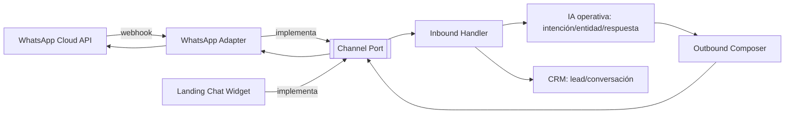

```ts
interface ChannelPort {
  sendText(to: Contact, text: string): Promise<MessageId>;
  sendTemplate(to: Contact, templateId: string, vars: Vars): Promise<MessageId>;
  sendInteractive(to: Contact, buttons: Button[]): Promise<MessageId>;  // ej. slots de visita
  onInbound(handler: (msg: InboundMessage) => Promise<void>): void;
}
```

### 5.2.1 Multi-número por asesor

- Cada asesor conecta su **WhatsApp Business** (phone number ID + token) → guardado cifrado en `channel_credentials`.
- El **routing inbound** usa el `phone_number_id` del webhook para saber a qué asesor/tenant pertenece el mensaje.
- Cumplimiento: ventana de 24h, plantillas aprobadas fuera de ventana, opt-out.

## 5.3 Flujo WhatsApp inbound (secuencia)

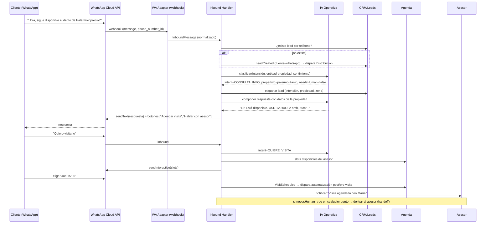

### 5.3.1 Detección de intención y entidad

La IA operativa clasifica cada mensaje en:

| Intent | Ejemplo | Acción del bot |
|--------|---------|----------------|
| `CONSULTA_INFO` | "¿cuánto sale?" | Responder con datos de la propiedad |
| `DISPONIBILIDAD` | "¿sigue disponible?" | Estado + CTA visita |
| `QUIERE_VISITA` | "quiero verlo" | Ofrecer slots + agendar |
| `NEGOCIACION` | "¿aceptan menos?" | **Handoff a asesor** (no negocia el bot) |
| `REQUISITOS` | "¿qué necesito para alquilar?" | Responder requisitos frecuentes |
| `SOPORTE/OTRO` | fuera de dominio | Handoff a asesor |

- **Identificación de propiedad**: por link de landing (query param `?p=<propertyId>`), por código en el mensaje, o por matching semántico (zona + tipo + precio mencionados).
- **Enriquecimiento CRM**: la IA **resume** la conversación y extrae `presupuesto`, `zona buscada`, `timing`, `tipo`, y los escribe en la ficha del lead.

### 5.3.2 Handoff a humano

Se deriva al asesor cuando: `intent ∈ {NEGOCIACION, SOPORTE}`, el cliente lo pide ("quiero hablar con alguien"), baja confianza de la IA (< umbral), o hay palabras sensibles. En handoff: el bot avisa "Te paso con {{asesor}}", marca la conversación `humanNeeded`, notifica al asesor y **pausa las respuestas automáticas** en ese hilo.

## 5.4 Landing Pages por propiedad

Cada propiedad tiene una **landing pública** optimizada para conversión.

### 5.4.1 Componentes

- **Galería** de fotos (carrusel) + **videos** + **tour**.
- **Mapa** con ubicación (aprox. por privacidad).
- **Descripción** y **características** (ambientes, m², antigüedad, expensas, amenities).
- **Formulario** de contacto (nombre, teléfono, mensaje) → `LeadCreated`.
- **Botón WhatsApp** (deep link `wa.me` con `?p=<propertyId>` prellenado) → abre chat con el asesor **con contexto de la propiedad**.
- **Chat inteligente** embebido (mismo `ChannelPort`, canal `web`) que responde con la info de la propiedad y **deriva al asesor**.
- **CTAs** claros ("Agendar visita", "Consultar por WhatsApp", "Ver similares").
- **Propiedades relacionadas** (misma zona/rango de precio/tipo).

### 5.4.2 Wireframe conceptual (landing)

```
┌───────────────────────────────────────────────────────────────────────┐
│  [◀ ▶  GALERÍA + VIDEO ]                          🏷 USD 120.000        │
│                                                    Depto · Palermo · 2amb│
├───────────────────────────────────────────┬───────────────────────────┤
│ CARACTERÍSTICAS                            │  📅 Agendar visita         │
│ 55 m² · 2 amb · 1 baño · 3° piso · c/balcón│  💬 Consultar por WhatsApp │
│ Expensas $45.000 · Apto crédito            │  ┌───────────────────────┐ │
│                                            │  │  CHAT INTELIGENTE      │ │
│ DESCRIPCIÓN                                │  │  "¿Precio? ¿Disponible?│ │
│ Luminoso, excelente ubicación...           │  │   ¿Coordino visita?"   │ │
│                                            │  │  [Escribí tu consulta] │ │
│ 🗺 MAPA (zona Palermo)                      │  └───────────────────────┘ │
├───────────────────────────────────────────┴───────────────────────────┤
│ FORMULARIO: [Nombre][Teléfono][Mensaje]  [Quiero que me contacten]     │
├────────────────────────────────────────────────────────────────────────┤
│ PROPIEDADES RELACIONADAS  [Depto Palermo 3amb] [Depto Villa Crespo] ... │
└────────────────────────────────────────────────────────────────────────┘
```

### 5.4.3 Flujo Landing + chat (secuencia)

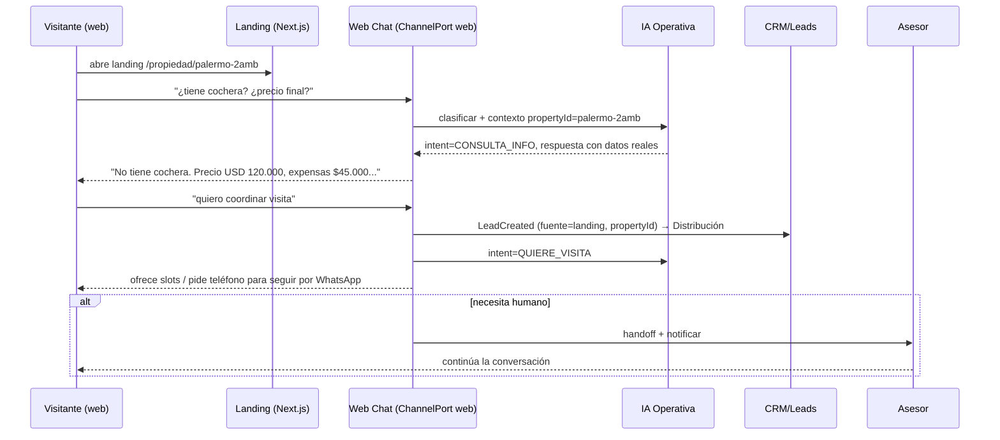

## 5.5 UI/UX

- **Onboarding de conexión WhatsApp**: asistente que guía al asesor a conectar su número (embedded signup de Meta), estados: no conectado / verificando / activo / error.
- **Inbox unificado del asesor**: todas las conversaciones (WhatsApp + web chat) en una bandeja, con etiquetas (intención, propiedad, score del lead), indicador de "atendido por bot / esperando humano".
- **Editor de FAQs y knowledge**: el dueño carga respuestas frecuentes y políticas; la IA responde en base a eso + datos de la propiedad (evita alucinar).
- **Landing builder**: se autogenera desde los datos de la propiedad; personalizable (orden de secciones, CTAs).

## 5.6 Datos que usa

- **Lee**: `properties`, `property_media`, `channel_credentials`, `faqs`, `conversations`, `messages`, `advisors`, `business_hours`.
- **Escribe**: `conversations`, `messages`, `leads`, `lead_tags`, `visits`, `outbox`.

## 5.7 Eventos

- **Consume**: webhooks inbound (→ `MessageReceived`), `VisitScheduled` (confirmaciones), respuestas de la IA.
- **Emite**: `MessageReceived`, `MessageSent`, `ConversationOpened`, `LeadCreated`, `LeadTagged`, `VisitScheduled`, `HumanHandoffRequested`.

## 5.8 IA operativa: límites y garantías

- **Grounding**: la IA responde solo con datos de la propiedad + FAQs cargadas. Si no sabe → deriva, no inventa.
- **No negocia** precio ni condiciones; eso es handoff obligatorio.
- **No imágenes**: la IA nunca genera imágenes (solo usa las cargadas).
- **Resumen/priorización**: puede resumir la conversación para el asesor y sugerir prioridad, pero el asesor decide.
- **Trazabilidad**: cada respuesta del bot queda logueada y marcada como generada por IA.

## 5.9 Seguridad y cumplimiento

- **Credenciales cifradas** (tokens de WhatsApp) en reposo; nunca en el front.
- **Verificación de webhook** (firma `X-Hub-Signature-256`) y validación del `phone_number_id`.
- **Multi-tenant**: aislamiento por `tenantId`; un webhook nunca cruza tenants.
- **Opt-out**: "BAJA"/"STOP" → desuscribe y frena bot + automatizaciones.
- **Rate limiting** en el widget web (anti-abuso) y validación del formulario (anti-bot/spam).
- **Ventana de 24h** y plantillas aprobadas respetadas por el Outbound Composer.

## 5.10 Criterios de aceptación

- [ ] Un asesor conecta su propio número de WhatsApp Business y recibe/responde por la plataforma.
- [ ] Un mensaje inbound crea/asocia un lead, lo clasifica (intención), identifica la propiedad y guarda la conversación.
- [ ] El bot responde FAQs con datos reales de la propiedad y **no inventa** (grounding); deriva cuando no sabe o hay negociación.
- [ ] El bot ofrece slots y agenda visitas (`VisitScheduled`).
- [ ] Handoff a humano funciona: pausa el bot, notifica al asesor, marca `humanNeeded`.
- [ ] La landing por propiedad muestra galería, video, mapa, características, formulario, botón WhatsApp con contexto, chat, CTAs y relacionadas.
- [ ] El chat de la landing usa el mismo `ChannelPort` y crea leads con `fuente=landing` + `propertyId`.
- [ ] Webhook verificado por firma; aislamiento multi-tenant estricto; tokens cifrados.
- [ ] Opt-out ("BAJA") frena bot y automatizaciones sobre ese contacto.
- [ ] Toda respuesta de IA queda trazada; la IA nunca genera imágenes.

---

## Apéndice A — Diccionario de entidades (referencia de consistencia)

| Entidad | Descripción breve |
|---------|-------------------|
| `Lead` | Cliente potencial; centro del sistema. Tiene etapa, asesor, score, tags, fuente. |
| `LeadFeatures` | Snapshot de señales normalizadas para el scoring. |
| `LeadScore` | Score 0–100 + breakdown + label (HOT/WARM/COLD) + configVersion. |
| `ScoreConfig` | Config de pesos/umbrales/modificadores del scoring por tenant. |
| `Conversation` | Hilo de mensajes con un lead (WhatsApp o web). |
| `Message` | Mensaje inbound/outbound. |
| `Visit` | Visita a una propiedad (agendada/realizada/cancelada). |
| `Property` | Propiedad publicada; base de landings y matching. |
| `Deal` | Cierre (Venta/Alquiler). |
| `Task` | Tarea/seguimiento con `dueAt`. |
| `Alert` | Alerta de la torre (tipo, prioridad, acción). |
| `Advisor` | Asesor (zonas, especialidades, carga, performance, online). |
| `AssignmentPolicy` | Política de distribución de leads. |
| `Assignment` / `assignment_log` | Asignación vigente + historial. |
| `AutomationRule` | Regla Trigger→Condición→Acción. |
| `AutomationRun` | Ejecución de una regla (máquina de estados). |
| `MessageTemplate` | Plantilla de mensaje (WhatsApp/web). |
| `ChannelCredentials` | Credenciales cifradas del número de WhatsApp por asesor. |
| `LandingPage` | Vitrina pública de una propiedad. |

## Apéndice B — Índice de eventos por módulo

| Módulo | Emite | Consume |
|--------|-------|---------|
| 1 · Centro de Operaciones | `LeadReassigned`(manual), `LeadStageChanged`(manual), `AlertResolved`, `ConversationOpened` | (casi todos, para render en vivo) |
| 2 · Lead Score | `LeadFeaturesUpdated`, `LeadScoreRecomputed` | eventos que mueven features + tick recencia |
| 3 · Automatizaciones | `MessageSent`, `TaskCreated`, `TaskCompleted`, `AlertRaised`, `AutomationRun*` | `VisitCompleted`, `ProposalSent`, `LeadStageChanged`, `ReservationCreated`, `DocumentUploaded`, `MessageReceived/Sent`, `LeadScoreRecomputed` |
| 4 · Distribución | `LeadAssigned`, `LeadReassigned`, `LeadMerged`, `AlertRaised("lead_unassigned")` | `LeadCreated`, `MessageReceived`, `AdvisorConnected/Disconnected`, tick SLA |
| 5 · WhatsApp + Landing | `MessageReceived/Sent`, `ConversationOpened`, `LeadCreated`, `LeadTagged`, `VisitScheduled`, `HumanHandoffRequested` | webhooks inbound, `VisitScheduled` |
