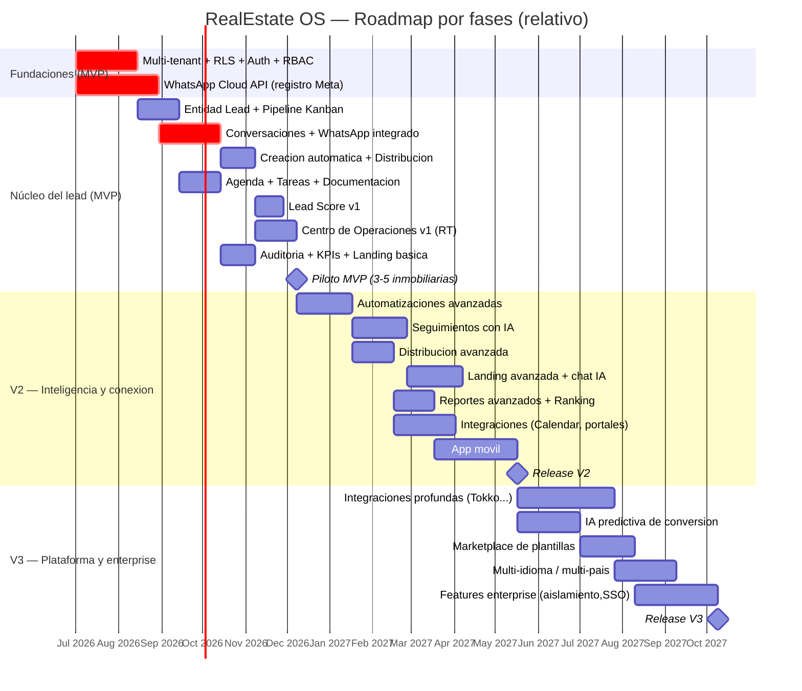
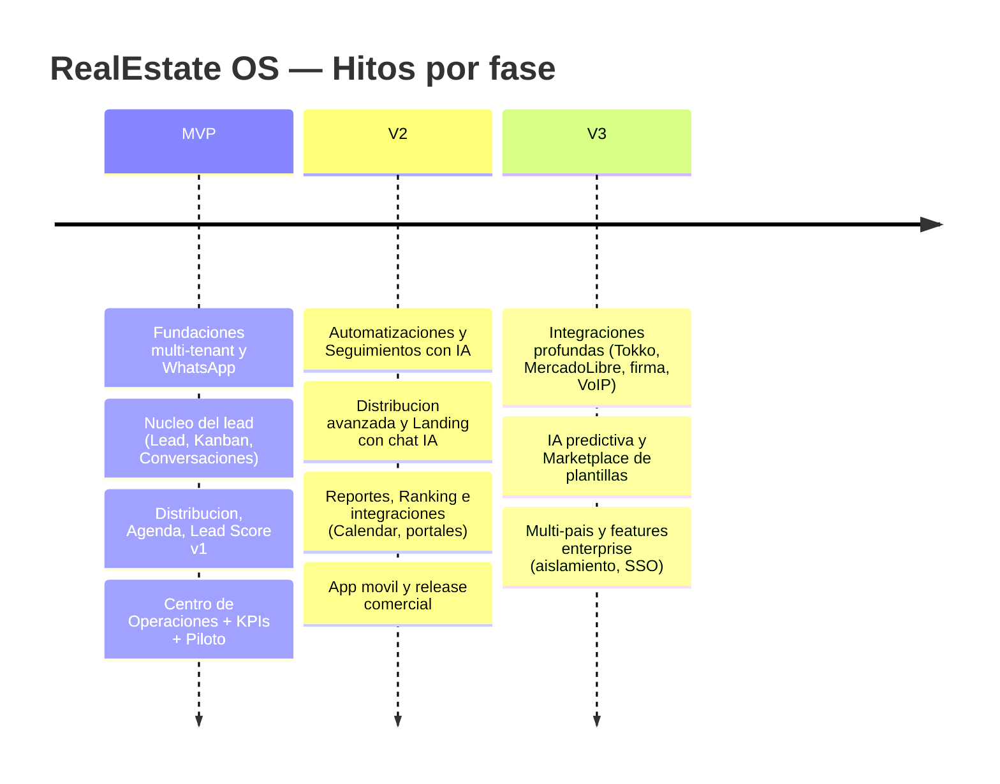
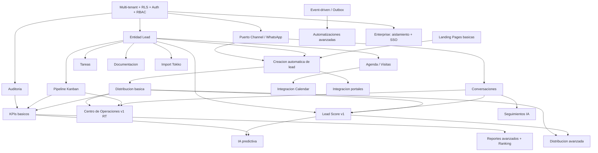

# 10 — Roadmap de Producto: RealEstate OS

> **Documento de producto y arquitectura.** Roadmap por fases (MVP → V2 → V3) para un SaaS multi-tenant orientado al lead para inmobiliarias de LATAM.
> **Autor:** Product Management Senior + Software Architect.
> **Tono:** honesto. Acá no vendemos humo: marcamos qué entra, qué queda afuera y por qué.

---

## 1. Filosofía del roadmap

### 1.1. El principio rector: el lead manda

RealEstate OS no es "otro CRM inmobiliario". Es un sistema operativo centrado en el **lead** y, más específicamente, en el **tiempo de respuesta al lead**. Todo lo demás (propiedades, reportes, rankings, automatizaciones) es infraestructura al servicio de esa idea.

La razón es simple y está respaldada por la operación real del rubro: en inmobiliaria, **el que contesta primero, gana**. Un lead inmobiliario tiene una ventana de atención de minutos, no de horas. Los estudios de industria (y la experiencia directa de cualquier inmobiliaria) muestran que la probabilidad de calificar y convertir un lead cae de forma abrupta pasados los primeros 5-10 minutos. La mayoría de las inmobiliarias hoy pierde leads no por falta de propiedades ni por precio, sino porque **el mensaje de WhatsApp del interesado se leyó tres horas tarde**, o directamente nunca se asignó a nadie.

Por lo tanto, la pregunta que ordena cada decisión de este roadmap es:

> **¿Esta feature reduce el tiempo de respuesta al lead o aumenta la probabilidad de que el lead correcto llegue rápido al asesor correcto?**

Si la respuesta es "sí y de forma directa", es candidata al MVP. Si es "sí, pero indirectamente", va a V2. Si es "es lindo tenerlo pero no mueve la aguja del lead", va a V3 o al backlog.

### 1.2. Qué significa "dar valor desde el día 1"

Una inmobiliaria que enciende RealEstate OS el primer día tiene que poder:

1. **Recibir un lead de WhatsApp y que el sistema lo cree solo**, sin que nadie cargue nada a mano.
2. **Asignarlo automáticamente a un asesor** (aunque sea con round-robin básico).
3. **Ver el lead en un tablero Kanban** y moverlo por el pipeline.
4. **Responderle desde el sistema**, en la misma conversación, sin salir a la app de WhatsApp.
5. **Agendar una visita** y que quede como tarea con recordatorio.
6. **Que el dueño vea, en tiempo real, qué está pasando** (Centro de Operaciones) y **cuánto tarda su equipo en responder** (KPI de tiempo de respuesta).

Si eso funciona el día 1, el producto ya es mejor que el "Excel + WhatsApp suelto + planilla de visitas" que usa hoy el 80% del mercado. Ese es el listón del MVP. Ni más, ni menos.

### 1.3. Reglas de secuenciación (los "no negociables")

- **La plataforma antes que las features.** Multi-tenancy con RLS, auth y RBAC son fundacionales. No se construye ningún módulo de negocio hasta que el aislamiento entre tenants esté probado. Un solo lead de la inmobiliaria A visible para la inmobiliaria B mata el producto entero.
- **El canal antes que la inteligencia.** WhatsApp funcionando y confiable viene antes que cualquier IA. Un Lead Score espectacular sobre un canal que no anda no sirve para nada.
- **La captura antes que la optimización.** Primero capturamos y no perdemos el lead; después optimizamos cómo lo distribuimos y lo puntuamos.
- **La observabilidad desde el principio.** Auditoría y KPIs básicos entran en el MVP, no como lujo sino porque sin medir el tiempo de respuesta no podemos demostrar el valor central del producto.

### 1.4. Criterio de corte (cómo decidimos qué queda afuera)

Aplicamos un corte estricto. Un módulo entra al MVP solo si cumple **todas** estas condiciones:

1. Es parte del camino crítico "capturar → asignar → responder → agendar → mover en pipeline".
2. Su ausencia haría que el producto no sea usable en producción real.
3. Se puede construir en su versión mínima sin depender de integraciones externas complejas (más allá de WhatsApp y Clerk).

Todo lo que no cumple las tres, se posterga. Sin culpa. El enemigo del MVP no es la falta de features, es el **scope creep** que retrasa el lanzamiento y nos deja sin feedback real del mercado.

---

## 2. Roadmap MVP — "No perder el lead"

**Objetivo de la fase:** que una inmobiliaria real opere su ciclo de lead completo dentro del sistema, con WhatsApp integrado y tiempo de respuesta medible. Lanzamiento con 3-5 inmobiliarias piloto.

**Duración estimada:** ver Gantt (sección 6). **Esfuerzo total de la fase: XXL.**

### 2.1. Alcance EXACTO del MVP

Los módulos que **entran** al MVP, con su alcance mínimo viable:

#### A. Multi-tenant + Auth + RBAC (fundacional) — `Esfuerzo: L`

- DB compartida con `tenantId` en todas las tablas de negocio.
- **Row-Level Security (RLS)** en PostgreSQL activada y probada con tests de aislamiento automatizados. Este es el punto más crítico del MVP.
- Auth vía **Clerk** (organizaciones = tenants, usuarios = miembros).
- RBAC con tres roles: **Dueño, Gerente, Asesor**, con una matriz de permisos mínima pero real (el Asesor ve sus leads; el Gerente los de su sucursal; el Dueño, todo).
- **Fuera del MVP:** permisos granulares configurables por el usuario, roles custom, permisos a nivel de campo.

#### B. Entidad Lead completa — `Esfuerzo: M`

- Modelo de datos del lead con todos los campos núcleo: contacto, origen/fuente, propiedad de interés, operación (venta/alquiler), presupuesto, estado en pipeline, asesor asignado, timestamps de creación y de primer contacto.
- Historial de cambios de estado (base para auditoría y para el KPI de tiempo de respuesta).
- Alta manual, edición, y de-duplicación básica por teléfono/email.
- **Fuera del MVP:** enriquecimiento automático de datos, merge inteligente de duplicados, campos personalizables por tenant.

#### C. Pipeline Kanban — `Esfuerzo: M`

- Tablero con las 10 etapas del pipeline: Nuevo Lead → Primer contacto → Interesado → Visita agendada → Visita realizada → Negociación → Reserva → Escribanía → Venta/Alquiler → Perdido.
- Drag & drop entre columnas; cada movimiento registra timestamp y actor (para auditoría).
- Filtros básicos (por asesor, por fuente, por estado).
- **Fuera del MVP:** etapas configurables por tenant, automatizaciones al mover de etapa, sub-pipelines por tipo de operación.

#### D. Conversaciones + Integración WhatsApp — `Esfuerzo: XL`

- Integración con **WhatsApp Business Cloud API** detrás del **puerto Channel** (arquitectura hexagonal, para poder sumar otros canales después).
- **Al menos 1 número** de WhatsApp por tenant conectado.
- Bandeja de conversaciones unificada: recepción y envío de mensajes desde el sistema, en tiempo real.
- Manejo de plantillas (templates) aprobadas por Meta para el primer contacto fuera de la ventana de 24hs.
- Vinculación automática mensaje ↔ lead.
- **Fuera del MVP:** múltiples números por asesor, chatbot IA, respuestas sugeridas, multimedia avanzada, catálogo de WhatsApp.

> **Nota de riesgo (ver doc 11):** este módulo es el de mayor incertidumbre del MVP por la dependencia de aprobación de Meta y las políticas de mensajería. Es el que hay que empezar primero y en paralelo a todo lo demás.

#### E. Creación automática de lead — `Esfuerzo: M`

- Cuando llega un mensaje de WhatsApp de un número desconocido, el sistema **crea el lead automáticamente**, lo ubica en "Nuevo Lead" y dispara la distribución.
- Captura de la fuente/origen cuando el dato está disponible (ej. click-to-WhatsApp con parámetros).
- **Fuera del MVP:** captura desde múltiples fuentes simultáneas (portales, formularios web externos, Meta Ads con matching avanzado).

#### F. Distribución básica de leads — `Esfuerzo: M`

- Asignación automática al crear el lead: **round-robin** y/o **por sucursal**.
- Regla de reasignación manual (el Gerente puede reasignar).
- **Fuera del MVP:** distribución por rendimiento del asesor, por especialidad/zona, por carga de trabajo dinámica, por horario/disponibilidad.

#### G. Agenda / Visitas — `Esfuerzo: M`

- Agendar visitas asociadas a un lead y a una propiedad.
- Vista de agenda por asesor y por sucursal.
- Recordatorios básicos (notificación in-app y/o mensaje).
- **Fuera del MVP:** sincronización con Google/Outlook Calendar, optimización de rutas, sugerencia inteligente de horarios.

#### H. Tareas — `Esfuerzo: S`

- Creación de tareas asociadas a un lead (llamar, enviar info, hacer seguimiento).
- Vencimientos y estado (pendiente/hecha).
- **Fuera del MVP:** tareas automáticas por reglas, plantillas de tareas, dependencias entre tareas.

#### I. Lead Score v1 — `Esfuerzo: M`

- Motor de **reglas ponderadas y explicables** (no IA). Ejemplo de señales: velocidad de respuesta del lead, presupuesto declarado, tipo de operación, fuente, cantidad de interacciones.
- Cada score muestra **el porqué** (qué reglas sumaron/restaron). La explicabilidad es requisito, no opcional.
- **Fuera del MVP:** scoring por IA/ML, aprendizaje sobre conversiones históricas, ajuste automático de pesos.

#### J. Centro de Operaciones v1 — `Esfuerzo: L`

- Panel en **tiempo real (WebSockets)** con lo esencial: leads entrando ahora, sin asignar, sin respuesta, y el estado del equipo.
- Alertas visuales para leads que superan el umbral de tiempo de respuesta.
- **Fuera del MVP:** analítica avanzada en vivo, mapas de calor, comparativas entre sucursales en tiempo real.

#### K. Documentación — `Esfuerzo: S`

- Adjuntar y almacenar archivos por lead/propiedad (fotos, DNI, comprobantes).
- Almacenamiento seguro con control de acceso por tenant.
- **Fuera del MVP:** integración con Drive/Dropbox, firma electrónica, versionado de documentos, OCR.

#### L. Auditoría — `Esfuerzo: S`

- Log inmutable de acciones clave: cambios de estado del lead, reasignaciones, envíos de mensajes, ediciones sensibles.
- **Fuera del MVP:** dashboard de auditoría avanzado, alertas de comportamiento anómalo, exportación de compliance.

#### M. KPIs básicos — `Esfuerzo: S`

- Métricas núcleo, con foco en el corazón del producto:
  - **Tiempo de respuesta** (primer contacto) — el KPI estrella.
  - Leads por fuente, por asesor, por estado.
  - Tasa de conversión por etapa (funnel básico).
  - Leads sin asignar / sin respuesta.
- **Fuera del MVP:** reportes configurables, cohortes, forecasting, exportables ejecutivos.

#### N. Landing Pages básicas — `Esfuerzo: M`

- Generador simple de landing por propiedad o por campaña, con formulario/botón click-to-WhatsApp que **crea el lead automáticamente** con su fuente.
- Plantilla única, personalización mínima (logo, colores, datos de la inmobiliaria).
- **Fuera del MVP:** editor visual avanzado, chat IA embebido, A/B testing, dominios personalizados, múltiples plantillas.

### 2.2. Qué queda EXPLÍCITAMENTE afuera del MVP

Para que no haya ambigüedad, estos módulos y capacidades **NO** están en el MVP:

- **Automatizaciones** avanzadas (workflows configurables, disparadores por evento).
- **Seguimientos** automáticos con IA / secuencias de nurturing.
- **Distribución avanzada** por rendimiento, zona o especialidad.
- **Reportes avanzados** y dashboards configurables.
- **Ranking** de asesores.
- **Métricas financieras** (comisiones, proyección de ingresos).
- **Propiedades** como módulo completo de gestión (en el MVP solo existe lo mínimo para asociar a un lead/visita; no hay portal de propiedades, ni publicación, ni matching).
- **Sucursales / Asesores** como módulos de administración avanzada (en el MVP hay una noción básica de sucursal y de usuario/asesor, no un panel completo de gestión).
- **Permisos** configurables (solo la matriz RBAC fija de 3 roles).
- Todas las **integraciones** salvo WhatsApp: Tokko, Zonaprop, Argenprop, MercadoLibre, Google/Outlook Calendar, Drive/Dropbox, firma electrónica, contabilidad, VoIP.
- **App móvil nativa** (el MVP es web responsive).
- Cualquier **IA generativa** (respuestas sugeridas, chatbots, resúmenes).

> **Regla de oro:** si aparece la tentación de meter "una sola cosita más" al MVP, la respuesta por defecto es **no**. El MVP se define tanto por lo que deja afuera como por lo que incluye.

### 2.3. Criterios de éxito del MVP (medibles)

| # | Criterio | Métrica objetivo |
|---|----------|------------------|
| 1 | Aislamiento multi-tenant | 0 fugas de datos entre tenants en suite de tests de RLS (100% pasando) |
| 2 | Captura sin pérdida | ≥ 99% de mensajes de WhatsApp entrantes generan/vinculan un lead |
| 3 | Tiempo de respuesta | Reducción medible del tiempo de primer contacto vs. baseline del piloto (objetivo: mediana < 10 min) |
| 4 | Adopción operativa | ≥ 80% de los leads del piloto se gestionan dentro del sistema (no por fuera) |
| 5 | Estabilidad del canal | Uptime de la integración WhatsApp ≥ 99% durante el piloto |
| 6 | Tiempo real | Latencia del Centro de Operaciones < 2s para reflejar un lead nuevo |
| 7 | Retención piloto | ≥ 3 de 5 inmobiliarias piloto siguen usando el sistema al mes 2 |

### 2.4. Riesgos de la fase MVP

- **WhatsApp Cloud API:** aprobación de Meta, política de plantillas, riesgo de baneo del número. *Mitigación:* empezar el registro y verificación en día 0; considerar un BSP como respaldo; usar plantillas conservadoras. (Detalle en doc 11.)
- **RLS mal configurada:** una fuga de datos entre tenants es catastrófica. *Mitigación:* tests de aislamiento automatizados como gate de CI; revisión de seguridad obligatoria antes del piloto.
- **Scope creep:** la presión por "una feature más" retrasa el lanzamiento. *Mitigación:* criterio de corte estricto (sección 1.4), backlog visible.
- **Tiempo real a escala temprana:** con pocos tenants no hay problema, pero mal diseñado hoy nos duele mañana. *Mitigación:* fan-out por tenant desde el diseño; presupuesto de latencia definido.
- **Adopción del piloto:** que el asesor no conecte su WhatsApp o siga usando el suelto. *Mitigación:* onboarding asistido, número compartido de la inmobiliaria como fallback.

---

## 3. Roadmap V2 — "Hacer el lead más inteligente y conectado"

**Objetivo de la fase:** una vez que capturamos y no perdemos leads, pasamos a **optimizar** cómo los trabajamos: automatización, inteligencia operativa, primeras integraciones externas y movilidad. Salida de piloto a producto comercializable a mayor escala.

**Esfuerzo total de la fase: XL.**

### 3.1. Alcance de V2

#### A. Automatizaciones avanzadas — `Esfuerzo: L`

- Motor de workflows configurable: "cuando pasa X, hacé Y" (ej. lead sin respuesta a los 10 min → alerta al gerente + reasignar).
- Disparadores por eventos del sistema (aprovechando el event-driven / outbox ya existente).
- Biblioteca de automatizaciones prearmadas para el rubro.
- **Criterio de éxito:** ≥ 50% de los tenants activan al menos 3 automatizaciones; reducción adicional del tiempo de respuesta.

#### B. Seguimientos con IA — `Esfuerzo: L`

- Secuencias de nurturing (follow-up) automáticas por WhatsApp con plantillas.
- **IA operativa** para sugerir el próximo mejor contacto y redactar borradores (el asesor aprueba; la IA no envía sola sin control).
- Detección de leads "fríos" que necesitan reactivación.
- **Criterio de éxito:** aumento medible de la tasa de reactivación de leads dormidos.

#### C. Distribución avanzada por rendimiento — `Esfuerzo: M`

- Asignación ponderada por conversión histórica, por zona, por especialidad y por carga/disponibilidad del asesor.
- Reglas de escalamiento (si el asesor no responde en N min, reasignar).
- **Criterio de éxito:** mejora en la tasa de conversión de leads distribuidos vs. round-robin.

#### D. Landing Pages avanzadas con chat IA — `Esfuerzo: L`

- Editor visual, múltiples plantillas, dominios personalizados, A/B testing básico.
- **Chat IA** embebido que califica al visitante y crea el lead ya con contexto y score inicial.
- **Criterio de éxito:** aumento en la tasa de captura de las landing vs. formulario simple.

#### E. Reportes avanzados — `Esfuerzo: M`

- Dashboards configurables, cohortes, funnel detallado, comparativas entre sucursales y asesores.
- Exportables ejecutivos (PDF/planilla) para el Dueño.
- Base del módulo de **Ranking** de asesores.
- **Criterio de éxito:** el Dueño usa los reportes semanalmente sin pedir datos por fuera del sistema.

#### F. Primeras integraciones — `Esfuerzo: L`

- **Google Calendar** (y Outlook) para sincronizar agenda/visitas — a través de la arquitectura hexagonal (nuevos adapters).
- Primeros **portales** (ingesta de leads desde Zonaprop / Argenprop / MercadoLibre como fuentes hacia la creación automática de lead).
- **Criterio de éxito:** ≥ 30% de los leads de un tenant piloto entran vía portales integrados con creación automática.

#### G. App móvil — `Esfuerzo: XL`

- App para el asesor (iOS/Android), foco en: ver leads asignados, responder WhatsApp, agendar y registrar visitas, notificaciones push.
- **Criterio de éxito:** ≥ 60% de los asesores usan la app a diario; el tiempo de respuesta mejora fuera del horario de escritorio.

### 3.2. Criterios de éxito de la fase V2

| Criterio | Métrica objetivo |
|----------|------------------|
| Escala de tenants | Soportar 10x los tenants del MVP sin degradación de latencia |
| Conversión | Mejora de la tasa de conversión global vs. MVP (distribución + seguimientos IA) |
| Movilidad | ≥ 60% de asesores activos en la app móvil |
| Integraciones | Google Calendar + al menos 1 portal en producción y en uso real |
| Comercial | Modelo de pricing validado; primeros clientes pagos fuera del piloto |

### 3.3. Riesgos de la fase V2

- **IA operativa que se pasa de la raya:** que un follow-up automático moleste al cliente o viole políticas de WhatsApp. *Mitigación:* IA sugiere, humano aprueba; límites de frecuencia; respeto estricto de opt-out.
- **Portales sin API estable:** muchos portales no ofrecen integración oficial y limpia. *Mitigación:* adapters aislados por portal; degradar con elegancia; no prometer lo que el portal no permite.
- **Tiempo real a escala real:** el fan-out por tenant se pone caro. *Mitigación:* revisar arquitectura de WS, considerar particionamiento y presupuesto de conexiones.
- **Complejidad del editor de landing:** puede volverse un producto en sí mismo. *Mitigación:* alcance acotado, no competir con Webflow.

---

## 4. Roadmap V3 — "Plataforma, ecosistema y enterprise"

**Objetivo de la fase:** convertir RealEstate OS en una **plataforma** con integraciones profundas, inteligencia predictiva, ecosistema de plantillas, alcance multi-país y capacidades enterprise. Acá competimos de frente con los incumbentes y apuntamos a cuentas grandes.

**Esfuerzo total de la fase: XXL.**

### 4.1. Alcance de V3

#### A. Integraciones profundas — `Esfuerzo: XL`

- **Import desde Tokko** (migración de cartera y contactos) — clave para arrancar la relación comercial con inmobiliarias que ya usan Tokko.
- **MercadoLibre** (publicación y sincronización, no solo ingesta de leads).
- **Firma electrónica** para reservas y contratos.
- **Contabilidad** (comisiones, facturación) vía adapters.
- **VoIP** (llamadas registradas y vinculadas al lead).
- **Criterio de éxito:** un tenant puede migrar desde Tokko y operar su cartera completa sin usar Tokko en paralelo.

#### B. IA predictiva de conversión — `Esfuerzo: L`

- Modelo que predice probabilidad de conversión del lead sobre datos históricos propios del tenant.
- Sustituye/complementa el Lead Score por reglas manteniendo explicabilidad (por qué el modelo cree que este lead convierte).
- **Criterio de éxito:** el score predictivo supera al de reglas en precisión de priorización, sin sacrificar transparencia.

#### C. Marketplace de plantillas — `Esfuerzo: M`

- Ecosistema de plantillas de landing, automatizaciones y secuencias de seguimiento, compartibles/vendibles entre tenants.
- **Criterio de éxito:** ≥ 20% de los tenants adoptan al menos una plantilla del marketplace.

#### D. Multi-idioma / multi-país — `Esfuerzo: L`

- i18n completo, monedas, formatos, y particularidades regulatorias por país de LATAM.
- Cumplimiento de leyes de datos locales (ver doc 11).
- **Criterio de éxito:** operación real en ≥ 2 países además de Argentina.

#### E. Features enterprise — `Esfuerzo: XL`

- **Aislamiento dedicado** (DB o esquema por tenant grande, para clientes que lo exijan).
- **SSO** (SAML/OIDC) para redes de inmobiliarias con IT propio.
- SLAs, roles y permisos granulares, auditoría de compliance avanzada, retención configurable.
- **Criterio de éxito:** cerrar al menos 1 cuenta enterprise (red/franquicia) con requisitos de aislamiento y SSO.

### 4.2. Criterios de éxito de la fase V3

| Criterio | Métrica objetivo |
|----------|------------------|
| Migración | Import de Tokko funcional con ≥ 95% de fidelidad de datos |
| Predicción | Score predictivo con mejora medible de priorización, explicable |
| Ecosistema | Marketplace con adopción real (≥ 20% de tenants) |
| Expansión | Operación en ≥ 2 países LATAM adicionales |
| Enterprise | ≥ 1 cuenta enterprise con aislamiento dedicado + SSO |

### 4.3. Riesgos de la fase V3

- **Import de Tokko frágil:** sin API oficial completa, la migración puede ser dolorosa. *Mitigación:* import por lotes con validación, herramientas de reconciliación, expectativas honestas con el cliente.
- **IA predictiva sin datos suficientes:** tenants chicos no generan volumen para entrenar. *Mitigación:* modelos globales con fine-tuning por tenant; fallback al score por reglas.
- **Aislamiento dedicado rompe la simplicidad multi-tenant:** dos modelos operativos conviviendo aumentan el costo. *Mitigación:* ofrecerlo solo a cuentas que lo justifiquen económicamente.
- **Multi-país regulatorio:** cada país agrega complejidad legal. *Mitigación:* entrar de a un país, con asesoría legal local.

---

## 5. Estimación de esfuerzo consolidada (T-shirt sizing)

Escala: `S` (chico) < `M` < `L` < `XL` < `XXL` (fase completa).

### MVP

| Módulo | Esfuerzo |
|--------|:--------:|
| Multi-tenant + Auth + RBAC | L |
| Entidad Lead completa | M |
| Pipeline Kanban | M |
| Conversaciones + WhatsApp | XL |
| Creación automática de lead | M |
| Distribución básica | M |
| Agenda / Visitas | M |
| Tareas | S |
| Lead Score v1 | M |
| Centro de Operaciones v1 | L |
| Documentación | S |
| Auditoría | S |
| KPIs básicos | S |
| Landing Pages básicas | M |
| **Total fase MVP** | **XXL** |

### V2

| Módulo | Esfuerzo |
|--------|:--------:|
| Automatizaciones avanzadas | L |
| Seguimientos con IA | L |
| Distribución avanzada por rendimiento | M |
| Landing Pages avanzadas + chat IA | L |
| Reportes avanzados + Ranking | M |
| Primeras integraciones (Google Calendar, portales) | L |
| App móvil | XL |
| **Total fase V2** | **XL** |

### V3

| Módulo | Esfuerzo |
|--------|:--------:|
| Integraciones profundas (Tokko, MercadoLibre, firma, contabilidad, VoIP) | XL |
| IA predictiva de conversión | L |
| Marketplace de plantillas | M |
| Multi-idioma / multi-país | L |
| Features enterprise (aislamiento dedicado, SSO) | XL |
| **Total fase V3** | **XXL** |

---

## 6. Diagrama de timeline (Gantt)

> Las fechas son **relativas** y orientativas. El objetivo es mostrar secuencia y solapamientos, no comprometer un calendario exacto. Arrancamos en el trimestre actual (2026-Q3).

### Timeline alternativa (vista de hitos)

---

## 7. Secuenciación y dependencias entre módulos

### 7.1. Grafo de dependencias

### 7.2. Reglas de secuencia (lectura del grafo)

1. **Todo cuelga de la plataforma.** `Multi-tenant + RLS + Auth + RBAC` es la raíz. Nada de negocio arranca antes de que el aislamiento esté probado.
2. **El puerto Channel habilita el canal.** WhatsApp entra por el `Puerto Channel`; de ahí salen Conversaciones y Creación automática de lead. Por eso el registro en Meta arranca en día 0, en paralelo a las fundaciones.
3. **La Entidad Lead es el eje del dominio.** Kanban, Agenda, Tareas, Documentación, Distribución y Lead Score dependen todos del modelo de lead. Es la segunda prioridad después de la plataforma.
4. **Lead Score necesita señales.** Depende de tener Lead + Conversaciones + Distribución funcionando, porque de ahí saca las señales que pondera.
5. **El Centro de Operaciones es un agregador.** Depende de Distribución, Kanban y Conversaciones (consume sus eventos en tiempo real). Va después de que esos tres emitan eventos.
6. **KPIs y Auditoría son transversales.** Auditoría se instrumenta temprano (registra desde el primer cambio de estado); KPIs se alimentan de esos registros.
7. **Las automatizaciones de V2 dependen del event-driven.** El transactional outbox + workers debe estar sólido desde el MVP (aunque se use poco), porque V2 lo explota a fondo.
8. **Distribución avanzada (V2) depende del Lead Score y de datos de conversión** que solo existen después de operar un tiempo con el MVP.
9. **Import de Tokko (V3) depende de la Entidad Lead madura** y de un modelo de propiedades ya más completo.

### 7.3. Camino crítico

El camino crítico del proyecto (lo que no se puede paralelizar y define el tiempo mínimo al piloto) es:

> **Multi-tenant/RLS → Puerto Channel/WhatsApp → Conversaciones → Creación automática + Distribución → Centro de Operaciones → Piloto MVP.**

Todo lo que esté fuera de ese camino (Tareas, Documentación, Landing básica, KPIs) puede desarrollarse en paralelo por otro tren de trabajo. La restricción dura es la **aprobación de WhatsApp por Meta**, que es externa y no controlamos: por eso se empieza el día 0.

---

## 8. Resumen ejecutivo del roadmap

- **MVP = "no perder el lead":** plataforma multi-tenant + WhatsApp + captura y distribución automática + pipeline + tiempo de respuesta medible. Corte estricto: afuera todo lo que no sea camino crítico del lead.
- **V2 = "lead más inteligente y conectado":** automatizaciones, IA operativa de seguimiento, distribución por rendimiento, primeras integraciones y app móvil.
- **V3 = "plataforma y enterprise":** integraciones profundas (Tokko, MercadoLibre, firma, contabilidad, VoIP), IA predictiva, marketplace, multi-país y capacidades enterprise (aislamiento dedicado, SSO).
- **Restricción dura:** aprobación de WhatsApp por Meta (externa) → arranca en día 0.
- **Métrica que ordena todo:** tiempo de respuesta al lead.
