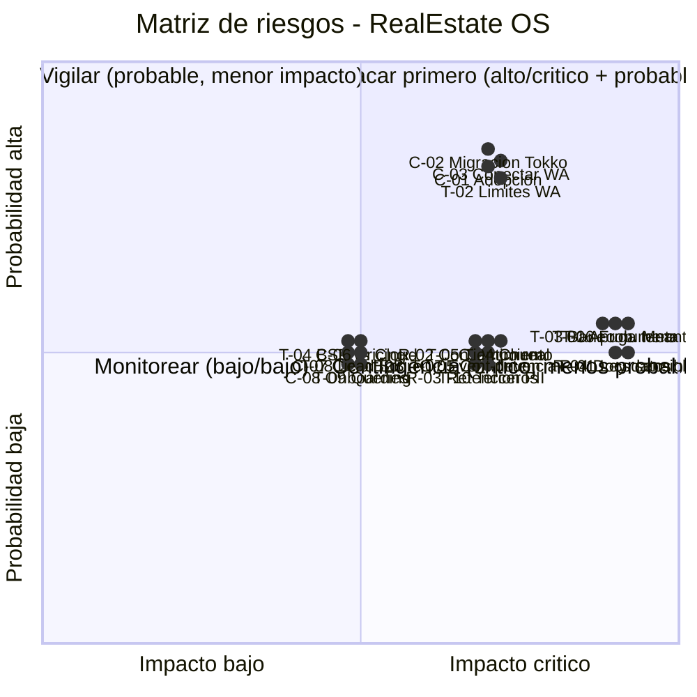

# 11 — Análisis de Riesgos: RealEstate OS

> **Documento de producto y arquitectura.** Registro de riesgos técnicos, comerciales y regulatorios del SaaS multi-tenant orientado al lead para inmobiliarias de LATAM.
> **Autor:** Product Management Senior + Software Architect.
> **Tono:** honesto y sin optimismo vacío. Un registro de riesgos que solo lista lo bueno no sirve. Acá está lo que puede salir mal y qué hacemos al respecto.

---

## Cómo leer este documento

Cada riesgo tiene: **descripción**, **probabilidad** (Baja / Media / Alta), **impacto** (Bajo / Medio / Alto / Crítico) y **mitigación**.

- **Probabilidad:** qué tan factible es que ocurra dado el estado actual del mercado y del stack.
- **Impacto:** cuánto duele si ocurre. **Crítico** = pone en riesgo el producto o al negocio del cliente (ej. fuga de datos entre tenants).

La convención de severidad sigue el estándar de review: **Crítico bloquea**, **Alto advierte**, **Medio informa**, **Bajo se anota**.

---

## 1. Riesgos técnicos

### T-01 — WhatsApp Business API: aprobación de Meta

**Descripción.** Toda la propuesta de valor del producto (captura y respuesta al lead) depende de WhatsApp. Meta controla el registro, la verificación del negocio (Business Verification) y la asignación de números. El proceso puede demorar días o semanas, pedir documentación, y rechazarse. Es una dependencia **externa que no controlamos** y que está en el camino crítico del MVP.

- **Probabilidad:** Media
- **Impacto:** Crítico
- **Mitigación:**
  - Iniciar el registro y la Business Verification en **día 0**, antes de escribir la primera línea de negocio.
  - Tener toda la documentación fiscal/legal de la empresa lista de antemano.
  - Evaluar un **BSP** (Business Solution Provider como Twilio, 360dialog, etc.) como camino alternativo/paralelo a la Cloud API directa, para no depender de un solo canal de aprobación.
  - Diseñar el **puerto Channel** de forma agnóstica: si un proveedor falla, se cambia el adapter sin tocar el dominio.

### T-02 — WhatsApp: límites de mensajería (messaging tiers) y política de plantillas

**Descripción.** Meta impone **tiers de mensajería** (1k, 10k, 100k, ilimitado) que escalan según calidad y volumen. Un número nuevo arranca limitado. Además, todo mensaje iniciado por el negocio fuera de la ventana de 24hs requiere una **plantilla (template) aprobada**; las plantillas se rechazan si parecen promocionales o incumplen políticas, y su aprobación toma tiempo. Esto limita seguimientos automáticos (clave en V2).

- **Probabilidad:** Alta
- **Impacto:** Alto
- **Mitigación:**
  - Cuidar el **quality rating** del número desde el día 1: respetar opt-out, evitar spam, mantener baja la tasa de bloqueo.
  - Mantener un **catálogo de plantillas conservadoras y pre-aprobadas** por caso de uso (primer contacto, recordatorio de visita, reactivación).
  - En V2, la IA de seguimientos debe respetar límites de frecuencia y la ventana de 24hs por diseño.
  - Priorizar mensajes iniciados por el cliente (la ventana de servicio de 24hs no requiere plantilla).

### T-03 — WhatsApp: riesgo de baneo del número

**Descripción.** Un número puede ser suspendido por Meta si acumula reportes de spam, bloqueos de usuarios o violaciones de política. Perder el número de una inmobiliaria = perder su canal de leads y su historial de conversaciones. Es un evento de bajo control y alto dolor.

- **Probabilidad:** Media
- **Impacto:** Crítico
- **Mitigación:**
  - Educación de onboarding: qué se puede y qué no se puede enviar.
  - Monitoreo del **quality rating** por número, con alertas tempranas cuando baja.
  - Respeto estricto de opt-out y consentimiento (ver riesgos regulatorios).
  - Plan de continuidad: procedimiento documentado para migrar a un número de respaldo y preservar el historial.

### T-04 — BSP vs. Cloud API directa (decisión de arquitectura del canal)

**Descripción.** Elegir entre integrar la **Cloud API de Meta directamente** (más barato, control total, más carga operativa: manejo de webhooks, tiers, verificación) o vía **BSP** (más caro por mensaje, pero abstrae complejidad, onboarding más rápido, soporte). Elegir mal encarece o ralentiza; casarse con uno sin abstracción genera lock-in.

- **Probabilidad:** Media
- **Impacto:** Medio
- **Mitigación:**
  - No decidir de forma irreversible: el **puerto Channel hexagonal** permite tener adapters para ambos.
  - Empezar con el que dé time-to-market más rápido para el piloto; reevaluar según costo por mensaje a escala.
  - Modelar el costo por mensaje en el pricing desde el principio.

### T-05 — Tiempo real a escala (WebSockets, fan-out por tenant)

**Descripción.** El Centro de Operaciones y las conversaciones dependen de WebSockets. A escala, el **fan-out** (emitir un evento a todas las conexiones de un tenant) se vuelve costoso: muchas conexiones simultáneas, presión de memoria, límites del proveedor de WS. Un diseño ingenuo colapsa con pocos tenants grandes.

- **Probabilidad:** Media
- **Impacto:** Alto
- **Mitigación:**
  - **Fan-out por tenant** con canales/rooms aislados desde el diseño (nunca broadcast global).
  - Presupuesto de latencia definido (< 2s para reflejar un lead nuevo) y pruebas de carga antes de V2.
  - Considerar un backplane (Redis pub/sub) o proveedor gestionado de WS con particionamiento.
  - Degradar con elegancia: si WS cae, la UI hace fallback a polling en lugar de romperse.

### T-06 — Multi-tenancy: fuga de datos entre tenants / RLS mal configurada

**Descripción.** DB compartida con `tenantId` + RLS. **El riesgo número uno del producto.** Una query sin filtro de tenant, una política de RLS mal escrita, o un bug en la capa de acceso puede exponer los leads de la inmobiliaria A a la B. En este rubro los datos de clientes son el activo; una fuga es letal para la reputación y potencialmente ilegal.

- **Probabilidad:** Media
- **Impacto:** Crítico
- **Mitigación:**
  - **RLS a nivel de PostgreSQL** como última línea de defensa, además del filtrado en la capa de aplicación (defensa en profundidad).
  - **Suite de tests de aislamiento automatizados** como gate obligatorio de CI: ningún deploy pasa si un test detecta cruce de tenants.
  - Contexto de tenant inyectado y verificado en cada request (nunca confiar en el `tenantId` que venga del cliente).
  - Revisión de seguridad obligatoria antes del piloto y ante cualquier cambio de esquema.
  - Uso del agente **security-reviewer** ante cambios en acceso a datos.

### T-07 — Consistencia event-driven (outbox, idempotencia, orden de eventos)

**Descripción.** La arquitectura event-driven con **transactional outbox + workers** puede fallar en tres frentes: eventos duplicados (worker reprocesa), eventos fuera de orden (un "lead ganado" llega antes que "lead creado"), y pérdida de eventos. Sin idempotencia, se disparan automatizaciones dobles (ej. dos asignaciones, dos mensajes al cliente).

- **Probabilidad:** Media
- **Impacto:** Alto
- **Mitigación:**
  - **Idempotencia** en todos los consumidores (claves de deduplicación por evento).
  - Outbox transaccional para garantizar "al menos una vez" con la escritura de negocio.
  - Ordenamiento por entidad (ej. eventos de un mismo lead procesados en orden) donde importe.
  - Dead-letter queue y observabilidad de los workers desde el MVP.

### T-08 — Lead Score: calidad de datos y explicabilidad

**Descripción.** El Lead Score por reglas ponderadas solo es tan bueno como los datos que lo alimentan. Si faltan señales (fuente desconocida, presupuesto no declarado), el score es ruido. Además, si el asesor no entiende **por qué** un lead tiene score alto, no confía en él y lo ignora. En V3, la IA predictiva agrega el riesgo de "caja negra".

- **Probabilidad:** Media
- **Impacto:** Medio
- **Mitigación:**
  - **Explicabilidad obligatoria:** el score siempre muestra qué reglas sumaron/restaron (requisito, no opcional).
  - Manejo explícito de datos faltantes (no inventar; marcar "dato ausente").
  - Validación del modelo de reglas con inmobiliarias piloto antes de confiar en él.
  - En V3, mantener explicabilidad aun con IA predictiva (feature importance visible).

### T-09 — Rendimiento de queries a escala

**Descripción.** Con crecimiento de tenants y volumen de leads/conversaciones, queries mal indexadas o patrones N+1 degradan la experiencia. Kanban, reportes y Centro de Operaciones son especialmente sensibles (leen mucho, en vivo).

- **Probabilidad:** Media
- **Impacto:** Medio
- **Mitigación:**
  - Índices por `tenantId` + columnas de filtro frecuentes desde el diseño de esquema.
  - Paginación y límites en todas las listas; nunca queries no acotadas.
  - Evitar N+1 (batching / includes de Prisma revisados); usar el agente **database-reviewer**.
  - Caché de lecturas caras (reportes, KPIs) con invalidación por evento.
  - Pruebas de carga con datos sintéticos representativos antes de V2.

### T-10 — Dependencia de terceros (Clerk, proveedor de WebSockets, otros SaaS)

**Descripción.** Auth vía **Clerk**, WS vía proveedor gestionado, y más adelante múltiples integraciones. Cada tercero es un punto de falla y un posible lock-in: caídas de Clerk = nadie entra; cambios de pricing o de API rompen el producto.

- **Probabilidad:** Media
- **Impacto:** Alto
- **Mitigación:**
  - Abstraer terceros críticos detrás de interfaces propias donde sea razonable (especialmente el canal, vía puerto hexagonal).
  - Monitoreo de estado y alertas de los proveedores; página de status propia para clientes.
  - Evaluar el costo de salida (exit cost) de cada dependencia antes de casarse con ella.
  - Para auth, entender el plan de portabilidad de usuarios de Clerk por si hay que migrar.

### Tabla resumen — Riesgos técnicos

| ID | Riesgo | Probabilidad | Impacto |
|----|--------|:------------:|:-------:|
| T-01 | WhatsApp: aprobación de Meta | Media | Crítico |
| T-02 | WhatsApp: límites de mensajería y plantillas | Alta | Alto |
| T-03 | WhatsApp: baneo del número | Media | Crítico |
| T-04 | BSP vs. Cloud API directa | Media | Medio |
| T-05 | Tiempo real a escala (WS, fan-out) | Media | Alto |
| T-06 | Fuga de datos entre tenants / RLS | Media | Crítico |
| T-07 | Consistencia event-driven (outbox) | Media | Alto |
| T-08 | Lead Score: datos y explicabilidad | Media | Medio |
| T-09 | Rendimiento de queries a escala | Media | Medio |
| T-10 | Dependencia de terceros (Clerk, WS) | Media | Alto |

---

## 2. Riesgos comerciales

### C-01 — Adopción: resistencia al cambio

**Descripción.** Las inmobiliarias están acostumbradas a **Tokko + Excel + WhatsApp suelto**. Cambiar de herramienta implica retrabajo, curva de aprendizaje y resistencia del equipo. El asesor promedio no quiere "otro sistema donde cargar cosas". Si no perciben valor inmediato, vuelven a sus planillas.

- **Probabilidad:** Alta
- **Impacto:** Alto
- **Mitigación:**
  - Valor visible el **día 1** (ver doc 10): el sistema captura el lead solo y responde WhatsApp desde adentro; menos trabajo, no más.
  - Onboarding asistido y acompañamiento humano en las primeras semanas.
  - No pedir que carguen todo de entrada; que el sistema se llene solo desde las conversaciones.
  - Métricas que le muestran al dueño cuánto mejoró el tiempo de respuesta (evidencia dura de valor).

### C-02 — Migración de datos desde Tokko

**Descripción.** Muchas inmobiliarias tienen su cartera y contactos en Tokko. Migrar es una barrera de entrada enorme; si es dolorosa o incompleta, no cambian. Tokko no ofrece necesariamente una API de exportación completa y limpia.

- **Probabilidad:** Alta
- **Impacto:** Alto
- **Mitigación:**
  - Herramienta de **import desde Tokko** priorizada en V3 (pero investigada antes).
  - Import por lotes con validación y reconciliación; expectativas honestas de fidelidad.
  - Permitir operar sin migrar todo (arrancar con leads nuevos, migrar cartera después).
  - Soporte dedicado de migración para las primeras cuentas.

### C-03 — Dependencia de que el asesor conecte su WhatsApp

**Descripción.** El producto brilla si los mensajes pasan por el sistema. Si el asesor sigue usando su WhatsApp personal por fuera, se pierden las conversaciones, el score y las métricas. Es un riesgo de comportamiento, no técnico.

- **Probabilidad:** Alta
- **Impacto:** Alto
- **Mitigación:**
  - Fallback con **número de la inmobiliaria** (no depender del personal de cada asesor).
  - Incentivos: el asesor que usa el sistema recibe mejores leads (distribución) y mejor ranking.
  - Hacer que responder desde el sistema sea **más cómodo** que desde el WhatsApp suelto (esa es la barra).
  - Visibilidad para el gerente de quién opera dentro y quién por fuera.

### C-04 — Churn (abandono)

**Descripción.** Un cliente que no ve valor sostenido se va. En SaaS B2B, el churn temprano mata el crecimiento (el CAC no se recupera). Riesgo alto si el onboarding falla o si el producto no se vuelve indispensable.

- **Probabilidad:** Media
- **Impacto:** Alto
- **Mitigación:**
  - Convertir el producto en el **sistema de registro (system of record)** del lead: si toda la operación vive ahí, irse cuesta.
  - Monitorear señales de churn (caída de uso, leads gestionados por fuera) y actuar antes.
  - Éxito del cliente proactivo, no reactivo.
  - Contratos y pricing que premien la permanencia sin encerrar de forma abusiva.

### C-05 — Competencia (Tokko reacciona, entra un global)

**Descripción.** Tokko es el incumbente en Argentina y puede copiar features o mejorar su WhatsApp. Un player global (con más plata y producto) puede entrar a LATAM. La ventana de diferenciación no es infinita.

- **Probabilidad:** Media
- **Impacto:** Alto
- **Mitigación:**
  - Diferenciación clara: **centrado en el lead y el tiempo de respuesta**, no en la publicación de propiedades (donde Tokko es fuerte).
  - Velocidad: entregar valor y ganar cuentas antes de que reaccionen.
  - Profundidad en WhatsApp e IA operativa como foso (moat) difícil de copiar rápido.
  - Foco en LATAM y en el detalle local (algo que un global tarda en atender).

### C-06 — Pricing

**Descripción.** Elegir mal el pricing (por usuario, por lead, por mensaje, flat) puede dejar plata en la mesa, ahuyentar a inmobiliarias chicas, o no cubrir el costo variable de WhatsApp. El costo por mensaje de WhatsApp es un costo variable real que hay que trasladar bien.

- **Probabilidad:** Media
- **Impacto:** Medio
- **Mitigación:**
  - Modelar el **costo por mensaje de WhatsApp** dentro del pricing desde el principio.
  - Validar disposición a pagar con las inmobiliarias piloto.
  - Estructura escalonada (chica / mediana / red) para no dejar afuera al segmento chico ni subvaluar al grande.
  - Revisar pricing tras el piloto con datos reales de uso.

### C-07 — Ciclo de venta B2B

**Descripción.** Vender a inmobiliarias (especialmente redes/franquicias) tiene un ciclo largo, con decisores múltiples. Esto tensiona el flujo de caja y la velocidad de crecimiento. Subestimarlo desalinea las expectativas del negocio.

- **Probabilidad:** Media
- **Impacto:** Medio
- **Mitigación:**
  - Empezar por inmobiliarias chicas/medianas (decisión más rápida) antes de ir por redes.
  - Ofrecer prueba/piloto de bajo compromiso para acortar el ciclo.
  - Casos de éxito documentados del piloto como palanca de venta.

### C-08 — Soporte y onboarding

**Descripción.** Si el onboarding no escala, cada cliente nuevo consume horas de fundadores/equipo. Un producto que necesita mucha mano para arrancar no escala y quema al equipo.

- **Probabilidad:** Media
- **Impacto:** Medio
- **Mitigación:**
  - Onboarding autoservicio guiado, con setup de WhatsApp lo más automatizado posible.
  - Documentación y videos por rol (Dueño, Gerente, Asesor).
  - Plantillas y automatizaciones prearmadas para el rubro (arrancar con valor, no con una hoja en blanco).

### Tabla resumen — Riesgos comerciales

| ID | Riesgo | Probabilidad | Impacto |
|----|--------|:------------:|:-------:|
| C-01 | Adopción / resistencia al cambio | Alta | Alto |
| C-02 | Migración desde Tokko | Alta | Alto |
| C-03 | Dependencia de conectar WhatsApp | Alta | Alto |
| C-04 | Churn | Media | Alto |
| C-05 | Competencia (Tokko / global) | Media | Alto |
| C-06 | Pricing | Media | Medio |
| C-07 | Ciclo de venta B2B | Media | Medio |
| C-08 | Soporte y onboarding | Media | Medio |

---

## 3. Riesgos regulatorios / legales

### R-01 — Protección de datos personales (Ley 25.326 Argentina y equivalentes LATAM)

**Descripción.** El producto maneja **datos personales** de leads (nombre, teléfono, email, presupuesto, intención de compra). En Argentina aplica la **Ley 25.326 de Protección de Datos Personales** (y su modernización en curso); en otros países LATAM hay equivalentes (LGPD en Brasil, leyes locales en México, Chile, Colombia, etc.). Incumplir expone a multas y a bloqueo comercial. La expansión multi-país (V3) multiplica el problema.

- **Probabilidad:** Media
- **Impacto:** Crítico
- **Mitigación:**
  - Registrar bases de datos ante la autoridad de aplicación cuando corresponda (en Argentina, la AAIP).
  - Principios de **minimización** (guardar solo lo necesario) y **finalidad** (usar el dato solo para lo declarado).
  - Derechos ARCO/de titulares: mecanismos para acceso, rectificación y supresión de datos.
  - Asesoría legal local antes de operar en cada país nuevo (V3).
  - El **aislamiento multi-tenant** (T-06) es también un requisito legal, no solo técnico.

### R-02 — Consentimiento en WhatsApp

**Descripción.** Meta exige **opt-in explícito** del usuario para recibir mensajes iniciados por el negocio. Enviar sin consentimiento viola las políticas de WhatsApp (riesgo de baneo, T-03) y potencialmente la ley de datos (mensajes no solicitados). Los seguimientos automáticos de V2 amplifican este riesgo.

- **Probabilidad:** Media
- **Impacto:** Alto
- **Mitigación:**
  - Registrar y almacenar la **evidencia de consentimiento** (cuándo, cómo, de qué canal vino el opt-in).
  - Opt-out simple y respetado de forma inmediata y automática.
  - En landing pages y formularios, capturar el consentimiento de forma explícita.
  - Las automatizaciones de seguimiento (V2) verifican consentimiento antes de enviar.

### R-03 — Retención de PII (información personal identificable)

**Descripción.** Guardar datos personales indefinidamente es un pasivo legal y de seguridad. Cuanto más se acumula, mayor el daño de una eventual fuga (T-06) y mayor el incumplimiento de principios de retención limitada.

- **Probabilidad:** Media
- **Impacto:** Alto
- **Mitigación:**
  - Políticas de **retención configurables** (borrado o anonimización de leads muertos tras un período).
  - Cifrado en reposo y en tránsito de datos personales.
  - Anonimización para datos usados en analítica/IA (V3).
  - Procedimiento de borrado ante solicitud del titular (derecho de supresión).

### R-04 — Documentación sensible (DNI, escrituras, comprobantes)

**Descripción.** El módulo de Documentación almacena datos altamente sensibles: DNI, escrituras, comprobantes de ingresos, contratos. Una fuga de esto es mucho más grave que una fuga de leads. Además, la firma electrónica (V3) agrega requisitos legales de validez y trazabilidad.

- **Probabilidad:** Media
- **Impacto:** Crítico
- **Mitigación:**
  - Control de acceso estricto por tenant y por rol a los documentos (defensa en profundidad sobre T-06).
  - Cifrado en reposo obligatorio para documentos sensibles.
  - Auditoría de todo acceso a documentos sensibles (quién vio qué y cuándo).
  - Firma electrónica (V3) con proveedor que cumpla la normativa local de firma digital.
  - Retención acotada también para documentos (no guardar escrituras de operaciones cerradas más de lo necesario/legalmente exigido).

### Tabla resumen — Riesgos regulatorios / legales

| ID | Riesgo | Probabilidad | Impacto |
|----|--------|:------------:|:-------:|
| R-01 | Protección de datos (Ley 25.326 y equivalentes) | Media | Crítico |
| R-02 | Consentimiento en WhatsApp | Media | Alto |
| R-03 | Retención de PII | Media | Alto |
| R-04 | Documentación sensible (DNI, escrituras) | Media | Crítico |

---

## 4. Matriz de riesgos (probabilidad × impacto)

### 4.1. Matriz consolidada

Leyenda de impacto para la matriz: se ubica cada riesgo por su combinación probabilidad/impacto. Los **Críticos** de probabilidad Media o Alta son los que exigen acción inmediata.

| Probabilidad ↓ / Impacto → | **Bajo** | **Medio** | **Alto** | **Crítico** |
|---|---|---|---|---|
| **Alta** | — | — | C-01, C-02, C-03, T-02 | — |
| **Media** | — | T-04, T-08, T-09, C-06, C-07, C-08 | T-05, T-07, T-10, C-04, C-05, R-02, R-03 | T-01, T-03, T-06, R-01, R-04 |
| **Baja** | — | — | — | — |

### 4.2. Diagrama Mermaid (quadrantChart)

> Eje X: impacto (izquierda = bajo, derecha = crítico). Eje Y: probabilidad (abajo = baja, arriba = alta). El cuadrante superior-derecho es la zona roja: atacar primero.

---

## 5. Top 5 riesgos y plan de contingencia

Estos son los cinco riesgos que, combinando probabilidad e impacto, más pueden hundir el proyecto. Cada uno tiene disparador (trigger), plan de contingencia y dueño responsable.

### #1 — T-06: Fuga de datos entre tenants (RLS)

**Por qué es #1.** Impacto crítico + es el riesgo más íntimamente ligado a la arquitectura. Una sola fuga destruye la confianza de todos los clientes y es potencialmente ilegal (se cruza con R-01).

- **Disparador:** un test de aislamiento falla, o se reporta acceso cruzado de datos.
- **Plan de contingencia:**
  1. **Freeze inmediato** de deploys y, si hay fuga confirmada en producción, corte del acceso afectado.
  2. Activar el agente **security-reviewer** y auditar todas las rutas de acceso a datos.
  3. Notificación a los tenants afectados según obligación legal (R-01) y a la autoridad si corresponde.
  4. Post-mortem y refuerzo de la suite de tests de RLS como gate.
- **Prevención estructural:** defensa en profundidad (RLS en DB + filtrado en app), tests de aislamiento en CI como gate obligatorio.
- **Dueño:** Arquitecto / Seguridad.

### #2 — T-01/T-03: WhatsApp (aprobación de Meta y baneo del número)

**Por qué es #2.** Es el canal del que depende toda la propuesta de valor, y su control es externo (Meta). Sin WhatsApp, no hay producto.

- **Disparador:** rechazo o demora de la aprobación de Meta; caída del quality rating; suspensión de un número.
- **Plan de contingencia:**
  1. Activar el camino **BSP** de respaldo (adapter alternativo del puerto Channel).
  2. Para un baneo, ejecutar el procedimiento de migración a número de respaldo preservando historial.
  3. Comunicación proactiva al cliente afectado con tiempos realistas.
- **Prevención estructural:** registro en Meta desde día 0, puerto Channel agnóstico, monitoreo de quality rating, plantillas conservadoras, respeto de opt-out.
- **Dueño:** Product + Arquitecto (integración de canal).

### #3 — C-01/C-03: Adopción y dependencia de que el asesor use WhatsApp en el sistema

**Por qué es #3.** Probabilidad alta + impacto alto. El mejor producto no sirve si el equipo de la inmobiliaria sigue trabajando por fuera con su WhatsApp suelto y sus planillas.

- **Disparador:** en el piloto, < 80% de los leads se gestionan dentro del sistema, o caída de uso semana a semana.
- **Plan de contingencia:**
  1. Intervención de éxito del cliente: entender la fricción real, ajustar onboarding.
  2. Reforzar el fallback con número de la inmobiliaria (no depender del asesor individual).
  3. Ajustar incentivos: mejores leads y mejor ranking para quien opera dentro.
  4. Si la fricción es de producto, priorizar mejoras de UX de la bandeja de conversaciones.
- **Prevención estructural:** valor visible día 1, onboarding asistido, responder desde el sistema más cómodo que el WhatsApp suelto.
- **Dueño:** Product + Customer Success.

### #4 — R-01/R-04: Protección de datos personales y documentación sensible

**Por qué es #4.** Impacto crítico legal. DNI, escrituras y datos de leads bajo leyes de protección de datos (25.326 y equivalentes LATAM). Un incidente acá se cruza con T-06 y con multas regulatorias.

- **Disparador:** solicitud de un titular ejerciendo derechos (acceso/supresión), auditoría regulatoria, o incidente de seguridad con PII.
- **Plan de contingencia:**
  1. Ejecutar el procedimiento de respuesta al titular (acceso, rectificación, supresión) dentro de los plazos legales.
  2. Ante incidente, protocolo de notificación a la autoridad y a los afectados.
  3. Revisión legal local, especialmente antes de cada expansión de país (V3).
- **Prevención estructural:** minimización de datos, cifrado en reposo, retención acotada, auditoría de acceso a documentos sensibles, registro de bases ante la autoridad.
- **Dueño:** Product + Legal.

### #5 — C-02: Migración de datos desde Tokko

**Por qué es #5.** Probabilidad alta + impacto alto sobre el crecimiento. Es la barrera de entrada más concreta: si migrar duele, la inmobiliaria no cambia, por más que el producto sea mejor.

- **Disparador:** una cuenta objetivo no avanza porque no puede/quiere migrar su cartera de Tokko.
- **Plan de contingencia:**
  1. Ofrecer migración asistida manual/semiautomática para las primeras cuentas clave.
  2. Permitir operar sin migrar todo: arrancar con leads nuevos, migrar cartera en paralelo.
  3. Acelerar la herramienta de import de Tokko (V3) si la demanda lo justifica.
- **Prevención estructural:** import por lotes con validación, expectativas honestas de fidelidad, soporte de migración dedicado.
- **Dueño:** Product + Customer Success.

---

## 6. Cierre honesto

Ningún registro de riesgos elimina el riesgo; lo hace visible y accionable. Los tres que más quitan el sueño son estructurales y hay que atacarlos desde el día 0:

1. **El aislamiento multi-tenant (T-06)** — porque un fallo es irreversible en confianza.
2. **La dependencia de WhatsApp/Meta (T-01/T-03)** — porque no la controlamos y es el corazón del producto.
3. **La adopción real (C-01/C-03)** — porque el producto solo vale si reemplaza de verdad al "Excel + WhatsApp suelto".

Los tres tienen mitigación en el roadmap (ver doc 10): RLS con tests de aislamiento como gate, registro en Meta y puerto Channel agnóstico desde el inicio, y valor visible el día 1 con onboarding asistido. Lo demás es gestión disciplinada de un registro que hay que revisar en cada fase.
