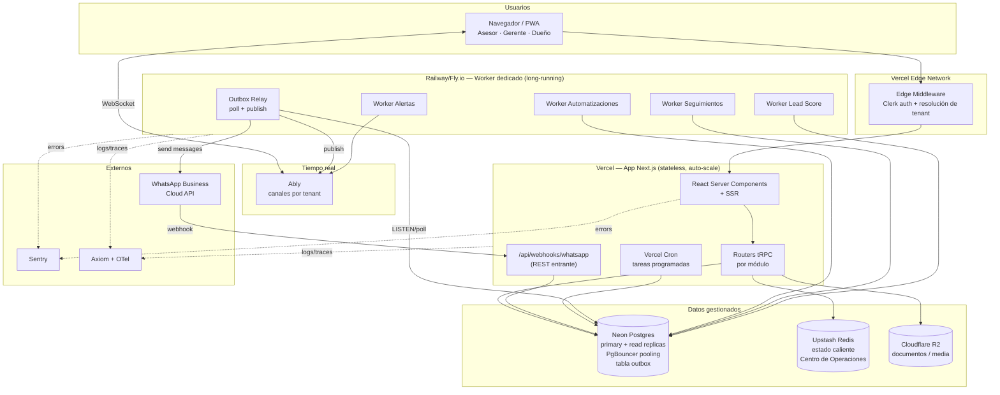
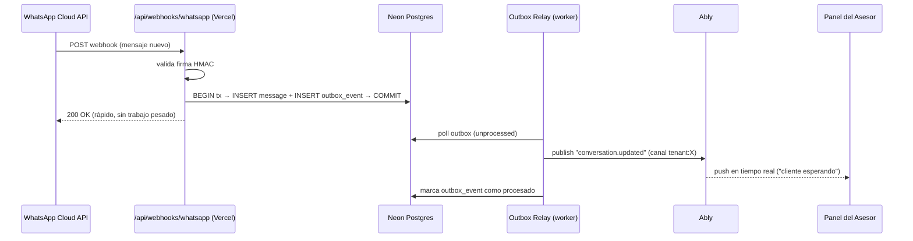
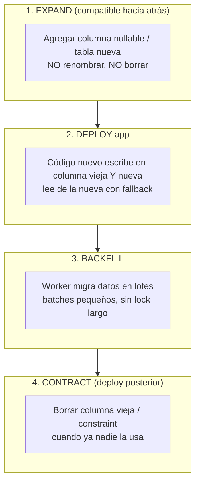
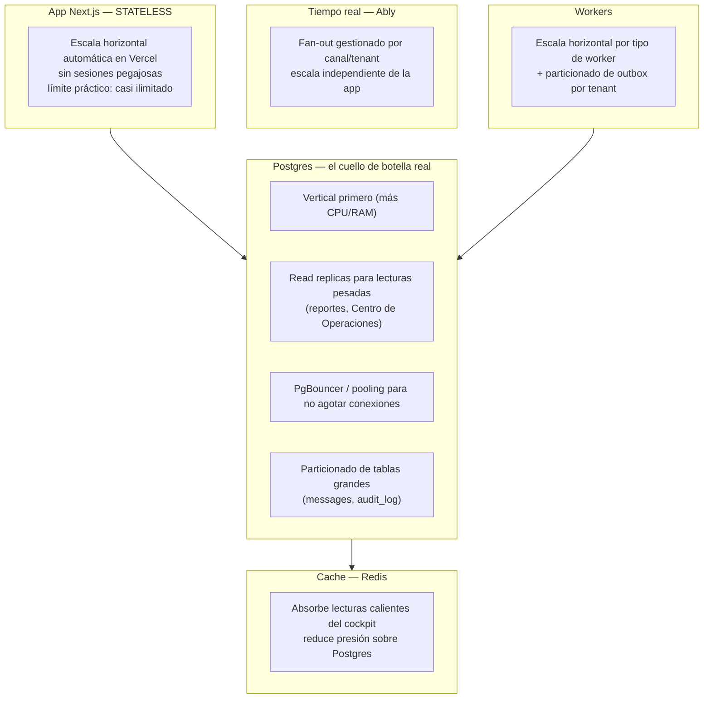

# 12 — Infraestructura y Escalabilidad

> **Producto:** RealEstate OS — SaaS multi-tenant para inmobiliarias LATAM, centrado en el LEAD.
> **Audiencia:** ingeniería de plataforma, DevOps/SRE, tech leads, quien firme los costos.
> **Estado:** documento vivo. Traduce las decisiones de la arquitectura técnica (doc 05) a infraestructura concreta, entornos, CI/CD, observabilidad, escalabilidad, backups y costos.

---

## 0. Principios de infraestructura

Antes de los diagramas, dejamos fijos los principios que gobiernan cada decisión de infra. Todo lo demás se justifica contra esto.

1. **Managed antes que self-hosted.** Somos un equipo de producto, no una empresa de operaciones. Todo lo que un proveedor gestionado haga bien (Postgres, tiempo real, storage, CDN) lo delegamos. Sólo operamos lo que nos da ventaja: el dominio.
2. **App stateless siempre.** La aplicación Next.js no guarda estado en memoria entre requests. Todo el estado vive en Postgres, Redis o el proveedor de tiempo real. Esto habilita escalado horizontal sin sesiones pegajosas.
3. **Un tenant nunca degrada a otro.** El aislamiento no es sólo de datos (RLS): también es de recursos. Un tenant que dispara 10k mensajes de WhatsApp no puede consumir la capacidad de fan-out de los demás.
4. **Zero-downtime como default.** Migraciones, deploys y rollbacks se diseñan para no cortar servicio. Una inmobiliaria pierde plata si el sistema se cae un martes a las 11.
5. **Observabilidad desde el día 1, no como parche.** Logging estructurado, tracing y error tracking se instrumentan en el esqueleto del proyecto, no cuando ya hay un incidente.
6. **Costo predecible y atado a valor.** La factura de infra crece con tenants y usuarios activos de forma entendible. Nada de sorpresas de USD 4.000 por un webhook en loop.
7. **Secretos fuera del código, siempre.** Ni una API key en el repo. Variables de entorno gestionadas por proveedor + rotación.

---

## 1. Estrategia de despliegue

### 1.1 Mapa de responsabilidades

| Capa | Servicio elegido (MVP) | Alternativas | Por qué |
|------|------------------------|--------------|---------|
| App Next.js (SSR/RSC + API) | **Vercel** | Fly.io, Railway, AWS ECS | App Router es de Vercel; preview deployments por PR gratis; edge middleware para auth/tenant. |
| Postgres gestionado | **Neon** | Supabase, RDS/Aurora | Branching de DB por PR, autoscaling, pooling incluido, serverless-friendly. |
| Tiempo real (WebSockets) | **Ably** | Pusher, WS propio en Fly.io | Fan-out por canal/tenant gestionado, presence, reconexión. Evitamos operar un cluster de WS en el MVP. |
| Workers (outbox + automatizaciones) | **Worker dedicado en Railway/Fly.io** (contenedor long-running) | Vercel Cron + Functions, Inngest, QStash | El outbox relay necesita un loop persistente y baja latencia; las funciones serverless con cold starts y timeouts no son el mejor fit para un poller continuo. |
| Storage de documentos | **Cloudflare R2** | S3, Vercel Blob, Supabase Storage | Sin egress fees (clave para documentos de propiedades que se descargan mucho), API compatible con S3. |
| Cache / datos calientes | **Upstash Redis** | Redis en Fly.io, ElastiCache | Serverless, pago por request, ideal para el estado caliente del Centro de Operaciones. |
| CDN / assets estáticos | **Vercel Edge Network** | Cloudflare | Incluido con Vercel. |
| Error tracking | **Sentry** | Highlight, Bugsnag | Estándar, integra con Next.js y workers. |
| Métricas / logs / tracing | **Axiom + OpenTelemetry** | Datadog, Grafana Cloud, Better Stack | Axiom es barato para logs estructurados; OTel evita lock-in de tracing. |

> **Decisión clave sobre workers.** Vercel Cron sirve para tareas *programadas* (ej. recalcular Lead Score cada hora, cerrar leads fríos a la noche). Pero el **Outbox Relay** es un *loop continuo* de baja latencia (queremos que un mensaje entrante de WhatsApp llegue al Centro de Operaciones en < 1s). Eso pide un proceso long-running, no una función que arranca cada minuto. Por eso separamos: **cron para lo programado, worker dedicado para lo reactivo.**

### 1.2 Diagrama de infraestructura



### 1.3 Flujo end-to-end de un evento (ejemplo: mensaje entrante)



El punto fino: el webhook **responde 200 lo antes posible** (sólo persiste y encola en el outbox). Todo el trabajo pesado (notificar, recalcular score, disparar automatización) lo hacen los workers de forma asíncrona. Si Meta no recibe el 200 en pocos segundos, reintenta, y podríamos duplicar mensajes.

---

## 2. Entornos

### 2.1 Los tres entornos

| Entorno | Propósito | Datos | Postgres | Deploy |
|---------|-----------|-------|----------|--------|
| **dev** | Desarrollo local + PRs | Seed sintético / branch efímero | Neon branch por PR | Preview deployment automático |
| **staging** | Pre-producción, QA, demos | Copia anonimizada de prod (subset) | Neon branch estable | Push a `staging` |
| **prod** | Clientes reales | Real, multi-tenant | Neon primary + replicas | Push a `main` (con aprobación) |

### 2.2 Branching y preview deployments

Usamos **trunk-based development con ramas de vida corta**:

```
main (prod)  ──●────────────●──────────────●──────►
                \          /                \
   feature/xyz   ●──●──●──● (PR + preview)    \
                                    staging ───●─────►
```

- Cada PR abre un **preview deployment en Vercel** con su propia URL (`realestate-os-pr-142.vercel.app`) y su propia **Neon branch** (base de datos aislada, copy-on-write de prod anonimizado). Esto permite probar migraciones y features con datos realistas sin tocar prod.
- El merge a `main` dispara deploy a prod detrás de un **gate de aprobación manual** más los checks de CI.
- `staging` se refresca desde `main` en cada release candidate para QA final y demos comerciales.
- Ramas de vida corta (< 3 días idealmente) para evitar drift y conflictos de migración.

> **Regla de oro de migraciones + preview:** una migración se prueba primero en la Neon branch del PR, luego en staging, y sólo entonces se aplica a prod. Nunca una migración llega a prod sin haber corrido antes en una branch con datos reales-anonimizados.

---

## 3. CI/CD

### 3.1 Pipeline

```mermaid
flowchart LR
    PR["Pull Request"] --> LINT["Lint<br/>ESLint + Prettier"]
    LINT --> TYPE["Typecheck<br/>tsc --noEmit"]
    TYPE --> UNIT["Tests unitarios<br/>Vitest"]
    UNIT --> MIG["Validar migraciones<br/>prisma migrate diff"]
    MIG --> INT["Tests integración<br/>contra Neon branch"]
    INT --> BUILD["Build Next.js<br/>+ build worker"]
    BUILD --> PREVIEW["Preview deploy<br/>(Vercel + Neon branch)"]
    PREVIEW --> E2E["E2E Playwright<br/>flujos críticos"]
    E2E --> GATE{"Gates OK?"}
    GATE -->|sí, merge a main| PRODMIG["Aplicar migraciones prod<br/>(expand)"]
    PRODMIG --> DEPLOY["Deploy prod<br/>(app + worker)"]
    DEPLOY --> CONTRACT["Migración contract<br/>(deploy posterior)"]
```



### 3.2 Gates de calidad

| Gate | Umbral | Bloquea merge |
|------|--------|---------------|
| Lint | 0 errores | Sí |
| Typecheck | 0 errores | Sí |
| Cobertura de tests | ≥ 80% líneas | Sí |
| Tests unitarios + integración | 100% verde | Sí |
| E2E flujos críticos | 100% verde | Sí (los críticos; los flaky se cuarentenan) |
| Vulnerabilidades (npm audit / Snyk) | 0 CRITICAL/HIGH | Sí |
| Tamaño de bundle | Sin regresión > 10% | Warn |
| Migración destructiva sin plan expand/contract | Detectada | Sí |

### 3.3 Migraciones seguras zero-downtime (expand/contract)

El patrón **expand → migrate → contract** evita cortes cuando la app vieja y la nueva conviven durante un deploy rolling:



**Reglas concretas:**
- Nunca `DROP COLUMN` ni `RENAME` en el mismo deploy que introduce el cambio de código. Se separa en dos releases.
- Índices se crean con `CREATE INDEX CONCURRENTLY` (no bloquea escrituras).
- Backfills grandes van en lotes (`WHERE id BETWEEN ...`) desde un worker, con pausas, para no saturar el primary.
- Toda migración corre en la Neon branch del PR primero. Prisma `migrate diff` en CI detecta cambios destructivos y falla si no están marcados como intencionales.

---

## 4. Observabilidad

### 4.1 Los cuatro pilares

| Pilar | Herramienta | Qué capturamos |
|-------|-------------|----------------|
| **Logging estructurado** | Pino → Axiom | JSON con `tenantId`, `userId`, `traceId`, `module`, `event`. Nunca PII en claro. |
| **Métricas** | OpenTelemetry → Axiom/Grafana | Latencia p50/p95/p99 por router tRPC, throughput del outbox, lag de replicas, conexiones de pool. |
| **Tracing distribuido** | OpenTelemetry | Un `traceId` que sigue el request desde el edge → tRPC → DB → outbox → worker → Ably. |
| **Error tracking** | Sentry | Excepciones con contexto de tenant y usuario, source maps, alertas por spike. |

### 4.2 Logging estructurado — ejemplo

```json
{
  "level": "info",
  "time": "2026-07-02T14:03:21.412Z",
  "traceId": "a1b2c3d4",
  "tenantId": "tnt_0f83",
  "userId": "usr_2210",
  "module": "conversations",
  "event": "inbound_message_persisted",
  "conversationId": "cnv_991",
  "durationMs": 38
}
```

Regla: **el `traceId` viaja en todos los logs de un mismo flujo**, incluyendo los workers. Si un mensaje entrante tarda, seguimos su `traceId` desde el webhook hasta el push en Ably.

### 4.3 Métricas clave (SLIs) y objetivos (SLOs)

| Métrica | SLO objetivo | Alerta si |
|---------|--------------|-----------|
| Disponibilidad app | 99.9% mensual | < 99.5% |
| Latencia p95 tRPC | < 300 ms | > 500 ms 5 min |
| Latencia webhook→push (mensaje visible) | < 1.5 s p95 | > 3 s |
| Lag de outbox (eventos sin procesar) | < 500 pendientes | > 2.000 |
| Lag de read replica | < 1 s | > 5 s |
| Uso de pool de conexiones | < 70% | > 85% |
| Error rate webhooks WhatsApp | < 0.5% | > 2% |
| Tasa de fallo de mensajes salientes WA | < 1% | > 3% |

### 4.4 Monitoreo específico de webhooks WhatsApp

Los webhooks de Meta son un punto crítico y frágil. Instrumentamos:

- **Validación de firma HMAC**: cada request con firma inválida se loguea y se cuenta (posible ataque o mala config).
- **Idempotencia**: cada mensaje de Meta trae un ID; guardamos los procesados y descartamos duplicados (Meta reintenta).
- **Dashboard de salud del webhook**: requests/min, ratio 200 vs error, latencia de respuesta, reintentos de Meta detectados.
- **Alerta de "webhook mudo"**: si en horario laboral no llega ningún webhook en X minutos para tenants activos, algo se rompió (token vencido, URL caída). Es una alerta *por ausencia*, que suele ser la más olvidada.
- **Monitoreo de tokens**: los tokens de la Cloud API vencen; alertamos con anticipación antes del vencimiento.

### 4.5 Alertas de infra

| Alerta | Canal | Severidad |
|--------|-------|-----------|
| App caída / health check falla | PagerDuty + Slack | CRITICAL |
| Postgres primary inaccesible | PagerDuty | CRITICAL |
| Outbox lag > 2.000 | Slack | HIGH |
| Worker caído (heartbeat perdido) | PagerDuty | HIGH |
| Spike de errores Sentry (> 50 en 5 min) | Slack | HIGH |
| Webhook WhatsApp mudo | Slack | HIGH |
| Costo diario > presupuesto | Email | MEDIUM |
| Certificado / token por vencer | Email | MEDIUM |

---

## 5. Escalabilidad

### 5.1 Cómo escala cada capa



#### App (stateless)
Es la capa más fácil. Sin estado en memoria, Vercel escala las instancias solas según tráfico. No hay sesiones pegajosas porque la sesión vive en Clerk y el estado en Postgres/Redis. El cuidado: cada instancia nueva abre conexiones a Postgres → de ahí la importancia del pooling.

#### Postgres (el verdadero límite)
Es donde primero duele. Estrategia por etapas:
1. **Vertical scaling**: subir el plan de Neon. Barato y sin cambios de código hasta cierto punto.
2. **Read replicas**: dirigir lecturas pesadas (reportes del Dueño, refresco del Centro de Operaciones, listados) a réplicas. Las escrituras siguen en el primary. tRPC enruta según si el procedimiento es query pesada o mutación.
3. **Pooling con PgBouncer** (o el pooler de Neon): las funciones serverless y los workers abren muchas conexiones cortas. PgBouncer en modo *transaction* multiplexa cientos de clientes lógicos sobre pocas conexiones físicas. Sin esto, agotamos `max_connections` rápido.
4. **Particionado**: ver 5.2.

#### Fan-out de WebSockets por tenant
El Centro de Operaciones abre un canal por tenant en Ably (`tenant:tnt_0f83:ops`). El fan-out (un evento → N clientes conectados de esa inmobiliaria) lo resuelve Ably, no nuestra app. Esto es clave: **si operáramos WS propios, el fan-out sería nuestro problema de escala.** Al delegarlo, cada tenant escala su realtime de forma aislada. Si más adelante un tenant enorme (cientos de asesores) necesita sub-canales (por sucursal, por equipo), se particiona el canal sin tocar el resto.

#### Workers y colas
Cada tipo de worker (Relay, Automatizaciones, Seguimientos, Score, Alertas) escala horizontalmente por separado. El outbox se puede **particionar por `tenantId`** para que N workers procesen rangos distintos sin pisarse (usando `SELECT ... FOR UPDATE SKIP LOCKED`). Si el volumen crece mucho, migramos el outbox a una cola real (SQS, Inngest, QStash) — pero eso es re-arquitectura, ver 5.4.

### 5.2 Particionado de tablas grandes

Dos tablas crecen sin techo: `messages` (cada mensaje de WhatsApp) y `audit_log` (cada acción). Se particionan **por rango de fecha** (mensualmente):

```sql
-- Ejemplo conceptual: partición por rango mensual
CREATE TABLE messages (
    id            uuid,
    tenant_id     uuid NOT NULL,
    conversation_id uuid NOT NULL,
    created_at    timestamptz NOT NULL,
    -- ...
) PARTITION BY RANGE (created_at);

CREATE TABLE messages_2026_07 PARTITION OF messages
    FOR VALUES FROM ('2026-07-01') TO ('2026-08-01');
```

Ventajas: las queries recientes tocan pocas particiones; las particiones viejas se pueden mover a almacenamiento más barato o archivar/borrar por retención (ej. mensajes > 24 meses) sin un `DELETE` masivo que bloquee.

> Sub-particionado opcional por `tenant_id` (hash) dentro de cada rango si un tenant gigante domina el volumen. No lo hacemos en el MVP; lo dejamos como palanca.

### 5.3 Estrategia de caching

| Nivel | Qué cachea | TTL / invalidación |
|-------|------------|--------------------|
| **React Query (cliente)** | Resultados de queries tRPC (listados, ficha de Lead, pipeline) | Stale-while-revalidate; se invalida por mutación y por evento WS |
| **Redis (servidor) — datos calientes** | Estado del Centro de Operaciones (contadores en vivo, leads calientes, agentes online), Lead Score precalculado, contadores de rate limit | Corto (segundos a minutos); se invalida cuando el outbox emite el evento correspondiente |
| **Vercel Data Cache / RSC** | Datos de baja frecuencia de cambio (configuración del tenant, catálogos) | Revalidación por tag |
| **CDN edge** | Assets estáticos, imágenes de propiedades | Inmutable con hash |

El patrón clave para el cockpit: el Centro de Operaciones **no consulta Postgres en cada refresh**. Los workers, al procesar el outbox, actualizan las estructuras calientes en Redis (contadores, listas de leads esperando). El cockpit lee de Redis (rapidísimo) y recibe deltas por Ably. Postgres queda como fuente de verdad, pero no como fuente de lectura del tiempo real.

### 5.4 Límites y cuándo re-arquitecturar

| Señal / umbral | Qué está pasando | Acción |
|----------------|------------------|--------|
| Primary Postgres > 70% CPU sostenido tras escalar vertical | Lecturas o escrituras saturan | Agregar read replicas / mover lecturas |
| Outbox lag persistente pese a más workers | El poller sobre Postgres es el límite | Migrar de outbox-en-Postgres a cola dedicada (SQS/Inngest/QStash) |
| `max_connections` agotado a pesar de PgBouncer | Demasiadas conexiones concurrentes | Ajustar pooler, revisar leaks, considerar sharding por tenant |
| Un solo tenant domina > 40% del volumen | Riesgo de vecino ruidoso | Sharding físico: mover ese tenant a su propia DB (silo) |
| Canales Ably saturados en un tenant | Un tenant con cientos de conectados | Sub-canalizar por sucursal/equipo |
| Costo de tiempo real gestionado desproporcionado | Ably caro a gran escala | Evaluar WS propio en cluster dedicado (sólo si el ahorro justifica operar la infra) |

**Filosofía de re-arquitectura:** no optimizamos por adelantado. Las palancas están identificadas (replicas, particiones, colas, sharding) pero se activan cuando la métrica lo pide, no antes. El MVP corre cómodo con Postgres + outbox + Ably durante muchos tenants.

---

## 6. Backups, disaster recovery, RPO/RTO

### 6.1 Objetivos

| Objetivo | Valor | Significado |
|----------|-------|-------------|
| **RPO** (Recovery Point Objective) | ≤ 5 minutos | Máxima pérdida de datos aceptable ante un desastre |
| **RTO** (Recovery Time Objective) | ≤ 1 hora | Máximo tiempo para volver a estar operativos |

### 6.2 Estrategia de backups

- **Postgres (Neon)**: Point-in-Time Recovery (PITR) continuo. Podemos restaurar a cualquier segundo dentro de la ventana de retención (ej. 30 días). Esto cubre el RPO ≤ 5 min de sobra.
- **Snapshots diarios** adicionales retenidos 30 días, más snapshots semanales retenidos 12 meses para cumplimiento.
- **Storage R2**: versionado de objetos activado + replicación. Los documentos de propiedades no se pierden ni por borrado accidental.
- **Configuración e infra como código**: entornos, variables (referencias, no valores), y esquema versionados en git. Un entorno se reconstruye desde cero.

### 6.3 Escenarios de DR

| Escenario | Respuesta | RTO estimado |
|-----------|-----------|--------------|
| Corrupción de datos / borrado accidental | PITR a un punto antes del incidente | 15–30 min |
| Caída de región de Postgres | Failover a réplica en otra zona/región | < 15 min |
| Caída de Vercel (edge) | Multi-región propia de Vercel; sin acción manual | Minutos |
| Caída de Ably | Degradación elegante: la app sigue por polling; realtime se recupera al volver | 0 corte funcional, sí de "vivo" |
| Corrupción de un solo tenant | Restore selectivo del tenant (export/import filtrado por `tenantId`) | 30–60 min |
| Pérdida de secretos | Rotación desde el gestor + redeploy | < 30 min |

### 6.4 Pruebas de recuperación

Un backup no probado no es un backup. Trimestralmente:
1. Restauramos un snapshot a un entorno aislado.
2. Verificamos integridad (conteos, checksums, ficha de un lead conocido).
3. Cronometramos el RTO real y ajustamos si se pasa del objetivo.

> **Degradación elegante ante caída de tiempo real.** Si Ably cae, el cliente detecta la desconexión y cambia a polling de React Query cada N segundos. El usuario ve un indicador discreto ("reconectando…") pero **sigue trabajando**. El realtime no es un single point of failure para la operación, sólo para la inmediatez.

---

## 7. Costos aproximados por etapa

> Valores **indicativos** en USD/mes, orden de magnitud, para razonar sobre la estructura de costos. Precios reales varían por proveedor, región y plan.

### 7.1 Etapas

| Etapa | Tenants | Usuarios activos | Mensajes WA/mes | Costo infra aprox. |
|-------|---------|------------------|-----------------|--------------------|
| **Piloto** | 1–5 | ~30 | ~10k | USD 150–300 |
| **Early** | 20–50 | ~300 | ~150k | USD 600–1.200 |
| **Growth** | 100–300 | ~2.000 | ~1M | USD 3.000–6.000 |
| **Scale** | 500+ | ~8.000 | ~5M+ | USD 12.000–25.000 |

### 7.2 Desglose indicativo en etapa Growth

| Componente | Costo aprox. | Cómo crece |
|------------|--------------|------------|
| Vercel (Pro/Enterprise) | USD 500–1.500 | Con tráfico y funciones ejecutadas |
| Neon Postgres (compute + storage + replicas) | USD 800–2.000 | Con datos, replicas y CPU |
| Ably (mensajes + conexiones) | USD 400–1.200 | Con conexiones concurrentes y mensajes realtime |
| Worker (Railway/Fly.io) | USD 100–400 | Con instancias por volumen de outbox |
| Upstash Redis | USD 100–300 | Con requests/día |
| Cloudflare R2 | USD 50–200 | Con storage (sin egress) |
| Sentry + Axiom | USD 150–400 | Con volumen de eventos/logs |
| **WhatsApp (Meta) — conversaciones** | Variable, aparte | Se factura por conversación iniciada, según país. Puede ser el mayor costo variable. |

### 7.3 Cómo crecen los costos

- **Lineal con usuarios activos**: Vercel (tráfico), Ably (conexiones). Cada asesor conectado suma una conexión de tiempo real.
- **Lineal-a-superlineal con datos**: Postgres (storage + compute para queries sobre tablas grandes). Aquí el particionado y las replicas contienen el crecimiento.
- **Lineal con volumen de mensajes**: outbox (workers), Ably (mensajes), y sobre todo **el costo de conversaciones de WhatsApp de Meta**, que es un pasamanos al cliente pero hay que monitorearlo.
- **Palanca de eficiencia**: R2 sin egress fees ahorra mucho a medida que se descargan documentos de propiedades. El caching en Redis reduce compute de Postgres.

> **Regla de costeo del pricing:** el costo variable dominante a escala suele ser **WhatsApp (Meta)** y **Postgres compute**. El pricing del producto a las inmobiliarias debe cubrir estos dos con margen, idealmente con un componente por volumen de conversaciones.

---

## 8. Seguridad de infraestructura

> Complementa el doc 07 (multi-tenant, RBAC, RLS) con la capa de infra.

### 8.1 Gestión de secretos

- **Cero secretos en el repo.** Ni en el código, ni en `.env` commiteado, ni en logs.
- Variables gestionadas por el proveedor (Vercel env vars, secretos de Railway/Fly.io) por entorno (dev/staging/prod separados).
- Validación al arranque: la app **falla al iniciar** si falta un secreto requerido (fail-fast), no arranca a medias.
- **Rotación**: tokens de WhatsApp, claves de Ably, credenciales de DB y R2 se rotan periódicamente y ante cualquier sospecha de exposición.
- Secretos distintos por tenant sólo donde aplica (ej. cada tenant tiene su propio token de WhatsApp Business, guardado cifrado en reposo).

### 8.2 Red y superficie de ataque

| Control | Implementación |
|---------|----------------|
| **TLS everywhere** | HTTPS obligatorio, HSTS. Sin tráfico en claro. |
| **DB no expuesta a internet** | Postgres accesible sólo desde app/workers vía conexión privada o allowlist. |
| **Secretos de webhook** | Verificación de firma HMAC en cada webhook de Meta antes de procesar. |
| **CORS estricto** | Sólo orígenes propios. |
| **Headers de seguridad** | CSP, X-Frame-Options, X-Content-Type-Options vía middleware. |

### 8.3 WAF y protección de borde

- **WAF de Vercel/Cloudflare** delante de la app: reglas OWASP, protección contra bots, mitigación DDoS básica.
- **Bloqueo geográfico / reglas** ante patrones de abuso.

### 8.4 Rate limiting

El rate limiting no es opcional; protege costo (Meta cobra por mensaje) y disponibilidad:

| Ámbito | Límite (ejemplo) | Backend |
|--------|------------------|---------|
| Por usuario / endpoint tRPC | ej. 100 req/min | Redis (sliding window) |
| Por tenant (global) | Según plan | Redis |
| Webhooks entrantes | Throttle + dedupe por ID de mensaje | Redis |
| Envío de mensajes WA | Respetar límites de Meta por tenant | Cola con backpressure |

Los contadores de rate limit viven en Redis (rápido, compartido entre instancias stateless). Al superar el límite: respuesta 429 con `Retry-After`, y log/alerta si es un patrón anómalo.

### 8.5 Aislamiento de tenants a nivel infra

Más allá de RLS (doc 07):
- El fan-out de tiempo real está segmentado por canal de tenant: un tenant nunca recibe eventos de otro, ni siquiera por error de canal.
- Rate limits por tenant impiden que uno consuma la capacidad de todos (anti "vecino ruidoso").
- Los documentos en R2 se aíslan por prefijo/bucket lógico de tenant, con URLs firmadas de vida corta.

---

## 9. Checklist de readiness de producción

- [ ] App stateless verificada (ninguna dependencia de memoria local entre requests)
- [ ] PgBouncer / pooler configurado y monitoreado (< 70% de conexiones)
- [ ] Read replicas configuradas para lecturas pesadas del cockpit y reportes
- [ ] Outbox con `SKIP LOCKED` y particionable por tenant
- [ ] Migraciones expand/contract; `CREATE INDEX CONCURRENTLY`; sin destructivas en un solo deploy
- [ ] Logging estructurado con `traceId` y `tenantId` en app y workers
- [ ] Tracing end-to-end (edge → tRPC → DB → worker → Ably)
- [ ] Sentry con source maps y contexto de tenant
- [ ] Alerta de "webhook WhatsApp mudo" activa
- [ ] Idempotencia de webhooks por ID de mensaje
- [ ] PITR de Postgres + snapshots; RPO ≤ 5 min, RTO ≤ 1 h
- [ ] Prueba de restore trimestral agendada
- [ ] Degradación elegante ante caída de Ably (fallback a polling)
- [ ] Secretos fuera del repo, fail-fast al arranque, rotación definida
- [ ] Rate limiting por usuario y por tenant en Redis
- [ ] WAF + headers de seguridad + TLS/HSTS
- [ ] Presupuesto de costos con alerta de sobreconsumo

---

## 10. Módulos / componentes de infraestructura nombrados

Para consistencia con el resto de la documentación:

- **Vercel App** — app Next.js stateless (RSC/SSR, routers tRPC, webhook REST, Vercel Cron).
- **Worker dedicado** — proceso long-running: Outbox Relay, Worker Automatizaciones, Worker Seguimientos, Worker Lead Score, Worker Alertas.
- **Neon Postgres** — primary + read replicas, PgBouncer pooling, tabla outbox, particionado de `messages` y `audit_log`.
- **Upstash Redis** — estado caliente del Centro de Operaciones, Lead Score precalculado, contadores de rate limit.
- **Ably** — tiempo real, canales por tenant (`tenant:{id}:ops`).
- **Cloudflare R2** — documentos y media de propiedades.
- **Sentry** — error tracking.
- **Axiom + OpenTelemetry** — logs, métricas y tracing.
- **Pipeline CI/CD** — lint → typecheck → tests → validar migraciones → build → preview → E2E → gate → deploy expand/contract.
