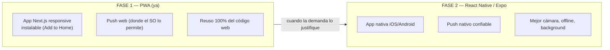
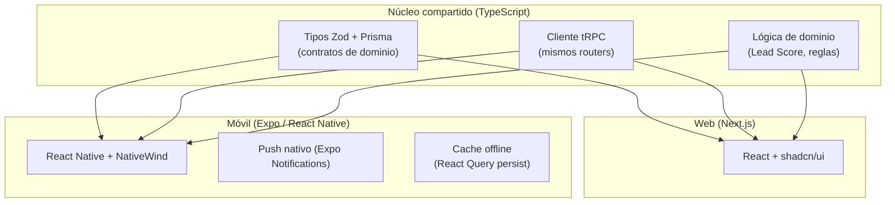

# 13 — UX/UI y App Móvil

> **Producto:** RealEstate OS — SaaS multi-tenant para inmobiliarias LATAM, centrado en el LEAD.
> **Audiencia:** diseño de producto, front-end, PM, fundadores.
> **Estado:** documento vivo. Define la filosofía de diseño, el sistema visual, la UX por rol, los patrones clave, las micro-interacciones y la estrategia de app móvil.

---

## 0. La tesis de diseño en una frase

> **El asesor no viene a "usar un CRM". Viene a saber a quién llamar ahora.** Todo lo demás es ruido.

RealEstate OS gana o pierde en la primera pantalla del asesor. Si al entrar ve una grilla de 40 columnas con filtros, perdimos. Si ve **tres cosas que hacer hoy, ordenadas por quién le va a comprar**, ganamos. Este documento existe para defender esa diferencia en cada decisión.

---

## 1. Principios de diseño

### 1.1 Los principios (anti-sobrecarga)

| # | Principio | Qué significa en la práctica |
|---|-----------|------------------------------|
| 1 | **Menos es más** | Cada pantalla muestra lo mínimo para tomar la próxima decisión. Si un dato no cambia una acción, no va en la vista principal. |
| 2 | **Foco en la acción siguiente** | La UI no describe el estado del mundo; sugiere el próximo paso. "Cliente esperando hace 12 min → Responder". |
| 3 | **Claridad sobre densidad** | Preferimos aire, jerarquía tipográfica y tarjetas legibles antes que tablas comprimidas. |
| 4 | **Velocidad percibida** | Updates optimistas, skeletons, tiempo real. La app se siente instantánea aunque la red no lo sea. |
| 5 | **Una decisión por vez** | Evitamos pantallas que piden 10 decisiones simultáneas. Flujos guiados, un foco claro. |
| 6 | **Progresive disclosure** | Lo avanzado se revela cuando se necesita (un clic más), no se apila por defecto. |
| 7 | **Consistencia** | Los mismos gestos y componentes significan lo mismo en todo el producto. |

### 1.2 Contraste explícito contra el CRM tradicional

```mermaid
flowchart LR
    subgraph Old["CRM tradicional (lo que NO somos)"]
        O1["Grilla infinita de filas"]
        O2["30 columnas, scroll horizontal"]
        O3["Filtros complejos que hay que armar"]
        O4["El usuario decide qué mirar"]
        O5["Data entry pesado"]
    end
    subgraph New["RealEstate OS"]
        N1["Feed de tarjetas accionables"]
        N2["Sólo lo que mueve la aguja"]
        N3["El sistema ya priorizó por vos"]
        N4["El producto decide qué mostrar primero"]
        N5["Captura pasiva desde WhatsApp"]
    end
    Old -.->|reemplazamos| New
```



| Dimensión | CRM tradicional | RealEstate OS |
|-----------|-----------------|---------------|
| Metáfora | Base de datos con vista | Panel de "qué hacer hoy" |
| Unidad visual | Fila de tabla | Tarjeta de lead accionable |
| Priorización | Manual (el usuario ordena/filtra) | Automática (Lead Score + Oportunidades del día) |
| Entrada de datos | Formularios largos | Captura desde conversaciones de WhatsApp |
| Tiempo real | Refrescar F5 | Push por WebSocket ("cliente esperando") |
| Objetivo de la home | Mostrar todo | Mostrar la próxima acción |

**Anti-objetivos explícitos (de la SPEC):** NO interfaces llenas de tablas. NO pantallas sobrecargadas. NO funciones innecesarias. Cada pedido de feature se pregunta: *¿esto ayuda al asesor a cerrar, o sólo agrega ruido?*

---

## 2. Sistema de diseño

### 2.1 Fundaciones

Base técnica: **shadcn/ui + TailwindCSS**, componentes accesibles (Radix por debajo), tematizables por tenant. Tokens en CSS variables para soportar modo claro/oscuro y branding por inmobiliaria.

### 2.2 Tokens de color

```
/* Neutrales (base de la interfaz "tranquila") */
--background        /* fondo app */
--foreground        /* texto principal */
--muted             /* fondos sutiles, secciones */
--muted-foreground  /* texto secundario */
--border            /* bordes suaves */

/* Marca (tematizable por tenant) */
--primary           /* acción principal, CTA */
--primary-foreground

/* Semánticos de estado del Lead / operación */
--hot      /* lead caliente / cliente esperando   → rojo/naranja */
--warm     /* lead templado / seguimiento próximo  → ámbar */
--cold     /* lead frío                            → azul/gris */
--success  /* ganado, tarea hecha                  → verde */
--danger   /* vencido, SLA roto                    → rojo */
```

Regla: **el color comunica temperatura y urgencia**, no decora. Un asesor debe entender "quién arde" por el color, sin leer.

### 2.3 Tipografía y densidad

| Uso | Estilo |
|-----|--------|
| Números clave (KPIs, Lead Score) | Grande, semibold, tabular |
| Títulos de sección | Medium, legible, sin gritar |
| Cuerpo | Cómodo (base 14–16px), buena altura de línea |
| Metadatos | Small, `muted-foreground` |

**Densidad**: media-baja por defecto. El asesor tiene aire; el Dueño (cockpit) tolera más densidad porque es una torre de control. Nunca la densidad de una planilla.

### 2.4 Componentes clave

| Componente | Uso |
|------------|-----|
| **LeadCard** | Tarjeta de lead con nombre, temperatura (color), Lead Score, próxima acción sugerida. Unidad atómica del producto. |
| **OpportunityFeedItem** | Ítem de "Oportunidades del día": lead + motivo + CTA. |
| **KanbanColumn / KanbanCard** | Pipeline con drag & drop. |
| **ConversationRow** | Fila de la bandeja tipo inbox (avatar, último mensaje, indicador "esperando"). |
| **LeadTimeline** | Timeline unificado en la ficha del Lead. |
| **AlertBanner** | Alerta con acción sugerida (no sólo aviso). |
| **StatCard / CockpitTile** | Métrica en vivo del Centro de Operaciones. |
| **AgendaItem** | Ítem de agenda / visita del día. |
| **EmptyState** | Estado vacío con ilustración + siguiente paso. |

### 2.5 Modo claro/oscuro

Soporte nativo vía tokens. El modo oscuro no es un "invert": se ajustan contrastes de los colores semánticos para que "caliente" siga leyéndose como urgencia sin encandilar.

### 2.6 Accesibilidad (WCAG 2.2 AA)

| Requisito | Implementación |
|-----------|----------------|
| Contraste texto ≥ 4.5:1 | Verificado en ambos modos; el estado nunca se comunica **sólo** por color (ícono + texto + color). |
| Navegación por teclado | Todo accionable con teclado; Kanban con drag&drop tiene alternativa por teclado (mover con flechas). |
| Foco visible | Anillos de foco claros en todos los controles. |
| Lectores de pantalla | Roles ARIA correctos (Radix ayuda); anuncios en vivo para "cliente esperando". |
| Targets táctiles | ≥ 44×44px en móvil. |
| Movimiento | Respetar `prefers-reduced-motion` en micro-interacciones. |

---

## 3. UX por rol

Tres roles, tres mentalidades. La misma data, tres puertas de entrada distintas.

### 3.1 Asesor — panel diario extremadamente simple

**Mentalidad:** "¿A quién atiendo ahora?" El asesor vive con el celular en la mano y poco tiempo. Su panel es lo más simple del producto.

**Qué ve al entrar (orden de prioridad, de arriba hacia abajo):**
1. **Cliente esperando** (lo más urgente): conversaciones nuevas de WhatsApp sin responder, con tiempo de espera. Rojo si supera SLA.
2. **Oportunidades del día**: feed accionable de leads que el sistema priorizó (por Lead Score y señales). Cada uno con un *motivo* y un *CTA*.
3. **Agenda / Visitas del día**: qué tiene hoy, en orden cronológico.
4. **Seguimientos pendientes**: tareas de follow-up que vencen hoy.
5. **Mi pipeline** (acceso, no protagonista): un vistazo al Kanban personal.

El **Lead Score** y **Oportunidades del día** son el motor: no le pedimos al asesor que decida a quién llamar; **le decimos a quién llamar y por qué**. Esa es toda la diferencia con un CRM.

#### Wireframe — Panel del Asesor (desktop)

```
┌──────────────────────────────────────────────────────────────────────┐
│  RealEstate OS          Hola, Sofía 👋            🔔 3   ◐   [ Sofía ▾]│
├──────────────────────────────────────────────────────────────────────┤
│                                                                        │
│  🔴 CLIENTE ESPERANDO (2)                                              │
│  ┌────────────────────────────┐ ┌────────────────────────────┐        │
│  │ Marta G.   ⏱ 12 min        │ │ Juan P.    ⏱ 4 min         │        │
│  │ "Hola, sigue disponible?"  │ │ "Me pasás fotos del depto?"│        │
│  │            [ Responder → ]  │ │            [ Responder → ] │        │
│  └────────────────────────────┘ └────────────────────────────┘        │
│                                                                        │
│  ⭐ OPORTUNIDADES DEL DÍA (4)                                          │
│  ┌────────────────────────────────────────────────────────────────┐  │
│  │ 🔥 92  Carla V.   ·  Motivo: visitó 3 props + respondió rápido │  │
│  │        Última: hace 2 h            [ Llamar ]  [ WhatsApp → ]   │  │
│  ├────────────────────────────────────────────────────────────────┤  │
│  │ 🔥 87  Diego M.   ·  Motivo: pidió precio, no le contestaron    │  │
│  │        Última: ayer                [ Llamar ]  [ WhatsApp → ]   │  │
│  ├────────────────────────────────────────────────────────────────┤  │
│  │ 🟠 74  Lucía R.   ·  Motivo: seguimiento programado hoy         │  │
│  │        Última: hace 3 días         [ Ver ficha → ]             │  │
│  └────────────────────────────────────────────────────────────────┘  │
│                                                                        │
│  📅 HOY                              ✓ SEGUIMIENTOS (3)                │
│  ┌──────────────────────────────┐   ┌──────────────────────────────┐  │
│  │ 11:00  Visita — Belgrano 1420│   │ ☐ Llamar a Pedro (venció)   │  │
│  │ 15:30  Visita — Palermo 88   │   │ ☐ Enviar tasación a Ana     │  │
│  │ 18:00  Llamado — Ramírez     │   │ ☐ Confirmar visita Belgrano │  │
│  └──────────────────────────────┘   └──────────────────────────────┘  │
│                                                                        │
│  ▸ Mi pipeline (12 leads)   ·   ▸ Clientes asignados (48)             │
└──────────────────────────────────────────────────────────────────────┘
```

Nota de diseño: **una sola pantalla, sin scroll horizontal, sin tablas.** Lo urgente arriba, el pipeline como link secundario. El asesor entra, ve rojo → responde; ve una oportunidad 🔥 → llama. Cinco segundos para saber qué hacer.

### 3.2 Gerente — supervisión y asignación

**Mentalidad:** "¿Cómo va mi equipo y dónde tapo agujeros?" El gerente supervisa asesores, reasigna leads, y detecta cuellos de botella (leads sin atender, asesores saturados).

**Qué ve al entrar:**
1. **Salud del equipo**: por asesor, cuántos leads calientes tiene, cuántos sin responder, tiempo de respuesta.
2. **Leads sin asignar / mal atendidos**: cola de leads que necesitan reasignación.
3. **Pipeline del equipo**: Kanban agregado con filtro por asesor.
4. **Alertas de supervisión**: SLAs rotos, oportunidades que se enfrían.

#### Wireframe — Panel del Gerente (desktop)

```
┌──────────────────────────────────────────────────────────────────────┐
│  RealEstate OS · Supervisión        Sucursal Centro     🔔 5   ◐      │
├──────────────────────────────────────────────────────────────────────┤
│  SALUD DEL EQUIPO                                    [ Reasignar ▾ ]   │
│  ┌────────────┬─────────┬──────────┬───────────┬────────────────────┐ │
│  │ Asesor     │ 🔥 Cal. │ Sin resp.│ T. resp.  │ Carga              │ │
│  ├────────────┼─────────┼──────────┼───────────┼────────────────────┤ │
│  │ Sofía      │   4     │   0  ✓   │  6 min    │ ████████░░  ok      │ │
│  │ Diego      │   7     │   3  ⚠   │  41 min   │ ██████████  alto    │ │
│  │ Ana        │   2     │   0  ✓   │  9 min    │ ████░░░░░░  bajo    │ │
│  └────────────┴─────────┴──────────┴───────────┴────────────────────┘ │
│                                                                        │
│  ⚠ NECESITAN ATENCIÓN                                                  │
│  ┌────────────────────────────────────────────────────────────────┐  │
│  │ 🔴 3 leads calientes de Diego sin responder hace > 40 min       │  │
│  │    → Sugerido: reasignar a Ana (baja carga)   [ Reasignar → ]   │  │
│  ├────────────────────────────────────────────────────────────────┤  │
│  │ 🟠 5 leads sin asignar en la última hora     [ Distribuir → ]   │  │
│  └────────────────────────────────────────────────────────────────┘  │
│                                                                        │
│  PIPELINE DEL EQUIPO            [ Todos ▾ ] [ Esta semana ▾ ]         │
│  Nuevo(18) → Contactado(24) → Visita(9) → Negociación(5) → Cierre(3) │
│  [ mini-kanban con conteos y drag para reasignar ]                    │
└──────────────────────────────────────────────────────────────────────┘
```

Nota: hay una tabla acá, pero es **corta, escaneada, orientada a decisión** (una fila por asesor, no por lead), y siempre acompañada de una **acción sugerida**. No es un data grid genérico.

### 3.3 Dueño — Centro de Operaciones (torre de control)

**Mentalidad:** "¿Cómo está el negocio, ahora mismo?" El Dueño ve todo. Su vista es un **cockpit en tiempo real**: pulso del negocio, no operación de detalle.

**Layout tipo cockpit (denso pero legible), todo en vivo por WebSocket:**
- **Fila superior de KPIs**: leads hoy, tasa de respuesta, conversión, ingresos proyectados.
- **Mapa de calor de actividad**: qué sucursales/asesores están activos ahora.
- **Feed de eventos en vivo**: mensajes entrantes, visitas confirmadas, cierres.
- **Embudo global**: pipeline agregado de toda la inmobiliaria.
- **Alertas ejecutivas**: SLAs sistémicos, oportunidades grandes en riesgo.

#### Wireframe — Centro de Operaciones / Dueño (cockpit)

```
┌──────────────────────────────────────────────────────────────────────┐
│ CENTRO DE OPERACIONES · en vivo ●        Inmobiliaria Norte    ◐  ▾   │
├────────────┬────────────┬────────────┬────────────┬──────────────────┤
│ LEADS HOY  │ T. RESP.   │ CONVERSIÓN │ VISITAS    │ INGRESO PROY.     │
│    128 ▲   │  8 min ▲   │   6.4% ▬   │   19 hoy   │  US$ 42.500       │
├────────────┴────────────┴────────────┴────────────┴──────────────────┤
│                                                                        │
│  EMBUDO GLOBAL (en vivo)              │  FEED EN VIVO ●                │
│  Nuevo        ████████████  128       │  14:03 🟢 Diego cerró Palermo │
│  Contactado   █████████     96        │  14:01 💬 Nuevo lead — Web     │
│  Visita       ████          41        │  13:58 📅 Visita confirmada    │
│  Negociación  ██            18        │  13:55 🔴 Lead esperando 20min │
│  Cierre       █             7         │  13:52 💬 Marta respondió      │
│                                        │  13:49 🟢 Ana agendó visita    │
│  ACTIVIDAD POR SUCURSAL               │  ...                           │
│  Centro   ●●●●●●○○  6/8 online        │                                │
│  Norte    ●●●○○     3/5 online        ├────────────────────────────────┤
│  Sur      ●●●●      4/4 online        │  ⚠ ALERTAS EJECUTIVAS          │
│                                        │  🔴 SLA roto en Centro (3)     │
│                                        │  🟠 Oportunidad US$120k en     │
│                                        │     riesgo (sin contacto 2d)   │
│                                        │        [ Ver → ]               │
└───────────────────────────────────────┴────────────────────────────────┘
```

Nota: el cockpit **tolera densidad** porque es una torre de control, pero mantiene jerarquía: KPIs grandes arriba, embudo visual (barras, no tablas), feed en vivo que se actualiza solo. El Dueño no opera leads acá; **entiende el negocio de un vistazo**.

---

## 4. Patrones UX clave

### 4.1 Pipeline Kanban con drag & drop

- Columnas = etapas del pipeline (Nuevo → Contactado → Visita → Negociación → Cierre).
- Cada tarjeta es un **LeadCard** (nombre, temperatura por color, Lead Score, próxima acción).
- **Drag & drop** para mover de etapa; al soltar, update optimista + persistencia + emisión de evento (WebSocket) para que Gerente/Dueño lo vean en vivo.
- **Alternativa por teclado** (accesibilidad): seleccionar tarjeta + flechas para mover.
- WIP visual: columnas con muchos leads muestran conteo; no se saturan visualmente.

### 4.2 Ficha del Lead — timeline unificado

El corazón del producto centrado en el lead. Una sola ficha reúne **todo** lo que pasó con esa persona, en orden cronológico:

```
┌──────────────────────────────────────────────────────────────┐
│  ← Carla Vega        🔥 Lead Score 92    [ WhatsApp ] [ ⋯ ]   │
│  Asignado a: Sofía · Etapa: Visita · Presupuesto: US$110k     │
├───────────────────────────────┬──────────────────────────────┤
│  TIMELINE UNIFICADO           │  DATOS                        │
│  ┌──────────────────────────┐ │  📞 +54 11 ...               │
│  │ 💬 Hoy 14:02              │ │  ✉ carla@...                 │
│  │   "Me encantó el de Bel." │ │  🏠 Interés: 2 amb, Belgrano │
│  ├──────────────────────────┤ │  💰 US$ 90k–110k             │
│  │ 📅 Ayer — Visita Belgrano │ │  🔖 Fuente: WhatsApp Web     │
│  │   Confirmada · Realizada  │ ├──────────────────────────────┤
│  ├──────────────────────────┤ │  PRÓXIMA ACCIÓN (sugerida)    │
│  │ ✓ Ayer — Tarea: enviar   │ │  📞 Llamar para cerrar visita │
│  │   ficha técnica ✓        │ │      [ Hecho ]  [ Reprogramar]│
│  ├──────────────────────────┤ ├──────────────────────────────┤
│  │ 📄 Hace 2d — Contrato.pdf│ │  DOCUMENTOS (2)               │
│  ├──────────────────────────┤ │  📄 Contrato.pdf              │
│  │ 💬 Hace 3d — 1er contacto│ │  📄 Tasación.pdf              │
│  └──────────────────────────┘ │                              │
└───────────────────────────────┴──────────────────────────────┘
```

El timeline **mezcla conversaciones, tareas, visitas y documentos** en un solo hilo. El asesor no salta entre pestañas: la historia completa está en un scroll.

### 4.3 Bandeja de conversaciones — estilo inbox

- Lista tipo email/WhatsApp Web: avatar, nombre, último mensaje, timestamp, **indicador de "esperando"** (punto rojo + tiempo).
- Panel de conversación a la derecha; ficha del lead accesible en un clic.
- Ordenada por urgencia (esperando primero), no cronológica pura.
- Respuestas rápidas / plantillas para agilizar.

### 4.4 Oportunidades del día — feed accionable

No es una lista de leads: es un **feed de acciones sugeridas**. Cada ítem responde tres preguntas: *¿quién?*, *¿por qué ahora?*, *¿qué hago?*

```
🔥 92  Carla V.  ·  visitó 3 props + respondió rápido  →  [ Llamar ]
```

El *motivo* (generado por el Lead Score y señales) es lo que lo hace accionable. Sin motivo, sería otra lista más.

### 4.5 Alertas con acción sugerida

Una alerta que sólo avisa genera fatiga. Cada alerta trae **la acción para resolverla**:

| Alerta | Acción sugerida embebida |
|--------|--------------------------|
| Lead caliente sin responder > 30 min | [ Responder ] / [ Reasignar ] |
| Oportunidad grande enfriándose | [ Ver ficha ] / [ Agendar llamado ] |
| Visita mañana sin confirmar | [ Enviar confirmación ] |
| SLA de sucursal roto | [ Ver leads afectados ] |

---

## 5. Micro-interacciones y feedback en tiempo real

| Interacción | Comportamiento |
|-------------|----------------|
| **Updates optimistas** | Mover una tarjeta de Kanban, marcar tarea hecha, enviar mensaje: la UI reacciona **al instante**; si el servidor falla, revierte con un toast. React Query maneja optimistic updates + rollback. |
| **"Cliente esperando"** | Punto pulsante + contador de tiempo que sube en vivo. Al pasar el SLA, cambia a rojo. Empujado por WebSocket, no por refresh. |
| **Nuevo lead entra** | La tarjeta aparece con una animación sutil de entrada; suena/notifica según preferencia. |
| **Presencia** | Puntos de "online" de asesores en el cockpit se actualizan en vivo (presence de Ably). |
| **Skeletons** | Nunca pantalla en blanco: skeletons mientras carga, dando sensación de velocidad. |
| **Feedback de acción** | Toasts breves y no intrusivos ("Lead reasignado a Ana"), con undo cuando aplica. |
| **Drag & drop** | Sombra/placeholder de dónde caerá la tarjeta; la columna destino se resalta. |
| **Reduced motion** | Todas las animaciones respetan `prefers-reduced-motion`. |

Principio: **el tiempo real no es una feature técnica, es una sensación**. El asesor tiene que sentir que el sistema está vivo y le avisa; el Dueño tiene que ver el negocio latir.

---

## 6. Onboarding y estados vacíos

### 6.1 Onboarding

- **Por rol**: el asesor recibe un onboarding distinto (2 minutos, cómo responder y usar Oportunidades del día) que el Dueño (conectar WhatsApp, invitar al equipo, ver el cockpit).
- **Conectar WhatsApp primero**: el mayor "aha moment" es ver un mensaje real entrar al inbox. El onboarding empuja a conectar la Cloud API cuanto antes.
- **Guiado, no manual**: tooltips contextuales in-app y checklist de setup ("1. Conectá WhatsApp · 2. Invitá asesores · 3. Cargá tus propiedades"), no un PDF.
- **Datos de ejemplo opcionales**: un tenant nuevo puede ver un lead demo para entender la ficha sin esperar tráfico real.

### 6.2 Estados vacíos (empty states)

Un estado vacío nunca es una pantalla muerta: explica y ofrece el siguiente paso.

| Pantalla vacía | Mensaje + acción |
|----------------|------------------|
| Sin conversaciones | "Todavía no hay mensajes. Conectá WhatsApp para empezar a recibir leads." → [ Conectar WhatsApp ] |
| Sin oportunidades hoy | "Ninguna oportunidad urgente 🎉 Buen momento para seguir a tus leads templados." → [ Ver pipeline ] |
| Pipeline vacío | "Tu pipeline está vacío. Los leads nuevos aparecerán acá automáticamente." |
| Sin agenda | "No tenés visitas hoy. ¿Agendás una?" → [ Nueva visita ] |
| Sin asesores (Dueño) | "Invitá a tu equipo para empezar a asignar leads." → [ Invitar asesores ] |

Tono: cercano, rioplatense, orientado a la acción. El vacío se celebra cuando es bueno ("ninguna oportunidad urgente 🎉") y se resuelve cuando es setup pendiente.

---

## 7. Estrategia de app móvil futura

### 7.1 El problema

El asesor inmobiliario **vive en la calle y en el celular**. Muchas de sus interacciones (responder WhatsApp, confirmar una visita, ver su agenda) ocurren fuera del escritorio. La estrategia móvil no es opcional a mediano plazo.

### 7.2 Decisión: PWA primero, React Native (Expo) después



**Por qué PWA primero:**
- **Costo/tiempo cero de reuso**: la app ya es Next.js responsive. Diseñando mobile-first las vistas del asesor, obtenemos una app instalable sin construir un cliente nuevo.
- **Un solo deploy, cero fricción de stores**: sin revisiones de App Store para iterar.
- **Cubre el 80% del caso**: responder conversaciones, ver agenda/visitas del día, ver Oportunidades del día.

**Por qué React Native / Expo después (y no otro stack):**
- **Reuso de lógica TS**: compartimos tipos (Zod/Prisma), el **cliente tRPC** y la lógica de dominio con la web. Expo + tRPC es un fit natural con nuestro stack; no reimplementamos contratos.
- **Push nativo confiable**: la limitación real de la PWA es el push en iOS. Cuando el push sea crítico para el negocio (y lo es: "cliente esperando"), justificamos el salto a nativo.
- **Cámara, background, offline serio**: subir fotos de propiedades, notificaciones en background y offline robusto se hacen mejor en nativo.

> **Justificación de la elección:** empezamos donde el costo marginal es casi cero (PWA sobre el mismo código) y saltamos a nativo (Expo) sólo cuando el **push confiable** y el **uso en la calle** lo pidan. Expo gana sobre Flutter/nativo puro porque **maximiza el reuso de nuestro TypeScript** (tipos + cliente tRPC), que es nuestra mayor ventaja de arquitectura.

### 7.3 Qué features van a móvil primero

| Prioridad | Feature | Por qué |
|-----------|---------|---------|
| 1 | **WhatsApp / Conversaciones** | Es el 80% del trabajo del asesor y es intrínsecamente móvil. |
| 2 | **Notificaciones push** | "Cliente esperando", nuevo lead, visita a confirmar. El disparador de que abra la app. |
| 3 | **Oportunidades del día** | El feed accionable: a quién llamar, en el bolsillo. |
| 4 | **Agenda / Visitas del día** | Se consulta en la calle, camino a una visita. |
| 5 | **Ficha del Lead (lectura + acciones rápidas)** | Ver historia y marcar acciones sin abrir la laptop. |

Lo que **no** va a móvil primero: reportes del Dueño, configuración pesada, el cockpit completo (se ve mejor en pantalla grande). Móvil es la app del **asesor en movimiento**, no una copia del escritorio.

### 7.4 Arquitectura compartida



- **Contratos y cliente tRPC compartidos**: la app móvil consume los **mismos routers** que la web. Un cambio de contrato se refleja tipado en ambos, sin drift.
- **UI no se comparte** (React DOM vs React Native), pero se puede alinear con **NativeWind** (Tailwind en RN) para reusar tokens de diseño.
- **Estado**: React Query en ambos, con persistencia offline en móvil.

### 7.5 Offline y notificaciones push

| Aspecto | Estrategia |
|---------|------------|
| **Offline (lectura)** | React Query con persistencia: la agenda del día, las oportunidades y la ficha del lead quedan cacheadas y son visibles sin señal. |
| **Offline (escritura)** | Cola optimista: marcar una tarea o escribir una nota se encola y sincroniza al recuperar red. Conflictos resueltos last-write-wins con timestamp del servidor. |
| **Push nativo** | Expo Notifications → tokens por dispositivo asociados al usuario/tenant. Los eventos del outbox (nuevo lead, cliente esperando, visita a confirmar) disparan push segmentado. |
| **Deep links** | La notificación abre directo la conversación o ficha correspondiente, no la home. |
| **Respeto de foco** | No spamear: agrupar notificaciones, respetar horario laboral del asesor, silenciar lo no urgente. |

---

## 8. Checklist de diseño

- [ ] Ninguna vista principal del asesor es una tabla
- [ ] La home del asesor comunica la próxima acción en < 5 segundos
- [ ] El color comunica temperatura/urgencia y nunca es el único canal (ícono + texto)
- [ ] Todo estado accionable tiene una acción sugerida embebida
- [ ] Updates optimistas con rollback en Kanban, tareas y mensajes
- [ ] "Cliente esperando" en vivo por WebSocket, con SLA visual
- [ ] Kanban drag&drop con alternativa por teclado (accesibilidad)
- [ ] Ficha del Lead con timeline unificado (conversaciones + tareas + visitas + documentos)
- [ ] Empty states con siguiente paso, tono rioplatense
- [ ] Onboarding por rol, "conectar WhatsApp" primero
- [ ] Modo claro/oscuro con contrastes AA en ambos
- [ ] WCAG 2.2 AA verificado (contraste, teclado, foco, lectores)
- [ ] Mobile-first en las vistas del asesor (habilita PWA sin reescribir)
- [ ] Cliente tRPC y tipos listos para reuso en Expo

---

## 9. Módulos / pantallas nombrados

Para consistencia con el resto de la documentación:

**Pantallas por rol**
- **Panel del Asesor** — Cliente esperando · Oportunidades del día · Agenda/Visitas del día · Seguimientos · Mi pipeline · Clientes asignados.
- **Panel del Gerente** — Salud del equipo · Necesitan atención (reasignación) · Pipeline del equipo · Alertas de supervisión.
- **Centro de Operaciones (Dueño)** — Cockpit: KPIs en vivo · Embudo global · Feed en vivo · Actividad por sucursal · Alertas ejecutivas.

**Patrones / componentes**
- **LeadCard**, **OpportunityFeedItem**, **KanbanColumn/KanbanCard**, **ConversationRow**, **LeadTimeline**, **AlertBanner**, **StatCard/CockpitTile**, **AgendaItem**, **EmptyState**.

**Vistas transversales**
- **Bandeja de Conversaciones** (inbox), **Ficha del Lead** (timeline unificado), **Pipeline Kanban**, **Oportunidades del día** (feed accionable).

**Móvil (futuro)**
- **App del Asesor (PWA → Expo)** — Conversaciones · Push · Oportunidades del día · Agenda/Visitas · Ficha del Lead (lectura + acciones rápidas), con núcleo TS compartido (tipos + cliente tRPC).
