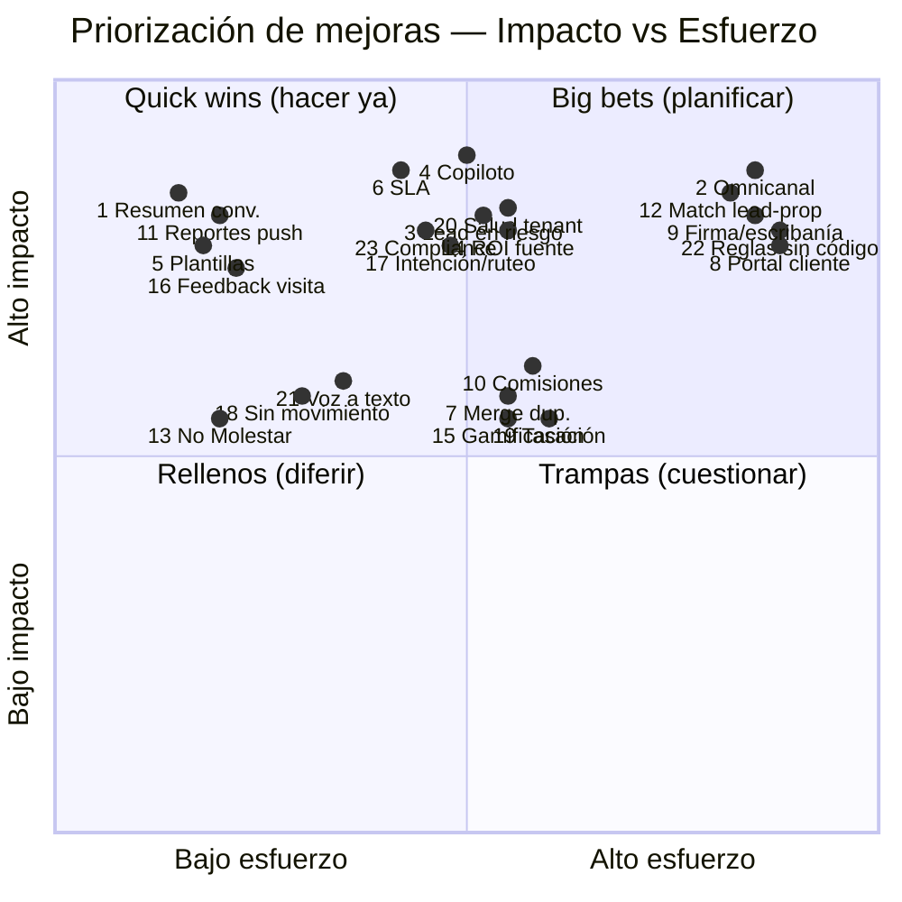

# 14 · Mejoras Propuestas

> Documento vivo de **oportunidades de producto** detectadas durante el diseño de **RealEstate OS**.
> Cada mejora acá listada **no estaba explícita** en el brief original: surgió del ejercicio de arquitectura y de mirar el negocio inmobiliario LATAM con ojos de producto.
> Todas respetan la restricción central: **IA sólo operativa** (responder, clasificar, resumir, priorizar, rutear). **Nunca** IA para editar fotos, home staging ni generar imágenes.

---

## Cómo leer este documento

RealEstate OS está pensado para competir a nivel LATAM durante los próximos 10 años. Eso obliga a distinguir entre lo que hay que construir **ya** (para tener un producto vendible y pegajoso) y lo que se puede diferir sin perder el tren. Este documento ordena esa conversación.

La tesis del producto es simple y hay que defenderla en cada mejora: **el centro es el LEAD, no la propiedad**. La propiedad es un atributo del lead ("qué está buscando / qué tiene para vender"). Toda mejora que proponemos empuja en la misma dirección: que el asesor responda más rápido, que ningún lead se pierda por olvido, y que el dueño vea la salud real de su operación.

Cada mejora sigue esta ficha:

- **Nombre**
- **Problema que resuelve**
- **Descripción**
- **Por qué aporta valor** (con impacto estimado en tiempo de respuesta / conversión / retención)
- **Complejidad** (baja / media / alta)
- **Fase sugerida** (MVP / V2 / V3)
- **Riesgos**

Las estimaciones de impacto son direccionales, basadas en benchmarks del sector (velocidad de primer contacto, tasa de no-respuesta, churn de leads tibios). Están para priorizar, no para prometer.

---

## Índice de mejoras

| # | Mejora | Complejidad | Fase |
|---|--------|-------------|------|
| 1 | Resumen automático de conversación (IA) | Baja | MVP |
| 2 | Bandeja unificada omnicanal (abstracción `Channel`) | Alta | V2 |
| 3 | Detección de lead en riesgo / churn temprano | Media | V2 |
| 4 | Copiloto de respuestas sugeridas (asesor aprueba) | Media | MVP+ |
| 5 | Plantillas con variables + biblioteca compartida | Baja | MVP |
| 6 | SLA de respuesta con semáforo y escalamiento | Media | MVP |
| 7 | Detección y merge de leads duplicados | Media | V2 |
| 8 | Portal del cliente | Alta | V3 |
| 9 | Firma de reserva digital + checklist de escribanía | Alta | V2 |
| 10 | Cálculo de comisiones y liquidación por asesor | Media | V2 |
| 11 | Reportes automáticos push (WhatsApp/email al dueño) | Baja | MVP |
| 12 | Match semántico lead ↔ propiedad | Alta | V2 |
| 13 | Modo No Molestar + horarios de atención por asesor | Baja | MVP |
| 14 | Analítica de origen de leads (ROI por fuente) | Media | V2 |
| 15 | Gamificación / objetivos para asesores | Media | V2 |
| 16 | Automatización de feedback post-visita | Baja | MVP |
| 17 | Detección de intención compra vs alquiler + ruteo | Media | MVP+ |
| 18 | Alertas de propiedades sin movimiento + acción sugerida | Baja | V2 |
| 19 | Tasación / valor de mercado como dato del lead | Media | V3 |
| 20 | Consola de salud del tenant (adopción del equipo) | Media | V2 |
| 21 | Voz a texto en notas de WhatsApp del cliente | Baja | V2 |
| 22 | Reglas de negocio sin código (constructor visual) | Alta | V3 |
| 23 | Registro de consentimiento y cumplimiento (opt-in/opt-out) | Media | MVP |

---

## 1 · Resumen automático de conversación (IA)

**Problema que resuelve.** Un lead puede tener semanas de historial disperso en WhatsApp. Cuando un asesor retoma (o cuando se reasigna el lead por vacaciones/rotación), tiene que leer decenas de mensajes para entender en qué quedó. Eso consume minutos por lead y genera errores ("¿ya le mandé la ficha del 2 ambientes?").

**Descripción.** Al abrir una conversación, el sistema muestra arriba un bloque **"En qué quedamos"**: 3-5 bullets con lo relevante (qué busca, presupuesto, objeciones, próximo paso comprometido, última propiedad enviada). Se regenera cuando hay mensajes nuevos sin leer. La IA resume, no decide ni escribe al cliente.

**Por qué aporta valor.**
- **Tiempo de respuesta:** baja el tiempo de "levantar contexto" de ~2-3 min a segundos. En un equipo con 200 leads activos esto es horas semanales recuperadas.
- **Conversión:** reduce el error de repetir/olvidar el próximo paso, que es una causa silenciosa de leads que se enfrían.
- **Retención (del cliente inmobiliaria):** es una de esas features que "se sienten" en la demo. Alto efecto wow, bajo costo.

**Complejidad.** Baja. Es un caso de resumen sobre texto ya almacenado; el costo real es el prompt engineering y el cacheo del resumen para no re-pagar tokens en cada apertura.

**Fase.** MVP. Es barato y es diferenciador desde el día uno.

**Riesgos.**
- Alucinación de datos (que "invente" un presupuesto). Mitigación: resumen extractivo anclado a mensajes, con link al mensaje fuente por bullet.
- Datos sensibles del cliente pasando por el modelo. Mitigación: política de proveedor sin retención de datos + minimización de PII en el prompt.

---

## 2 · Bandeja unificada omnicanal (abstracción `Channel`)

**Problema que resuelve.** Los leads llegan por WhatsApp, Instagram DM, Facebook Messenger, mail y el chat de la landing. Hoy el asesor salta entre apps y pierde el hilo; peor: el mismo cliente aparece "dos veces" por dos canales distintos.

**Descripción.** Introducir un **puerto `Channel`** en la arquitectura hexagonal: cada canal (WhatsApp Cloud API, Meta Messaging, email, web chat) es un **adapter** que normaliza mensajes a un modelo común (`inbound_message`, `outbound_message`, `contact_handle`). La bandeja del asesor es una sola, agnóstica al canal; el envío elige el canal según el `handle` del contacto.

**Por qué aporta valor.**
- **Tiempo de respuesta:** una sola cola de trabajo, sin cambiar de app. Menos mensajes que se quedan sin responder por estar "en la otra bandeja".
- **Conversión:** captura leads de Instagram/Facebook (enorme en LATAM inmobiliario) dentro del mismo pipeline y Lead Score.
- **Retención:** es el tipo de feature que sube el "costo de irse" — cuando toda la comunicación vive acá, el CRM se vuelve el sistema operativo real de la inmobiliaria.

**Complejidad.** Alta. Cada plataforma tiene su modelo de webhooks, ventanas de mensajería, límites y aprobaciones. Pero **si la abstracción se diseña bien desde el MVP** (aunque sólo WhatsApp esté implementado), agregar canales después es incremental.

**Fase.** V2 para los canales extra; **el puerto `Channel` se diseña en el MVP** aunque sólo tenga un adapter (WhatsApp). Diseñar la abstracción tarde es la deuda técnica más cara de este producto.

**Riesgos.**
- Ventanas de 24h y políticas de plantillas difieren por canal → confunden al asesor. Mitigación: la UI muestra el estado de la ventana por conversación.
- Dependencia de aprobaciones de Meta. Mitigación: degradar con elegancia (canal no habilitado ≠ app rota).

---

## 3 · Detección de lead en riesgo / churn temprano

**Problema que resuelve.** Los leads no se pierden de golpe: se enfrían. Un lead que estaba "Interesado" y lleva 6 días sin respuesta, o que dejó de abrir los mensajes, se está yendo — y nadie se entera hasta que es tarde.

**Descripción.** Un scoring operativo de **riesgo de pérdida** por lead, explicable, basado en señales: días sin contacto, caída de ritmo de respuesta, etapa vs tiempo esperado en etapa, objeciones no resueltas. Genera una lista **"En riesgo hoy"** y una alerta accionable ("Reactivá a Juan: 5 días en Negociación sin avance"). La IA prioriza y explica; el asesor actúa.

**Por qué aporta valor.**
- **Conversión / rescate:** recuperar aunque sea un 5-10% de leads tibios que hoy se pierden por olvido es dinero directo. En inmobiliaria un solo lead rescatado paga meses de suscripción.
- **Retención:** el dueño ve que el software "trabaja para él" evitando pérdidas, no sólo registrando datos.

**Complejidad.** Media. Reusa el motor de Lead Score y el event log; el desafío es calibrar umbrales para que la lista sea corta y creíble (no ruido).

**Fase.** V2. Necesita historial suficiente para que las señales sean confiables.

**Riesgos.**
- Fatiga de alertas si marca demasiados leads. Mitigación: límite diario y foco en top-N por impacto.
- Señales engañosas (cliente de vacaciones). Mitigación: explicabilidad + acción de "posponer".

---

## 4 · Copiloto de respuestas sugeridas (el asesor aprueba)

**Problema que resuelve.** Responder rápido y bien, a toda hora, con tono profesional, es agotador. El primer contacto tardío es el asesino nº1 de conversión inmobiliaria.

**Descripción.** Al recibir un mensaje, el sistema propone **1-3 borradores** de respuesta contextualizados (usando historial, propiedad de interés, plantillas). El asesor **edita y envía** — la IA nunca manda sola. Es estrictamente operativo: redacta texto, no toma decisiones comerciales ni promete precios.

**Por qué aporta valor.**
- **Tiempo de respuesta:** convierte "escribir desde cero" en "aprobar/ajustar". Baja el tiempo de respuesta drásticamente, sobre todo fuera de horario pico.
- **Conversión:** primer contacto más veloz y consistente = más leads que avanzan de etapa.
- **Retención:** los asesores lo adoran (les saca la parte tediosa), y la adopción del equipo es lo que retiene al tenant.

**Complejidad.** Media. El reto no es generar texto sino **anclar el borrador** al contexto correcto y evitar promesas indebidas.

**Fase.** MVP+ (inmediatamente después del núcleo de conversaciones). Es un diferenciador de venta enorme.

**Riesgos.**
- Que sugiera algo comercialmente inapropiado (comprometer precio/plazos). Mitigación: guardarraíles de prompt + revisión humana obligatoria + plantillas aprobadas como base.
- Homogeneización del tono. Mitigación: el asesor siempre edita; aprender del estilo de las respuestas enviadas (opt-in).

---

## 5 · Plantillas con variables + biblioteca compartida

**Problema que resuelve.** Cada asesor reescribe los mismos mensajes (bienvenida, envío de ficha, recordatorio de visita) con calidad desigual. Y las plantillas de WhatsApp Business requieren gestión formal.

**Descripción.** Biblioteca de plantillas a nivel inmobiliaria, con **variables** (`{{nombre}}`, `{{propiedad}}`, `{{fecha_visita}}`), categorías y permisos (quién puede editar). Integra el flujo de **aprobación de plantillas de WhatsApp** para mensajes fuera de la ventana de 24h.

**Por qué aporta valor.**
- **Tiempo de respuesta:** insertar una plantilla con datos ya resueltos toma segundos.
- **Conversión:** mensajes consistentes y profesionales; menos errores.
- **Retención:** el conocimiento de "qué mensaje funciona" queda en la empresa, no en la cabeza de cada asesor. Sube el costo de cambiar de sistema.

**Complejidad.** Baja (la parte de variables y biblioteca). Media si se integra el ciclo de aprobación de plantillas de WhatsApp.

**Fase.** MVP. Es infraestructura básica de conversaciones y habilita el copiloto (#4).

**Riesgos.**
- Rechazo de plantillas por Meta. Mitigación: guía de redacción y estados visibles.
- Plantillas desactualizadas. Mitigación: dueño de plantilla + fecha de revisión.

---

## 6 · SLA de respuesta con semáforo y escalamiento automático

**Problema que resuelve.** "Contestá rápido" no es una política, es un deseo. Sin un SLA medible, los leads sin responder se acumulan invisibles y el gerente se entera tarde.

**Descripción.** SLA **configurable por tenant** (ej: primer contacto < 5 min en horario laboral). Cada lead/conversación muestra un **semáforo** (verde/amarillo/rojo). Al vencer el SLA, **escalamiento automático**: reasignar, notificar al gerente, o disparar auto-respuesta de "ya te contactamos". Todo queda en Auditoría.

**Por qué aporta valor.**
- **Tiempo de respuesta:** es literalmente el KPI que esta feature ataca. Equipos con SLA visible responden materialmente más rápido.
- **Conversión:** el vínculo velocidad→conversión en inmobiliaria está bien documentado; responder en minutos vs horas cambia la tasa de contacto efectivo.
- **Retención:** el gerente tiene por fin control operativo real. Es una razón de compra para el rol Gerente.

**Complejidad.** Media. Requiere scheduler/timers confiables, horarios laborales y reglas de escalamiento; encaja natural en el modelo event-driven.

**Fase.** MVP. Es parte del corazón "que ningún lead se pierda".

**Riesgos.**
- Escalamientos ruidosos si el SLA está mal calibrado. Mitigación: valores por defecto sensatos + simulación antes de activar.
- Depender del reloj del sistema/timezones. Mitigación: timezone por sucursal, tests exhaustivos.

---

## 7 · Detección y merge de leads duplicados

**Problema que resuelve.** El mismo cliente escribe por WhatsApp hoy y completa la landing mañana con otro teléfono. Se crean dos leads, dos asesores lo trabajan, el cliente recibe mensajes cruzados y la data de conversión se ensucia.

**Descripción.** Motor de deduplicación por señales (teléfono normalizado, email, nombre + propiedad de interés) que **sugiere posibles duplicados** y permite **merge** conservando historial de ambos canales, con auditoría del merge y posibilidad de deshacer.

**Por qué aporta valor.**
- **Conversión:** un solo hilo coherente por cliente evita la fricción de mensajes contradictorios.
- **Retención / confianza en la data:** los reportes y el Lead Score dejan de estar inflados por duplicados. La dirección confía en los números.

**Complejidad.** Media. La detección es tratable (normalización + reglas + fuzzy match); lo delicado es el **merge sin pérdida** y la reversibilidad.

**Fase.** V2. Se vuelve necesaria cuando entran varios canales (#2).

**Riesgos.**
- Merge equivocado (dos personas distintas). Mitigación: siempre sugerido, nunca automático; deshacer disponible.
- Colisión con RBAC (leads de asesores distintos). Mitigación: el merge respeta reglas de asignación y deja rastro.

---

## 8 · Portal del cliente

**Problema que resuelve.** El cliente vive a ciegas: no sabe qué propiedades le mandaron, cuándo es su próxima visita ni en qué estado está su reserva. Bombardea al asesor con "¿alguna novedad?".

**Descripción.** Un portal web (sin app) donde el cliente ve **su** búsqueda: propiedades sugeridas, visitas agendadas, documentos, estado de reserva/escribanía. Acceso por link mágico. Es lectura + acciones acotadas (confirmar visita, subir un documento).

**Por qué aporta valor.**
- **Conversión:** un cliente informado avanza solo; menos fricción, menos abandono por silencio percibido.
- **Retención:** eleva la percepción de profesionalismo de la inmobiliaria → menos churn de la inmobiliaria hacia otro CRM.
- **Tiempo de respuesta (indirecto):** descarga al asesor de las consultas de estado repetitivas.

**Complejidad.** Alta. Es una superficie nueva con su propia auth (magic link), permisos finos ("el cliente sólo ve lo suyo") y consideraciones de privacidad multi-tenant.

**Fase.** V3. Aporta mucho, pero primero hay que tener sólido el lado interno.

**Riesgos.**
- Fuga de datos entre clientes/tenants. Mitigación: aislamiento estricto + tokens de acceso de corta vida.
- Expectativa de "todo self-service". Mitigación: alcance acotado y claro.

---

## 9 · Firma de reserva digital + checklist de escribanía

**Problema que resuelve.** El tramo final (Reserva → Escribanía → Venta) vive en papel, PDFs sueltos y grupos de WhatsApp. Se pierden documentos, se atrasan firmas, se caen operaciones por falta de seguimiento.

**Descripción.** Flujo digital de **reserva** con firma electrónica (integración con proveedor de e-sign) y un **checklist de escribanía** por operación: documentos requeridos, responsables, vencimientos, estado. Todo enganchado a las etapas del pipeline y a Documentación.

**Por qué aporta valor.**
- **Conversión (cierre):** menos operaciones que se caen en la línea de meta por desprolijidad documental.
- **Retención:** toca el momento de mayor valor (la plata real). Un CRM que asegura el cierre es difícil de abandonar.

**Complejidad.** Alta. Firma electrónica con validez, integración con un proveedor, y variabilidad legal por país LATAM (Argentina, México, Chile difieren).

**Fase.** V2. Es donde está el dinero; conviene no dejarlo para el final.

**Riesgos.**
- Validez legal por jurisdicción. Mitigación: proveedor de e-sign con cobertura regional + no prometer más de lo que la ley habilita.
- Custodia de documentos sensibles. Mitigación: cifrado, retención y auditoría estrictas.

---

## 10 · Cálculo de comisiones y liquidación por asesor

**Problema que resuelve.** Calcular comisiones a mano (por asesor, por sucursal, por tipo de operación, con splits) es fuente eterna de errores y disputas. Y es una de las primeras cosas que el dueño quiere ver.

**Descripción.** Motor de **reglas de comisión** configurable (porcentajes por operación/rol/monto, splits entre asesores, topes). Al cerrar una operación, calcula la comisión, genera la liquidación por asesor y alimenta las métricas financieras.

**Por qué aporta valor.**
- **Retención:** es una feature "pegajosa" clásica — una vez que el cálculo de plata vive en el sistema, migrar es carísimo.
- **Conversión (del negocio, no del lead):** transparencia en comisiones motiva al equipo comercial.

**Complejidad.** Media. La lógica es acotada pero las reglas varían mucho entre inmobiliarias; el riesgo es sobre-diseñar.

**Fase.** V2. Depende de tener bien cerrado el ciclo de operación (#9 ayuda).

**Riesgos.**
- Errores de cálculo = disputas de dinero. Mitigación: tests exhaustivos, trazabilidad del cálculo, aprobación humana de la liquidación.
- Reglas infinitamente configurables → complejidad. Mitigación: empezar con los 3-4 modelos más comunes.

---

## 11 · Reportes automáticos push (WhatsApp/email al dueño)

**Problema que resuelve.** El dueño no entra al dashboard todos los días. Si la información no lo busca a él, no la usa — y percibe que "no ve nada".

**Descripción.** Reportes programados (diario/semanal) que se **envían solos** por WhatsApp o email: leads nuevos, respondidos, visitas, operaciones en curso, ranking de asesores, alertas. Configurable por rol y frecuencia.

**Por qué aporta valor.**
- **Retención:** mantiene al **dueño** (quien paga) enganchado con el valor del producto sin que tenga que iniciar sesión. Es anti-churn puro.
- **Conversión (del negocio):** el dueño detecta cuellos de botella (ej. caída de visitas) a tiempo.

**Complejidad.** Baja. Reusa reportes existentes + scheduler + el canal de WhatsApp ya construido.

**Fase.** MVP. Barato y con altísimo efecto de "el software me habla".

**Riesgos.**
- Percibirse como spam. Mitigación: frecuencia y contenido configurables, opt-out fácil.
- Datos sensibles por canal externo. Mitigación: resumen sin PII crítica; detalle sólo dentro de la app.

---

## 12 · Match semántico lead ↔ propiedad

**Problema que resuelve.** El asesor busca en el inventario "a ojo" qué propiedad ofrecerle a cada lead. Con inventario grande, se olvida de propiedades que encajan perfecto.

**Descripción.** Dado el lead (zona, presupuesto, ambientes, requisitos en lenguaje natural), el sistema **sugiere propiedades del inventario** que matchean, ordenadas por afinidad. Combina filtros estructurados con búsqueda semántica sobre la descripción del lead. La IA prioriza/rankea; no genera contenido ni imágenes.

**Por qué aporta valor.**
- **Conversión:** más y mejores propiedades ofrecidas por lead = más visitas = más cierres. Ataca directo el corazón del negocio.
- **Tiempo de respuesta:** el asesor arma la propuesta en segundos en vez de buscar manualmente.

**Complejidad.** Alta. Requiere embeddings del inventario, un índice vectorial y mantenerlo sincronizado con altas/bajas de propiedades, respetando el aislamiento por tenant.

**Fase.** V2. Necesita inventario de propiedades cargado y estable primero.

**Riesgos.**
- Sugerencias irrelevantes minan la confianza. Mitigación: combinar con filtros duros (presupuesto/zona) como piso.
- Costo de embeddings a escala. Mitigación: re-indexar sólo ante cambios.

---

## 13 · Modo No Molestar + horarios de atención por asesor

**Problema que resuelve.** Los asesores atienden a toda hora y se queman; o el cliente escribe a las 23h y siente que "no le contestan". Falta una política de disponibilidad.

**Descripción.** Cada asesor configura sus **horarios de atención** y un **Modo No Molestar**. Fuera de horario, auto-respuesta ("Te leemos, te contactamos mañana a las 9"). Los timers de SLA (#6) respetan estos horarios. El ruteo evita asignar leads urgentes a quien está fuera de horario.

**Por qué aporta valor.**
- **Retención (del equipo):** respeta el tiempo del asesor → equipos más sanos, menos rotación, mejor adopción.
- **Conversión:** el cliente recibe *algo* siempre; el silencio percibido baja.

**Complejidad.** Baja. Es configuración + auto-respuesta + integración con el scheduler de SLA.

**Fase.** MVP. Complementa naturalmente al SLA; juntos son coherentes.

**Riesgos.**
- Leads calientes esperando por respeto a horarios. Mitigación: excepción configurable para leads de alto score.

---

## 14 · Analítica de origen de leads (ROI por fuente)

**Problema que resuelve.** El dueño gasta en portales (Zonaprop, Mercado Libre, Meta Ads) sin saber cuál convierte de verdad. Decide a ciegas dónde poner la plata.

**Descripción.** Cada lead guarda su **fuente/campaña**. Reportes de conversión y costo por fuente: leads generados, tasa de contacto, visitas, cierres y (si se carga la inversión) **ROI por canal**. Atribución simple pero honesta.

**Por qué aporta valor.**
- **Retención:** responde la pregunta más cara del dueño ("¿en qué portal invierto?"). Un CRM que optimiza el gasto en pauta es irremplazable.
- **Conversión (del negocio):** reasignar presupuesto a la fuente que convierte mejora el embudo entero.

**Complejidad.** Media. Lo difícil no es el reporte sino **capturar bien la fuente** desde cada canal (UTMs, origen de WhatsApp, formularios).

**Fase.** V2. Requiere que la captura de origen esté sólida (empezar a capturarla desde el MVP aunque el reporte llegue después).

**Riesgos.**
- Atribución incompleta → conclusiones erróneas. Mitigación: ser explícitos sobre el modelo de atribución y sus límites.

---

## 15 · Gamificación / objetivos para asesores

**Problema que resuelve.** El equipo comercial necesita motivación y metas claras. El ranking existe, pero sin objetivos ni progreso visible motiva poco.

**Descripción.** Sobre el módulo de Ranking: **objetivos** por asesor/equipo (leads contactados, visitas, cierres), barras de progreso, logros e incentivos configurables. Nada de vanidad vacía: metas atadas a KPIs reales.

**Por qué aporta valor.**
- **Retención (del equipo y del tenant):** más adopción diaria = más dependencia del producto = menos churn.
- **Conversión:** foco del equipo en las actividades que mueven la aguja (contactar, agendar, cerrar).

**Complejidad.** Media. Reusa métricas y ranking; el reto es diseñar objetivos que motiven sin incentivar gaming de métricas.

**Fase.** V2.

**Riesgos.**
- Gamificación mal diseñada incentiva números vacíos (contactos truchos). Mitigación: metas sobre resultados, no sólo actividad.
- Presión tóxica. Mitigación: el dueño elige si activarlo y cómo.

---

## 16 · Automatización de feedback post-visita

**Problema que resuelve.** Después de una visita nadie pregunta qué pasó. Se pierde señal valiosísima (¿le gustó? ¿objeción de precio? ¿sigue interesado?) y el lead queda en limbo.

**Descripción.** Al marcar "Visita realizada", el sistema dispara automáticamente (con delay configurable) un mensaje al cliente pidiendo feedback, y al asesor un recordatorio de registrar el resultado. La respuesta alimenta el Lead Score y el pipeline.

**Por qué aporta valor.**
- **Conversión:** capturar la objeción post-visita permite reaccionar (bajar precio, ofrecer otra propiedad) antes de perder al lead.
- **Retención (data):** enriquece el score con señal de altísimo valor.

**Complejidad.** Baja. Es una automatización event-driven sobre una transición de etapa ya existente.

**Fase.** MVP. Barata y de impacto directo en el embudo.

**Riesgos.**
- Fatiga del cliente por mensajes automáticos. Mitigación: un solo mensaje, con opt-out y respetando #13.

---

## 17 · Detección de intención compra vs alquiler + ruteo

**Problema que resuelve.** Compra y alquiler son negocios distintos (ticket, ciclo, a veces asesores especializados). Si el lead se rutea mal, lo atiende quien no corresponde y se pierde tiempo/calidad.

**Descripción.** Al ingresar el lead, la IA **clasifica la intención** (compra / alquiler / venta / tasación) a partir del mensaje y la landing de origen, y **rutea** al asesor o equipo adecuado según reglas de distribución. Operativo puro: clasifica y rutea, no decide comercialmente.

**Por qué aporta valor.**
- **Tiempo de respuesta:** el lead cae en la persona correcta desde el minuto cero.
- **Conversión:** atención especializada convierte mejor.

**Complejidad.** Media. La clasificación es tratable; el reto es integrarla limpio con el motor de Distribución de leads.

**Fase.** MVP+ (junto o poco después de Distribución).

**Riesgos.**
- Clasificación errónea rutea mal. Mitigación: confianza mínima + fallback a distribución por defecto + corrección manual que retroalimenta.

---

## 18 · Alertas de propiedades sin movimiento + acción sugerida

**Problema que resuelve.** Propiedades que llevan semanas publicadas sin consultas ni visitas quedan "muertas" en el inventario. Nadie decide qué hacer con ellas.

**Descripción.** Detecta propiedades **sin movimiento** (X días sin consultas/visitas) y sugiere una **acción operativa**: revisar precio, republicar, ampliar zona de difusión, revisar la ficha. Es una recomendación basada en reglas + señales del inventario; el humano decide.

**Por qué aporta valor.**
- **Conversión (del inventario):** mueve stock estancado, que en inmobiliaria es plata dormida.
- **Retención:** el dueño percibe que el sistema cuida su inventario activamente.

**Complejidad.** Baja. Reglas sobre actividad de propiedades + alertas.

**Fase.** V2. Requiere el módulo de Propiedades con actividad registrada.

**Riesgos.**
- Sugerir "bajar precio" puede molestar al propietario. Mitigación: framing de sugerencia interna para el asesor, nunca automático hacia el propietario.

---

## 19 · Tasación / valor de mercado como dato del lead

**Problema que resuelve.** Cuando el lead es un propietario que quiere vender/alquilar, el asesor no tiene una referencia rápida de valor de mercado y improvisa. Y muchas inmobiliarias captan leads justamente ofreciendo "tasá tu propiedad".

**Descripción.** Incorporar un **valor de mercado estimado** como atributo del lead (vía integración con fuentes/portales de referencia o comparables del propio inventario). Sirve para captar leads de venta ("cuánto vale tu propiedad") y para dar al asesor un piso de conversación.

**Por qué aporta valor.**
- **Conversión:** habilita un canal de captación de propietarios (lado oferta), no sólo compradores.
- **Retención:** dato diferencial que fideliza al asesor.

**Complejidad.** Media/Alta según la fuente. Con comparables internos es más simple; con integraciones externas depende de disponibilidad de datos por país.

**Fase.** V3. Valioso pero no bloqueante; depende de fuentes de datos regionales.

**Riesgos.**
- Estimaciones imprecisas dan falsa seguridad. Mitigación: mostrarlo siempre como rango + "referencial", nunca como tasación oficial.

---

## 20 · Consola de salud del tenant (adopción del equipo)

**Problema que resuelve.** El dueño paga, pero si su equipo no usa el sistema, el valor no se materializa y termina cancelando ("no lo usábamos"). Nadie ve la adopción real hasta que es tarde.

**Descripción.** Panel para el **Dueño** con la salud de uso: quién carga leads, quién responde, quién ignora el sistema, tasa de uso de plantillas, respuesta a SLAs, leads sin tocar. Traduce adopción en una señal accionable ("El asesor X no registra visitas hace 2 semanas").

**Por qué aporta valor.**
- **Retención (crítica):** la baja adopción es *la* causa nº1 de churn en CRMs. Hacerla visible permite corregir antes de perder al cliente. Esto protege el ingreso recurrente directamente.
- Doble uso: alimenta el **customer success** del propio RealEstate OS para intervenir proactivamente.

**Complejidad.** Media. Reusa Auditoría y métricas; el trabajo es sintetizar "salud" de forma clara y no punitiva.

**Fase.** V2. Se vuelve relevante apenas hay equipos reales usando el producto.

**Riesgos.**
- Uso como herramienta de vigilancia/castigo. Mitigación: enfocar en salud del negocio y coaching, no en control policial.

---

## 21 · Voz a texto en notas de WhatsApp del cliente

**Problema que resuelve.** En LATAM buena parte de los clientes mandan **audios** de WhatsApp. El asesor tiene que escucharlos uno por uno, y no quedan buscables ni resumibles.

**Descripción.** Transcripción automática de los audios entrantes a texto, integrada al hilo de conversación. Habilita búsqueda, resumen (#1) y respuestas sugeridas (#4) también sobre mensajes de voz. Operativo puro: transcribe, no interpreta comercialmente.

**Por qué aporta valor.**
- **Tiempo de respuesta:** leer 3 líneas es más rápido que escuchar un audio de 2 minutos.
- **Conversión:** ningún dato del cliente se pierde por estar "encerrado" en un audio.

**Complejidad.** Baja/Media. Es un adapter de STT sobre el canal de WhatsApp; el costo por minuto hay que vigilarlo.

**Fase.** V2. Encaja perfecto una vez que Conversaciones está sólido.

**Riesgos.**
- Costo de transcripción a volumen. Mitigación: transcribir bajo demanda o sólo audios de leads activos.
- Precisión con acentos/ruido. Mitigación: mostrar texto como "aproximado", con el audio original siempre a mano.

---

## 22 · Reglas de negocio sin código (constructor visual)

**Problema que resuelve.** Cada inmobiliaria quiere sus propias automatizaciones (distribución, alertas, escalamientos). Si cada regla requiere desarrollo, no escala y el módulo de Automatizaciones queda rígido.

**Descripción.** Un **constructor visual** de reglas tipo "Cuándo (evento) → Si (condición) → Entonces (acción)" sobre el mismo bus de eventos del sistema. Permite al Dueño/Gerente armar automatizaciones sin tocar código, dentro de límites seguros.

**Por qué aporta valor.**
- **Retención:** cada regla que un tenant construye es trabajo de configuración que no querrá rehacer en otro CRM → altísimo costo de cambio.
- **Escalabilidad del producto:** menos pedidos custom, más autoservicio.

**Complejidad.** Alta. Es un mini motor de reglas con UI, validación, y guardarraíles para que nadie se dispare en el pie.

**Fase.** V3. Requiere que el modelo event-driven y los módulos base estén muy maduros.

**Riesgos.**
- Reglas que se pisan o crean loops. Mitigación: validación, límites de ejecución, modo simulación.
- Complejidad expuesta al usuario. Mitigación: plantillas de reglas comunes como punto de partida.

---

## 23 · Registro de consentimiento y cumplimiento (opt-in/opt-out)

**Problema que resuelve.** Mandar mensajes automáticos y usar datos personales sin consentimiento es un riesgo legal creciente en LATAM (leyes de protección de datos por país) y una causa de bloqueo en WhatsApp Business.

**Descripción.** Registro explícito de **consentimiento** por contacto (cuándo, por qué canal, para qué), gestión de **opt-out** honrado en todos los canales, y trazabilidad en Auditoría. Las automatizaciones (#11, #16) respetan el estado de consentimiento.

**Por qué aporta valor.**
- **Retención / continuidad:** protege a la inmobiliaria (y a RealEstate OS) de sanciones y de que WhatsApp bloquee el número. Un bloqueo de WhatsApp puede paralizar la operación entera.
- **Confianza:** vender a nivel LATAM y a inmobiliarias grandes exige cumplimiento; sin esto, hay clientes que no se pueden cerrar.

**Complejidad.** Media. Es transversal: toca captación, canales y automatizaciones. Barato en esfuerzo relativo a lo que evita.

**Fase.** MVP. El cumplimiento no es una feature "V3"; nace con el producto o duele después.

**Riesgos.**
- Complejidad legal variable por país. Mitigación: modelo de consentimiento configurable por tenant/jurisdicción.
- Fricción en la captación. Mitigación: capturar consentimiento de forma natural en los formularios de landing.

---

## Tabla-resumen priorizada (impacto × esfuerzo)

Impacto: valor de negocio esperado (velocidad / conversión / retención). Esfuerzo: complejidad de construcción. Ordenada por relación impacto/esfuerzo.

| Mejora | Impacto | Esfuerzo | Palanca principal | Fase |
|--------|:------:|:--------:|-------------------|:----:|
| 1 · Resumen de conversación | Alto | Bajo | Tiempo de respuesta | MVP |
| 6 · SLA + escalamiento | Alto | Medio | Tiempo de respuesta / conversión | MVP |
| 11 · Reportes push al dueño | Alto | Bajo | Retención (dueño) | MVP |
| 5 · Plantillas + biblioteca | Alto | Bajo | Tiempo de respuesta | MVP |
| 16 · Feedback post-visita | Alto | Bajo | Conversión | MVP |
| 13 · No Molestar + horarios | Medio | Bajo | Retención (equipo) | MVP |
| 23 · Consentimiento/compliance | Alto | Medio | Continuidad / riesgo | MVP |
| 4 · Copiloto de respuestas | Alto | Medio | Tiempo de respuesta / conversión | MVP+ |
| 17 · Intención + ruteo | Alto | Medio | Conversión | MVP+ |
| 3 · Lead en riesgo | Alto | Medio | Conversión (rescate) | V2 |
| 14 · ROI por fuente | Alto | Medio | Retención (dueño) | V2 |
| 20 · Salud del tenant | Alto | Medio | Retención (anti-churn) | V2 |
| 10 · Comisiones | Medio | Medio | Retención | V2 |
| 7 · Merge de duplicados | Medio | Medio | Calidad de data | V2 |
| 18 · Propiedades sin movimiento | Medio | Bajo | Conversión (inventario) | V2 |
| 15 · Gamificación | Medio | Medio | Retención (equipo) | V2 |
| 21 · Voz a texto | Medio | Bajo | Tiempo de respuesta | V2 |
| 2 · Omnicanal (`Channel`) | Alto | Alto | Conversión / retención | V2* |
| 12 · Match lead↔propiedad | Alto | Alto | Conversión | V2 |
| 9 · Firma + escribanía | Alto | Alto | Conversión (cierre) | V2 |
| 8 · Portal del cliente | Alto | Alto | Retención | V3 |
| 19 · Tasación / valor | Medio | Medio | Conversión (captación) | V3 |
| 22 · Reglas sin código | Alto | Alto | Retención (lock-in) | V3 |

> \* La **abstracción `Channel`** (puerto) se diseña en el MVP aunque los canales extra lleguen en V2. Diseñarla tarde es la deuda más cara del sistema.

---

## Cuadrante de priorización (quick wins vs big bets)

**Lectura del cuadrante.**
- **Quick wins (arriba-izquierda):** resumen de conversación, plantillas, reportes push, feedback post-visita, SLA, compliance. Alto impacto, poco esfuerzo → van en el MVP sin discusión.
- **Big bets (arriba-derecha):** omnicanal, match lead↔propiedad, firma/escribanía, portal del cliente, reglas sin código. Grandes diferenciadores, pero caros → planificar bien, no improvisar.
- **Trampas (abajo-derecha):** comisiones, merge, gamificación, tasación. Valiosas pero de esfuerzo medio con impacto medio → hacerlas cuando el core esté sólido, sin sobre-diseñar.
- **Rellenos (abajo-izquierda):** No Molestar, sin-movimiento, voz a texto. Baratas y útiles → se cuelan cuando hay hueco.

---

## Recomendación: Top 5 para incorporar YA

Elegidos por relación impacto/esfuerzo y por reforzar la tesis del producto (**velocidad de respuesta + ningún lead perdido + dueño enganchado**). Todos respetan IA sólo operativa.

1. **Resumen automático de conversación (#1).** El wow de la demo, barato, y ataca el tiempo de "levantar contexto". Diferenciador desde el día uno.
2. **SLA de respuesta con semáforo y escalamiento (#6).** Es el corazón del "que ningún lead se pierda". Convierte una intención en una política medible y da al Gerente una razón de compra.
3. **Copiloto de respuestas sugeridas (#4).** Baja el tiempo de primer contacto — el asesino nº1 de conversión — y dispara la adopción del equipo, que es lo que retiene al tenant.
4. **Reportes automáticos push al dueño (#11).** Anti-churn puro y barato: mantiene enganchado a quien firma el cheque sin que tenga que iniciar sesión.
5. **Registro de consentimiento / compliance (#23).** No es glamoroso, pero protege la operación (evita bloqueos de WhatsApp y sanciones) y **destraba ventas** a inmobiliarias grandes y a mercados con regulación estricta. Nace con el producto o duele carísimo después.

**Mención especial:** diseñar el **puerto `Channel` (#2)** desde el MVP aunque sólo se implemente WhatsApp. No es una feature entregable ya, pero es la **decisión arquitectónica** que evita la deuda técnica más cara del producto y habilita todo el roadmap omnicanal.

---

> **Principio rector.** Cada una de estas mejoras se justifica por mover una de tres agujas: **tiempo de respuesta**, **conversión** o **retención**. Si una propuesta futura no mueve ninguna, no entra. Y ninguna cruza la línea: la IA acá **asiste al humano** (resume, sugiere, prioriza, rutea) — **nunca** genera imágenes, edita fotos ni hace home staging, y **nunca** aprieta "enviar" sola en una decisión comercial.
